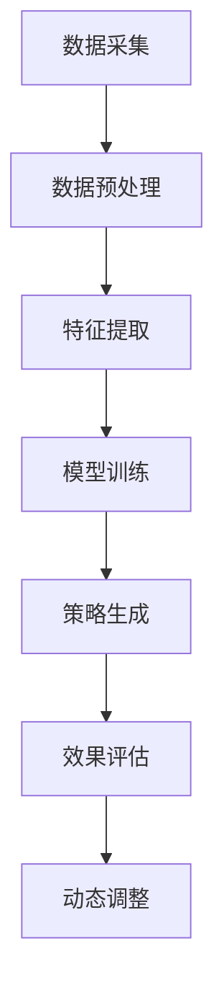
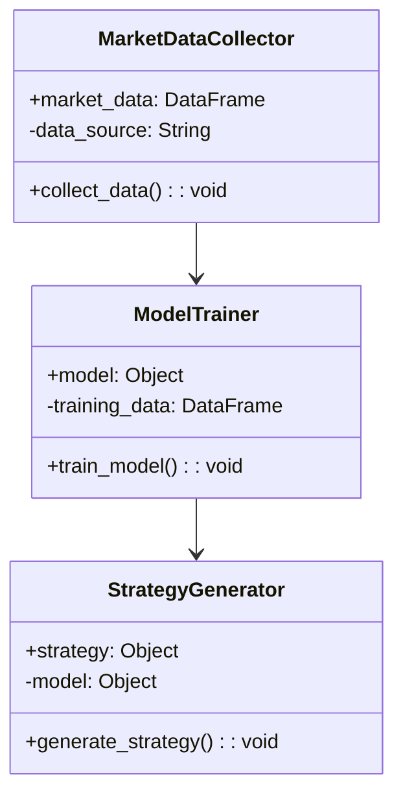
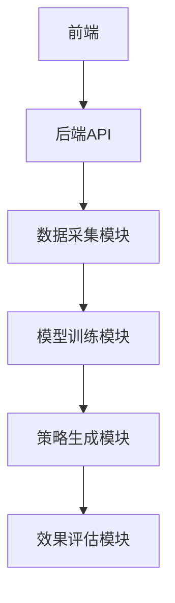
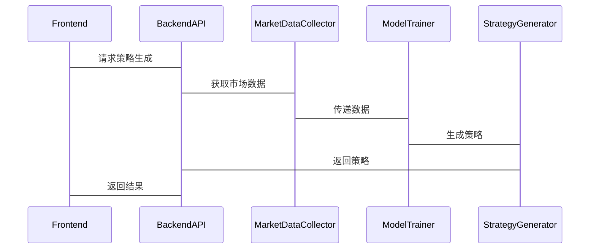

                 


# 人工智能驱动的智能beta策略设计

## 关键词：人工智能、beta策略、算法原理、系统架构、项目实战

## 摘要：人工智能技术的快速发展为金融领域的beta策略设计带来了全新的可能性。本文将深入探讨AI驱动的beta策略的核心概念、算法原理、系统架构以及实际项目案例，结合理论与实践，为读者提供全面而深入的指导。

---

## 第一部分：背景与基础

### 第1章：智能beta策略概述

#### 1.1 传统beta策略的局限性

##### 1.1.1 传统beta策略的定义与特点
- beta策略是一种投资组合配置策略，旨在通过市场波动捕捉收益。
- 传统beta策略基于历史数据分析，假设市场行为具有周期性。
- 特点包括简单易懂、可复制性强，但灵活性和适应性较弱。

##### 1.1.2 传统beta策略的局限性
- 传统beta策略依赖于历史数据，无法应对突发事件。
- 市场环境变化可能导致策略失效。
- 缺乏动态调整能力，难以捕捉新兴市场机会。

##### 1.1.3 传统beta策略的边界与外延
- 适用于市场环境相对稳定的场景。
- 边界包括数据质量、市场深度和交易成本。
- 外延涉及策略组合、风险控制和收益优化。

#### 1.2 AI驱动beta策略的背景

##### 1.2.1 AI技术的发展与应用
- AI技术在金融领域的广泛应用，如智能投顾、风险评估和市场预测。
- 数据挖掘和机器学习算法的进步推动了AI在beta策略中的应用。

##### 1.2.2 beta策略与AI技术的结合
- AI技术通过实时数据处理和模型优化，提升beta策略的灵活性和适应性。
- 结合大数据分析和深度学习，实现更精准的市场预测和策略调整。

##### 1.2.3 AI驱动beta策略的核心概念与组成
- 核心概念：通过AI技术动态优化beta策略，实现收益最大化。
- 组成包括数据采集、模型训练、策略生成和效果评估。

---

## 第二部分：核心概念与原理

### 第2章：AI驱动beta策略的核心原理

#### 2.1 数据特征与模型选择

##### 2.1.1 数据特征的定义与选择
- 数据特征包括市场指标、经济指标和技术指标。
- 数据特征的选择基于相关性分析和特征重要性评估。

##### 2.1.2 不同模型的特点与适用场景
- 线性模型：适用于线性关系明显的场景。
- 非线性模型：适用于复杂市场环境的预测。
- 强化学习模型：适用于动态调整和实时决策。

##### 2.1.3 数据特征与模型选择的关系
- 数据特征影响模型选择，需根据数据特点选择合适模型。
- 模型性能依赖于数据质量，需进行数据清洗和特征工程。

#### 2.2 算法原理与优化目标

##### 2.2.1 算法原理的详细讲解
- 算法原理：通过机器学习模型预测市场走势，动态调整beta策略。
- 优化目标：最大化收益、最小化风险、提高策略适应性。

##### 2.2.2 优化目标的设定与实现
- 设定优化目标：根据投资目标和风险偏好设定收益和风险指标。
- 实现方法：通过模型训练和参数调整优化策略表现。

##### 2.2.3 算法原理与优化目标的关系
- 算法原理是实现优化目标的技术手段。
- 优化目标指导算法设计和参数选择。

---

## 第三部分：算法原理与实现

### 第3章：AI驱动beta策略的算法实现

#### 3.1 算法原理与流程图

##### 3.1.1 使用Mermaid绘制算法流程图


#### 3.2 算法实现

##### 3.2.1 算法实现步骤
1. 数据采集与预处理：收集市场数据并进行清洗。
2. 特征提取：提取关键市场指标作为模型输入。
3. 模型训练：使用机器学习算法训练模型。
4. 策略生成：基于模型预测生成交易策略。
5. 效果评估：评估策略表现并进行优化。

##### 3.2.2 使用Python实现算法

```python
import numpy as np
import pandas as pd
from sklearn.linear_model import LinearRegression
from sklearn.metrics import mean_squared_error

# 数据预处理
data = pd.read_csv('market_data.csv')
X = data[['market_index', 'economic_indicators']]
y = data['returns']

# 模型训练
model = LinearRegression()
model.fit(X, y)

# 预测与评估
y_pred = model.predict(X)
mse = mean_squared_error(y, y_pred)
print(f'Mean Squared Error: {mse}')
```

##### 3.2.3 算法原理的数学模型与公式

- 线性回归模型：
$$ y = \beta_0 + \beta_1 x_1 + \beta_2 x_2 + \dots + \beta_n x_n + \epsilon $$

- 优化目标：
$$ \min \sum_{i=1}^{N} (y_i - \hat{y}_i)^2 $$

---

## 第四部分：系统分析与架构设计方案

### 第4章：系统架构设计

#### 4.1 问题场景介绍

##### 4.1.1 系统目标
- 实现AI驱动的beta策略设计与优化。
- 提供实时市场数据处理和策略生成功能。

##### 4.1.2 项目介绍
- 开发一个AI驱动的beta策略设计系统，支持数据采集、模型训练和策略生成。

#### 4.2 系统功能设计

##### 4.2.1 领域模型设计


##### 4.2.2 系统架构设计


##### 4.2.3 系统接口设计

- 接口1：数据采集模块接口
  - 输入：市场指标和经济指标。
  - 输出：预处理后的数据集。

- 接口2：模型训练模块接口
  - 输入：特征提取后的数据集。
  - 输出：训练好的模型。

##### 4.2.4 系统交互设计


---

## 第五部分：项目实战

### 第5章：AI驱动beta策略的项目实战

#### 5.1 环境安装与配置

##### 5.1.1 安装依赖
- Python 3.8+
- numpy, pandas, scikit-learn, mermaid

##### 5.1.2 配置环境
- 创建虚拟环境并安装依赖：
  ```bash
  pip install numpy pandas scikit-learn
  ```

#### 5.2 系统核心实现

##### 5.2.1 数据采集模块实现
```python
import pandas as pd

def collect_market_data():
    # 示例：从CSV文件读取数据
    data = pd.read_csv('market_data.csv')
    return data
```

##### 5.2.2 模型训练模块实现
```python
from sklearn.linear_model import LinearRegression

def train_model(X, y):
    model = LinearRegression()
    model.fit(X, y)
    return model
```

##### 5.2.3 策略生成模块实现
```python
import numpy as np

def generate_strategy(model, X):
    y_pred = model.predict(X)
    strategy = np.where(y_pred > 0.5, 'Buy', 'Sell')
    return strategy
```

##### 5.2.4 效果评估模块实现
```python
from sklearn.metrics import accuracy_score

def evaluate_strategy(y_true, y_pred):
    accuracy = accuracy_score(y_true, y_pred)
    print(f'Accuracy: {accuracy}')
```

#### 5.3 实际案例分析与详细解读

##### 5.3.1 数据准备
- 数据来源：市场数据CSV文件。
- 数据预处理：清洗和特征工程。

##### 5.3.2 模型训练
- 使用训练数据训练线性回归模型。
- 调整模型参数，优化预测精度。

##### 5.3.3 策略生成与测试
- 基于模型预测生成交易策略。
- 测试策略在实际市场中的表现。

##### 5.3.4 结果分析
- 分析策略的表现，包括收益、风险和稳定性。
- 总结经验教训，优化策略设计。

#### 5.4 项目小结

##### 5.4.1 实战总结
- 成功实现了AI驱动的beta策略设计系统。
- 通过实际案例验证了算法的有效性。

##### 5.4.2 经验与教训
- 数据质量对模型性能影响重大。
- 策略优化需要结合市场实际情况。

---

## 第六部分：最佳实践与总结

### 第6章：总结与展望

#### 6.1 最佳实践 tips

##### 6.1.1 数据处理
- 确保数据质量和完整性，进行适当的特征工程。

##### 6.1.2 模型选择
- 根据数据特点和业务需求选择合适模型。

##### 6.1.3 策略优化
- 定期评估和优化策略，适应市场变化。

#### 6.2 小结

##### 6.2.1 核心内容回顾
- AI技术为beta策略设计提供了新的可能性。
- 系统化的设计和实现方法确保了策略的有效性。

#### 6.3 注意事项

##### 6.3.1 风险提示
- 市场波动可能导致策略失效，需加强风险控制。

##### 6.3.2 实施建议
- 在实际应用中，结合具体情况调整策略参数。

#### 6.4 拓展阅读

##### 6.4.1 推荐资源
- 《机器学习实战》
- 《深度学习》
- 《算法导论》

##### 6.4.2 学习路径
- 先学习基础的机器学习算法。
- 进一步研究强化学习和深度学习在金融中的应用。

---

## 结语

人工智能技术为beta策略的设计和优化提供了强大的工具和方法。通过系统的架构设计和实际项目的实现，我们可以更好地理解AI驱动beta策略的核心原理和实际应用。希望本文能为读者提供有价值的指导和启发，帮助他们在金融领域实现更高效的投资策略设计。

