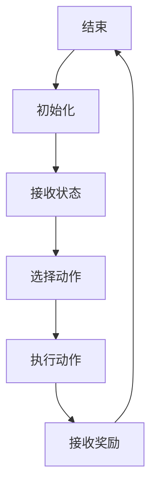

                 


# 人机协作：设计AI Agent与人类的配合模式

---

## 关键词：
- 人机协作
- AI Agent
- 协作模式
- 系统设计
- 人工智能

---

## 摘要：
人机协作是人工智能领域的重要研究方向，旨在通过设计AI Agent与人类的协同工作模式，提升人类工作效率、优化决策过程并拓展人类能力边界。本文将系统性地探讨人机协作的核心概念、算法原理、系统设计与实现，结合实际案例分析，为读者提供全面的理论与实践指导。

---

## 目录
### 目录
1. [人机协作的背景与核心概念](#人机协作的背景与核心概念)
   - 1.1 问题背景
   - 1.2 核心概念与联系
2. [AI Agent的算法原理](#ai-agent的算法原理)
   - 2.1 算法原理概述
   - 2.2 算法实现
   - 2.3 数学模型与公式
3. [人机协作的系统设计与实现](#人机协作的系统设计与实现)
   - 3.1 系统分析与架构设计
   - 3.2 项目实战与实现
4. [实际案例分析](#实际案例分析)
5. [结论与展望](#结论与展望)

---

## 人机协作的背景与核心概念

### 1.1 问题背景

#### 1.1.1 人工智能与人类协作的必要性
随着人工智能技术的快速发展，AI Agent在各个领域的应用越来越广泛。然而，AI Agent的决策过程往往基于数据和算法，缺乏对人类情感、意图和价值观的理解。因此，如何设计AI Agent使其能够与人类高效协作，成为当前研究的热点问题。

#### 1.1.2 当前协作模式的局限性
传统的人机协作模式通常基于规则或任务分解，这种方式难以应对复杂多变的实际场景。此外，人机协作过程中信息传递不充分、决策透明度不足等问题也限制了协作效率的提升。

#### 1.1.3 人机协作的潜在价值与意义
通过设计AI Agent与人类的配合模式，可以充分发挥人工智能的计算能力和人类的创造力、灵活性。这种协作模式不仅能够提升工作效率，还能够在复杂决策中提供更全面的支持。

### 1.2 问题描述

#### 1.2.1 协作模式的定义与分类
协作模式可以分为任务型协作、决策型协作和混合型协作。任务型协作主要关注具体任务的执行，而决策型协作则侧重于决策过程的支持，混合型协作则是两者的结合。

#### 1.2.2 人机协作的核心问题
- 如何实现人机之间的高效信息传递？
- 如何确保AI Agent的决策过程透明可解释？
- 如何平衡AI Agent的自主性和人类的主导性？

#### 1.2.3 当前协作中的主要挑战
- 协作过程中的信息不对称问题
- AI Agent决策的不确定性问题
- 人机协作中的伦理和安全问题

### 1.3 问题解决与边界

#### 1.3.1 人机协作的目标与边界
人机协作的目标是通过AI Agent辅助人类完成任务，同时保持人类对决策过程的主导权。其边界包括技术限制、法律规范和伦理约束。

#### 1.3.2 协作模式的适用场景
- 复杂决策支持
- 高效任务执行
- 创新思维辅助

#### 1.3.3 人机协作的外延与限制
人机协作的外延包括人机混合智能、增强人类能力等领域，其限制则主要体现在技术实现的难度和伦理问题。

---

## AI Agent的算法原理

### 2.1 算法原理概述

#### 2.1.1 AI Agent的基本算法
AI Agent的决策过程通常基于强化学习、概率论等算法。例如，Q-Learning算法是一种常用的强化学习方法，适用于动态环境下的决策问题。

#### 2.1.2 基于概率论的决策模型
概率论是AI Agent决策的重要基础。例如，马尔可夫决策过程（MDP）通过状态转移概率来建模决策问题。

#### 2.1.3 强化学习在协作中的应用
强化学习通过奖惩机制，使AI Agent在协作过程中不断优化决策策略。例如，Deep Q-Network（DQN）算法在游戏AI中表现出色。

### 2.2 算法实现

#### 2.2.1 基于Python的AI Agent实现
以下是一个简单的AI Agent实现示例：

```python
class AI_Agent:
    def __init__(self):
        self.q_table = {}

    def get_action(self, state):
        if state not in self.q_table:
            self.q_table[state] = 0.0
        return self.q_table[state]

    def update_q_table(self, state, reward):
        self.q_table[state] = reward
```

#### 2.2.2 算法流程图展示
以下是一个强化学习算法的流程图：



### 2.3 数学模型与公式

#### 2.3.1 概率论基础公式
概率的基本公式如下：

$$ P(A|B) = \frac{P(A \cap B)}{P(B)} $$

其中，$P(A|B)$ 表示在事件B发生的条件下，事件A发生的概率。

#### 2.3.2 强化学习的数学模型
强化学习的核心是通过最大化累积奖励来优化策略。数学模型如下：

$$ Q(s, a) = Q(s, a) + \alpha (r + \gamma Q(s', a') - Q(s, a)) $$

其中，$s$ 是当前状态，$a$ 是动作，$r$ 是奖励，$s'$ 是下一个状态，$\alpha$ 是学习率，$\gamma$ 是折扣因子。

---

## 人机协作的系统设计与实现

### 3.1 系统分析与架构设计

#### 3.1.1 问题场景介绍
以医疗诊断为例，AI Agent需要协助医生进行病灶识别和诊断建议。

#### 3.1.2 系统功能设计
系统功能包括：
1. 病历数据输入与分析
2. AI Agent的诊断建议
3. 人机交互界面

#### 3.1.3 系统架构设计
系统架构采用分层设计，包括数据层、算法层和用户界面层。

#### 3.1.4 接口与交互设计
系统接口包括：
1. 病历数据接口
2. AI诊断接口
3. 用户反馈接口

### 3.2 项目实战与实现

#### 3.2.1 环境安装与配置
需要安装Python、TensorFlow、Keras等库。

#### 3.2.2 核心代码实现
以下是AI Agent的实现代码：

```python
import numpy as np

class AI_Agent:
    def __init__(self, state_space, action_space):
        self.state_space = state_space
        self.action_space = action_space
        self.q_table = np.zeros((state_space, action_space))

    def get_action(self, state, epsilon=0.1):
        if np.random.random() < epsilon:
            return np.random.randint(self.action_space)
        return np.argmax(self.q_table[state])

    def update_q_table(self, state, action, reward, learning_rate=0.1, gamma=0.9):
        self.q_table[state][action] = self.q_table[state][action] + learning_rate * (reward + gamma * np.max(self.q_table[state]) - self.q_table[state][action])
```

#### 3.2.3 代码解读与分析
该代码实现了一个简单的Q-Learning算法，用于AI Agent的决策过程。

#### 3.2.4 实际案例分析
以医疗诊断为例，AI Agent可以根据病历数据提供诊断建议，医生可以根据建议进行最终决策。

---

## 结论与展望

人机协作的设计模式是一个复杂的系统工程，涉及AI Agent的设计、算法实现和系统架构等多个方面。未来的研究方向包括提高AI Agent的可解释性、增强协作过程中的安全性，以及探索更多的人机协作应用场景。

---

## 参考文献
1. Russell, S., & Norvig, P. (2010). Artificial Intelligence: A Modern Approach.
2. Sutton, R. S., & Barto, A. G. (2018). Reinforcement Learning: Theory and Algorithms.

---

通过以上内容，我们系统性地探讨了人机协作的设计模式，从理论到实践，为读者提供了全面的指导。

