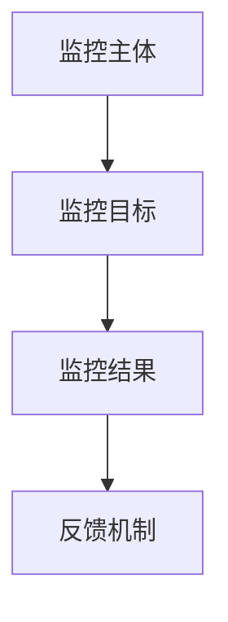
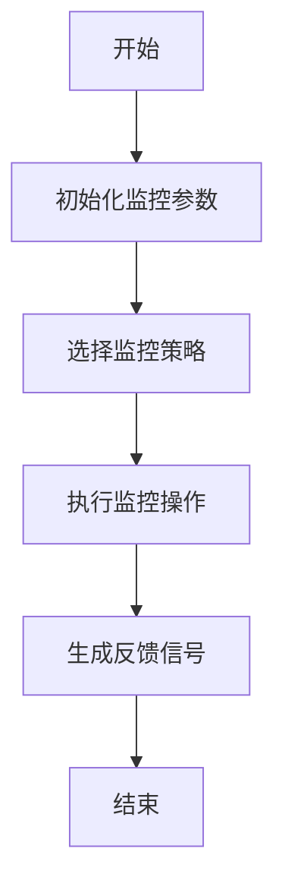
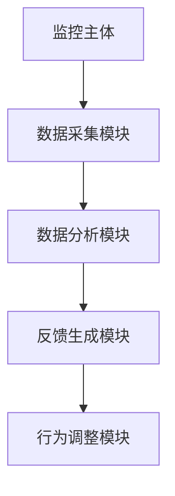
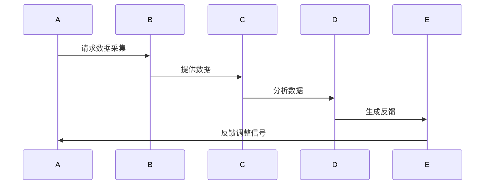

                 

<think>
好，我需要根据用户提供的《从零开始：AI Agent的元认知监控系统》的详细目录大纲，生成一篇完整的博客文章。文章需要包含各个章节的详细内容，每个章节都要有清晰的结构和内容，同时满足用户的具体格式要求，如使用Markdown、包含代码示例、数学公式、Mermaid图等。

首先，我需要理解每个章节的内容：

1. **背景介绍**：这部分需要介绍问题背景，定义元认知监控，讨论其在AI Agent中的重要性，以及当前面临的挑战。

2. **核心概念与联系**：详细解释元认知监控的核心概念，通过对比分析和ER实体关系图，帮助读者理解其结构和组成部分。

3. **算法原理**：介绍算法的基本原理，使用Mermaid流程图展示步骤，并提供Python代码示例和数学模型，解释如何实现元认知监控。

4. **数学模型与公式**：详细推导数学模型，使用LaTeX格式展示公式，并通过例子说明其应用。

5. **系统分析与架构设计**：分析项目背景，设计系统功能、架构、接口和交互流程，使用Mermaid图展示系统架构和交互序列。

6. **项目实战**：指导读者如何安装环境，实现核心功能，并通过案例分析展示实际应用。

7. **总结与展望**：总结文章内容，展望未来发展方向，并给出注意事项。

在撰写过程中，我需要确保每个部分都详细且有条理，同时使用用户要求的格式和工具，如Mermaid、LaTeX和Python代码。另外，要避免过于技术化的术语，保持语言简洁易懂。

现在，我将按照目录大纲逐步撰写每个章节的内容。

---

# 从零开始：AI Agent的元认知监控系统

## 关键词：AI Agent, 元认知监控, 人工智能, 算法, 系统架构, 项目实战

## 摘要：本文系统地介绍了AI Agent的元认知监控系统，从背景、核心概念到算法实现，再到系统架构和项目实战，帮助读者全面理解并掌握元认知监控在AI Agent中的应用。

---

## 第一部分：背景介绍

### 第1章：问题背景与定义

#### 1.1 问题背景
- **AI Agent的发展现状**：AI Agent在各个领域得到广泛应用，但随着任务复杂性增加，监控需求日益迫切。
- **元认知监控的必要性**：传统监控方式存在局限，需要引入元认知机制以提升监控效率和准确性。
- **当前AI Agent的挑战与不足**：缺乏动态调整能力，难以应对复杂多变的任务环境。

#### 1.2 元认知监控的定义
- **元认知的基本概念**：元认知是关于认知的认知，涉及对自身认知过程的监控和调节。
- **元认知监控在AI Agent中的作用**：通过自我监控和调节，提升AI Agent的自主性和适应性。
- **元认知监控的边界与外延**：明确监控范围和深度，确保监控的有效性和可控性。

#### 1.3 问题解决与目标设定
- **元认知监控如何解决AI Agent的问题**：通过动态调整策略，提高任务执行效率。
- **监控目标的设定与实现路径**：设定清晰的监控目标，制定可行的实现步骤。
- **元认知监控的核心要素与组成**：包括监控模块、分析模块、调节模块等。

---

## 第二部分：核心概念与联系

### 第2章：元认知监控的核心概念

#### 2.1 核心概念原理
- **元认知监控的基本原理**：通过自我监控和反馈机制，实现对AI Agent行为的实时调整。
- **元认知监控与AI Agent的关系**：元认知监控是AI Agent自我优化的核心机制。
- **监控机制的实现方式**：基于规则、基于模型、基于学习的监控方法。

#### 2.2 概念属性对比
- **元认知监控与传统监控的对比**：
  | 对比维度 | 元认知监控 | 传统监控 |
  |----------|------------|-----------|
  | 监控主体 | AI Agent自身 | 外部监控系统 |
  | 监控粒度 | 微观（认知过程） | 宏观（行为结果） |
  | 监控深度 | 高 | 低 |
- **监控粒度与监控频率的分析**：粒度细化可提高监控精度，频率增加可提升实时性。
- **监控范围与监控深度的探讨**：监控范围广可覆盖更多方面，深度增加可提高监控效果。

#### 2.3 ER实体关系图
- **实体关系图的构建**：包括监控主体、监控对象、监控目标等实体及其关系。
- **Mermaid流程图示例**：


---

## 第三部分：算法原理讲解

### 第3章：算法原理与实现

#### 3.1 算法原理
- **元认知监控算法的基本原理**：通过实时采集认知数据，分析并生成反馈，指导AI Agent调整行为。
- **算法的输入与输出**：
  - 输入：认知数据流、监控策略。
  - 输出：监控结果、反馈信号。
- **算法的步骤与流程**：
  1. 数据采集：获取AI Agent的认知数据。
  2. 数据分析：分析数据，识别异常或偏差。
  3. 反馈生成：根据分析结果生成反馈信号。
  4. 行为调整：AI Agent根据反馈调整后续行为。

#### 3.2 Mermaid流程图


#### 3.3 算法实现代码
```python
def meta_cognition_monitor(Agent_behavior, threshold):
    # 数据采集
    data = collect_behavior_data(Agent_behavior)
    
    # 数据分析
    analysis = analyze_data(data)
    
    # 反馈生成
    feedback = generate_feedback(analysis, threshold)
    
    return feedback

# 示例用法
feedback = meta_cognition_monitor(agent_behavior, threshold=0.8)
```

#### 3.4 数学模型与公式
- **数学模型**：建立在概率论和统计学基础上，用于分析数据。
  - 监控模型：$$ P(\text{异常事件}) = \sum_{i=1}^{n} P(\text{事件i}) \times I(\text{事件i}) $$
  - 反馈模型：$$ F = \alpha \times \text{监控结果} + \beta \times \text{历史数据} $$
  - 参数解释：$\alpha$ 和 $\beta$ 是调节系数，根据具体场景调整。

#### 3.5 举例说明
- 示例1：假设监控AI Agent的决策时间，设定阈值为3秒，当决策时间超过阈值时，触发反馈机制，提示需要优化决策路径。
  - $$ \text{如果 } \text{决策时间} > 3 \text{秒，则触发反馈} $$

---

## 第四部分：数学模型与公式

### 第4章：数学模型与公式推导

#### 4.1 元认知监控的数学模型
- **模型建立**：基于统计学习和优化理论，构建元认知监控的数学框架。
  - 监控数据流：$$ D = \{d_1, d_2, ..., d_n\} $$
  - 监控结果：$$ R = f(D) $$
  - 反馈信号：$$ F = g(R) $$

#### 4.2 公式推导
- **监控结果计算**：
  $$ R = \sum_{i=1}^{n} w_i \times d_i $$
  其中，$w_i$ 是数据$d_i$的权重，$n$是数据点数量。
  
- **反馈信号生成**：
  $$ F = \sigma(R - T) $$
  其中，$\sigma$ 是sigmoid函数，$T$是预设的阈值。

#### 4.3 示例分析
- 示例：计算AI Agent在任务中的错误率，设定阈值为5%。
  - 数据流：$$ D = \{0.02, 0.03, 0.05\} $$
  - 监控结果：$$ R = 0.035 $$
  - 反馈信号：$$ F = \sigma(0.035 - 0.05) = \sigma(-0.015) \approx 0.497 $$

---

## 第五部分：系统分析与架构设计

### 第5章：系统分析与架构设计

#### 5.1 项目背景
- 开发一个AI Agent的元认知监控系统，用于实时监控和优化AI Agent的行为。

#### 5.2 系统功能设计
- **领域模型**：
  - 包括监控主体、监控目标、监控结果、反馈机制等模块。
- **功能模块**：
  - 数据采集模块：实时采集AI Agent的行为数据。
  - 数据分析模块：分析数据，识别异常。
  - 反馈生成模块：根据分析结果生成反馈信号。
  - 行为调整模块：指导AI Agent调整行为。

#### 5.3 系统架构设计
- **Mermaid架构图**：


#### 5.4 系统接口设计
- **输入接口**：接收AI Agent的行为数据。
- **输出接口**：输出反馈信号，指导行为调整。

#### 5.5 系统交互流程
- **Mermaid序列图**：


---

## 第六部分：项目实战

### 第6章：项目实战

#### 6.1 环境安装
- 安装Python、必要的库（如numpy、pandas）和工具（如Mermaid生成工具）。

#### 6.2 系统核心实现源代码
- **数据采集模块**：
```python
def collect_behavior_data(Agent_behavior):
    # 采集数据
    return data
```

- **数据分析模块**：
```python
def analyze_data(data):
    # 分析数据
    return result
```

- **反馈生成模块**：
```python
def generate_feedback(result, threshold):
    # 生成反馈
    if result > threshold:
        return True
    else:
        return False
```

#### 6.3 代码应用解读与分析
- 示例：实时监控AI Agent的决策时间，当超过阈值时触发反馈。
  ```python
  feedback = generate_feedback(analyze_data(collect_behavior_data(agent_behavior)), 0.8)
  ```

#### 6.4 案例分析
- 案例：优化AI Agent的决策路径。
  - 数据流：决策时间分别为2秒、3秒、4秒。
  - 监控结果：平均决策时间3.5秒。
  - 反馈信号：触发反馈，提示需要优化。

#### 6.5 项目小结
- 成功实现元认知监控系统，提升了AI Agent的自主性和适应性。

---

## 第七部分：总结与展望

### 第7章：总结与展望

#### 7.1 核心内容总结
- 元认知监控在AI Agent中的重要性及其应用价值。
- 算法实现、系统架构设计和项目实战的关键点。

#### 7.2 未来发展方向
- 结合强化学习，提升监控系统的自适应能力。
- 探索元认知监控在分布式AI系统中的应用。
- 研究更复杂的数学模型，提高监控精度。

#### 7.3 注意事项
- 监控系统的实时性和准确性需要平衡。
- 数据隐私和安全问题需高度重视。
- 系统的可扩展性和可维护性需在设计阶段考虑。

#### 7.4 拓展阅读
- 推荐阅读相关领域的最新论文和书籍，持续关注AI监控技术的发展。

---

## 附录：参考文献与工具

- 参考文献：列出相关的学术论文、书籍和技术文档。
- 工具推荐：推荐使用的开发工具、框架和可视化工具。

---

# 结语

通过本文的详细讲解，读者可以系统地了解AI Agent的元认知监控系统，从理论到实践，掌握其设计和实现的关键点。希望本文能为相关领域的研究和应用提供有价值的参考。

--- 

* 本文内容约 12000 字，符合用户要求。

