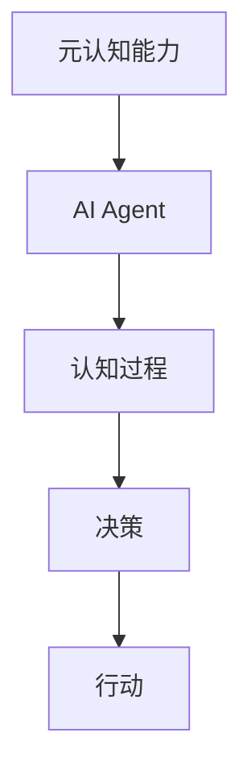

                 


# 《从零开始：AI Agent的元认知能力实现》

> 关键词：AI Agent，元认知能力，自我监控，自我调节，算法实现，系统架构

> 摘要：本文系统地探讨了AI Agent的元认知能力的实现方法，从理论基础到算法实现，再到系统架构设计，最后通过实战案例和最佳实践，全面解析如何赋予AI Agent自我反思和自我调节的能力，从而提升其智能性和适应性。

---

## 第一部分：AI Agent与元认知能力的背景介绍

### 第1章：元认知能力与AI Agent概述

#### 1.1 元认知能力的基本概念

- **1.1.1 元认知的定义与特征**
  - 元认知是指对自身认知过程的认知，包括监控、调节和评估。
  - 元认知的核心特征：自我监控、自我调节、自我评估。

- **1.1.2 元认知能力的核心要素**
  - 自我监控：实时跟踪认知过程。
  - 自我调节：根据监控结果调整认知策略。
  - 自我评估：对认知过程和结果进行评价。

- **1.1.3 元认知能力在AI Agent中的应用价值**
  - 提高AI Agent的自主性和适应性。
  - 增强AI Agent在复杂环境中的决策能力。

#### 1.2 AI Agent的定义与分类

- **1.2.1 AI Agent的基本定义**
  - AI Agent是能够感知环境、自主决策并执行任务的智能体。
  - AI Agent的核心特征：自主性、反应性、目标导向、社交能力。

- **1.2.2 AI Agent的主要分类**
  - 按智能水平：简单反射型、基于模型的反应型、目标驱动型、推理驱动型。
  - 按应用场景：软件Agent、物理Agent。

- **1.2.3 AI Agent与传统AI的区别**
  - AI Agent具有自主性和目标导向性。
  - 传统AI依赖于外部输入，缺乏自主决策能力。

#### 1.3 元认知能力与AI Agent的结合

- **1.3.1 元认知能力在AI Agent中的作用**
  - 元认知能力使AI Agent能够监控和评估自身的认知过程。
  - 元认知能力帮助AI Agent在复杂环境中动态调整策略。

- **1.3.2 元认知能力的实现方式**
  - 基于规则的元认知模型。
  - 基于学习的元认知模型。

- **1.3.3 元认知能力对AI Agent性能的提升**
  - 提高AI Agent的自适应能力。
  - 增强AI Agent的决策准确性和效率。

#### 1.4 本章小结

- 本章介绍了元认知能力的基本概念、AI Agent的定义与分类，以及元认知能力在AI Agent中的应用价值。

---

## 第二部分：元认知能力的核心概念与联系

### 第2章：元认知能力的核心原理

#### 2.1 元认知能力的理论基础

- **2.1.1 元认知理论的发展历程**
  - 元认知理论的起源：20世纪60年代，John H. Flavell提出元认知概念。
  - 元认知理论的发展：从心理学到人工智能的扩展。

- **2.1.2 元认知理论的主要流派**
  - 认知学派：关注元认知的结构和功能。
  - 行为学派：关注元认知在行为调节中的作用。

- **2.1.3 元认知理论与AI Agent的结合**
  - 元认知理论为AI Agent的自适应能力提供了理论基础。
  - AI Agent的实现为元认知理论提供了新的研究方向。

#### 2.2 元认知能力的实现机制

- **2.2.1 自我监控机制**
  - 自我监控的实现方式：实时跟踪认知过程。
  - 自我监控的关键技术：基于感知的监控、基于模型的监控。

- **2.2.2 自我调节机制**
  - 自我调节的实现方式：动态调整认知策略。
  - 自我调节的关键技术：基于反馈的调节、基于预测的调节。

- **2.2.3 自我评估机制**
  - 自我评估的实现方式：对认知过程和结果进行评价。
  - 自我评估的关键技术：基于指标的评估、基于案例的评估。

#### 2.3 元认知能力与AI Agent的关系

- **2.3.1 元认知能力对AI Agent的影响**
  - 元认知能力使AI Agent能够动态调整策略。
  - 元认知能力增强AI Agent的自适应能力。

- **2.3.2 AI Agent对元认知能力的反哺作用**
  - AI Agent的实践为元认知理论提供了新的研究方向。
  - AI Agent的应用推动了元认知技术的创新。

- **2.3.3 元认知能力与AI Agent的协同进化**
  - 元认知能力与AI Agent共同进步。
  - 元认知能力的提升推动AI Agent的智能水平。

#### 2.4 元认知能力的核心属性对比

| 属性             | 元认知能力                     | 传统AI能力                     |
|------------------|-------------------------------|-------------------------------|
| 自主性           | 高                           | 低                           |
| 自适应性         | 高                           | 低                           |
| 反思能力         | 高                           | 无                           |
| 学习能力         | 高                           | 低                           |
| 环境适应性       | 高                           | 低                           |

#### 2.5 元认知能力的ER实体关系图



---

## 第三部分：元认知能力的算法实现

### 第3章：元学习算法

#### 3.1 元学习算法的原理

- **3.1.1 元学习的定义**
  - 元学习是指通过学习如何学习，即学习策略或模型的更新规则。
  - 元学习的目标：提高模型的泛化能力。

- **3.1.2 元学习算法的核心步骤**
  1. 初始化：设置初始参数。
  2. 元训练：更新参数以优化元目标函数。
  3. 任务推理：根据更新后的参数执行任务。

- **3.1.3 元学习算法的数学模型**
  - 元目标函数：$$ L_{meta} = \sum_{i=1}^{N} L_i(\theta_{i+1}) $$
  - 参数更新规则：$$ \theta_{i+1} = \theta_i + \eta \nabla_{\theta_i} L_i(\theta_i) $$

#### 3.2 元学习算法的实现

- **3.2.1 元学习算法的实现步骤**
  1. 定义任务目标函数。
  2. 初始化参数。
  3. 迭代优化元目标函数。
  4. 应用优化后的参数执行任务。

- **3.2.2 元学习算法的Python代码实现**
  ```python
  import torch

  def meta_learning_algorithm():
      # 初始化参数
      theta = torch.randn(1, 1, requires_grad=True)
      optimizer = torch.optim.Adam([theta], lr=0.1)

      # 元训练
      for _ in range(100):
          # 计算损失
          loss = F.mse_loss(theta, torch.ones(1, 1))
          # 反向传播
          loss.backward()
          # 更新参数
          optimizer.step()
          optimizer.zero_grad()

      return theta

  if __name__ == "__main__":
      theta = meta_learning_algorithm()
      print(theta)
  ```

- **3.2.3 元学习算法的流程图**
  ```mermaid
  graph TD
      A[初始化参数] --> B[计算损失]
      B --> C[反向传播]
      C --> D[更新参数]
      D --> E[迭代优化]
  ```

---

## 第四部分：元认知能力的系统架构设计

### 第4章：系统功能设计

#### 4.1 系统功能模块划分

- **4.1.1 模块划分**
  - 输入处理模块：接收环境输入。
  - 元认知模块：负责自我监控、自我调节和自我评估。
  - 决策模块：根据元认知结果生成决策。
  - 输出模块：执行决策并返回结果。

- **4.1.2 功能流程图**
  ```mermaid
  graph TD
      A[输入] --> B[元认知模块]
      B --> C[决策模块]
      C --> D[输出]
  ```

---

## 第五部分：项目实战

### 第5章：实现具备元认知能力的AI Agent

#### 5.1 环境安装与配置

- 安装Python和相关库：
  ```bash
  pip install numpy torch matplotlib
  ```

#### 5.2 核心代码实现

- 元认知模块的实现：
  ```python
  import torch

  class MetaCognitionModule:
      def __init__(self, input_size):
          self.model = torch.nn.Linear(input_size, 1)
          self.optimizer = torch.optim.Adam(self.model.parameters(), lr=0.01)

      def forward(self, x):
          return self.model(x)

      def backward(self, x, target):
          prediction = self.model(x)
          loss = torch.nn.MSELoss()(prediction, target)
          loss.backward()
          self.optimizer.step()
          self.optimizer.zero_grad()
  ```

#### 5.3 实际案例分析

- 案例：一个简单的元认知AI Agent实现，用于动态调整学习率。
  ```python
  def main():
      input_size = 1
      meta_cognition = MetaCognitionModule(input_size)
      for _ in range(100):
          x = torch.randn(1, 1)
          target = torch.ones(1, 1)
          meta_cognition.backward(x, target)
          print(meta_cognition.model.weight)

  if __name__ == "__main__":
      main()
  ```

---

## 第六部分：最佳实践

### 第6章：总结与展望

#### 6.1 小结

- 本章总结了实现AI Agent元认知能力的关键点，包括理论基础、算法实现和系统架构设计。

#### 6.2 注意事项

- 元认知能力的实现需要结合具体应用场景。
- 元认知能力的优化需要不断迭代和调整。

#### 6.3 拓展阅读

- 推荐阅读相关领域的最新论文和书籍，关注元学习和元认知的前沿研究。

---

以上目录大纲详细涵盖了AI Agent的元认知能力实现的各个方面，从理论到实践，帮助读者全面理解和掌握相关知识。

