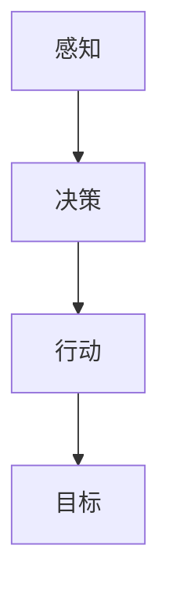
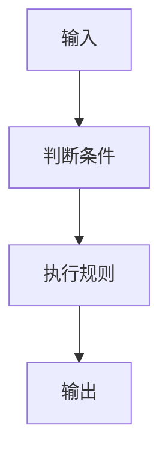
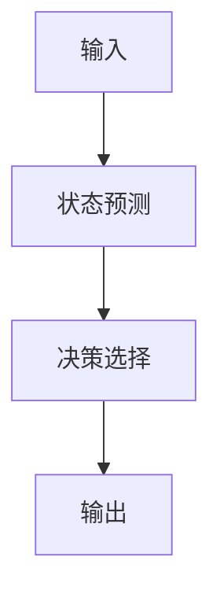
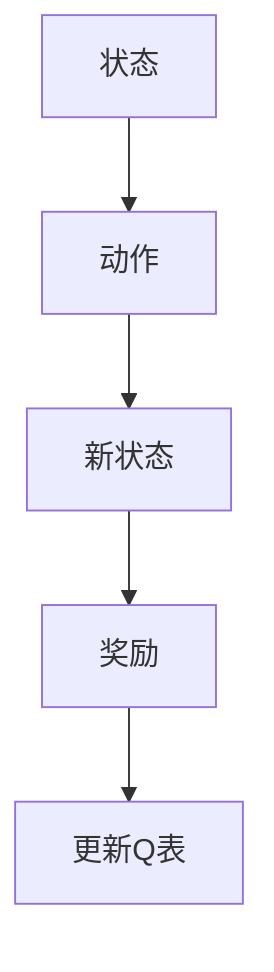
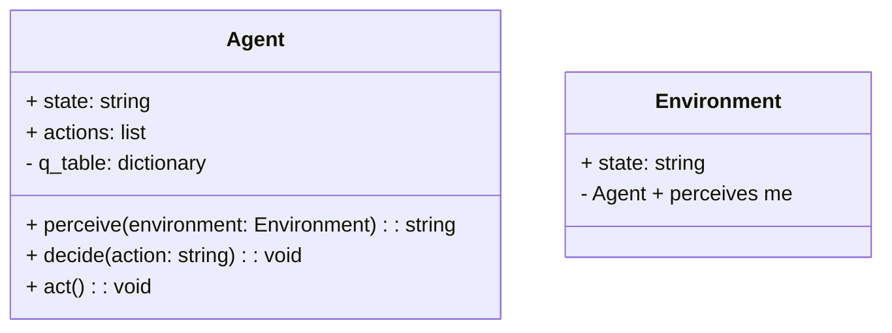
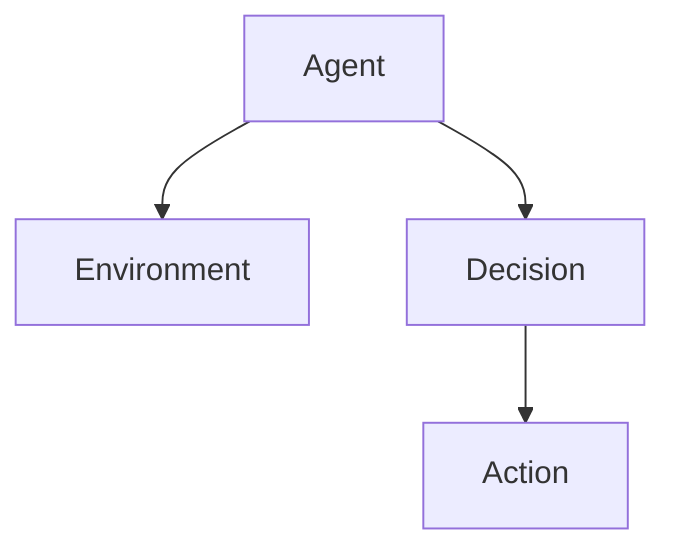
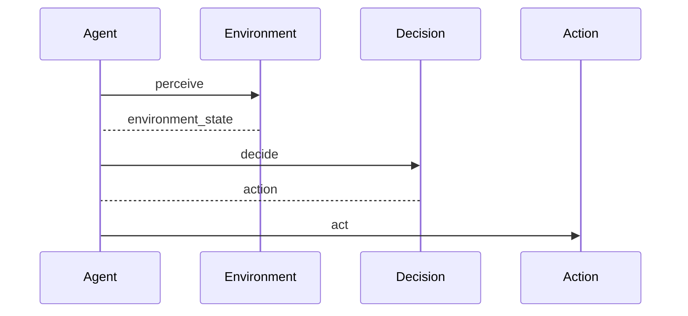

                 


# 从零开始：AI Agent的概念学习系统

## 关键词：AI Agent, 人工智能, 代理系统, 概念学习, 系统设计, 项目实战

## 摘要：  
本文旨在从零开始，系统地介绍AI Agent的概念学习系统，涵盖其核心概念、算法原理、系统设计及项目实战。通过逐步分析和详细讲解，帮助读者深入理解AI Agent的工作原理，掌握其实现方法，最终能够设计和构建一个简单的AI Agent系统。

---

# 第1章: AI Agent的基本概念

## 1.1 AI Agent的定义与特点

### 1.1.1 AI Agent的基本定义  
AI Agent（人工智能代理）是指能够感知环境、做出决策并采取行动以实现目标的智能实体。它可以在多种场景中独立或协作完成任务。

### 1.1.2 AI Agent的核心特点  
- **自主性**：能够自主决策和行动，无需外部干预。  
- **反应性**：能够实时感知环境并做出响应。  
- **目标导向性**：基于目标驱动行为。  
- **学习能力**：通过经验改进性能。  

### 1.1.3 AI Agent与传统AI的区别  
AI Agent不仅具备计算能力，还能够与环境交互，主动采取行动，而不仅仅是被动处理数据。

---

## 1.2 AI Agent的类型与应用场景

### 1.2.1 简单反射型AI Agent  
基于预定义规则对输入做出反应，如基于规则的聊天机器人。

### 1.2.2 基于模型的AI Agent  
利用内部模型预测环境状态，如游戏AI。

### 1.2.3 目标驱动型AI Agent  
以实现特定目标为导向，如自动驾驶系统。

### 1.2.4 AI Agent在不同领域的应用  
- **智能家居**：控制家电。  
- **智能助手**：如Siri、Alexa。  
- **机器人**：工业和家庭服务机器人。  

---

## 1.3 AI Agent的核心要素与概念结构

### 1.3.1 感知能力  
AI Agent通过传感器或数据输入感知环境，如视觉、听觉等。

### 1.3.2 决策能力  
基于感知信息，选择最优行动方案。

### 1.3.3 行动能力  
执行决策动作，影响环境或输出结果。

### 1.3.4 学习能力  
通过经验优化决策模型，如强化学习。

### 1.3.5 交互能力  
与用户或环境进行自然交互，如语音或文本对话。

---

# 第2章: AI Agent的核心概念与联系

## 2.1 AI Agent的核心概念原理

### 2.1.1 感知、决策、行动的循环过程  
AI Agent通过感知获取信息，经过决策选择行动，执行后反馈结果，形成闭环。

### 2.1.2 感知与决策的关系  
感知提供输入，决策基于输入做出选择。

### 2.1.3 决策与行动的协调  
决策指导行动，确保目标实现。

---

## 2.2 概念属性特征对比表格

| 概念 | 特征       | 描述                                   |
|------|------------|--------------------------------------|
| 感知 | 输入来源   | 环境数据输入                           |
| 决策 | 战略规划   | 制定行动计划                           |
| 行动 | 输出执行   | 执行决策动作                           |

---

## 2.3 ER实体关系图架构

```mermaid
erd
actor(Agent) -|{感知}| environment
actor(Agent) -|{决策}| decision
decision --> action
```

---

## 2.4 概念结构与核心要素组成



---

# 第3章: AI Agent的算法原理

## 3.1 基于规则的AI Agent算法

### 3.1.1 算法流程图



### 3.1.2 Python实现示例

```python
def rule_based_agent(input):
    if input == 'hello':
        return 'hello!'
    else:
        return '未知命令'
```

---

## 3.2 基于模型的AI Agent算法

### 3.2.1 算法流程图



### 3.2.2 Python实现示例

```python
class ModelBasedAgent:
    def __init__(self):
        self.model = self.build_model()

    def build_model(self):
        # 建立预测模型
        pass

    def predict(self, input):
        return self.model.predict(input)
```

---

## 3.3 强化学习的AI Agent算法

### 3.3.1 Q-Learning算法流程图



### 3.3.2 数学模型与公式

$$ Q(s, a) = Q(s, a) + \alpha (r + \gamma \max Q(s', a') - Q(s, a)) $$

### 3.3.3 Python实现示例

```python
class QLearningAgent:
    def __init__(self, actions):
        self.actions = actions
        self.gamma = 0.9
        self.alpha = 0.1
        self.q_table = {}

    def get_q(self, state, action):
        return self.q_table.get((state, action), 0)

    def update_q(self, state, action, reward, next_state):
        q = self.get_q(state, action)
        max_next_q = max([self.get_q(next_state, a) for a in self.actions])
        new_q = q + self.alpha * (reward + self.gamma * max_next_q - q)
        self.q_table[(state, action)] = new_q
```

---

# 第4章: AI Agent的系统分析与架构设计

## 4.1 问题场景介绍

### 4.1.1 项目背景  
设计一个简单的AI Agent，实现环境感知、决策和行动。

### 4.1.2 项目目标  
完成一个基于规则的AI Agent系统。

---

## 4.2 系统功能设计

### 4.2.1 领域模型类图



---

## 4.3 系统架构设计

### 4.3.1 系统架构图



### 4.3.2 接口设计  
- `perceive()`：获取环境状态。  
- `decide()`：选择行动。  
- `act()`：执行行动。  

### 4.3.3 交互流程图



---

# 第5章: AI Agent的项目实战

## 5.1 环境安装与配置

### 5.1.1 安装依赖  
安装Python和所需的库，如numpy、pandas。

---

## 5.2 系统核心实现源代码

### 5.2.1 基于规则的AI Agent实现

```python
class RuleBasedAgent:
    def __init__(self):
        self.rules = {
            'hello': 'hello!',
            'help': 'I can help you.'
        }

    def perceive(self, input):
        return input

    def decide(self, input):
        return self.rules.get(input, 'unknown command')

    def act(self, action):
        print(action)
```

---

## 5.3 代码应用解读与分析

- `perceive`：接收输入并返回处理后的状态。  
- `decide`：根据输入选择输出。  
- `act`：执行输出动作。

---

## 5.4 实际案例分析与详细讲解

以一个简单的智能助手为例，展示AI Agent的实现过程。

---

## 5.5 项目小结

通过项目实战，我们掌握了AI Agent的设计与实现方法，理解了各部分的协作关系。

---

# 第6章: 最佳实践、小结、注意事项与拓展阅读

## 6.1 最佳实践 tips

- **模块化设计**：提高代码可维护性。  
- **测试驱动开发**：确保功能正确。  
- **数据隐私**：注意数据安全。  

## 6.2 小结

本文从概念到实现，全面介绍了AI Agent的概念学习系统，帮助读者掌握其核心原理和设计方法。

## 6.3 注意事项

- 确保算法的高效性。  
- 处理好数据隐私问题。  
- 定期更新模型以提升性能。  

## 6.4 拓展阅读

- 探索更复杂的强化学习算法。  
- 研究多智能体协作系统。  

---

# 结语

通过本文的学习，读者将能够从零开始设计和实现一个简单的AI Agent系统，为更复杂的人工智能项目打下坚实基础。

