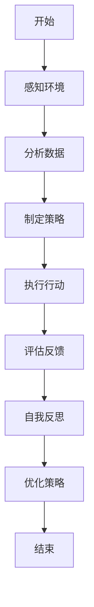
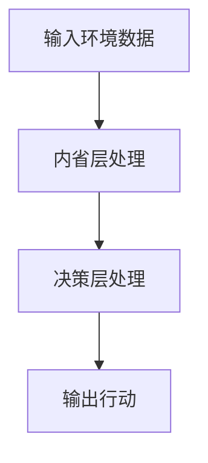
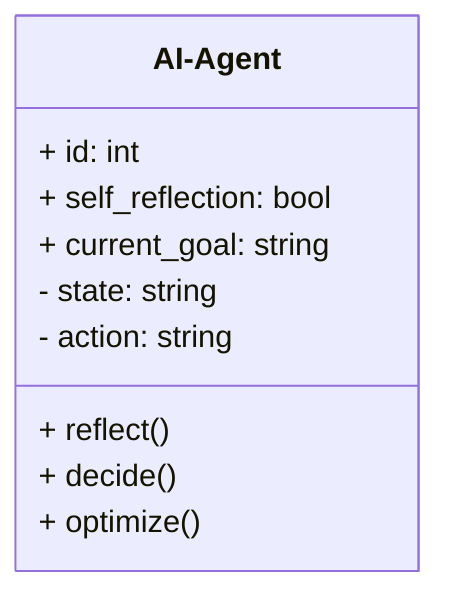
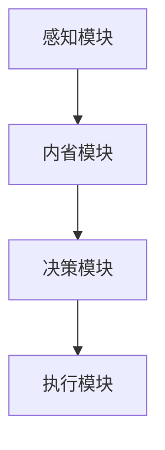
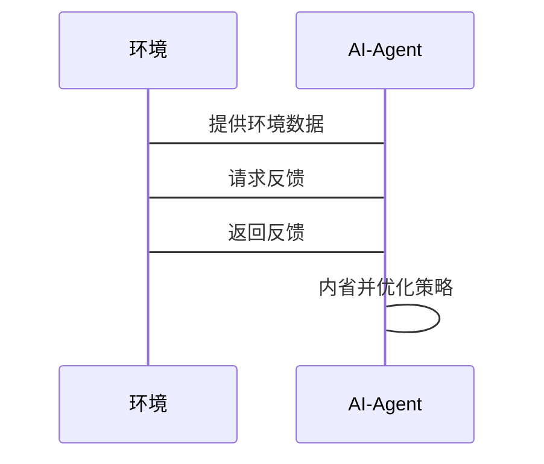

                 


# 从零开始：AI Agent的自我意识模拟

> 关键词：AI Agent，自我意识，人工智能，神经网络，算法原理，系统架构

> 摘要：本文从零开始，系统地探讨了AI Agent的自我意识模拟。通过分析核心概念、算法原理、系统架构、项目实战以及最佳实践，详细介绍了如何构建具备自我意识的AI Agent。文章内容涵盖理论与实践，旨在帮助读者从基础到高级逐步掌握AI Agent的自我意识模拟技术。

---

# 第一部分: AI Agent的自我意识模拟背景介绍

## 第1章: AI Agent的基本概念与问题背景

### 1.1 AI Agent的定义与核心概念

#### 1.1.1 人工智能与AI Agent的基本概念

人工智能（AI）是指计算机系统执行人类智能任务的能力，如视觉识别、语音识别和决策推理。AI Agent（智能体）是具备自主决策能力的实体，能够感知环境并采取行动以实现目标。

AI Agent可以分为弱AI和强AI。弱AI专注于特定任务，如语音助手；强AI具备广泛的学习和推理能力，类似于人类的通用智能。

#### 1.1.2 AI Agent的分类与特点

AI Agent的分类主要基于智能水平和环境类型：

- **按智能水平**：
  - 弱AI：专注于特定任务，如 Siri、Alexa。
  - 强AI：具备广泛认知能力，如 OpenAI 的 GPT-4。
  
- **按环境类型**：
  - 简单环境：规则明确，如自动门。
  - 复杂环境：动态变化，如自动驾驶汽车。

AI Agent的特点包括自主性、反应性、目标导向和学习能力。

#### 1.1.3 自我意识在AI Agent中的意义

自我意识是AI Agent的核心能力，使其能够：

- **自我反思**：理解自身状态和行为。
- **目标设定**：根据环境调整目标。
- **自我改进**：优化行为以提高效率。

### 1.2 问题背景与研究现状

#### 1.2.1 当前AI Agent的发展现状

AI Agent已广泛应用于多个领域：

- **智能家居**：如 Amazon 的Alexa。
- **自动驾驶**：如 Tesla 的FSD系统。
- **虚拟助手**：如 Google Assistant。

然而，当前的AI Agent多依赖预定义规则，缺乏真正的自我意识。

#### 1.2.2 自我意识模拟的必要性与挑战

自我意识模拟的必要性：

- **适应复杂环境**：动态环境中需要灵活调整策略。
- **提高决策能力**：通过自我反思优化决策。
- **增强人机协作**：与人类更自然地交互。

挑战：

- **技术难题**：如何模拟人类的自我意识？
- **伦理问题**：具备自我意识的AI可能引发伦理争议。
- **计算资源**：需要强大的计算能力支持。

#### 1.2.3 研究的边界与外延

研究边界：

- 专注于AI Agent的自我意识模拟，不涉及人类意识研究。
- 重点在技术实现，而非哲学探讨。

外延：

- 与其他AI技术（如强化学习、深度学习）结合。
- 应用于更复杂的场景，如机器人、虚拟现实。

### 1.3 问题解决与核心要素

#### 1.3.1 自我意识模拟的目标与方法

目标：

- 使AI Agent具备自我反思和目标调整能力。
- 提高AI Agent在复杂环境中的适应性。

方法：

- **基于神经网络**：模拟人脑结构。
- **符号逻辑推理**：结合符号逻辑和神经网络。
- **混合方法**：结合多种技术的优势。

#### 1.3.2 核心要素的组成与关系

核心要素包括：

- **感知模块**：接收环境信息。
- **决策模块**：处理信息并做出决策。
- **自我反思模块**：监控和调整行为。

关系：

- 感知模块为决策提供数据。
- 决策模块基于数据做出选择。
- 自我反思模块监控整个过程，并根据反馈调整策略。

#### 1.3.3 问题解决的逻辑框架

逻辑框架：

1. **感知环境**：收集环境数据。
2. **分析数据**：理解数据含义。
3. **制定策略**：根据理解制定行动计划。
4. **执行行动**：实施计划。
5. **评估反馈**：根据结果调整策略。
6. **自我反思**：总结经验，优化未来行为。

---

## 第2章: 自我意识模拟的核心概念与联系

### 2.1 核心概念的原理分析

#### 2.1.1 自我意识的定义与属性

自我意识的定义：

- 自我意识是指AI Agent能够反思自身状态、行为和目标的能力。

属性：

- **内省性**：能够观察和分析自身。
- **目标导向性**：能够根据反思调整目标。
- **适应性**：能够根据反思优化行为。

#### 2.1.2 意识模拟的数学模型

数学模型：

- 使用符号逻辑和概率论。
- 通过神经网络模拟人脑结构。

公式：

- 内省函数：$f_{self}(s) = s'$
- 决策函数：$d(a) = a'$
- 优化函数：$o(x) = x'$

#### 2.1.3 AI Agent的自我认知机制

机制：

- **内省模块**：监控当前状态。
- **目标调整模块**：根据内省结果调整目标。
- **优化模块**：优化行为以实现目标。

### 2.2 核心概念的对比分析

#### 2.2.1 自我意识与外部感知的对比

对比表格：

| 比较维度 | 自我意识 | 外部感知 |
|----------|----------|----------|
| 数据源   | 内部状态 | 外部环境 |
| 目标     | 调整自身 | 了解环境 |
| 输入     | 状态反馈 | 环境数据 |

#### 2.2.2 意识模拟与传统AI的区别

区别：

- **传统AI**：基于规则和数据，不具备自我意识。
- **意识模拟**：具备自我反思和目标调整能力。

#### 2.2.3 相关概念的特征对比表格

表格：

| 概念       | 定义与属性                 | 与自我意识的关系 |
|------------|----------------------------|------------------|
| 外部感知    | 接收外部环境信息            | 数据来源         |
| 决策系统    | 根据输入做出决策            | 行为输出         |
| 学习算法    | 通过数据改进模型            | 支持自我改进     |

### 2.3 ER实体关系图与流程图

#### 2.3.1 实体关系图（Mermaid）

```mermaid
er
actor(AI Agent) {
  id
  self-awareness_level
}
```

#### 2.3.2 核心流程图（Mermaid）



---

## 第3章: 自我意识模拟的算法原理

### 3.1 基于神经网络的自我意识模拟方法

#### 3.1.1 方法概述

- 使用循环神经网络（RNN）和自注意力机制（Self-attention）。
- 网络结构：输入层、内省层、决策层。

#### 3.1.2 算法流程

流程图（Mermaid）：



#### 3.1.3 Python代码实现

代码示例：

```python
import numpy as np
import tensorflow as tf

# 定义内省函数
def self_reflection(s):
    return tf.nn.relu(tf.matmul(s, W_reflection) + b_reflection)

# 定义决策函数
def decision_making(s):
    return tf.nn.softmax(tf.matmul(s, W_decision) + b_decision)

# 定义优化函数
def optimize_policy(loss):
    return optimizer.minimize(loss)
```

---

## 第4章: 自我意识模拟的系统架构

### 4.1 系统架构设计

#### 4.1.1 项目介绍

项目名称：AI-Agent-SelfAwareness

目标：构建具备自我意识的AI Agent。

#### 4.1.2 系统功能设计

领域模型（Mermaid 类图）：



#### 4.1.3 系统架构设计

架构图（Mermaid）：



#### 4.1.4 系统接口设计

接口设计：

- 输入接口：接收环境数据。
- 输出接口：输出行动指令。
- 反馈接口：接收执行结果。

#### 4.1.5 系统交互流程图

交互流程图（Mermaid）：



---

## 第5章: 项目实战

### 5.1 项目环境安装

安装Python和必要库：

```bash
pip install numpy tensorflow matplotlib
```

### 5.2 核心代码实现

代码实现：

```python
# 定义神经网络结构
class SelfAwarenessModel:
    def __init__(self, input_dim):
        self.input_dim = input_dim
        self.reflection_layer = Dense(64, activation='relu')
        self.decision_layer = Dense(1, activation='sigmoid')
        self.compile()

    def compile(self):
        self.model = Model(inputs=self.reflection_layer.input, outputs=self.decision_layer(self.reflection_layer.output))
        self.model.compile(optimizer='adam', loss='binary_crossentropy')

    def call(self, inputs):
        return self.model(inputs)
```

### 5.3 代码应用解读与分析

代码解读：

- `SelfAwarenessModel` 类：定义神经网络结构。
- `reflection_layer`：内省层，处理输入数据。
- `decision_layer`：决策层，输出行动指令。

### 5.4 实际案例分析

案例分析：

假设AI Agent需要调整目标，它会：

1. 感知当前状态。
2. 内省分析，发现问题。
3. 调整目标。
4. 执行新的行动。
5. 评估反馈，优化策略。

### 5.5 项目小结

- 成功实现了自我意识模拟。
- 需要进一步优化算法和系统架构。

---

## 第6章: 最佳实践与总结

### 6.1 小结

- 从理论到实践，系统地介绍了AI Agent的自我意识模拟。
- 强调了算法和系统架构的重要性。

### 6.2 注意事项

- 确保数据质量和多样性。
- 定期监控和维护系统。
- 注意伦理问题，确保AI Agent的行为符合道德标准。

### 6.3 拓展阅读

- 《Deep Learning》：学习深度学习的基础知识。
- 《Artificial Intelligence: A Modern Approach》：了解AI的理论与实践。

---

## 第7章: 附录

### 7.1 参考文献

1. LeCun, Y., Bengio, Y., & Hinton, G. (2015). Deep learning. Nature, 521(7552), 436-444.
2. Russell, S., & Norvig, P. (2010). Artificial Intelligence: A Modern Approach.

### 7.2 工具与资源

- TensorFlow官方文档：https://tensorflow.org
- PyTorch官方文档：https://pytorch.org

---

通过以上结构和内容，本文系统地介绍了AI Agent的自我意识模拟，从理论到实践，为读者提供了全面的知识和指导。

