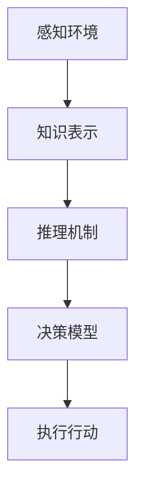
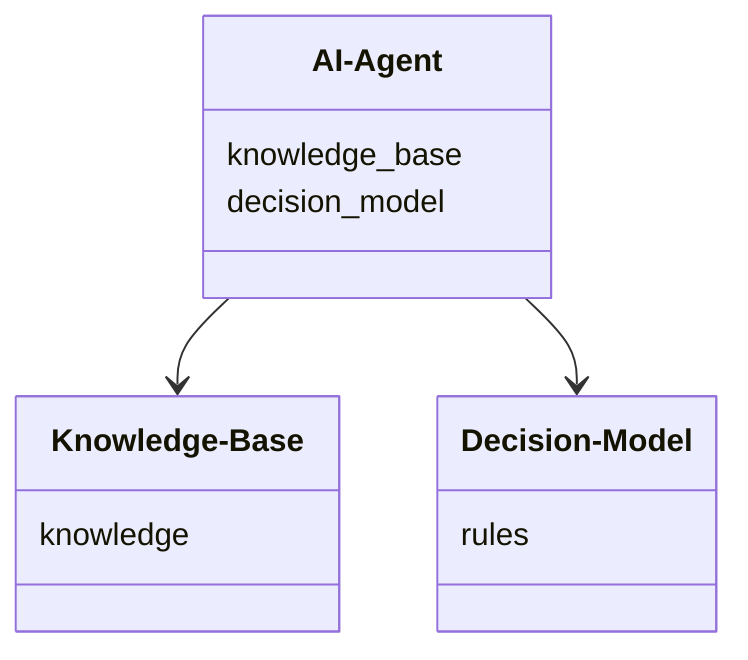
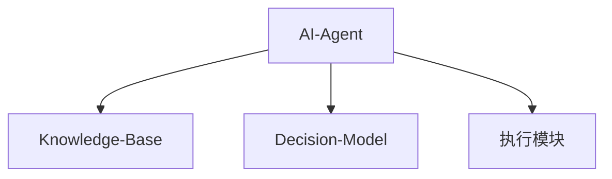
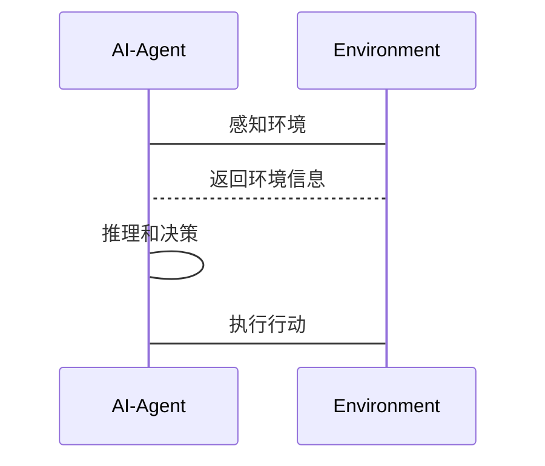
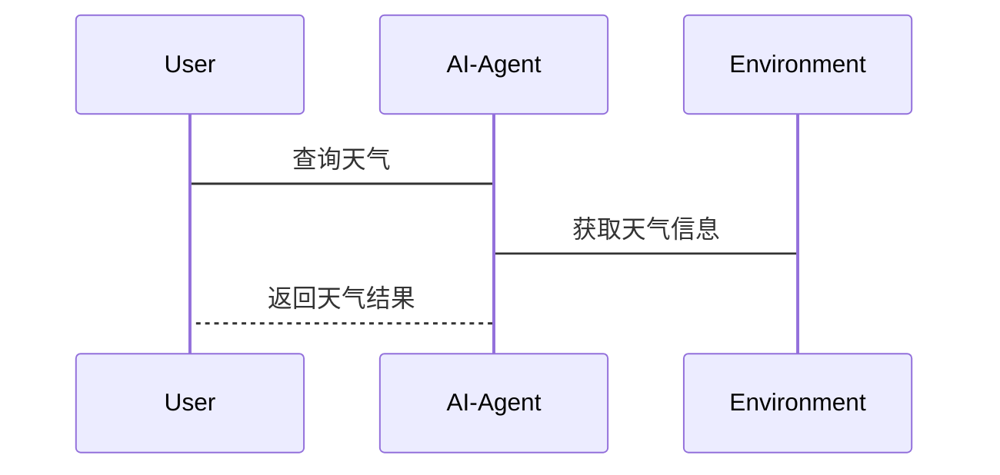

                 


# 从零开始：AI Agent的认知架构设计

> 关键词：AI Agent，认知架构，人工智能，系统设计，算法原理，项目实战

> 摘要：本文从AI Agent的基本概念出发，深入探讨认知架构的核心原理、算法设计、系统架构以及项目实战，通过详细的理论分析和实际案例，全面解析AI Agent的认知架构设计。

---

# 第1章: AI Agent认知架构概述

## 1.1 AI Agent的基本概念

### 1.1.1 什么是AI Agent
AI Agent（人工智能代理）是一种能够感知环境并采取行动以实现目标的智能实体。与传统AI系统不同，AI Agent具有更强的自主性和适应性，能够在动态环境中实时做出决策。

$$\text{AI Agent的定义：}$$

AI Agent = 感知（Perception） + 行动（Action） + 决策（Decision）

### 1.1.2 AI Agent的核心特征

AI Agent的核心特征可以总结为以下几点：

1. **自主性（Autonomy）**：AI Agent能够在没有外部干预的情况下自主运行。
2. **反应性（Reactivity）**：AI Agent能够实时感知环境并做出反应。
3. **目标导向（Goal-oriented）**：AI Agent的行为以实现特定目标为导向。
4. **学习能力（Learnting）**：AI Agent能够通过经验改进自身的性能。

### 1.1.3 AI Agent与传统AI的区别

| 特性       | 传统AI             | AI Agent         |
|------------|--------------------|-------------------|
| 执行方式   | 静态、规则驱动     | 动态、目标驱动   |
| 适应性     | 较低               | 较高             |
| 交互性     | 单向               | 双向             |
| 应用场景   | 数据分析、模式识别 | 自动化控制、智能助手 |

### 1.1.4 认知架构的背景与意义

认知架构是AI Agent的核心组成部分，它模拟了人类的认知过程，包括感知、推理、决策和行动。认知架构的意义在于它能够使AI Agent具备类似人类的智能，能够处理复杂、动态的环境。

---

## 1.2 问题背景与问题描述

### 1.2.1 当前AI系统的局限性

当前的AI系统主要依赖于规则和模式识别，缺乏自主性和适应性。例如，传统机器学习模型在面对未见过的数据时，往往表现不佳，而AI Agent能够通过自适应和学习来克服这一问题。

### 1.2.2 AI Agent认知架构设计的目标

AI Agent认知架构设计的目标是构建一个能够自主感知环境、理解环境、推理问题、制定计划并执行行动的智能系统。

### 1.2.3 问题解决的边界与外延

AI Agent的认知架构设计需要考虑以下边界和外延：

1. **边界**：AI Agent的能力范围和限制。
2. **外延**：AI Agent与其他系统的接口和交互方式。

### 1.2.4 核心概念与联系

认知架构的核心概念包括：

- **知识表示（Knowledge Representation）**：如何表示和存储知识。
- **推理机制（Reasoning Mechanism）**：如何从知识中推导出结论。
- **决策模型（Decision Model）**：如何根据推理结果做出决策。

---

## 1.3 核心概念与联系

### 1.3.1 核心概念原理

认知架构的核心原理可以表示为：

$$\text{认知架构 = 知识表示 + 推理机制 + 决策模型}$$

### 1.3.2 核心概念属性特征对比表

| 概念       | 描述                                      |
|------------|-----------------------------------------|
| 知识表示    | 如何表示和存储知识                        |
| 推理机制    | 如何从知识中推导出结论                    |
| 决策模型    | 如何根据推理结果做出决策                |

### 1.3.3 ER实体关系图

```mermaid
erd
  entity AI-Agent {
    id
    knowledge-base
    decision-model
  }
  entity Knowledge-Base {
    id
    knowledge
  }
  entity Decision-Model {
    id
    rules
  }
  AI-Agent -- 知识表示
  AI-Agent -- 推理机制
  AI-Agent -- 决策模型
```

---

# 第2章: AI Agent认知架构的核心原理

## 2.1 问题建模与求解的数学表达

### 2.1.1 问题建模的数学表示

AI Agent的问题建模可以表示为：

$$\text{问题建模 = 状态空间 + 行动空间 + 转移函数}$$

### 2.1.2 知识表示的数学模型

知识表示的数学模型可以表示为：

$$\text{知识表示 = 实体 + 关系 + 属性}$$

### 2.1.3 行为决策的数学公式

行为决策的数学公式可以表示为：

$$\text{决策 = max_{a} (Q(s, a))}$$

其中，\( Q(s, a) \) 表示在状态 \( s \) 下采取行动 \( a \) 的期望回报。

---

## 2.2 算法原理与流程图

### 2.2.1 算法原理

AI Agent的认知架构算法原理可以表示为：

1. **感知环境**：通过传感器或接口获取环境信息。
2. **知识表示**：将获取的信息表示为知识。
3. **推理机制**：基于知识进行推理。
4. **决策模型**：根据推理结果做出决策。
5. **执行行动**：根据决策结果执行行动。

### 2.2.2 算法流程图



### 2.2.3 代码实现

以下是一个简单的AI Agent算法实现示例：

```python
class AI-Agent:
    def __init__(self):
        self.knowledge_base = []
    
    def perceive(self, environment):
        # 获取环境信息
        self.knowledge_base.append(environment)
    
    def reason(self):
        # 推理逻辑
        pass
    
    def decide(self):
        # 决策逻辑
        pass
    
    def act(self):
        # 执行行动
        pass
```

---

## 2.3 算法实现与代码示例

### 2.3.1 环境安装

需要安装以下依赖：

```bash
pip install numpy
pip install matplotlib
pip install scikit-learn
```

### 2.3.2 核心算法实现

```python
import numpy as np

class AI-Agent:
    def __init__(self):
        self.knowledge_base = []
    
    def perceive(self, environment):
        self.knowledge_base.append(environment)
    
    def reason(self):
        # 示例推理逻辑
        pass
    
    def decide(self):
        # 示例决策逻辑
        pass
    
    def act(self):
        # 示例执行逻辑
        pass
```

---

# 第3章: AI Agent认知架构的系统设计

## 3.1 问题场景介绍

### 3.1.1 应用场景描述

AI Agent可以应用于多个领域，例如智能助手、自动驾驶、智能推荐系统等。

### 3.1.2 系统目标与范围

系统的目标是实现一个能够自主感知、推理和决策的AI Agent。

### 3.1.3 用户需求分析

用户需求包括：

1. 实现实时感知环境
2. 提供智能推理和决策
3. 支持多种交互方式

---

## 3.2 系统功能设计

### 3.2.1 领域模型类图



---

## 3.3 系统架构设计

### 3.3.1 系统架构图



---

## 3.4 系统交互流程图



---

# 第4章: 项目实战与应用

## 4.1 项目环境安装与配置

### 4.1.1 开发环境搭建

需要安装以下工具：

- Python 3.8+
- Jupyter Notebook
- Git

### 4.1.2 依赖库安装

```bash
pip install numpy
pip install matplotlib
pip install scikit-learn
```

---

## 4.2 系统核心功能实现

### 4.2.1 知识表示模块实现

```python
class Knowledge-Base:
    def __init__(self):
        self.knowledge = []
    
    def add_knowledge(self, knowledge):
        self.knowledge.append(knowledge)
```

### 4.2.2 行为决策模块实现

```python
class Decision-Model:
    def __init__(self):
        self.rules = []
    
    def add_rule(self, rule):
        self.rules.append(rule)
    
    def decide(self, state):
        # 示例决策逻辑
        pass
```

### 4.2.3 交互接口模块实现

```python
class Interaction-Interface:
    def __init__(self):
        self.input = None
        self.output = None
    
    def receive_input(self, input):
        self.input = input
    
    def send_output(self, output):
        self.output = output
```

---

## 4.3 代码解读与分析

### 4.3.1 核心算法代码

```python
class AI-Agent:
    def __init__(self):
        self.knowledge_base = Knowledge-Base()
        self.decision_model = Decision-Model()
        self.interaction_interface = Interaction-Interface()
    
    def run(self):
        while True:
            self.interaction_interface.receive_input(input)
            self.knowledge_base.add_knowledge(self.interaction_interface.input)
            self.decision_model.decide(self.knowledge_base.knowledge)
            self.interaction_interface.send_output(self.decision_model.decision)
```

---

## 4.4 实际案例分析

### 4.4.1 应用场景

AI Agent在智能助手中的应用：



---

## 4.5 项目小结

通过以上步骤，我们可以实现一个基本的AI Agent系统。未来可以进一步优化算法、扩展功能和提升性能。

---

# 第5章: 最佳实践与小结

## 5.1 最佳实践 tips

1. **模块化设计**：将系统划分为多个模块，便于维护和扩展。
2. **数据驱动**：利用大数据和机器学习提升系统性能。
3. **实时优化**：通过反馈机制不断优化系统。

## 5.2 小结

本文从AI Agent的基本概念出发，深入探讨了认知架构的核心原理、算法设计、系统架构以及项目实战。通过详细的理论分析和实际案例，全面解析了AI Agent的认知架构设计。

## 5.3 注意事项

- 确保系统的安全性和隐私性。
- 定期更新知识库和决策规则。
- 优化系统的响应速度和准确性。

## 5.4 拓展阅读

- 《人工智能：一种现代的方法》
- 《认知科学导论》
- 《软件架构设计》

--- 

# 结语

AI Agent的认知架构设计是一个复杂而有趣的领域，它结合了人工智能、认知科学和系统设计的多方面知识。通过本文的学习，读者可以掌握AI Agent的核心原理和设计方法，为实际应用打下坚实的基础。

