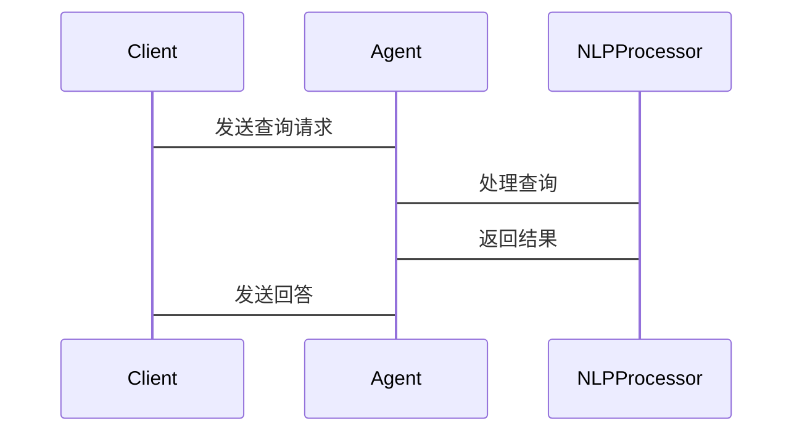

                 


# 《从零开始：搭建AI Agent开发环境》

## 关键词：AI Agent, 机器学习, 自然语言处理, 系统架构, 项目实战, 技术博客

## 摘要：  
本文旨在帮助读者从零开始搭建AI Agent开发环境。通过系统地介绍AI Agent的基本概念、技术基础、算法原理、系统架构设计以及项目实战，读者将能够逐步掌握AI Agent开发的核心技能。文章内容涵盖从理论到实践的全过程，结合丰富的图表和代码示例，帮助读者深入理解AI Agent的开发流程和实现细节。

---

# 第1章: AI Agent基本概念与背景

## 1.1 AI Agent的定义与特点

### 1.1.1 AI Agent的定义
AI Agent（人工智能代理）是指在特定环境中能够感知并自主行动以实现目标的智能体。与传统程序不同，AI Agent具备自主性、反应性和目标导向性。

### 1.1.2 AI Agent的核心特点
- **自主性**：AI Agent能够在没有外部干预的情况下自主行动。
- **反应性**：能够感知环境并实时调整行为。
- **目标导向性**：通过采取行动来实现预设目标。
- **学习能力**：能够通过经验改进性能。

### 1.1.3 AI Agent与传统程序的区别
| 特性 | 传统程序 | AI Agent |
|------|----------|----------|
| 行为驱动 | 预定义规则 | 实时感知与决策 |
| 数据处理 | 批处理 | 实时处理 |
| 目标设定 | 静态 | 动态调整 |

## 1.2 AI Agent的类型与应用场景

### 1.2.1 简单反射式Agent
- **定义**：基于当前感知直接采取行动，不依赖内部状态。
- **应用场景**：实时反馈系统、简单自动化工序。

### 1.2.2 基于模型的反射式Agent
- **定义**：利用内部状态模型来规划和调整行动。
- **应用场景**：复杂环境中的自主决策系统。

### 1.2.3 目标驱动的Agent
- **定义**：通过明确的目标驱动行为，采取最优路径实现目标。
- **应用场景**：智能推荐系统、任务自动化。

### 1.2.4 混合驱动的Agent
- **定义**：结合目标驱动和反应式方法，具备更强的灵活性和适应性。
- **应用场景**：复杂交互系统、多目标优化问题。

### 1.2.5 AI Agent的应用场景
- **智能客服**：基于自然语言处理的对话系统。
- **自动驾驶**：实时感知与决策的无人系统。
- **智能助手**：个性化推荐与任务管理。

## 1.3 AI Agent开发的基本流程

### 1.3.1 需求分析
- 明确目标：确定AI Agent的功能和性能需求。
- 环境分析：了解开发环境和约束条件。

### 1.3.2 模型选择
- 算法选择：根据任务特点选择合适的机器学习模型。
- 模型评估：通过实验验证模型的可行性和效果。

### 1.3.3 数据准备
- 数据收集：获取高质量的训练数据。
- 数据预处理：清洗和归一化数据，确保模型输入规范。

### 1.3.4 模型训练
- 模型训练：使用训练数据优化模型参数。
- 模型评估：通过验证集评估模型性能。

### 1.3.5 接口开发
- API设计：定义与外部系统的交互接口。
- 接口实现：编写API代码，确保与其他系统的兼容性。

### 1.3.6 测试与部署
- 功能测试：验证AI Agent的各项功能是否正常。
- 性能测试：评估AI Agent在高负载下的表现。
- 部署上线：将AI Agent部署到目标环境并进行监控。

---

# 第2章: AI Agent开发环境的技术基础

## 2.1 机器学习基础

### 2.1.1 监督学习
- **定义**：通过标记数据训练模型，使其能够预测新数据的标签。
- **算法**：线性回归、支持向量机、随机森林。
- **应用场景**：分类、回归问题。

### 2.1.2 无监督学习
- **定义**：在无标签数据上发现数据结构。
- **算法**：聚类、主成分分析。
- **应用场景**：客户分群、异常检测。

### 2.1.3 强化学习
- **定义**：通过试错机制优化决策策略。
- **算法**：Q-Learning、Deep Q-Networks。
- **应用场景**：游戏AI、机器人控制。

### 2.1.4 深度学习
- **定义**：通过多层神经网络学习数据的高层次特征。
- **算法**：卷积神经网络、循环神经网络。
- **应用场景**：图像识别、自然语言处理。

## 2.2 自然语言处理基础

### 2.2.1 词嵌入
- **定义**：将词转换为低维向量表示。
- **算法**：Word2Vec、GloVe。
- **应用场景**：文本相似度计算、情感分析。

### 2.2.2 语言模型
- **定义**：能够理解并生成自然语言文本的模型。
- **算法**：n-gram模型、循环神经网络、Transformer。
- **应用场景**：机器翻译、对话系统。

### 2.2.3 意图识别
- **定义**：识别用户输入的意图。
- **算法**：基于规则的意图识别、基于机器学习的意图识别。
- **应用场景**：智能客服、语音助手。

### 2.2.4 实体识别
- **定义**：从文本中提取命名实体。
- **算法**：CRF、神经网络。
- **应用场景**：信息抽取、问答系统。

## 2.3 知识图谱与推理

### 2.3.1 知识图谱构建
- **定义**：将分散的知识点组织成结构化的图谱。
- **工具**：FreeBase、Wikidata。
- **应用场景**：知识问答、语义搜索。

### 2.3.2 逻辑推理
- **定义**：通过逻辑规则进行推理。
- **算法**：规则推理、逻辑编程。
- **应用场景**：专家系统、知识推理。

### 2.3.3 基于知识图谱的问答
- **定义**：结合知识图谱进行问答系统优化。
- **应用场景**：智能助手、企业知识库。

## 2.4 开发工具与框架

### 2.4.1 Python编程基础
- **安装与配置**：安装Python和必要的开发工具。
- **常用库**：NumPy、Pandas、Matplotlib。
- **开发习惯**：代码结构、版本控制。

### 2.4.2 TensorFlow/PyTorch
- **定义**：深度学习框架。
- **安装与配置**：安装TensorFlow/PyTorch，配置环境。
- **核心功能**：构建模型、训练模型、评估模型。

---

# 第3章: AI Agent开发环境的核心算法原理

## 3.1 强化学习算法

### 3.1.1 强化学习的基本原理
- **定义**：通过试错机制优化决策策略。
- **数学模型**：
  - 状态空间：$S$
  - 行动空间：$A$
  - 奖励函数：$R$
  - 策略：$\pi(a|s)$
  - 价值函数：$V(s)$
- **算法流程**：
  1. 环境感知：接收当前状态$s$。
  2. 行为选择：根据策略$\pi$选择行动$a$。
  3. 执行行动：采取行动$a$，获得奖励$r$和新的状态$s'$。
  4. 价值评估：更新价值函数$V(s)$，优化策略$\pi$。

### 3.1.2 Deep Q-Networks
- **定义**：基于深度神经网络的Q-Learning算法。
- **算法流程**：
  1. 状态输入：输入当前状态$s$到神经网络，得到Q值估计。
  2. 行为选择：选择Q值最大的行动$a$。
  3. 执行与反馈：执行$a$，获得奖励$r$和新状态$s'$。
  4. 记忆与回放：将经验$(s, a, r, s')$存储在经验回放池中。
  5. 神经网络训练：随机抽取经验样本，更新神经网络参数。

### 3.1.3 算法实现
- **代码示例**：
  ```python
  import numpy as np
  import tensorflow as tf

  class DeepQNetwork:
      def __init__(self, state_space, action_space, learning_rate=0.01):
          self.state_space = state_space
          self.action_space = action_space
          self.learning_rate = learning_rate
          self.model = tf.keras.Sequential([
              tf.keras.layers.Dense(24, activation='relu', input_dim=state_space),
              tf.keras.layers.Dense(action_space)
          ])
          self.model.compile(optimizer=tf.keras.optimizers.Adam(lr=learning_rate),
                             loss='mean_squared_error')

      def predict(self, state):
          return self.model.predict(np.array([state]))[0]

      def train(self, states, targets):
          self.model.fit(np.array(states), np.array(targets), epochs=1, verbose=0)
  ```

---

## 3.2 监督学习算法

### 3.2.1 线性回归
- **定义**：通过最小化预测值与真实值的差平方和来优化模型参数。
- **数学模型**：
  - 损失函数：$L = \frac{1}{2m}\sum_{i=1}^{m}(y_i - \hat{y_i})^2$
  - 优化方法：梯度下降。
- **代码示例**：
  ```python
  import numpy as np

  def linear_regression(X, y, learning_rate=0.01, iterations=1000):
      m = len(X)
      theta = np.zeros((1, X.shape[1]))
      for _ in range(iterations):
          hypothesis = np.dot(theta, X.T)
          loss = (1/(2*m)) * np.sum(np.square(hypothesis - y))
          gradient = (1/m) * np.dot(X.T, (hypothesis - y))
          theta = theta - learning_rate * gradient
      return theta
  ```

---

## 3.3 生成模型

### 3.3.1 Transformer模型
- **定义**：基于自注意力机制的生成模型。
- **数学模型**：
  - 查询、键、值向量：$Q = K = V = x$
  - 注意力权重：$A = \text{softmax}(\frac{QK^T}{\sqrt{d}})$
  - 输出：$\text{Output} = A V$
- **代码示例**：
  ```python
  import tensorflow as tf

  class TransformerLayer(tf.keras.layers.Layer):
      def __init__(self, d_model, num_heads, **kwargs):
          super(TransformerLayer, self).__init__(**kwargs)
          self.num_heads = num_heads
          self.d_model = d_model
          self.depth = d_model // num_heads
          self.embedding = tf.keras.layers.Dense(d_model)
          self.dense = tf.keras.layers.Dense(d_model)

      def call(self, inputs):
          batch_size, seq_len, _ = inputs.shape
          x = self.embedding(inputs)
          x = tf.reshape(x, (batch_size, seq_len, self.num_heads, self.depth))
          x = tf.transpose(x, [0, 2, 1, 3])
          key = x
          query = x
          value = x
          attention_output = tf.matmul(query, key, transpose_b=True)
          attention_output = tf.nn.softmax(attention_output)
          attention_output = tf.matmul(attention_output, value)
          attention_output = tf.transpose(attention_output, [0, 2, 1, 3])
          attention_output = tf.reshape(attention_output, (batch_size, seq_len, self.d_model))
          x = self.dense(attention_output)
          return x
  ```

---

# 第4章: AI Agent开发环境的系统架构设计

## 4.1 问题场景介绍

### 4.1.1 项目背景
假设我们需要开发一个智能客服系统，帮助用户解答问题并提供服务。

### 4.1.2 项目目标
构建一个能够理解用户需求、提供准确答案的智能客服系统。

## 4.2 系统功能设计

### 4.2.1 领域模型
- **实体关系图**：
  ```mermaid
  classDiagram
      class User {
          id: int
          name: string
          }
      class Query {
          id: int
          content: string
          time: datetime
          }
      class Answer {
          id: int
          content: string
          }
      class Agent {
          handleQuery(Query): Answer
          }
      User --> Query
      Agent --> Query
      Query --> Answer
      ```
- **领域模型说明**：用户发起查询，AI Agent处理查询并生成答案。

## 4.3 系统架构设计

### 4.3.1 系统架构图
```mermaid
graph TD
    Client --> Agent: 发送查询请求
    Agent --> NLPProcessor: 进行自然语言处理
    NLPProcessor --> KnowledgeBase: 查询知识库
    KnowledgeBase --> NLPProcessor: 返回结果
    NLPProcessor --> Agent: 返回处理结果
    Agent --> Client: 发送回答
```

### 4.3.2 系统架构说明
- **Client**：用户端，发送查询请求。
- **Agent**：AI代理，接收请求并协调处理。
- **NLPProcessor**：自然语言处理模块，负责理解和生成文本。
- **KnowledgeBase**：知识库，存储和提供信息。

## 4.4 系统接口设计

### 4.4.1 API设计
- **接口名称**：`/api/v1/query`
- **请求方法**：POST
- **请求参数**：
  - `query`: string（用户查询内容）
  - `user_id`: int（用户ID）
- **响应参数**：
  - `status`: int（状态码）
  - `message`: string（错误信息）
  - `answer`: string（回答内容）

### 4.4.2 接口实现
- **代码示例**：
  ```python
  from flask import Flask, request
  from transformers import pipeline

  app = Flask(__name__)
  qa_pipeline = pipeline("question-answering")

  @app.route('/api/v1/query', methods=['POST'])
  def handle_query():
      data = request.json
      query = data['query']
      user_id = data['user_id']
      answer = qa_pipeline(query, context)[0]['answer']
      return {
          'status': 200,
          'message': 'success',
          'answer': answer
      }
  ```

## 4.5 系统交互设计

### 4.5.1 交互流程


### 4.5.2 交互设计说明
- **Client**：发送查询请求到Agent。
- **Agent**：接收请求后，调用NLPProcessor进行处理。
- **NLPProcessor**：处理后返回结果。
- **Agent**：根据结果生成回答并发送给Client。

---

# 第5章: AI Agent开发环境的项目实战

## 5.1 项目环境搭建

### 5.1.1 安装Python
```bash
python --version
```

### 5.1.2 安装开发工具
- 安装Jupyter Notebook：`pip install jupyter`

### 5.1.3 安装机器学习库
- 安装TensorFlow：`pip install tensorflow`
- 安装Transformers：`pip install transformers`

## 5.2 系统核心实现

### 5.2.1 模型训练
```python
from transformers import pipeline

qa_pipeline = pipeline("question-answering")
```

### 5.2.2 接口开发
```python
from flask import Flask
app = Flask(__name__)

@app.route('/api/v1/query', methods=['POST'])
def handle_query():
    data = request.json
    query = data['query']
    answer = qa_pipeline(query, context)[0]['answer']
    return {
        'status': 200,
        'message': 'success',
        'answer': answer
    }
```

### 5.2.3 测试
```bash
curl -X POST http://localhost:5000/api/v1/query \
     -H "Content-Type: application/json" \
     -d '{"query": "What is AI Agent?"}'
```

## 5.3 项目实战案例分析

### 5.3.1 案例背景
开发一个智能客服系统，帮助用户解答常见问题。

### 5.3.2 案例实现
- **需求分析**：识别用户意图，分类问题类型。
- **模型选择**：使用预训练的问答模型。
- **数据准备**：收集常见问题和答案。
- **模型训练**：微调预训练模型。
- **接口开发**：构建RESTful API，实现与前端的交互。

### 5.3.3 案例分析
- **性能优化**：优化模型响应时间，提高准确率。
- **错误处理**：处理模型预测错误的情况，提供备用方案。

## 5.4 项目小结

### 5.4.1 经验总结
- 确保数据质量，选择合适的模型。
- 及时监控系统性能，优化模型和架构。

### 5.4.2 注意事项
- 处理边界条件，避免遗漏。
- 保持代码简洁，便于维护。

---

# 第6章: AI Agent开发环境的扩展与展望

## 6.1 技术趋势

### 6.1.1 多模态AI Agent
- 结合视觉、听觉等多模态信息，提升交互体验。

### 6.1.2 自适应学习
- 模型具备自适应能力，动态优化自身性能。

## 6.2 挑战与未来方向

### 6.2.1 伦理与安全
- 确保AI Agent的行为符合伦理规范，防止滥用。

### 6.2.2 实时性与响应速度
- 提升模型的计算效率，降低延迟。

## 6.3 最佳实践

### 6.3.1 模型选择
- 根据任务特点选择合适的模型，避免过度复杂化。

### 6.3.2 数据处理
- 保证数据质量，合理处理数据偏差。

## 6.4 小结

### 6.4.1 总结
通过本文的介绍，读者可以系统地了解AI Agent开发环境的搭建过程，从基础概念到项目实战，逐步掌握AI Agent开发的核心技能。

### 6.4.2 展望
未来，AI Agent将在更多领域得到广泛应用，技术也将不断进步，为人类创造更大的价值。

---

# 结语
搭建AI Agent开发环境是一项复杂但极具挑战性的任务。通过系统地学习和实践，读者可以逐步掌握相关技术，开发出高效、智能的AI Agent系统。

