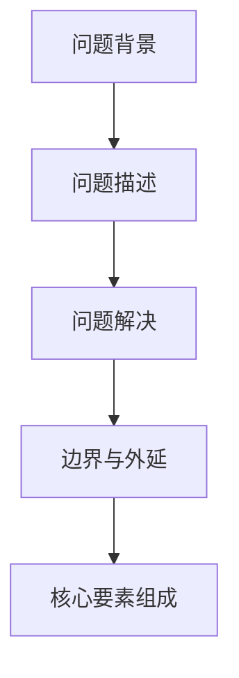
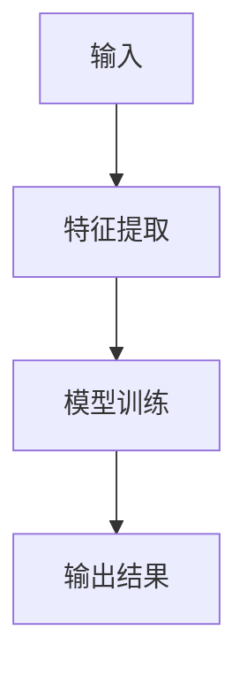
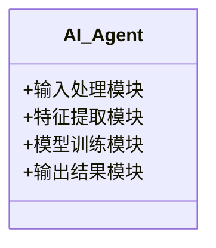
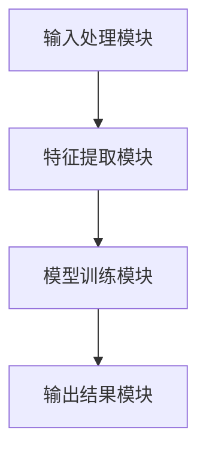
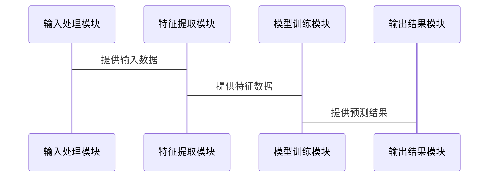

                 


# 从零开始：构建AI Agent的完整指南

## 关键词：AI Agent, 人工智能, 机器学习, 人工智能开发, AI算法

## 摘要：  
本文将详细介绍从零开始构建一个AI Agent的完整过程，涵盖AI Agent的基本概念、核心算法、系统架构设计以及实际项目实现。通过逐步分析，帮助读者理解AI Agent的工作原理，并掌握构建AI Agent所需的关键技术和工具。

---

# 第一部分: AI Agent的背景与基础

## 第1章: AI Agent概述

### 1.1 AI Agent的基本概念
- 什么是AI Agent？
- AI Agent的核心特征
- AI Agent与传统AI的区别

### 1.2 AI Agent的分类
- 简单反射式Agent
- 基于模型的反射式Agent
- 目标驱动的Agent
- 情感驱动的Agent

### 1.3 AI Agent的应用场景
- 个人助手
- 智能客服
- 自动交易
- 游戏AI

### 1.4 本章小结

---

## 第2章: AI Agent的核心概念

### 2.1 问题背景与问题描述
- 问题背景分析
- 问题描述与目标设定
- 问题解决的边界与外延

### 2.2 核心概念与联系
- 核心概念原理
- 核心概念属性特征对比表格
- ER实体关系图架构（Mermaid）



---

## 第3章: AI Agent的算法原理

### 3.1 算法原理概述
- 算法原理的数学模型
- 算法流程图（Mermaid）



### 3.2 算法实现
- Python源代码实现

```python
def ai_agent(input):
    # 特征提取
    features = extract_features(input)
    # 模型训练
    model = train_model(features)
    # 输出结果
    return model.predict(input)
```

### 3.3 数学模型与公式
- 数学模型
$$ y = f(x) $$

- 具体算法公式
$$ P(y|x) = \frac{P(x|y)P(y)}{P(x)} $$

---

## 第4章: AI Agent的系统分析与架构设计

### 4.1 问题场景介绍
- 项目背景
- 项目目标

### 4.2 系统功能设计
- 领域模型Mermaid类图



### 4.3 系统架构设计
- Mermaid架构图



### 4.4 系统接口设计
- 接口描述
- 接口实现示例

### 4.5 系统交互设计
- Mermaid序列图



---

## 第5章: 项目实战与优化

### 5.1 项目环境搭建
- 安装必要的库
- 环境配置示例

### 5.2 系统核心实现
- 核心源代码实现
- 代码解读与分析

### 5.3 实际案例分析
- 案例背景
- 案例分析
- 详细讲解剖析

### 5.4 项目优化建议
- 性能优化
- 可扩展性优化
- 维护性优化

### 5.5 本章小结

---

## 第6章: 最佳实践与注意事项

### 6.1 最佳实践
- 代码规范
- 设计模式
- 性能优化技巧

### 6.2 注意事项
- 常见问题及解决方案
- 常见误区
- 常见陷阱

### 6.3 拓展阅读
- 推荐书籍
- 推荐文章
- 推荐在线资源

### 6.4 本章总结

---

## 参考文献
- 列出相关的书籍、文章、技术文档等参考资料。

---

## 索引
- 按主题或关键词创建索引，方便读者查阅。

---

## 致谢
- 感谢参与本书编写和支持的人。

---

通过以上目录结构，您可以逐步构建一个完整的AI Agent，从基础理论到实际应用，全面掌握AI Agent的构建过程和关键点。

