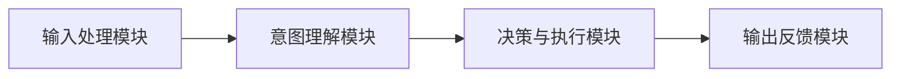

                 


# 《从零构建 AI Agent：LLM 大模型应用开发实践》

---

## 关键词

- AI Agent
- LLM 大模型
- 人工智能
- 自然语言处理
- 应用开发

---

## 摘要

随着人工智能技术的快速发展，AI Agent（人工智能代理）正逐渐成为人机交互和自动化任务的核心技术。本文将从零开始，详细讲解如何构建基于大语言模型（LLM）的 AI Agent。通过理论分析与实践结合，系统性地介绍 AI Agent 的核心概念、LLM 的工作原理、系统架构设计以及实际项目开发的全过程。文章内容涵盖 AI Agent 的背景与概念、LLM 的训练与优化、系统架构设计、项目实战以及高级应用与未来展望。旨在为读者提供一份从基础到实践的完整指南，帮助开发者高效地构建基于 LLM 的 AI Agent 应用。

---

## 正文

### 第一部分：AI Agent 与 LLM 大模型基础

#### 第1章：AI Agent 与 LLM 大模型概述

##### 1.1 AI Agent 的基本概念

- **1.1.1 什么是 AI Agent**
  
  AI Agent（人工智能代理）是指能够感知环境并采取行动以实现目标的智能体。它能够通过与用户交互、分析数据或执行任务来完成特定目标。AI Agent 可以是实时响应的（reactive）或基于规划的（deliberative），也可以是两者结合的混合型。

- **1.1.2 AI Agent 的分类与特点**
  
  - **实时响应型 AI Agent**：这类代理实时感知环境并立即采取行动，例如聊天机器人。
  - **基于规划的 AI Agent**：这类代理会根据当前状态和目标生成行动计划，例如任务调度系统。
  - **混合型 AI Agent**：结合实时响应和规划的特点，适用于复杂场景。

- **1.1.3 AI Agent 的应用场景**
  
  AI Agent 广泛应用于多个领域，包括：
  - 人机交互（如智能助手）
  - 自动化任务（如智能客服）
  - 游戏 AI
  - 智能推荐系统

##### 1.2 LLM 大模型的基本原理

- **1.2.1 什么是 LLM**
  
  LLM（Large Language Model，大语言模型）是一种基于深度学习的自然语言处理模型，能够理解和生成人类语言。它通常基于Transformer架构，通过大量数据训练而成。

- **1.2.2 LLM 的核心技术与优势**
  
  - **Transformer 架构**：支持自注意力机制，能够处理长文本序列。
  - **大规模预训练**：通过在海量数据上预训练，模型能够学习语言的规律和上下文关系。
  - **多任务学习能力**：LLM 可以通过微调适应多种下游任务，如文本生成、问答系统等。

- **1.2.3 LLM 与传统 NLP 模型的区别**
  
  传统的 NLP 模型通常针对特定任务进行训练，而 LLM 是通过预训练生成通用语言表示，能够适应多种任务。

##### 1.3 AI Agent 中的 LLM 角色

- **LLM 在 AI Agent 中的作用**
  
  LLM 作为 AI Agent 的核心模块，负责理解用户输入、生成响应以及执行任务相关的文本处理。

- **LLM 如何赋能 AI Agent**
  
  - 提供自然语言理解能力，使 AI Agent 能够理解用户意图。
  - 生成自然流畅的文本，提升用户体验。
  - 支持多语言处理，扩展 AI Agent 的应用场景。

- **1.3.3 LLM 在 AI Agent 中的应用场景**
  
  - 聊天机器人
  - 智能客服
  - 任务型 AI Agent（如行程规划助手）

##### 1.4 本章小结

本章介绍了 AI Agent 和 LLM 的基本概念、技术优势及其在 AI Agent 中的应用。接下来，我们将深入探讨 LLM 的训练过程及其在 AI Agent 中的具体应用。

---

### 第二部分：LLM 大模型的核心技术与算法原理

#### 第2章：LLM 大模型的训练与优化

##### 2.1 语言模型的训练过程

- **2.1.1 前向传播**
  
  前向传播是将输入数据通过模型各层计算出输出结果的过程。对于语言模型，输入通常是文本序列，输出是概率分布。

- **2.1.2 损失计算**
  
  损失函数衡量模型预测结果与真实结果之间的差异。常用的损失函数包括交叉熵损失。

- **2.1.3 反向传播与参数优化**
  
  反向传播通过链式法则计算各层参数的梯度，并利用优化算法（如随机梯度下降）更新参数。

##### 2.2 常见的优化算法

- **2.2.1 梯度下降**
  
  基础的优化算法，通过不断调整参数方向减小损失函数值。

- **2.2.2 Adam 优化器**
  
  Adam 是一种结合动量和自适应学习率的优化算法，能够更快收敛并适应不同梯度规模。

- **2.2.3 其他优化方法**
  
  包括 AdaGrad、RMSprop 等，各有不同的优势和适用场景。

##### 2.3 模型压缩与推理优化

- **模型剪枝**
  
  删除模型中冗余的参数，减少模型大小和计算量。

- **知识蒸馏**
  
  将大模型的知识迁移到小模型，通过教师模型指导学生模型学习。

- **模型量化**
  
  将模型参数从浮点数转换为低精度整数，减少存储和计算开销。

##### 2.4 本章小结

本章详细介绍了 LLM 的训练过程及其优化算法，帮助读者理解如何训练和优化大模型。接下来，我们将探讨 AI Agent 的系统设计与架构。

---

### 第三部分：AI Agent 的系统设计与架构

#### 第3章：AI Agent 的系统架构设计

##### 3.1 系统功能模块划分

- **输入处理模块**
  
  接收用户的输入（文本、语音等）并进行预处理。

- **意图理解模块**
  
  利用 NLP 技术理解用户的意图，生成语义表示。

- **决策与执行模块**
  
  根据意图生成响应或调用其他服务执行任务。

- **输出反馈模块**
  
  将生成的响应输出给用户，或根据执行结果反馈状态。

##### 3.2 系统架构图



##### 3.3 系统接口设计

- **输入接口**
  
  支持多种输入格式，如文本、语音、图像。

- **输出接口**
  
  提供多种输出方式，如文本、语音、动作指令。

- **调用接口**
  
  提供 API 接口，方便其他系统调用 AI Agent 的功能。

##### 3.4 本章小结

本章详细介绍了 AI Agent 的系统架构设计，包括功能模块划分、系统架构图和接口设计。接下来，我们将通过实际项目来展示如何实现这些设计。

---

### 第四部分：LLM 大模型的项目实战

#### 第4章：项目实战

##### 4.1 环境安装

- 安装 Python 和相关库：
  - `python3`
  - `pip install torch transformers`

##### 4.2 项目实现

```python
from transformers import AutoTokenizer, AutoModelForCausalLM
import torch

# 加载预训练模型和分词器
model_name = "gpt2"
tokenizer = AutoTokenizer.from_pretrained(model_name)
model = AutoModelForCausalLM.from_pretrained(model_name)

# 定义生成函数
def generate_response(prompt):
    inputs = tokenizer.encode(prompt, return_tensors="pt")
    input_ids = inputs.to(torch.long).to("cuda")
    max_length = 50
    temperature = 0.7
    beam_width = 5

    outputs = model.generate(input_ids, max_length=max_length, temperature=temperature, num_beams=beam_width)
    response = tokenizer.decode(outputs[0], skip_special_tokens=True)
    return response

# 示例
prompt = "What is AI Agent?"
response = generate_response(prompt)
print(response)
```

##### 4.3 代码解读

- **tokenizer**：用于将文本转换为模型可接受的输入格式。
- **model**：预训练好的大语言模型，用于生成文本。
- **generate_response 函数**：接收提示文本，生成模型的响应。

##### 4.4 实际案例分析

- **案例 1：聊天机器人**
  - 用户输入： "What is AI Agent?"
  - 系统响应： "AI Agent 是能够感知环境并采取行动以实现目标的智能体..."

- **案例 2：任务型 AI Agent**
  - 用户输入： "Help me book a flight to Paris."
  - 系统响应： "Sure, please provide your travel dates and preferred airlines."

##### 4.5 项目小结

本章通过实际项目展示了如何使用 LLM 实现 AI Agent 的核心功能。读者可以在此基础上扩展功能，例如集成更多模块或优化性能。

---

### 第五部分：高级应用与未来展望

#### 第5章：高级应用与未来展望

##### 5.1 高级应用

- **多模态 AI Agent**
  
  结合视觉、听觉等多种感知方式，提升用户体验。

- **人机协作**
  
  通过上下文理解实现更自然的人机交互。

##### 5.2 未来展望

- **更强大的 LLM**
  
  随着模型规模的增大和训练技术的提升，LLM 的能力将不断提升。

- **边缘计算**
  
  将 LLM 部署到边缘设备，实现低延迟和高实时性的应用。

##### 5.3 最佳实践 tips

- **模型选择**：根据任务需求选择合适的 LLM 模型。
- **性能优化**：通过模型压缩和推理优化降低计算成本。
- **安全与隐私**：确保数据安全和用户隐私。

##### 5.4 小结

本章展望了 AI Agent 的未来发展方向，并给出了实际应用中的注意事项和最佳实践建议。

---

## 附录

- **术语表**
  
  - AI Agent：人工智能代理。
  - LLM：大语言模型。
  - Transformer：一种深度学习架构，广泛应用于 NLP。

---

通过本文的系统讲解，读者将能够从零开始构建基于 LLM 的 AI Agent，掌握从理论到实践的完整开发流程。希望本文能为开发者提供有价值的参考和启发。

---

# END

