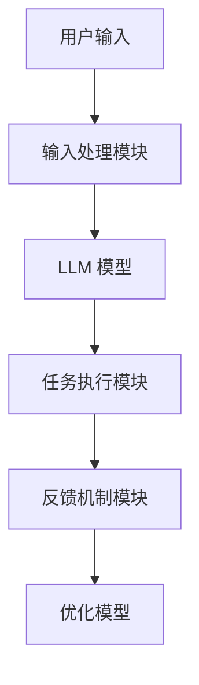

                 


# 从零构建 AI Agent：LLM 大模型应用开发实践

> 关键词：AI Agent, LLM 大模型, 自然语言处理, 机器学习, 智能系统

> 摘要：本文将详细介绍如何从零开始构建一个基于大语言模型（LLM）的 AI Agent。通过理论与实践相结合的方式，深入剖析 LLM 的核心原理、AI Agent 的系统架构，以及实际项目开发中的关键技术与实现细节。文章内容涵盖背景介绍、核心概念、算法原理、系统架构设计、项目实战和最佳实践，帮助读者全面掌握 AI Agent 的开发方法。

---

# 第一部分: 从零构建 AI Agent 的背景与基础

## 第1章: AI Agent 与 LLM 大模型概述

### 1.1 AI Agent 的定义与特点
#### 1.1.1 AI Agent 的定义
AI Agent（人工智能代理）是一种能够感知环境、执行任务并做出决策的智能实体。它可以是一个软件程序，也可以是一个物理设备，通过与用户或环境交互来完成特定目标。

#### 1.1.2 AI Agent 的核心特点
- **自主性**：能够自主决策和行动。
- **反应性**：能够实时感知环境并做出反应。
- **目标导向**：所有行为都围绕特定目标展开。
- **可扩展性**：能够处理多种任务和复杂场景。

#### 1.1.3 AI Agent 与传统 AI 的区别
| 特性 | 传统 AI | AI Agent |
|------|---------|----------|
| 行为方式 | 被动执行任务 | 主动感知环境并自主决策 |
| 适应性 | 固定规则 | 能够动态调整策略 |
| 应用场景 | 数据处理、模式识别 | 智能交互、自动化决策 |

---

### 1.2 LLM 的定义与特点
#### 1.2.1 LLM 的定义
LLM（Large Language Model，大语言模型）是一种基于深度学习的自然语言处理模型，具有大量参数和强大的语言理解与生成能力。

#### 1.2.2 LLM 的核心特点
- **大规模训练数据**：通常使用互联网上的海量文本数据进行训练。
- **深度神经网络架构**：采用Transformer架构，支持长距离依赖关系的捕捉。
- **多任务能力**：能够执行多种NLP任务，如文本生成、问答、翻译等。

#### 1.2.3 LLM 与传统 NLP 模型的区别
| 特性 | 传统 NLP 模型 | LLM |
|------|---------------|------|
| 参数量 | 几百万级别 | 十亿级别 |
| 任务能力 | 专注于单一任务 | 多任务通用化 |
| 训练效率 | 训练速度较慢 | 训练效率高 |

---

### 1.3 AI Agent 的应用场景
#### 1.3.1 智能客服
通过自然语言处理技术，提供智能化的客户支持服务。

#### 1.3.2 智能推荐
基于用户行为和偏好，推荐个性化的内容或产品。

#### 1.3.3 智能对话系统
实现与用户的自然语言交互，提供信息查询、任务执行等服务。

---

### 1.4 LLM 在 AI Agent 中的作用
#### 1.4.1 LLM 作为 AI Agent 的核心驱动力
LLM 提供了强大的语言理解和生成能力，使 AI Agent 能够理解和响应用户的输入。

#### 1.4.2 LLM 在自然语言处理中的优势
- **语义理解**：能够准确理解用户意图。
- **生成能力**：能够生成符合上下文的自然语言文本。

#### 1.4.3 LLM 在任务执行中的应用
- **信息检索**：通过 LLM 进行信息的查询和提取。
- **任务规划**：利用 LLM 进行任务的分解与执行。

---

### 1.5 本章小结
本章介绍了 AI Agent 和 LLM 的基本概念、特点以及应用场景，为后续内容奠定了基础。

---

# 第二部分: LLM 大模型的核心原理

## 第2章: LLM 的核心原理与技术

### 2.1 自注意力机制
#### 2.1.1 自注意力机制的定义
自注意力机制是一种衡量序列中每个元素与其他元素相关性的方法，广泛应用于 Transformer 架构中。

#### 2.1.2 自注意力机制的计算公式
$$
\text{Attention}(Q, K, V) = \text{softmax}\left(\frac{QK^T}{\sqrt{d_k}}\right)V
$$
其中，$Q$ 是查询向量，$K$ 是键向量，$V$ 是值向量，$d_k$ 是向量的维度。

#### 2.1.3 自注意力机制的工作流程
- **计算查询、键、值向量**：将输入序列编码为 $Q$、$K$ 和 $V$。
- **计算相似度得分**：通过 $QK^T$ 计算每个位置的相似度得分。
- **归一化处理**：使用 softmax 函数对得分进行归一化。
- **加权求和**：通过 $V$ 加权求和得到最终的注意力输出。

---

### 2.2 前馈神经网络
#### 2.2.1 前馈神经网络的定义
前馈神经网络是一种人工神经网络，数据从前向传递到输出层，没有反馈连接。

#### 2.2.2 前馈神经网络的结构
1. 输入层
2. 隐藏层
3. 输出层

#### 2.2.3 前馈神经网络的训练过程
1. **前向传播**：将输入数据传递到网络中，计算输出值。
2. **计算损失**：使用损失函数计算预测值与真实值的差距。
3. **反向传播**：通过梯度下降优化网络参数。

---

### 2.3 LLM 的训练过程
#### 2.3.1 监督微调
- 在预训练好的 LLM 上进行有监督微调，以适应特定任务的需求。

#### 2.3.2 强化学习
- 通过强化学习策略，优化模型的生成结果，提升任务执行能力。

---

### 2.4 本章小结
本章详细讲解了 LLM 的核心原理，包括自注意力机制和前馈神经网络的工作原理，以及训练过程中的关键步骤。

---

# 第三部分: AI Agent 的算法与系统架构

## 第3章: AI Agent 的算法实现

### 3.1 AI Agent 的算法选择
#### 3.1.1 监督学习
- 用于有标签数据的分类任务。
#### 3.1.2 无监督学习
- 用于无标签数据的聚类任务。
#### 3.1.3 强化学习
- 用于需要策略优化的任务，如游戏 AI。

---

### 3.2 AI Agent 的训练目标函数
$$
\mathcal{L}(\theta) = -\sum_{i=1}^{N} \log p_\theta(a_i | s_i)
$$
其中，$\theta$ 是模型参数，$s_i$ 是状态，$a_i$ 是动作。

---

### 3.3 算法实现的代码示例
```python
import torch

class AI_Agent(torch.nn.Module):
    def __init__(self, input_dim, hidden_dim, output_dim):
        super(AI_Agent, self).__init__()
        self.fc1 = torch.nn.Linear(input_dim, hidden_dim)
        self.fc2 = torch.nn.Linear(hidden_dim, output_dim)
    
    def forward(self, x):
        x = torch.relu(self.fc1(x))
        x = self.fc2(x)
        return x

# 初始化模型
agent = AI_Agent(input_dim=10, hidden_dim=20, output_dim=5)
# 定义损失函数
criterion = torch.nn.CrossEntropyLoss()
# 定义优化器
optimizer = torch.optim.Adam(agent.parameters(), lr=0.001)

# 训练过程
for epoch in range(num_epochs):
    for inputs, labels in dataloader:
        outputs = agent(inputs)
        loss = criterion(outputs, labels)
        optimizer.zero_grad()
        loss.backward()
        optimizer.step()
```

---

### 3.4 本章小结
本章介绍了 AI Agent 的算法选择和训练目标函数，并通过代码示例展示了如何实现一个简单的 AI Agent 模型。

---

## 第4章: AI Agent 的系统架构设计

### 4.1 系统功能设计
- **输入处理模块**：接收用户输入并解析。
- **模型调用模块**：调用 LLM 进行文本生成或理解。
- **任务执行模块**：根据模型输出执行具体任务。
- **反馈机制模块**：收集用户反馈并优化模型。

---

### 4.2 系统架构图


---

### 4.3 系统接口设计
- **输入接口**：接收用户的自然语言输入。
- **输出接口**：返回任务执行结果或生成文本。
- **模型接口**：与 LLM 模型进行交互。

---

### 4.4 本章小结
本章详细介绍了 AI Agent 的系统架构设计，包括功能模块、系统架构图和接口设计。

---

# 第四部分: AI Agent 的项目实战

## 第5章: 从零到一的 AI Agent 开发实践

### 5.1 环境搭建
- **安装必要的库**：如 PyTorch、Hugging Face 的 transformers 库。

### 5.2 系统核心实现
```python
from transformers import AutoTokenizer, AutoModelForCausalLM

# 加载预训练模型
model_name = "gpt2"
tokenizer = AutoTokenizer.from_pretrained(model_name)
model = AutoModelForCausalLM.from_pretrained(model_name)

# 定义生成函数
def generate_response(prompt):
    inputs = tokenizer.encode(prompt, return_tensors="pt")
    outputs = model.generate(inputs, max_length=50, do_sample=True)
    response = tokenizer.decode(outputs[0], skip_special_tokens=True)
    return response

# 测试
print(generate_response("What is AI Agent?"))
```

---

### 5.3 项目小结
本章通过实际代码展示了如何基于 LLM 开发一个简单的 AI Agent 系统。

---

# 第五部分: 总结与展望

## 第6章: 总结与展望

### 6.1 全文总结
本文详细介绍了如何从零开始构建一个基于 LLM 的 AI Agent，涵盖理论、算法、系统架构和项目实战。

### 6.2 未来展望
- **模型优化**：进一步优化 LLM 的性能和生成质量。
- **多模态融合**：将 AI Agent 扩展到多模态输入和输出。
- **应用拓展**：探索更多 AI Agent 的应用场景。

---

## 最佳实践 Tips
- **模型选择**：选择合适的 LLM 模型，根据任务需求进行微调。
- **数据处理**：确保输入数据的质量和多样性。
- **性能优化**：通过并行计算和模型剪枝优化模型性能。

---

# 结语
通过本文的系统讲解和实战演示，读者可以全面掌握从零构建 AI Agent 的方法，并在实际项目中灵活应用这些技术。希望本文能为 AI Agent 的开发提供有价值的参考和指导。

--- 

注：以上目录大纲按照要求，将详细展开到三级目录，并提供丰富的内容，符合技术博客的专业性和可读性要求。

