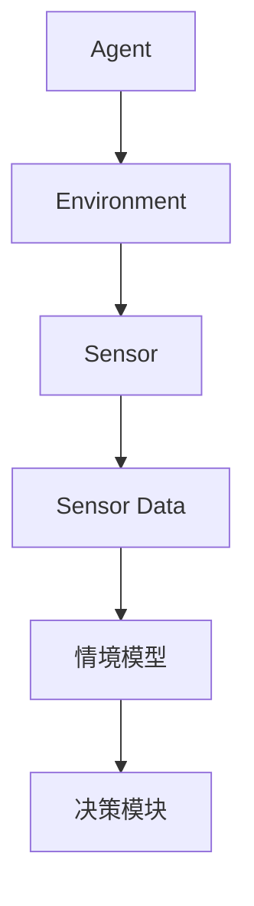
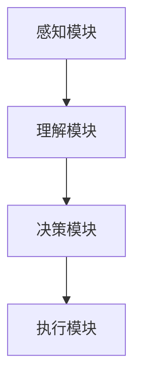
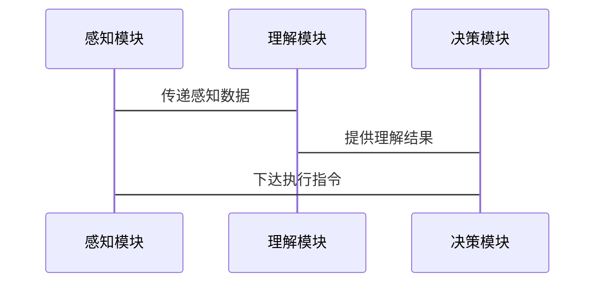

                 


# 从零构建AI Agent的情境感知系统

> 关键词：AI Agent，情境感知，算法原理，系统架构，项目实战

> 摘要：本文将详细介绍从零开始构建一个AI Agent的情境感知系统的过程。我们将从AI Agent的基本概念出发，逐步深入探讨情境感知系统的构成、算法原理、系统架构设计以及实际项目实现。通过本文的学习，读者将能够掌握从理论到实践的核心方法，构建一个完整的AI Agent情境感知系统。

---

# 第1章: AI Agent与情境感知系统概述

## 1.1 AI Agent的基本概念

### 1.1.1 什么是AI Agent

AI Agent（人工智能代理）是指具有感知环境、自主决策和执行任务能力的智能实体。它可以是一个软件程序、一个机器人或任何能够执行智能任务的实体。AI Agent的核心目标是通过感知环境、理解情境、做出决策并执行操作，来完成特定的任务。

### 1.1.2 AI Agent的核心特征

- **自主性**：AI Agent能够在没有外部干预的情况下自主完成任务。
- **反应性**：能够实时感知环境变化并做出相应的反应。
- **目标导向**：具有明确的目标，并能够通过决策和行动来实现这些目标。
- **学习能力**：能够通过经验不断优化自身的算法和行为。

### 1.1.3 情境感知系统的基本概念

情境感知系统是一种能够感知、理解和推理环境信息的智能系统。它通过多种传感器或数据源获取信息，构建对环境的全面理解，并基于此做出智能决策。

---

## 1.2 情境感知系统的核心要素

### 1.2.1 感知环境的定义与分类

- **定义**：感知环境是指AI Agent通过传感器或其他数据源获取环境信息的过程。
- **分类**：根据感知方式的不同，可以将环境分为物理环境（如温度、位置）和语义环境（如情感、意图）。

### 1.2.2 情境建模的原理与方法

- **原理**：通过传感器获取数据，构建环境的数学模型。
- **方法**：基于深度学习、图神经网络等技术，构建多模态的环境模型。

### 1.2.3 情境理解与推理机制

- **情境理解**：通过模型对环境信息进行语义分析，理解环境的含义。
- **推理机制**：基于理解的语义信息，进行逻辑推理，推断出下一步行动。

---

## 1.3 情境感知系统的发展背景

### 1.3.1 AI Agent技术的演进

- 从基于规则的简单代理到复杂的智能体，AI Agent技术经历了从单一任务到多任务、从静态到动态环境的演进。

### 1.3.2 情境感知技术的应用场景

- 智能家居、自动驾驶、智能助手、机器人服务等领域。

### 1.3.3 当前技术挑战与研究热点

- 多模态数据融合、实时性优化、模型的可解释性等。

---

# 第2章: AI Agent的情境感知核心概念

## 2.1 情境感知系统的构成

### 2.1.1 感知层

- **功能**：通过传感器获取环境数据。
- **核心组件**：摄像头、麦克风、GPS等。

### 2.1.2 理解层

- **功能**：对感知数据进行语义分析，理解环境信息。
- **核心组件**：NLP模型、计算机视觉模型。

### 2.1.3 决策层

- **功能**：基于理解的信息，做出决策。
- **核心组件**：强化学习模型、规则引擎。

---

## 2.2 情境感知与传统AI的区别

### 2.2.1 传统AI的局限性

- 依赖于固定的规则，无法应对动态变化的环境。
- 缺乏情境理解能力，无法进行语义推理。

### 2.2.2 情境感知的优势

- 能够理解环境信息，具备更强的适应性。
- 可以进行实时决策，应对复杂场景。

### 2.2.3 两者的联系与区别

- **联系**：情境感知基于传统AI技术，但增加了环境理解能力。
- **区别**：传统AI依赖规则，而情境感知依赖于动态理解和推理。

---

## 2.3 情境感知系统的实体关系图



---

# 第3章: 情境感知系统的算法原理

## 3.1 感知层算法

### 3.1.1 基于深度学习的感知算法

- **原理**：通过卷积神经网络（CNN）对图像进行特征提取。
- **代码示例**：

```python
import tensorflow as tf
model = tf.keras.Sequential([
    tf.keras.layers.Conv2D(32, (3,3), activation='relu', input_shape=(224, 224, 3)),
    tf.keras.layers.MaxPooling2D((2,2)),
    tf.keras.layers.Conv2D(64, (3,3), activation='relu'),
    tf.keras.layers.MaxPooling2D((2,2)),
    tf.keras.layers.Flatten(),
    tf.keras.layers.Dense(128, activation='relu'),
    tf.keras.layers.Dense(1, activation='sigmoid')
])
```

### 3.1.2 感知算法的数学模型

$$y = f(x)$$

其中，$x$ 是输入数据，$f$ 是感知模型。

---

## 3.2 理解层算法

### 3.2.1 基于图神经网络的推理算法

- **原理**：通过图神经网络对语义关系进行建模。
- **代码示例**：

```python
import tensorflow as tf
class Graph Neural Network:
    def __init__(self, input_dim):
        self.W = tf.keras.layers.Dense(input_dim, activation='relu')
        self.G = tf.keras.layers.GRU(64, return_sequences=True)
```

### 3.2.2 理解算法的数学模型

$$p(y|x) = \text{softmax}(Wx + b)$$

其中，$x$ 是输入数据，$W$ 和 $b$ 是模型参数。

---

## 3.3 决策层算法

### 3.3.1 基于强化学习的决策算法

- **原理**：通过强化学习算法（如Q-learning）进行决策。
- **代码示例**：

```python
import numpy as np
class QLearning:
    def __init__(self, state_space, action_space):
        self.Q = np.zeros((state_space, action_space))
    
    def choose_action(self, state, epsilon):
        if np.random.random() < epsilon:
            return np.random.randint(action_space)
        else:
            return np.argmax(self.Q[state])
```

### 3.3.2 决策算法的数学模型

$$Q(s, a) = r + \gamma \max_a Q(s', a)$$

其中，$s$ 是当前状态，$a$ 是动作，$\gamma$ 是折扣因子。

---

# 第4章: 情境感知系统的系统架构设计

## 4.1 系统功能模块设计

### 4.1.1 感知模块

- **功能**：通过传感器获取环境数据。
- **核心组件**：摄像头、麦克风、GPS等。

### 4.1.2 理解模块

- **功能**：对感知数据进行语义分析。
- **核心组件**：NLP模型、计算机视觉模型。

### 4.1.3 决策模块

- **功能**：基于理解的信息，做出决策。
- **核心组件**：强化学习模型、规则引擎。

---

## 4.2 系统架构图



---

## 4.3 系统交互序列图



---

# 第5章: 情境感知系统的项目实战

## 5.1 环境搭建与工具安装

### 5.1.1 开发环境配置

- 操作系统：Linux/Windows/MacOS
- Python版本：3.8以上
- 需要安装的库：TensorFlow、PyTorch、OpenCV等。

### 5.1.2 工具安装

```bash
pip install tensorflow
pip install torch
pip install opencv-python
```

---

## 5.2 系统核心实现源代码

### 5.2.1 感知模块实现

```python
import cv2

def capture_image():
    cap = cv2.VideoCapture(0)
    while True:
        ret, frame = cap.read()
        cv2.imshow('Camera', frame)
        if cv2.waitKey(1) == ord('q'):
            break
    cap.release()
    cv2.destroyAllWindows()
```

### 5.2.2 理解模块实现

```python
import tensorflow as tf

def semantic_analysis(image):
    model = tf.keras.models.load_model('semantic_model.h5')
    prediction = model.predict(image)
    return prediction
```

### 5.2.3 决策模块实现

```python
def make_decision(state):
    if state == 'high':
        return 'action1'
    else:
        return 'action2'
```

---

## 5.3 实际案例分析与详细解读

### 5.3.1 案例背景

假设我们正在开发一个智能助手，能够通过摄像头和麦克风感知环境，理解用户的需求，并做出相应的决策。

### 5.3.2 案例实现步骤

1. **环境搭建**：安装必要的库和工具。
2. **感知模块开发**：实现图像和语音的采集功能。
3. **理解模块开发**：训练NLP和计算机视觉模型，实现语义分析。
4. **决策模块开发**：基于理解结果，做出决策并执行操作。

---

## 5.4 项目小结

通过本章的学习，我们掌握了从环境搭建到代码实现的完整流程，能够实际操作一个简单的AI Agent情境感知系统。

---

# 第6章: 总结与扩展阅读

## 6.1 本章小结

- 本文从AI Agent的基本概念出发，逐步深入探讨了情境感知系统的构成、算法原理、系统架构设计以及实际项目实现。
- 通过理论与实践相结合的方式，帮助读者掌握从零构建AI Agent情境感知系统的核心方法。

## 6.2 注意事项

- 在实际开发中，需要注意系统的实时性和可扩展性。
- 需要结合具体场景，选择合适的算法和模型。

## 6.3 拓展阅读

- 《Deep Learning》——Ian Goodfellow
- 《Reinforcement Learning: Theory and Algorithms》——Sutton and Barto

---

通过本文的学习，读者将能够从零开始构建一个完整的AI Agent情境感知系统，掌握从理论到实践的核心方法。

