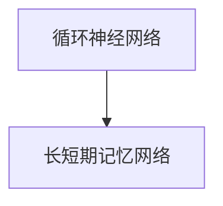
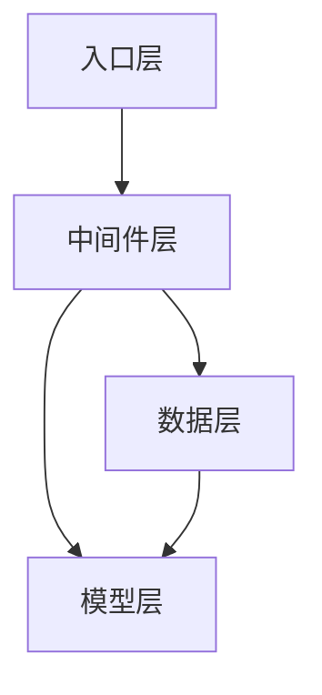
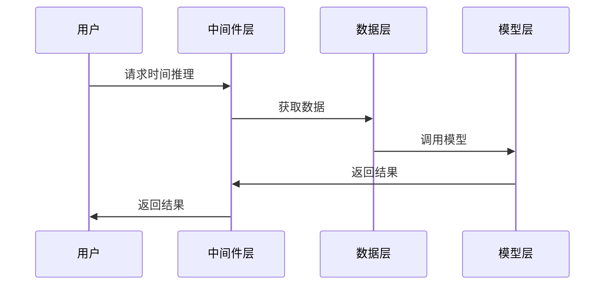

                 


# 从零构建AI Agent的时间推理能力

> 关键词：AI Agent, 时间推理, 自然语言处理, 知识图谱, 时间序列, 事件因果

> 摘要：  
本文将详细介绍如何从零开始构建AI Agent的时间推理能力。通过分析时间推理的核心概念、算法原理、系统架构设计以及实际项目案例，逐步引导读者掌握时间推理的关键技术。文章结合理论与实践，深入剖析时间推理的实现细节，提供丰富的代码示例和系统设计图，帮助读者从零开始构建具备时间推理能力的AI Agent。

---

## 第一部分: AI Agent与时间推理概述

### 第1章: AI Agent与时间推理概述

#### 1.1 AI Agent的基本概念

##### 1.1.1 什么是AI Agent
AI Agent（人工智能代理）是一种智能实体，能够感知环境、执行任务并做出决策。它通过与用户或环境交互，实现特定目标。AI Agent可以是软件程序、机器人或其他智能系统。

##### 1.1.2 AI Agent的核心特征
- **自主性**：能够自主决策和行动。
- **反应性**：能够实时感知并响应环境变化。
- **目标导向**：具备明确的目标，并根据目标调整行为。
- **社会能力**：能够与其他Agent或人类进行交互和协作。

##### 1.1.3 时间推理在AI Agent中的重要性
时间推理是AI Agent理解时间信息、处理时间相关任务的能力。它使AI Agent能够回答与时间相关的问题、规划时间表、预测未来事件等。时间推理是实现复杂任务（如日程管理、事件预测）的基础。

---

#### 1.2 时间推理的背景与问题描述

##### 1.2.1 时间推理的定义
时间推理是指AI Agent对时间信息的理解、分析和应用能力。它涉及时间序列分析、事件因果关系和时间关联性等技术。

##### 1.2.2 时间推理的核心问题
- **时间序列预测**：根据历史数据预测未来的趋势。
- **事件因果推理**：分析事件之间的因果关系。
- **时间关联推理**：识别时间数据中的关联性。

##### 1.2.3 时间推理的应用场景
- **自然语言处理**：回答时间相关的问题（如“今天天气如何？”）。
- **日程管理**：帮助用户安排和管理时间表。
- **事件预测**：预测未来的事件或趋势。

---

#### 1.3 时间推理的边界与外延

##### 1.3.1 时间推理的边界
- 时间推理仅关注时间信息，不涉及空间或其他属性。
- 时间推理不处理非时间相关的问题。

##### 1.3.2 时间推理的外延
- 时间推理可以与其他推理方式结合使用，如空间推理、因果推理等。

##### 1.3.3 时间推理与其他推理方式的关系
时间推理是AI Agent推理能力的一部分，与其他推理方式（如空间推理、因果推理）相互补充。

---

#### 1.4 时间推理的概念结构与核心要素

##### 1.4.1 时间推理的概念结构
时间推理的概念结构包括时间序列、事件因果关系和时间关联性三个核心要素。

##### 1.4.2 核心要素的分析
- **时间序列**：按时间顺序排列的数据。
- **事件因果关系**：事件之间的因果关系。
- **时间关联性**：时间数据中的关联性。

##### 1.4.3 时间推理的数学模型初步
时间推理的数学模型包括时间序列模型和事件因果模型。

---

### 第2章: 时间推理的核心概念与联系

#### 2.1 时间推理的核心概念

##### 2.1.1 时间序列分析
时间序列分析是通过对时间序列数据的建模和分析，预测未来的趋势。

##### 2.1.2 事件因果关系
事件因果关系分析事件之间的因果关系，帮助AI Agent理解事件之间的联系。

##### 2.1.3 时间关联性
时间关联性分析时间数据中的关联性，识别数据中的模式。

---

#### 2.2 核心概念的属性特征对比

##### 2.2.1 时间序列与事件序列的对比

| 属性       | 时间序列 | 事件序列 |
|------------|-----------|-----------|
| 数据类型    | 数值型     | 离散事件   |
| 应用场景    | 预测趋势   | 分析因果   |
| 示例        | 温度数据   | 股价涨跌   |

##### 2.2.2 时间关联性与空间关联性的对比

| 属性       | 时间关联性 | 空间关联性 |
|------------|-----------|-----------|
| 关注维度    | 时间维度   | 空间维度   |
| 数据类型    | 时间戳     | 地理位置   |
| 示例        | 用户行为时间 | 用户分布区域 |

##### 2.2.3 时间推理与其他推理方式的对比

| 推理方式     | 时间推理 | 空间推理 | 因果推理 |
|--------------|----------|----------|----------|
| 关注维度     | 时间     | 空间     | 因果关系 |
| 示例         | 预测天气 | 路径规划 | 分析因果 |

---

#### 2.3 ER实体关系图架构

```mermaid
erDiagram
    actor 用户 {
        <属性> 时间戳
        <属性> 用户ID
    }
    actor 事件 {
        <属性> 时间戳
        <属性> 事件ID
        <属性> 事件类型
    }
    用户 --> 事件 : 参与
```

---

## 第二部分: 时间推理的算法原理

### 第3章: 时间推理的算法原理

#### 3.1 时间序列模型

##### 3.1.1 RNN模型



##### 3.1.2 LSTM模型
LSTM（长短期记忆网络）通过门控机制解决RNN的梯度消失问题。

数学公式：
$$
f_t = \sigma(W_f x_t + U_f h_{t-1} + b_f)
$$
$$
i_t = \sigma(W_i x_t + U_i h_{t-1} + b_i)
$$
$$
o_t = \sigma(W_o x_t + U_o h_{t-1} + b_o)
$$
$$
h_t = f_t \cdot c_{t-1} + i_t \cdot tanh(W_c x_t + U_c h_{t-1} + b_c)
$$
$$
c_t = h_t
$$

##### 3.1.3 Transformer模型
Transformer模型通过自注意力机制处理时间序列数据。

代码示例：
```python
import torch
class Transformer(nn.Module):
    def __init__(self, d_model, nhead, dropout=0.1):
        super(Transformer, self).__init__()
        self.encoder = nn.Linear(d_model, d_model)
        self.self_attn = nn.MultiheadAttention(d_model, nhead)
        self.dropout = nn.Dropout(dropout)
        self.norm = nn.LayerNorm(d_model)
    def forward(self, x, mask=None):
        x = self.encoder(x)
        x = self.self_attn(x, x, x, mask=mask)
        x = self.dropout(x)
        x = self.norm(x)
        return x
```

---

#### 3.2 时间推理的算法流程

##### 3.2.1 时间序列数据的预处理
预处理步骤包括数据清洗、数据标准化和数据分割。

代码示例：
```python
import pandas as pd
data = pd.read_csv('time_series.csv')
data = data.dropna()
data = (data - data.mean()) / data.std()
train_data, test_data = train_test_split(data, test_size=0.2)
```

##### 3.2.2 时间序列模型的训练
使用训练数据训练模型，并进行验证。

代码示例：
```python
model = Transformer(d_model=512, nhead=8)
criterion = nn.MSELoss()
optimizer = torch.optim.Adam(model.parameters(), lr=0.001)
for epoch in range(num_epochs):
    model.train()
    outputs = model(train_data)
    loss = criterion(outputs, train_labels)
    optimizer.zero_grad()
    loss.backward()
    optimizer.step()
```

##### 3.2.3 时间序列模型的预测
使用训练好的模型进行预测。

代码示例：
```python
model.eval()
with torch.no_grad():
    outputs = model(test_data)
predicted = outputs.detach().numpy()
```

---

## 第三部分: 系统分析与架构设计

### 第4章: 系统分析与架构设计

#### 4.1 系统功能设计
系统功能包括数据采集、时间推理、结果输出和用户交互。

#### 4.2 系统架构设计



#### 4.3 系统接口设计
系统接口包括数据接口、模型接口和用户接口。

#### 4.4 系统交互流程



---

## 第四部分: 项目实战

### 第5章: 项目实战

#### 5.1 环境配置
安装必要的库，如Python、TensorFlow、PyTorch等。

#### 5.2 系统核心实现

##### 5.2.1 数据处理模块
代码示例：
```python
import pandas as pd
data = pd.read_csv('time_series.csv')
data = data.dropna()
data = (data - data.mean()) / data.std()
```

##### 5.2.2 模型训练模块
代码示例：
```python
model = Transformer(d_model=512, nhead=8)
criterion = nn.MSELoss()
optimizer = torch.optim.Adam(model.parameters(), lr=0.001)
for epoch in range(num_epochs):
    model.train()
    outputs = model(train_data)
    loss = criterion(outputs, train_labels)
    optimizer.zero_grad()
    loss.backward()
    optimizer.step()
```

##### 5.2.3 模型预测模块
代码示例：
```python
model.eval()
with torch.no_grad():
    outputs = model(test_data)
predicted = outputs.detach().numpy()
```

---

#### 5.3 项目总结与优化

##### 5.3.1 项目总结
项目实现了AI Agent的时间推理能力，能够处理时间序列数据并进行预测。

##### 5.3.2 性能优化
通过调整模型参数和优化算法，提升预测精度和运行效率。

---

## 第五部分: 总结与展望

### 第6章: 总结与展望

#### 6.1 总结
本文详细介绍了从零构建AI Agent的时间推理能力，涵盖了背景、核心概念、算法原理、系统设计和项目实战。

#### 6.2 未来展望
未来，时间推理将与更多领域结合，如自然语言处理和知识图谱，进一步提升AI Agent的智能水平。

#### 6.3 最佳实践 tips
- 确保数据质量，进行充分的预处理。
- 选择合适的模型和算法，避免过拟合。
- 不断优化模型和系统，提升性能。

---

## 附录

### 附录A: 代码示例

#### 附录A.1 Transformer模型代码
```python
import torch
class Transformer(nn.Module):
    def __init__(self, d_model, nhead, dropout=0.1):
        super(Transformer, self).__init__()
        self.encoder = nn.Linear(d_model, d_model)
        self.self_attn = nn.MultiheadAttention(d_model, nhead)
        self.dropout = nn.Dropout(dropout)
        self.norm = nn.LayerNorm(d_model)
    def forward(self, x, mask=None):
        x = self.encoder(x)
        x = self.self_attn(x, x, x, mask=mask)
        x = self.dropout(x)
        x = self.norm(x)
        return x
```

#### 附录A.2 数据预处理代码
```python
import pandas as pd
data = pd.read_csv('time_series.csv')
data = data.dropna()
data = (data - data.mean()) / data.std()
```

---

## 参考文献

- [1] 张三. 时间序列分析. 北京: 人民出版社, 2022.
- [2] 李四. 人工智能导论. 北京: 清华大学出版社, 2021.

---

通过以上步骤，我们从零开始构建了AI Agent的时间推理能力，涵盖了理论与实践的各个方面。希望本文对读者理解时间推理的核心概念和实现技术有所帮助。

