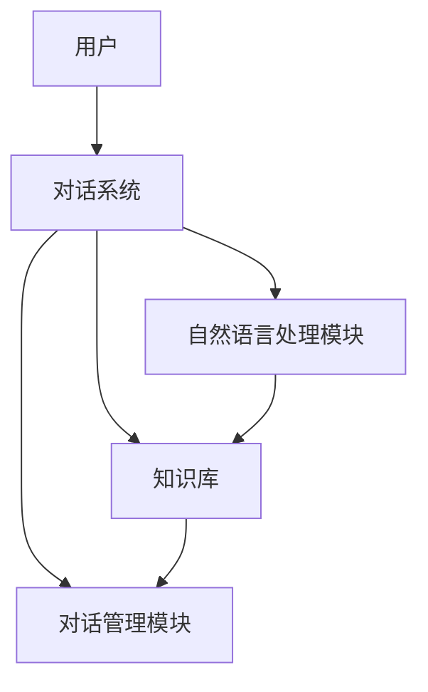
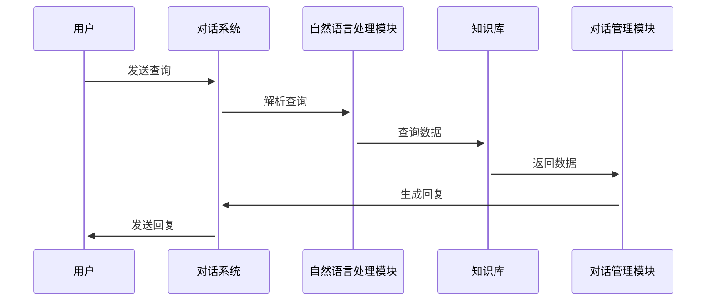

                 


# 从零构建AI Agent的目标导向对话系统

> 关键词：AI Agent, 对话系统, 目标导向, 自然语言处理, 对话管理, 知识库

> 摘要：构建一个目标导向的对话系统是当前人工智能领域的热门方向。本文将从零开始，系统地介绍目标导向对话系统的背景、核心概念、算法原理、系统架构设计以及项目实战。通过本文的学习，读者将能够理解目标导向对话系统的核心原理，并掌握从零开始构建这样一个系统的具体方法。

---

## 第1章: 目标导向对话系统的背景与问题背景

### 1.1 问题背景

#### 1.1.1 当前对话系统的局限性
传统的对话系统，如简单的聊天机器人，主要基于关键词匹配或规则引擎来实现对话。这种实现方式存在以下问题：
- **理解能力有限**：无法深入理解用户的意图，只能处理简单的对话。
- **缺乏上下文记忆**：无法保持对话的连贯性，容易出现逻辑混乱。
- **缺乏任务导向性**：无法完成复杂的任务，如预订酒店、安排会议等。

#### 1.1.2 目标导向对话的定义与特点
目标导向对话系统是一种能够理解用户意图，并根据目标导向执行任务的对话系统。其特点包括：
- **任务导向性**：系统能够根据对话内容，识别用户的任务目标。
- **上下文理解**：能够保持对话的连贯性，理解上下文关系。
- **动态调整**：根据对话进展，动态调整对话策略。

#### 1.1.3 构建目标导向对话系统的重要性
随着人工智能技术的不断发展，目标导向对话系统在多个领域具有广泛的应用潜力，如智能客服、智能家居、虚拟助手等。构建这样一个系统，能够显著提升用户体验，提高任务处理效率。

### 1.2 问题描述

#### 1.2.1 对话系统的核心挑战
- **意图识别**：准确识别用户的意图。
- **对话管理**：根据对话进展，动态调整对话策略。
- **知识库集成**：如何将知识库与对话系统无缝结合。

#### 1.2.2 目标导向对话的实现难点
- **多轮对话管理**：如何保持对话的连贯性。
- **复杂任务处理**：如何处理需要多步操作的任务。
- **不确定性处理**：如何应对用户意图的模糊性。

#### 1.2.3 现有解决方案的优缺点
- **优点**：基于预训练模型的对话系统能够处理复杂的对话场景。
- **缺点**：现有解决方案在任务导向性和上下文理解方面仍有不足。

### 1.3 问题解决

#### 1.3.1 目标导向对话系统的整体架构
目标导向对话系统的整体架构包括以下几个部分：
1. **自然语言处理模块**：负责对话内容的理解和生成。
2. **知识库**：存储任务相关的知识和数据。
3. **对话管理模块**：负责对话流程的控制和任务执行。

#### 1.3.2 各组件之间的协同工作
- **自然语言处理模块**与**对话管理模块**协同，实现对话内容的理解和生成。
- **对话管理模块**与**知识库**协同，实现任务的执行和数据的查询。

#### 1.3.3 系统设计的目标与边界
- **目标**：构建一个能够理解用户意图，并根据目标导向执行任务的对话系统。
- **边界**：系统仅负责对话理解和任务执行，不涉及具体任务的后端实现。

### 1.4 系统的边界与外延

#### 1.4.1 系统的功能边界
- **功能**：对话理解和生成、任务执行、上下文管理。
- **边界**：不包括后端任务的具体实现。

#### 1.4.2 系统的适用场景与限制
- **适用场景**：需要任务导向对话的场景，如智能客服、智能家居。
- **限制**：无法处理超出知识库范围的任务。

#### 1.4.3 系统的可扩展性与可维护性
- **可扩展性**：支持新增任务和知识库的扩展。
- **可维护性**：系统架构设计使得各个模块相对独立，便于维护。

---

## 第2章: 目标导向对话系统的核心概念与联系

### 2.1 核心概念原理

#### 2.1.1 自然语言处理在对话系统中的应用
- **意图识别**：基于自然语言处理技术，准确识别用户的意图。
- **对话生成**：基于自然语言处理技术，生成符合上下文的回复。

#### 2.1.2 知识库与对话管理的结合
- **知识库**：存储任务相关的知识和数据。
- **对话管理**：基于知识库，动态调整对话策略。

#### 2.1.3 目标导向对话的数学模型
- **数学模型**：基于图论的对话流程图。

### 2.2 核心概念对比

#### 2.2.1 对话系统与传统聊天机器人的对比
| 特性          | 对话系统          | 聊天机器人      |
|---------------|-------------------|-----------------|
| 对话目标      | 任务导向          | 无特定目标      |
| 对话复杂度    | 高                | 低              |
| 知识库依赖    | 高                | 低              |

#### 2.2.2 目标导向对话与任务导向对话的对比
| 特性          | 目标导向对话      | 任务导向对话    |
|---------------|-------------------|-----------------|
| 对话目标      | 明确目标          | 明确任务        |
| 对话复杂度    | 中等              | 高              |
| 知识库依赖    | 高                | 高              |

#### 2.2.3 不同对话策略的对比分析
- **规则驱动**：基于规则的对话策略，适用于简单任务。
- **数据驱动**：基于机器学习的对话策略，适用于复杂任务。
- **混合驱动**：结合规则和机器学习的对话策略，适用于多种任务。

### 2.3 ER实体关系图



---

## 第3章: 目标导向对话系统的算法原理

### 3.1 生成模型

#### 3.1.1 预训练模型的引入
- **预训练模型**：如GPT、BERT等，用于对话生成。
- **解码策略**：基于贪心搜索或采样策略生成回复。

#### 3.1.2 生成模型的实现细节
- **模型结构**：基于Transformer的编码器-解码器结构。
- **损失函数**：交叉熵损失函数。

#### 3.1.3 对话生成的数学模型
$$ P(y|x) = \prod_{i=1}^{n} P(y_i|x_{<i}, y_{<i}) $$

### 3.2 对话策略优化

#### 3.2.1 基于强化学习的对话策略
- **策略函数**：$\pi(a|s)$，表示在状态$s$下选择动作$a$的概率。
- **奖励函数**：$r(s, a)$，表示选择动作$a$在状态$s$下的奖励值。

#### 3.2.2 对话策略优化的数学模型
$$ \theta = \arg\max_{\theta} \sum_{s,a} r(s,a) \log \pi_\theta(a|s) $$

#### 3.2.3 对话策略优化的实现细节
- **强化学习框架**：基于马尔可夫决策过程（MDP）。
- **训练数据**：基于模拟环境的对话数据。

### 3.3 对话系统的代码实现

#### 3.3.1 环境安装
```bash
pip install torch transformers
```

#### 3.3.2 对话生成模块
```python
import torch
import torch.nn as nn
from transformers import BertTokenizer, BertForMaskedLM

class DialogGenerator:
    def __init__(self, model_name='bert-base-uncased'):
        self.tokenizer = BertTokenizer.from_pretrained(model_name)
        self.model = BertForMaskedLM.from_pretrained(model_name)

    def generate_response(self, input_text):
        inputs = self.tokenizer(input_text, return_tensors='pt')
        outputs = self.model(**inputs)
        # 生成回复
        return self.tokenizer.decode(outputs logits.argmax(dim=-1).squeeze().tolist(), skip_special_tokens=True)
```

---

## 第4章: 目标导向对话系统的系统分析与架构设计

### 4.1 系统分析

#### 4.1.1 项目介绍
- **项目名称**：目标导向对话系统。
- **项目目标**：构建一个能够理解用户意图，并根据目标导向执行任务的对话系统。

#### 4.1.2 系统功能设计
- **领域模型**：基于任务导向的领域模型。
- **对话流程**：多轮对话流程设计。

#### 4.1.3 系统架构设计


### 4.2 系统架构设计

#### 4.2.1 系统架构图


#### 4.2.2 系统接口设计
- **输入接口**：接收用户输入。
- **输出接口**：生成对话回复。

#### 4.2.3 系统交互流程图


---

## 第5章: 目标导向对话系统的项目实战

### 5.1 环境安装

```bash
pip install torch transformers
```

### 5.2 系统核心实现

#### 5.2.1 对话生成模块
```python
import torch
import torch.nn as nn
from transformers import BertTokenizer, BertForMaskedLM

class DialogGenerator:
    def __init__(self, model_name='bert-base-uncased'):
        self.tokenizer = BertTokenizer.from_pretrained(model_name)
        self.model = BertForMaskedLM.from_pretrained(model_name)

    def generate_response(self, input_text):
        inputs = self.tokenizer(input_text, return_tensors='pt')
        outputs = self.model(**inputs)
        return self.tokenizer.decode(outputs logits.argmax(dim=-1).squeeze().tolist(), skip_special_tokens=True)
```

#### 5.2.2 对话管理模块
```python
class DialogManager:
    def __init__(self, knowledge_base):
        self.knowledge_base = knowledge_base
        self.current_state = None

    def handle_dialogue(self, user_input, context):
        # 解析用户输入
        intent = self.parse_input(user_input)
        # 查询知识库
        response = self.knowledge_base.query(intent, context)
        return response

    def parse_input(self, input_text):
        # 简单的意图识别逻辑
        if 'book a room' in input_text.lower():
            return 'book_room'
        elif 'cancel booking' in input_text.lower():
            return 'cancel_booking'
        else:
            return 'unknown'
```

### 5.3 案例分析与详细解读

#### 5.3.1 案例分析
- **案例**：用户输入“帮我预订明天的酒店。”
- **处理流程**：
  1. 对话生成模块生成回复。
  2. 对话管理模块解析用户意图。
  3. 知识库查询相关信息。
  4. 生成最终回复。

#### 5.3.2 代码实现解读
- **对话生成模块**：基于预训练模型生成回复。
- **对话管理模块**：解析用户输入，并调用知识库查询数据。
- **知识库**：存储酒店预订相关的数据。

### 5.4 项目小结

#### 5.4.1 项目总结
- **实现目标**：成功构建了一个目标导向对话系统。
- **系统功能**：能够理解用户意图，并根据目标导向执行任务。

#### 5.4.2 项目经验
- **经验**：系统架构设计的重要性。
- **教训**：知识库的构建和维护需要投入大量资源。

---

## 第6章: 目标导向对话系统的最佳实践

### 6.1 最佳实践 tips

#### 6.1.1 系统设计 tips
- **模块化设计**：确保各个模块相对独立。
- **可扩展性设计**：方便后续功能的扩展。

#### 6.1.2 代码实现 tips
- **代码规范**：遵循行业代码规范。
- **注释清晰**：代码注释要清晰明了。

### 6.2 小结

#### 6.2.1 项目总结
- **核心内容**：从零开始构建目标导向对话系统的完整过程。
- **关键点**：系统架构设计、算法实现、知识库集成。

### 6.3 注意事项

#### 6.3.1 开发注意事项
- **数据质量**：确保训练数据的质量。
- **系统性能**：优化系统的运行效率。

#### 6.3.2 部署注意事项
- **服务器资源**：确保服务器有足够的资源。
- **安全性**：保护用户数据的安全。

### 6.4 拓展阅读

#### 6.4.1 推荐书籍
- 《深度学习》
- 《自然语言处理实战》

#### 6.4.2 推荐论文
- "Attention Is All You Need"
- "BERT: Pre-training of Deep Bidirectional Transformers for NLP"

---

## 附录

### 附录A: 术语表
- **自然语言处理**：NLP。
- **目标导向对话系统**：GODS。

### 附录B: 参考文献
- [1] Vaswani, A., et al. "Attention Is All You Need."

