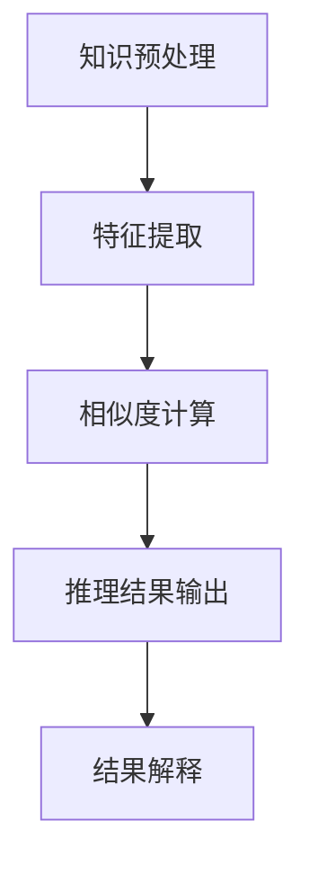

                 


# 从零构建AI Agent的类比推理系统

> 关键词：AI Agent，类比推理，知识图谱，向量空间模型，符号逻辑，推理算法，系统架构

> 摘要：  
本文将详细介绍从零开始构建AI Agent的类比推理系统的全过程。从类比推理的基本概念到算法原理，从系统架构设计到实际项目实现，本文将全面解析类比推理系统的核心技术与实现细节。通过本文，读者将能够理解类比推理的基本原理，掌握类比推理系统的实现方法，并能够基于实际需求进行系统扩展与优化。

---

# 第一部分: AI Agent与类比推理概述

## 第1章: AI Agent的基本概念与背景

### 1.1 AI Agent的定义与分类

AI Agent（人工智能代理）是指能够感知环境、自主决策并执行任务的智能实体。它可以分为以下几类：

- **简单反射型Agent**：基于当前输入做出简单反应。
- **基于模型的反射型Agent**：利用内部模型进行状态表示和决策。
- **目标驱动型Agent**：基于目标进行规划和推理。
- **效用驱动型Agent**：通过最大化效用函数进行决策。

### 1.2 类比推理的定义与特点

类比推理是一种基于相似性进行推理的思维方式，其核心在于寻找两个事物之间的相似性或关系，并通过已知信息推导未知信息。类比推理的特点包括：

- **相似性驱动**：依赖于输入数据的相似性。
- **非精确性**：推理结果通常具有一定的模糊性。
- **启发性**：基于经验或已知知识进行推理。

### 1.3 类比推理在AI Agent中的作用

类比推理在AI Agent中的作用主要体现在以下几个方面：

- **知识表示**：通过类比推理将隐性知识显式化。
- **推理与决策**：帮助AI Agent在复杂场景中做出合理决策。
- **学习与优化**：通过类比推理优化AI Agent的性能。

---

## 第2章: 类比推理的背景与技术背景

### 2.1 类比推理的历史发展

类比推理的概念最早可以追溯到古希腊哲学家亚里士多德的逻辑推理理论。20世纪，随着人工智能的兴起，类比推理开始被广泛应用于机器学习和自然语言处理领域。

### 2.2 类比推理的技术基础

类比推理的技术基础主要包括以下几点：

- **符号逻辑**：基于符号逻辑的推理规则。
- **知识图谱**：通过知识图谱构建语义网络。
- **机器学习**：利用机器学习模型进行特征提取和模式识别。

### 2.3 类比推理的应用场景

类比推理的应用场景包括：

- **自然语言处理**：如文本相似性计算、语义分析。
- **推荐系统**：通过用户行为相似性进行推荐。
- **医疗诊断**：通过症状相似性进行疾病诊断。

---

# 第二部分: 类比推理的核心概念与原理

## 第3章: 类比推理的核心概念

### 3.1 类比推理的定义

类比推理是一种通过比较两个事物之间的相似性，推导出新的结论的推理方式。其基本形式为：如果A与B在某些方面相似，那么A在其他方面也可能与B相似。

### 3.2 类比推理的三段论模型

类比推理的三段论模型可以表示为：

1. **前提**：A在某些方面与B相似。
2. **前提**：A在其他方面也有某种属性。
3. **结论**：B可能具有与A相同的属性。

### 3.3 类比推理的特征提取

特征提取是类比推理的关键步骤，主要包括以下内容：

- **文本特征提取**：如TF-IDF、词嵌入。
- **图像特征提取**：如CNN、PCA。
- **行为特征提取**：如用户行为序列分析。

---

## 第4章: 类比推理的原理与机制

### 4.1 基于符号逻辑的推理

基于符号逻辑的推理是一种通过预定义的规则进行推理的方式。其优点是逻辑清晰，但缺点是难以处理模糊性问题。

### 4.2 基于向量空间的推理

基于向量空间的推理是一种通过向量相似性进行推理的方式。其优点是能够处理高维数据，但缺点是缺乏语义理解能力。

### 4.3 基于知识图谱的推理

基于知识图谱的推理是一种通过知识图谱进行语义推理的方式。其优点是能够处理复杂的语义关系，但缺点是构建知识图谱需要大量人工干预。

---

# 第三部分: 类比推理的算法原理

## 第5章: 向量空间模型

### 5.1 向量空间模型的定义

向量空间模型是一种将文本表示为向量空间中点的模型。其核心思想是将文本转换为向量，通过向量的相似性进行推理。

### 5.2 余弦相似度计算

余弦相似度是一种常用的文本相似性度量方法，其公式为：

$$
\cos \theta = \frac{\vec{A} \cdot \vec{B}}{|\vec{A}| |\vec{B}|}
$$

其中，$\vec{A}$和$\vec{B}$分别是两个文本的向量表示。

### 5.3 曼哈顿距离计算

曼哈顿距离是一种常用的向量距离度量方法，其公式为：

$$
d = |x_1 - x_2| + |y_1 - y_2|
$$

---

## 第6章: 基于知识图谱的推理算法

### 6.1 知识图谱的构建

知识图谱的构建主要包括数据采集、数据清洗、实体识别和关系抽取等步骤。

### 6.2 基于路径的推理算法

基于路径的推理算法是一种通过知识图谱中的路径进行推理的方式。其优点是能够处理复杂的语义关系，但缺点是计算复杂度较高。

### 6.3 基于规则的推理算法

基于规则的推理算法是一种通过预定义的规则进行推理的方式。其优点是规则清晰，但缺点是难以处理复杂场景。

---

# 第四部分: 类比推理系统的架构设计

## 第7章: 系统架构概述

### 7.1 系统整体架构

类比推理系统的整体架构主要包括知识库、推理引擎和接口模块三个部分。

### 7.2 知识库设计

知识库设计主要包括数据存储、数据查询和数据管理三个部分。

### 7.3 推理引擎设计

推理引擎设计主要包括特征提取、相似度计算和推理结果输出三个部分。

---

## 第8章: 系统功能设计

### 8.1 系统功能模块

类比推理系统的功能模块主要包括知识预处理、特征提取、推理引擎和结果解释四个部分。

### 8.2 功能模块交互流程

功能模块交互流程可以通过Mermaid图表示如下：



---

# 第五部分: 项目实战

## 第9章: 环境安装与核心代码实现

### 9.1 环境安装

需要安装的环境包括Python、Jieba、numpy和scikit-learn等库。

### 9.2 核心代码实现

以下是类比推理系统的核心代码实现：

```python
import numpy as np
from sklearn.metrics.pairwise import cosine_similarity

# 定义特征提取函数
def extract_features(text):
    # 这里可以使用TF-IDF或其他特征提取方法
    pass

# 定义相似度计算函数
def calculate_similarity(features1, features2):
    return cosine_similarity(features1, features2)

# 定义推理函数
def analogical_reasoning(features1, features2):
    similarity = calculate_similarity(features1, features2)
    return similarity
```

---

## 第10章: 项目小结

### 10.1 项目总结

通过本文的项目实战部分，读者可以掌握类比推理系统的实现方法，并能够基于实际需求进行系统扩展与优化。

### 10.2 注意事项

在实际应用中，需要注意数据质量和特征提取的准确性，以确保推理结果的准确性。

### 10.3 拓展阅读

建议读者进一步阅读相关领域的经典论文和书籍，以深入理解类比推理的核心原理和技术实现。

---

# 第六部分: 总结与展望

## 第11章: 总结与展望

### 11.1 总结

通过本文的详细讲解，读者可以全面掌握类比推理系统的核心技术与实现方法。

### 11.2 展望

未来，随着人工智能技术的不断发展，类比推理系统将在更多领域得到广泛应用，同时也需要进一步优化和创新。

---

# 结语

类比推理是AI Agent的重要组成部分，其核心技术与实现方法将为人工智能的发展提供重要支持。通过本文的详细讲解，读者可以全面掌握类比推理系统的核心技术与实现方法，并能够基于实际需求进行系统扩展与优化。

