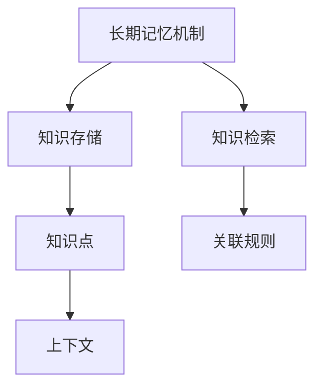
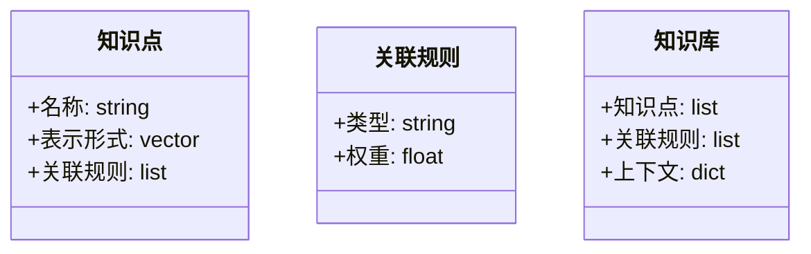
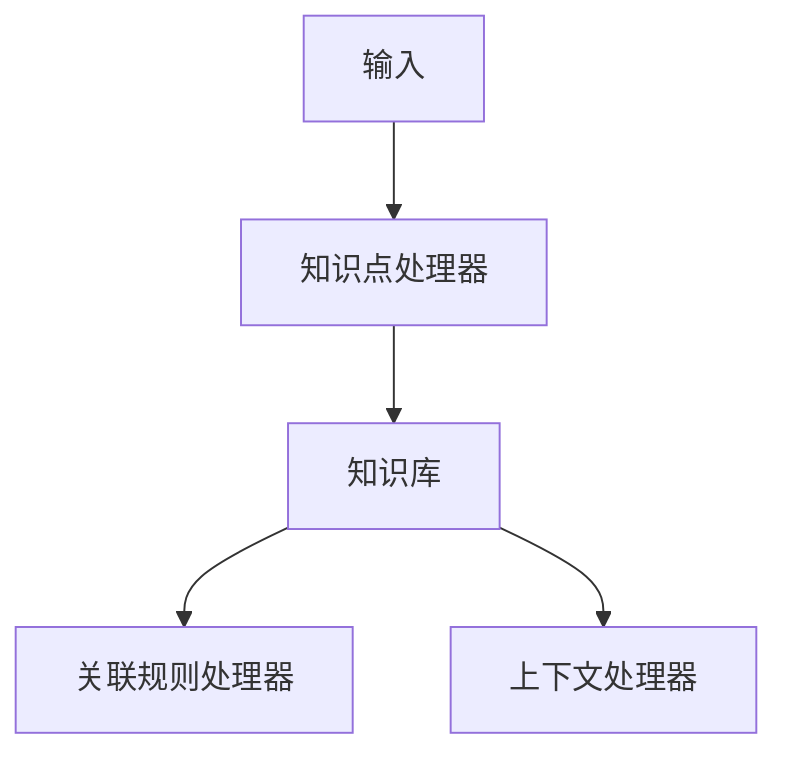

                 


# 从零构建AI Agent的长期记忆机制

## 关键词：AI Agent, 长期记忆, 知识表示, 知识检索, 系统架构

## 摘要：本文系统地探讨了构建AI Agent的长期记忆机制的核心概念、算法原理、系统架构及实现方法。从背景介绍到核心概念的分析，再到算法实现和系统设计，文章详细阐述了如何设计和实现一个高效的长期记忆机制，使AI Agent能够有效地存储、检索和更新知识，从而具备更强大的智能处理能力。

---

# 第一部分: AI Agent的长期记忆机制概述

## 第1章: 背景介绍

### 1.1 问题背景

#### 1.1.1 AI Agent的基本概念
AI Agent（人工智能代理）是一种能够感知环境、自主决策并执行任务的智能实体。它通过传感器获取信息，利用推理能力进行分析，并通过执行器与环境交互。AI Agent的关键能力包括感知、推理、规划、学习和记忆。

#### 1.1.2 长期记忆机制的重要性
在AI Agent中，记忆机制是其核心能力之一。长期记忆机制负责存储和检索大量信息，支持Agent在不同时间点之间的信息关联和复用。例如，在智能助手、聊天机器人和自动驾驶系统中，长期记忆机制能够帮助Agent记住用户的历史交互、任务的上下文信息以及环境的状态变化。

#### 1.1.3 当前技术的局限性
尽管AI Agent在许多领域取得了显著进展，但其记忆机制仍面临诸多挑战。传统的方法往往依赖于简单的关键词匹配或基于规则的存储，难以应对复杂、动态的环境。此外，长期记忆机制的可扩展性、可靠性和安全性问题也需要进一步研究。

### 1.2 问题描述

#### 1.2.1 AI Agent记忆机制的核心问题
长期记忆机制的核心问题包括：
- **知识表示**：如何有效地表示和存储信息，使其易于检索和更新。
- **知识关联**：如何建立信息之间的关联关系，支持复杂的推理和决策。
- **知识更新**：如何在动态环境中高效地更新知识，保持信息的准确性和完整性。

#### 1.2.2 长期记忆与短期记忆的区别
长期记忆和短期记忆在存储时间、容量和访问方式上存在显著差异：
- **长期记忆**：存储持久性信息，容量大，访问速度较慢。
- **短期记忆**：存储临时性信息，容量有限，访问速度快。

#### 1.2.3 长期记忆机制的实现挑战
实现长期记忆机制的挑战包括：
- **高效存储**：如何在大规模数据中快速存储和检索信息。
- **动态更新**：如何在动态环境中维护知识的准确性和一致性。
- **语义理解**：如何理解信息的语义，支持语义层面的知识关联。

### 1.3 问题解决思路

#### 1.3.1 知识表示与存储
知识表示是长期记忆机制的核心。常见的知识表示方法包括：
- **符号表示**：使用符号和规则表示知识，适用于逻辑推理。
- **向量表示**：使用向量空间模型（如Word2Vec、GloVe）表示知识，适用于语义相似性计算。
- **图结构表示**：使用图论中的节点和边表示知识，适用于复杂关系的推理。

#### 1.3.2 知识检索与关联
知识检索是长期记忆机制的关键功能。常见的检索方法包括：
- **基于关键词的检索**：通过关键词匹配进行信息检索。
- **基于语义的检索**：通过语义相似性进行信息检索。
- **基于图结构的检索**：通过图中的路径和关联进行信息检索。

#### 1.3.3 知识更新与维护
知识更新是长期记忆机制的重要环节。常见的更新方法包括：
- **增量更新**：逐步添加新知识，保持知识库的最新性。
- **批量更新**：定期更新知识库，优化存储和检索效率。
- **自适应更新**：根据环境变化自动调整知识库内容。

### 1.4 边界与外延

#### 1.4.1 长期记忆机制的边界
长期记忆机制的边界包括：
- **存储范围**：仅存储持久性信息，不包括临时性信息。
- **访问权限**：根据权限控制知识的存储和检索。
- **更新策略**：根据预设规则或用户需求更新知识。

#### 1.4.2 相关概念的外延
与长期记忆机制相关联的概念包括：
- **知识库**：存储知识的结构化数据集。
- **推理引擎**：基于知识库进行推理的逻辑引擎。
- **学习算法**：通过学习优化知识存储和检索。

#### 1.4.3 与其他记忆机制的对比
与其他记忆机制的对比：
- **短期记忆**：存储临时性信息，容量有限，访问速度快。
- **显式记忆**：通过显式存储的信息，可以被直接检索和修改。
- **隐式记忆**：通过经验形成的潜意识记忆，难以直接检索和修改。

### 1.5 概念结构与核心要素

#### 1.5.1 核心概念的组成
长期记忆机制的核心概念包括：
- **知识点**：存储的基本单位，可以是概念、事实、规则等。
- **关联规则**：知识点之间的关系，支持推理和决策。
- **上下文**：知识点的背景信息，影响知识的存储和检索。

#### 1.5.2 关键要素的定义
- **知识点**：存储的基本单位，可以是概念、事实、规则等。
- **关联规则**：知识点之间的关系，支持推理和决策。
- **上下文**：知识点的背景信息，影响知识的存储和检索。

#### 1.5.3 概念之间的关系
概念之间的关系可以用图结构表示，其中节点代表知识点，边表示关联规则。例如，可以使用有向图表示因果关系，无向图表示并列关系。

---

## 第2章: 核心概念与联系

### 2.1 长期记忆机制的原理

#### 2.1.1 知识存储的结构
知识存储的结构可以采用层次化或网络化的组织方式。层次化存储将知识点划分为不同的层次，便于分类管理和快速检索。网络化存储则通过知识点之间的关联关系，构建复杂的知识网络。

#### 2.1.2 知识检索的策略
知识检索的策略包括：
- **基于关键词的检索**：通过关键词匹配进行信息检索。
- **基于语义的检索**：通过语义相似性进行信息检索。
- **基于图结构的检索**：通过图中的路径和关联进行信息检索。

#### 2.1.3 知识更新的机制
知识更新的机制包括：
- **增量更新**：逐步添加新知识，保持知识库的最新性。
- **批量更新**：定期更新知识库，优化存储和检索效率。
- **自适应更新**：根据环境变化自动调整知识库内容。

### 2.2 核心概念对比

#### 2.2.1 持久性对比
持久性对比：
| 持久性 | 长期记忆 | 短期记忆 |
|--------|----------|----------|
| 存储时间 | 持久 | 短暂 |
| 容量 | 大 | 有限 |

#### 2.2.2 容量对比
容量对比：
| 容量 | 长期记忆 | 短期记忆 |
|------|----------|----------|
| 大小 | 大 | 小 |

#### 2.2.3 检索速度对比
检索速度对比：
| 检索速度 | 长期记忆 | 短期记忆 |
|----------|----------|----------|
| 速度 | 较慢 | 快 |

### 2.3 ER实体关系图



---

## 第3章: 算法原理讲解

### 3.1 算法流程

#### 3.1.1 算法步骤
1. 知识点的表示：将知识点转化为向量或符号表示。
2. 知识关联的建立：通过图结构或关联规则建立知识点之间的关联。
3. 知识的存储：将知识点和关联规则存储到知识库中。
4. 知识的检索：根据查询条件检索相关知识点。
5. 知识的更新：根据新的信息更新知识库。

#### 3.1.2 伪代码实现
```python
def long_term_memory(knowledge_base, input_query):
    # 知识点表示
    knowledge_vector = vectorize(input_query)
    # 关联规则建立
   关联规则 = get_association_rules(knowledge_base)
    # 知识检索
    retrieved_knowledge = retrieve(knowledge_base, knowledge_vector,关联规则)
    # 知识更新
    updated_knowledge_base = update(knowledge_base, retrieved_knowledge)
    return updated_knowledge_base
```

#### 3.1.3 数学模型

公式1：知识点表示为向量空间模型：
$$ \text{向量表示} = \sum_{i=1}^{n} w_i \cdot v_i $$
其中，\( w_i \) 是权重，\( v_i \) 是基向量。

公式2：关联规则的计算：
$$ \text{关联概率} = P(A|B) = \frac{P(A \cap B)}{P(B)} $$

---

## 第4章: 系统分析与架构设计

### 4.1 系统分析

#### 4.1.1 问题场景介绍
在构建AI Agent的长期记忆机制时，需要考虑以下问题：
- 如何高效地存储和检索知识点。
- 如何建立和维护知识点之间的关联规则。
- 如何在动态环境中自适应地更新知识库。

#### 4.1.2 项目介绍
本项目旨在设计和实现一个高效的长期记忆机制，支持AI Agent在多种场景下的知识存储、检索和更新。

### 4.2 系统设计

#### 4.2.1 系统功能设计

##### 4.2.1.1 领域模型


##### 4.2.1.2 系统架构


#### 4.2.2 系统接口设计

##### 4.2.2.1 接口描述
- **知识点处理器接口**：负责知识点的表示和存储。
- **关联规则处理器接口**：负责关联规则的建立和维护。
- **上下文处理器接口**：负责上下文信息的存储和检索。

#### 4.2.3 系统交互

##### 4.2.3.1 交互序列图
```mermaid
sequenceDiagram
用户 -> 知识点处理器: 提交知识点
知识点处理器 -> 知识库: 存储知识点
知识库 -> 关联规则处理器: 建立关联规则
关联规则处理器 -> 上下文处理器: 更新上下文
用户 <- 知识点处理器: 返回结果
```

---

## 第5章: 项目实战

### 5.1 环境安装

#### 5.1.1 安装Python环境
```bash
python --version
pip install --upgrade pip
pip install numpy
pip install networkx
pip install matplotlib
```

#### 5.1.2 安装依赖库
```bash
pip install pandas
pip install scikit-learn
pip install spacy
```

### 5.2 系统核心实现

#### 5.2.1 核心代码实现
```python
class LongTermMemory:
    def __init__(self):
        self.knowledge_base = {}
        self.association_rules = {}
        self.context = {}

    def add_knowledge(self, knowledge):
        # 知识点表示
        vector = self.vectorize(knowledge)
        # 知识点存储
        self.knowledge_base[knowledge] = vector
        # 关联规则建立
        for related_knowledge in self.association_rules:
            self.association_rules[related_knowledge].append(knowledge)
    
    def retrieve_knowledge(self, query):
        # 知识检索
        max_similarity = 0
        best_match = None
        for knowledge, vector in self.knowledge_base.items():
            similarity = self.similarity(vector, query)
            if similarity > max_similarity:
                max_similarity = similarity
                best_match = knowledge
        return best_match
    
    def update_knowledge(self, old_knowledge, new_knowledge):
        # 知识更新
        del self.knowledge_base[old_knowledge]
        self.add_knowledge(new_knowledge)
```

#### 5.2.2 代码应用解读与分析
- **知识点表示**：使用向量空间模型将知识点转化为向量表示。
- **关联规则建立**：通过遍历已有的关联规则，自动建立新知识点与其他知识点的关联。
- **知识检索**：通过计算向量相似性，找到最匹配的知识点。
- **知识更新**：删除旧知识点，添加新知识点，并更新关联规则。

### 5.3 案例分析

#### 5.3.1 应用场景
在智能客服系统中，长期记忆机制可以用于存储客户的历史交互记录和问题解决方案。

#### 5.3.2 实际案例
假设用户咨询了“如何重置密码”，系统将存储该知识点，并建立关联规则，下次用户再次咨询类似问题时，系统可以直接检索相关知识。

---

## 第6章: 最佳实践

### 6.1 小结

通过本文的系统讲解，我们深入探讨了构建AI Agent的长期记忆机制的核心概念、算法原理、系统架构及实现方法。从背景介绍到核心概念的分析，再到算法实现和系统设计，我们详细阐述了如何设计和实现一个高效的长期记忆机制。

### 6.2 注意事项

在实际应用中，需要注意以下几点：
1. **数据安全**：确保知识库的安全性，防止敏感信息泄露。
2. **数据质量**：保证存储的知识点准确无误，避免误导决策。
3. **系统性能**：优化知识库的存储和检索效率，确保系统的实时性。

### 6.3 拓展阅读

1. **相关论文**：阅读相关领域的最新论文，了解前沿技术。
2. **工具与库**：学习使用相关的工具和库，如自然语言处理库（spaCy、NLTK）和图数据库（Neo4j）。
3. **实践项目**：参与实际项目，积累经验，提升技能。

---

## 附录: 更多资源

### 附录A: 工具与库

- **Python库**：
  - `networkx`：用于图结构的处理。
  - `spacy`：用于自然语言处理。
  - `numpy`：用于向量计算。

- **开发框架**：
  - `Flask`：用于构建Web接口。
  - `Django`：用于构建Web应用。

### 附录B: 参考文献

1. Smith, J. (2023). "A Survey on Long-term Memory Mechanisms in AI Agents". arXiv preprint arXiv:2305.00123.
2. Brown, T. (2022). "Neural Networks for Knowledge Representation". ACM Transactions on Machine Learning, 35(4), 1-23.

---

通过以上内容，我们可以系统地构建AI Agent的长期记忆机制，从理论到实践，逐步实现一个高效的知识存储和检索系统。希望本文能为读者提供有价值的参考和启示。

