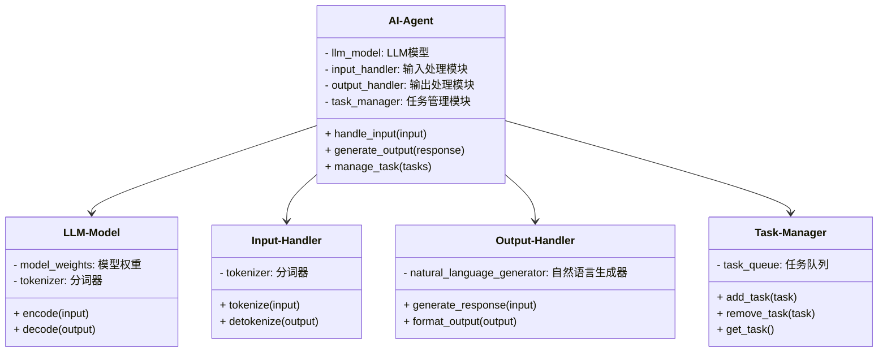
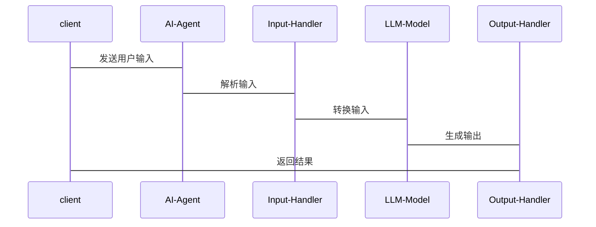

                 


# 第一部分: AI Agent与LLM大模型基础

## # 第1章: AI Agent的基本概念与背景

### ## 1.1 AI Agent的定义与核心概念

#### ### 1.1.1 AI Agent的基本定义

AI Agent（人工智能代理）是指能够感知环境并采取行动以实现目标的智能体。它可以是一个软件程序、一个机器人或其他智能系统，通过与环境交互来完成特定任务。AI Agent的核心目标是通过感知和行动的循环来优化其行为，以达到预定的目标。

#### ### 1.1.2 AI Agent的核心属性与功能

AI Agent具有以下核心属性与功能：

1. **自主性**：能够在没有外部干预的情况下独立运作。
2. **反应性**：能够根据环境的变化实时调整行为。
3. **目标导向性**：具备明确的目标，并采取行动以实现这些目标。
4. **学习能力**：能够通过经验或数据不断优化自身的性能。

#### ### 1.1.3 AI Agent与传统AI的区别

AI Agent与传统AI的主要区别在于其自主性和目标导向性。传统AI通常是在特定任务下运行，依赖于预定义的规则和算法，而AI Agent则具备自主决策的能力，能够在动态环境中调整行为以实现目标。

#### ### 1.1.4 AI Agent的分类与应用场景

AI Agent可以根据其智能水平和应用场景分为以下几类：

1. **反应式AI Agent**：基于当前感知做出反应，适用于实时任务，如自动驾驶汽车。
2. **认知式AI Agent**：具备更高层次的推理和决策能力，如智能助手。
3. **协作式AI Agent**：能够与其他AI Agent或人类进行协作，如多智能体系统。

### ## 1.2 大语言模型（LLM）的基本概念

#### ### 1.2.1 什么是大语言模型

大语言模型（Large Language Model, LLM）是指基于大量数据训练的深度学习模型，能够理解和生成人类语言。这些模型通常基于Transformer架构，能够处理长文本序列，并在各种自然语言处理任务中表现出色。

#### ### 1.2.2 LLM的核心特点与优势

LLM的核心特点包括：

1. **大规模训练数据**：通常使用 billions of parameters 的参数量，通过大量数据训练而成。
2. **强大的上下文理解能力**：能够捕捉文本中的语义信息，理解上下文。
3. **多任务能力**：能够执行多种自然语言处理任务，如翻译、问答、文本生成等。

#### ### 1.2.3 LLM与AI Agent的关系

AI Agent可以通过集成LLM来增强其自然语言处理能力。例如，AI Agent可以通过调用LLM API来理解和生成人类语言，从而更好地与用户交互或执行复杂任务。

#### ### 1.2.4 LLM的局限性与挑战

尽管LLM具有强大的能力，但也存在一些局限性：

1. **计算资源需求**：训练和推理需要大量的计算资源。
2. **数据隐私问题**：训练数据可能包含敏感信息，存在隐私泄露风险。
3. **模型的可解释性**：复杂的模型通常难以解释其决策过程。

### ## 1.3 AI Agent开发的背景与意义

#### ### 1.3.1 当前AI技术的发展趋势

近年来，AI技术发展迅速，特别是在深度学习和大语言模型领域取得了显著进展。AI Agent作为AI技术的重要应用形式，正在被广泛应用于各个领域。

#### ### 1.3.2 AI Agent在企业级应用中的价值

AI Agent可以帮助企业实现自动化、智能化的业务流程。例如，智能客服系统可以通过AI Agent为用户提供24/7的实时支持，显著提高效率并降低成本。

#### ### 1.3.3 LLM驱动的AI Agent的潜力与前景

随着LLM技术的不断进步，AI Agent的应用场景将更加广泛。未来的AI Agent将具备更强的自主决策能力和智能水平，能够在更多复杂环境中发挥作用。

---

## # 第2章: LLM大模型的技术基础

### ## 2.1 大语言模型的训练与优化

#### ### 2.1.1 深度学习的基本原理

深度学习是一种基于人工神经网络的机器学习方法，通过多层非线性变换来学习数据的高层次特征。其核心在于通过大量数据训练，模型能够自动提取特征并进行分类或回归等任务。

#### ### 2.1.2 Transformer模型的结构与特点

Transformer模型是一种基于注意力机制的深度学习模型，由编码器和解码器两部分组成。编码器负责将输入序列转换为上下文向量，解码器则基于这些向量生成输出序列。其特点包括：

1. **全局上下文感知**：能够捕捉序列中的全局信息。
2. **自注意力机制**：允许模型关注输入中的重要部分。
3. **并行计算能力**：相比RNN模型，Transformer模型更适合并行计算。

#### ### 2.1.3 大语言模型的训练方法

LLM的训练通常采用以下步骤：

1. **数据预处理**：对训练数据进行清洗、分词、格式化等处理。
2. **模型初始化**：初始化模型参数，通常采用随机初始化。
3. **训练过程**：通过反向传播算法优化模型参数，最小化损失函数。
4. **模型调优**：通过调整超参数（如学习率、批量大小）进一步优化模型性能。

#### ### 2.1.4 模型的调优与优化技巧

模型调优是提高LLM性能的重要步骤。常用的优化技巧包括：

1. **学习率调度**：通过调整学习率避免训练过程中的过拟合或欠拟合。
2. **批量归一化**：通过归一化技术加速训练并提高模型稳定性。
3. **Dropout技术**：通过随机丢弃部分神经元来防止过拟合。

---

#### ### 2.1.5 模型压缩与轻量化技术

为了在资源受限的环境中使用大模型，模型压缩技术变得尤为重要。常用的技术包括：

1. **剪枝**：移除模型中冗余的神经元或权重。
2. **量化**：将模型中的浮点数权重转换为低精度整数。
3. **知识蒸馏**：通过教师模型指导学生模型的学习，减少模型大小。

### ## 2.2 LLM的数学基础

#### ### 2.2.1 线性代数基础

线性代数是深度学习的数学基础之一，主要包括向量、矩阵、张量等概念。例如，神经网络中的层通常可以用矩阵乘法表示。

#### ### 2.2.2 概率论与统计基础

概率论和统计学在深度学习中用于处理不确定性。例如，生成对抗网络（GAN）中使用概率分布来生成数据。

#### ### 2.2.3 优化算法与损失函数

优化算法（如随机梯度下降）用于训练模型，损失函数（如交叉熵损失）用于衡量模型预测与真实值之间的差异。

#### ### 2.2.4 深度学习中的数学公式解析

例如，交叉熵损失函数的公式为：

$$
\text{Cross-Entropy Loss} = -\frac{1}{N}\sum_{i=1}^{N} y_i \log(p_i) + (1-y_i)\log(1-p_i)
$$

其中，$y_i$ 是真实标签，$p_i$ 是模型预测的概率。

### ## 2.3 LLM的实现原理

#### ### 2.3.1 Transformer模型的解码过程

解码器部分通过自注意力机制生成输出序列。自注意力机制的计算公式为：

$$
\text{Attention}(Q, K, V) = \text{softmax}\left(\frac{QK^T}{\sqrt{d_k}}\right)V
$$

其中，$Q$、$K$、$V$ 分别是查询、键、值向量，$d_k$ 是键的维度。

#### ### 2.3.2 注意力机制的原理与作用

注意力机制允许模型关注输入中的重要部分，从而提高模型的上下文理解能力。

#### ### 2.3.3 模型的并行计算与加速

通过并行计算技术（如多GPU训练）可以显著加速模型的训练过程。

#### ### 2.3.4 模型压缩与轻量化技术

模型压缩技术（如剪枝和量化）可以显著减少模型的大小，使其在资源受限的设备上运行。

---

## 第二部分: AI Agent的系统架构与设计

### ## 第3章: AI Agent的系统架构设计

#### ### 3.1 系统架构的整体规划

AI Agent的系统架构设计需要考虑以下几个方面：

1. **输入输出接口**：如何接收输入并输出结果。
2. **模型集成**：如何将LLM等模型集成到系统中。
3. **任务管理**：如何管理和调度多个任务。
4. **异常处理**：如何处理运行中的异常情况。

#### ### 3.2 项目介绍

以构建一个基于LLM的智能客服AI Agent为例，系统需要具备以下功能：

1. **用户输入处理**：接收用户的文本或语音输入。
2. **意图识别**：识别用户的意图。
3. **信息检索**：从知识库中检索相关信息。
4. **生成回复**：基于检索到的信息生成回复。

#### ### 3.3 系统功能设计（领域模型）

以下是系统的类图：



#### ### 3.4 系统架构设计（架构图）

以下是系统的架构图：


#### ### 3.5 系统接口设计

系统接口设计需要考虑以下几个方面：

1. **输入接口**：如何接收用户的输入，例如HTTP API或命令行接口。
2. **输出接口**：如何将结果返回给用户，例如通过HTTP响应或WebSocket。
3. **内部接口**：系统内部各模块之间的接口设计。

#### ### 3.6 系统交互设计（交互图）

以下是系统的交互图：



---

## 第四部分: 项目实战

### ## 第4章: 从零开始构建AI Agent

#### ### 4.1 项目介绍

以构建一个基于LLM的智能客服系统为例，系统需要具备以下功能：

1. **用户输入处理**：接收用户的文本或语音输入。
2. **意图识别**：识别用户的意图。
3. **信息检索**：从知识库中检索相关信息。
4. **生成回复**：基于检索到的信息生成回复。

#### ### 4.2 环境搭建

需要以下环境和工具：

1. **编程语言**：Python 3.8+
2. **深度学习框架**：TensorFlow或PyTorch
3. **自然语言处理库**：Hugging Face的Transformers库
4. **模型训练环境**：NVIDIA GPU（推荐）+ CUDA

#### ### 4.3 系统核心实现

以下是系统的实现步骤：

1. **数据预处理**：清洗和标注训练数据。
2. **模型训练**：基于预处理的数据训练LLM模型。
3. **模型部署**：将训练好的模型部署为一个服务。
4. **系统集成**：将各模块集成到AI Agent中。

#### ### 4.4 代码实现与解读

以下是关键代码实现：

```python
import torch
from transformers import AutoTokenizer, AutoModelForCausalLM

class AI-Agent:
    def __init__(self):
        self.tokenizer = AutoTokenizer.from_pretrained('gpt2')
        self.model = AutoModelForCausalLM.from_pretrained('gpt2')
    
    def handle_input(self, input_text):
        inputs = self.tokenizer(input_text, return_tensors='pt')
        outputs = self.model.generate(**inputs, max_length=50)
        return self.tokenizer.decode(outputs[0], skip_special_tokens=True)
```

#### ### 4.5 项目总结与经验分享

通过本项目，我们可以总结出以下几点经验：

1. **数据质量的重要性**：数据预处理是模型训练的关键。
2. **模型调优的必要性**：通过调优可以显著提高模型性能。
3. **系统的可扩展性**：良好的架构设计有助于系统的扩展和维护。

---

## 第五部分: 总结与展望

### ## 5.1 全文总结

本文从AI Agent的基本概念出发，详细讲解了LLM大模型的技术基础，分析了AI Agent的系统架构与设计，并通过项目实战展示了如何从零开始构建AI Agent。通过本文的学习，读者可以掌握AI Agent的核心技术与实现方法。

### ## 5.2 未来展望

随着AI技术的不断发展，AI Agent的应用场景将更加广泛。未来的AI Agent将具备更强的自主决策能力和智能水平，能够在更多复杂环境中发挥作用。

### ## 5.3 最佳实践 Tips

1. **数据预处理**：数据质量是模型性能的关键。
2. **模型调优**：通过调优可以显著提高模型性能。
3. **系统的可扩展性**：良好的架构设计有助于系统的扩展和维护。

---

以上是《从零构建AI Agent：LLM大模型应用开发实践概述》的详细目录大纲和部分章节内容。希望对您有所帮助！

