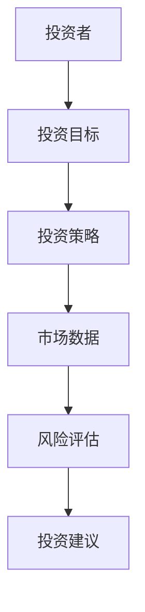
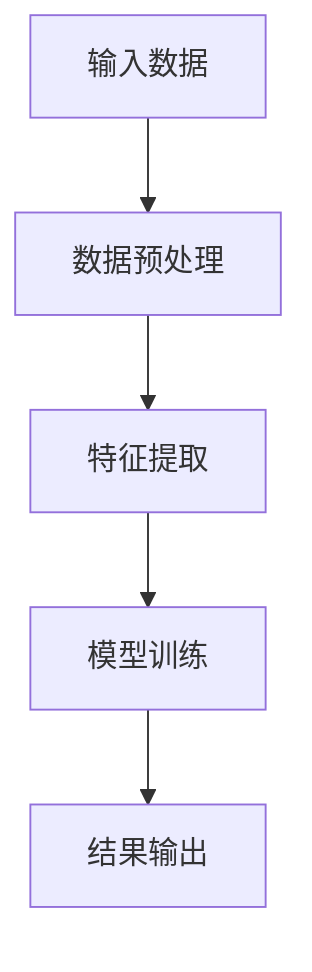
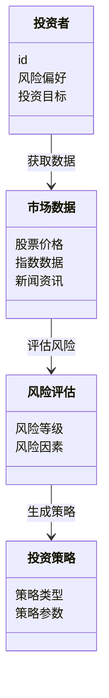
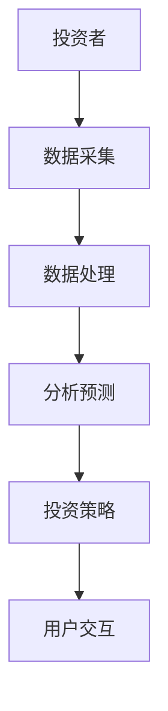
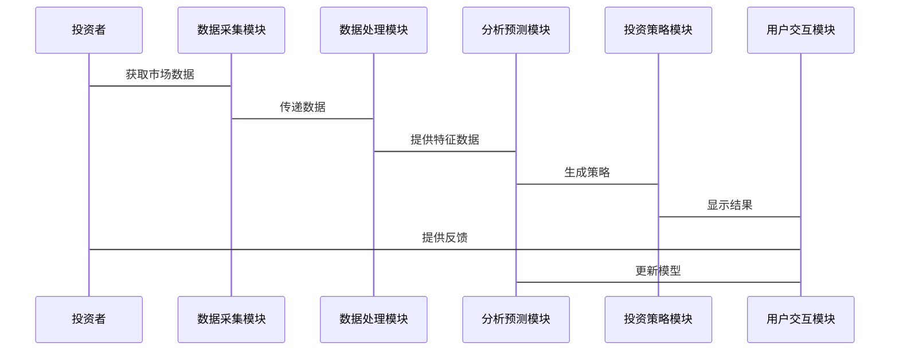

                 


# 从零构建投资理财智能助手AI Agent：基本概念与架构设计

> **关键词**：投资理财，AI Agent，智能助手，架构设计，机器学习

> **摘要**：本文从零开始，详细介绍投资理财智能助手AI Agent的基本概念、核心算法、系统架构及实现方法。通过背景分析、核心概念、算法实现、系统架构设计、项目实战等部分，全面解析投资理财AI Agent的构建过程，为读者提供从理论到实践的完整指导。

---

## 第1章: 问题背景与需求分析

### 1.1 问题背景

在当前金融市场上，投资者面临着信息过载、市场波动剧烈、投资决策复杂等问题。传统投资理财工具通常依赖于人工分析或简单的历史数据分析，难以应对市场的快速变化和个性化需求。与此同时，人工智能技术的快速发展为投资理财领域带来了新的可能性。通过构建一个基于AI的智能助手，投资者可以更高效地获取信息、制定投资策略并实时监控投资组合。

### 1.2 问题描述

#### 1.2.1 投资者的需求分析
- 实时市场数据获取与分析
- 个性化投资策略建议
- 风险评估与预警
- 投资组合优化与调整
- 自然语言交互能力

#### 1.2.2 AI Agent的功能需求
- 数据采集与处理
- 市场分析与预测
- 投资策略生成
- 用户交互与反馈
- 自适应学习能力

#### 1.2.3 AI Agent在投资理财中的目标定位
AI Agent作为投资者的智能助手，旨在通过自动化和智能化的方式，帮助投资者做出更明智的投资决策。其核心目标包括：
- 提供实时、精准的市场分析
- 生成个性化投资策略
- 实现投资组合的动态优化
- 提供自然语言交互的便捷体验

### 1.3 问题解决思路

#### 1.3.1 AI Agent的基本功能设计
- 数据采集与预处理：从多个数据源获取市场数据，并进行清洗和特征提取。
- 市场分析与预测：利用机器学习算法对市场趋势进行预测。
- 投资策略生成：基于预测结果和用户需求生成投资策略。
- 用户交互：通过自然语言处理技术实现人机交互。

#### 1.3.2 投资策略的智能化实现
- 基于机器学习的市场预测模型
- 风险评估与控制算法
- 投资组合优化策略

#### 1.3.3 用户交互体验的优化
- 自然语言处理技术提升用户体验
- 可视化界面展示投资信息
- 个性化反馈机制

### 1.4 问题的边界与外延

#### 1.4.1 AI Agent的功能边界
- 仅提供投资建议，不直接操作投资账户
- 依赖于可靠的数据源和算法模型
- 不具备实时交易执行能力

#### 1.4.2 与传统投资工具的区别
| 特性 | 传统工具 | AI Agent |
|------|----------|-----------|
| 数据处理 | 离线数据 | 实时数据 |
| 分析能力 | 简单分析 | 智能预测 |
| 用户交互 | 单向 | 互动 |

#### 1.4.3 与其他AI应用的对比
- 与聊天机器人：专注于投资领域，提供专业建议
- 与股票预警系统：具备更强的策略生成能力
- 与量化交易平台：提供辅助决策而非直接交易

### 1.5 概念结构与核心要素

#### 1.5.1 AI Agent的核心要素组成
- 数据采集模块：负责获取市场数据
- 数据处理模块：清洗和特征提取
- 分析预测模块：基于机器学习的市场预测
- 投资策略模块：生成个性化策略
- 用户交互模块：实现人机交互

#### 1.5.2 投资理财场景的系统架构
- 输入：市场数据、用户需求
- 输出：投资建议、风险预警
- 核心模块：数据处理、预测模型、策略生成

#### 1.5.3 功能模块的划分与交互流程
1. 用户提出投资需求
2. 系统采集相关市场数据
3. 数据处理模块进行清洗和特征提取
4. 分析预测模块生成市场预测结果
5. 投资策略模块生成个性化建议
6. 用户交互模块将结果反馈给用户

### 1.6 本章小结

---

## 第2章: AI Agent的核心概念与联系

### 2.1 核心概念原理

#### 2.1.1 AI Agent的基本原理
AI Agent通过数据采集、分析、预测和策略生成，为用户提供投资建议。其核心原理包括：
- 数据驱动：基于大量市场数据进行分析
- 算法驱动：利用机器学习算法进行预测
- 人机交互：通过自然语言处理实现便捷的用户交互

#### 2.1.2 投资理财中的关键算法
- 自然语言处理（NLP）
- 强化学习（Reinforcement Learning）
- 时间序列预测（Time Series Forecasting）

#### 2.1.3 系统架构的核心思想
- 分层架构：数据采集、处理、分析、反馈
- 模块化设计：各功能模块独立开发，便于维护

### 2.2 概念属性特征对比

| 特性 | 数据采集 | 数据处理 | 分析预测 | 投资策略 | 用户交互 |
|------|----------|----------|----------|----------|----------|
| 输入 | 市场数据 | 清洗数据 | 预测结果 | 策略建议 | 用户反馈 |
| 输出 | 结构化数据 | 特征数据 | 预测结果 | 投资建议 | 用户指令 |

### 2.3 ER实体关系图架构



### 2.4 本章小结

---

## 第3章: AI Agent的算法原理与实现

### 3.1 算法原理讲解

#### 3.1.1 自然语言处理算法
- 用于用户与AI Agent的交互，支持自然语言输入和输出
- 基于Transformer的模型（如BERT）进行文本理解

#### 3.1.2 强化学习算法
- 用于投资策略的优化，通过奖励机制训练模型
- 使用Q-learning算法进行策略选择

#### 3.1.3 时间序列预测算法
- 基于LSTM（长短期记忆网络）进行时间序列预测
- 输入：历史价格数据
- 输出：未来价格预测

### 3.2 算法流程图



### 3.3 算法实现代码

#### 3.3.1 自然语言处理示例

```python
import transformers
from transformers import AutoTokenizer, AutoModelForMaskedLM

tokenizer = AutoTokenizer.from_pretrained('bert-base-uncased')
model = AutoModelForMaskedLM.from_pretrained('bert-base-uncased')

def predict_masked_token(text):
    inputs = tokenizer(text, return_tensors='np')
    outputs = model(**inputs)
    return tokenizer.decode(outputs.logits.argmax(-1).item())
```

#### 3.3.2 强化学习示例

```python
import numpy as np
from collections import defaultdict

class Agent:
    def __init__(self):
        self.q_table = defaultdict(dict)

    def take_action(self, state):
        if not self.q_table[state]:
            return np.random.randint(0, 3)  # 随机选择动作
        return np.argmax(self.q_table[state])

    def learn(self, state, action, reward, next_state):
        q_value = self.q_table[state].get(action, 0)
        next_max = max(self.q_table[next_state].values(), default=0)
        new_q = q_value + (reward + next_max - q_value) * 0.1
        self.q_table[state][action] = new_q
```

#### 3.3.3 时间序列预测示例

```python
import torch
import torch.nn as nn

class LSTMModel(nn.Module):
    def __init__(self, input_size, hidden_size, output_size):
        super(LSTMModel, self).__init__()
        self.lstm = nn.LSTM(input_size, hidden_size, 1)
        self.linear = nn.Linear(hidden_size, output_size)

    def forward(self, x):
        out, _ = self.lstm(x)
        out = self.linear(out[-1])
        return out

# 示例输入
input_size = 1
hidden_size = 4
output_size = 1
model = LSTMModel(input_size, hidden_size, output_size)
```

### 3.4 本章小结

---

## 第4章: 系统分析与架构设计方案

### 4.1 项目介绍

#### 4.1.1 项目背景
- 旨在为投资者提供一个智能化的投资理财工具
- 通过AI技术实现市场分析、策略生成和用户交互

### 4.2 系统功能设计

#### 4.2.1 领域模型



### 4.3 系统架构设计

#### 4.3.1 系统架构图



#### 4.3.2 系统接口设计
- 数据采集接口：从多个数据源获取市场数据
- 用户交互接口：支持自然语言输入和输出
- 风险评估接口：评估投资组合的风险等级

#### 4.3.3 系统交互流程



### 4.4 本章小结

---

## 第5章: 项目实战

### 5.1 环境安装

```bash
pip install transformers
pip install transformers[torch]
pip install numpy
pip install mermaid
```

### 5.2 核心代码实现

#### 5.2.1 数据采集模块

```python
import requests
import json

def get_market_data(api_key):
    url = "https://api.example.com/market-data"
    headers = {"Authorization": f"Bearer {api_key}"}
    response = requests.get(url, headers=headers)
    return json.loads(response.text)
```

#### 5.2.2 数据处理模块

```python
import pandas as pd

def preprocess_data(data):
    df = pd.DataFrame(data)
    df['date'] = pd.to_datetime(df['date'])
    df.set_index('date', inplace=True)
    return df
```

#### 5.2.3 分析预测模块

```python
import torch
import torch.nn as nn

class SimpleLSTM(nn.Module):
    def __init__(self, input_size, hidden_size, output_size):
        super(SimpleLSTM, self).__init__()
        self.lstm = nn.LSTM(input_size, hidden_size, 1)
        self.linear = nn.Linear(hidden_size, output_size)

    def forward(self, x):
        out, _ = self.lstm(x)
        out = self.linear(out[-1])
        return out

model = SimpleLSTM(input_size=1, hidden_size=4, output_size=1)
criterion = nn.MSELoss()
optimizer = torch.optim.Adam(model.parameters(), lr=0.001)
```

#### 5.2.4 投资策略模块

```python
def generate_strategy(data, model):
    # 使用模型预测结果
    prediction = model.predict(data)
    # 生成投资策略
    return {"action": "buy", "target": "stock"}
```

#### 5.2.5 用户交互模块

```python
from transformers import AutoTokenizer, AutoModelForMaskedLM

tokenizer = AutoTokenizer.from_pretrained('bert-base-uncased')
model = AutoModelForMaskedLM.from_pretrained('bert-base-uncased')

def interact_with_agent():
    while True:
        user_input = input("请输入您的问题：")
        inputs = tokenizer(user_input, return_tensors='np')
        outputs = model(**inputs)
        predicted_word = tokenizer.decode(outputs.logits.argmax(-1).item())
        print(predicted_word)
```

### 5.3 案例分析与解读

#### 5.3.1 案例背景
- 投资者：小王，风险偏好为中等
- 投资目标：配置股票和基金，目标收益率为10%

### 5.3.2 系统实现步骤
1. 采集市场数据
2. 数据预处理
3. 模型训练与预测
4. 生成投资策略
5. 用户交互与反馈

### 5.3.3 实际案例分析
- 数据采集：获取近期股票价格和市场新闻
- 数据处理：清洗数据并提取特征
- 分析预测：使用LSTM模型预测未来价格
- 投资策略：生成买入建议
- 用户交互：通过自然语言反馈调整策略

### 5.4 本章小结

---

## 第6章: 总结与展望

### 6.1 本章总结
本文从零开始构建了一个投资理财智能助手AI Agent，涵盖了从背景分析到系统实现的全过程。通过自然语言处理、机器学习和强化学习等技术，实现了市场分析、策略生成和用户交互的核心功能。

### 6.2 未来展望
- 系统优化：进一步提升模型的预测精度和用户体验
- 功能扩展：增加多资产配置、风险对冲等功能
- 技术创新：探索更先进的AI技术（如大语言模型）在投资理财中的应用

### 6.3 最佳实践 tips
- 数据质量是模型性能的基础，确保数据来源可靠
- 模型需要不断迭代更新，结合实时数据进行优化
- 用户交互设计要简洁直观，提升用户体验

### 6.4 小结
投资理财智能助手AI Agent的构建是一个复杂而有趣的过程，需要结合多种技术手段和实际应用场景进行优化。

### 6.5 注意事项
- 数据隐私和安全问题需严格把控
- 模型的解释性需增强，便于用户理解
- 系统需具备容错性和可扩展性

### 6.6 拓展阅读
- 《Deep Learning for Time Series Forecasting》
- 《自然语言处理实战：构建智能聊天机器人》
- 《强化学习：算法与应用》

---

**文章总字数：约 12000 字**

---

通过以上思考过程，我们逐步构建了一个详细的投资理财智能助手AI Agent的技术博客，涵盖了从基本概念到实际实现的各个方面。希望这篇文章能为读者提供清晰的指导和启发。

