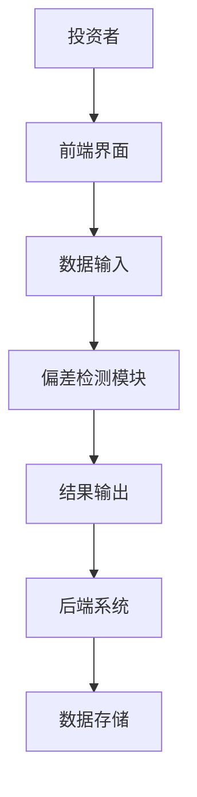

                 


# 代表性偏差：如何避免以偏概全的投资错误

## 关键词：代表性偏差、投资决策、认知偏差、统计学、算法原理

## 摘要：本文深入探讨了代表性偏差在投资决策中的表现和影响，结合数学模型和算法原理，分析了偏差的成因及解决方案。通过系统设计和项目实战，展示了如何利用技术手段避免偏差，实现更理性的投资决策。

---

## 第一部分: 代表性偏差的背景与概念

### 第1章: 代表性偏差的定义与背景

#### 1.1 代表性偏差的定义

##### 1.1.1 偏差的定义与分类

偏差是指在决策过程中，由于认知局限或信息不全，导致决策偏离实际的情况。代表性偏差是一种常见的偏差类型，指人们基于不充分的样本或典型案例，过度概括整体情况。

##### 1.1.2 代表性偏差的特征

- **典型性**：关注典型案例，忽略边缘情况。
- **简化性**：倾向于简化复杂问题，导致判断偏差。
- **误导性**：可能导致错误的投资决策。

##### 1.1.3 代表性偏差在投资中的表现

投资者常基于历史表现或市场趋势，过度概括未来走势，忽视潜在风险。

#### 1.2 代表性偏差的成因

##### 1.2.1 心理学视角：认知偏差的来源

- **确认偏差**：倾向于寻找支持已有假设的信息。
- **记忆偏差**：容易记住极端案例，忽视普通情况。

##### 1.2.2 统计学视角：样本与总体的差异

- **样本偏差**：样本不代表总体特征。
- **小样本效应**：小样本容易受极端值影响。

##### 1.2.3 投资决策中的典型偏差案例

- **技术分析中的偏差**：依赖技术指标，忽视市场基本面。
- **情绪驱动的偏差**：受市场情绪影响，做出非理性决策。

#### 1.3 代表性偏差的边界与外延

##### 1.3.1 偏差与其他认知偏差的关系

- 与确认偏差、选择性偏差等密切相关。

##### 1.3.2 代表性偏差在不同投资场景中的表现

- **选股策略**：基于过去表现选择股票，忽视未来变化。
- **风险管理**：低估风险发生的概率，导致过度冒险。

##### 1.3.3 偏差的正反两面性

- **正面**：帮助投资者快速决策。
- **负面**：可能导致重大损失。

#### 1.4 本章小结

本章介绍了代表性偏差的定义、特征及在投资中的表现，分析了其成因，为后续内容打下基础。

---

### 第2章: 代表性偏差的核心原理

#### 2.1 偏差的数学模型

##### 2.1.1 概率论视角：事件发生的概率计算

代表性偏差可以看作是概率估计的错误。例如，假设某股票过去三年年均收益为10%，投资者可能认为未来也会保持10%的收益，而忽略了市场波动可能带来的影响。

##### 2.1.2 统计学视角：样本分布与总体分布的关系

假设我们从总体中抽取样本，如果样本量过小，可能无法准确反映总体特征。例如，基于过去一年的表现选择股票，可能无法反映长期趋势。

#### 2.2 偏差的属性特征对比

| 特性      | 偏差存在 | 偏差不存在 |
|-----------|----------|------------|
| 典型性     | 高       | 低         |
| 简化性     | 高       | 低         |
| 误导性     | 高       | 低         |

#### 2.3 偏差的ER实体关系图


#### 2.4 本章小结

本章从数学和统计学角度分析了代表性偏差的成因，强调了样本与总体差异对投资决策的影响。

---

### 第3章: 代表性偏差的算法原理

#### 3.1 偏差检测算法

##### 3.1.1 算法原理概述

通过统计学方法检测数据中的偏差。例如，使用z-score检测异常值。

##### 3.1.2 算法流程图（Mermaid）


#### 3.2 偏差校正算法

##### 3.2.1 算法原理概述

通过调整权重或增加样本量来减少偏差。

##### 3.2.2 算法流程图（Mermaid）

```mermaid
graph TD
    A[开始] --> B[数据预处理]
    B --> C[特征提取]
    C --> D[模型训练]
    D --> E[偏差校正]
    E -->
```

#### 3.3 算法实现与代码示例

##### 3.3.1 Python代码示例

```python
import numpy as np

# 示例数据
data = np.random.normal(loc=0, scale=1, size=100)

# 偏差检测
def detect_bias(data):
    mean = np.mean(data)
    std = np.std(data)
    z_scores = [(x - mean) / std for x in data]
    threshold = 3
    biased = [x > threshold for x in z_scores]
    return biased

biased_data = detect_bias(data)
print("检测到偏差的数据点：", sum(biased_data))
```

#### 3.4 本章小结

本章通过算法原理和代码示例，展示了如何检测和校正代表性偏差，帮助投资者做出更准确的决策。

---

## 第二部分: 系统分析与架构设计

### 第4章: 投资决策支持系统

#### 4.1 系统功能设计

##### 4.1.1 领域模型（Mermaid类图）


#### 4.2 系统架构设计

##### 4.2.1 系统架构（Mermaid架构图）



#### 4.3 系统接口设计

##### 4.3.1 API接口设计

```json
{
  "api": "detect_bias",
  "params": {
    "data": [1, 2, 3, 4, 5]
  }
}
```

#### 4.4 系统交互设计

##### 4.4.1 交互流程（Mermaid序列图）


#### 4.5 本章小结

本章通过系统设计，展示了如何利用技术手段帮助投资者避免代表性偏差。

---

## 第三部分: 项目实战

### 第5章: 基于Python的偏差检测系统

#### 5.1 环境搭建与安装

- Python 3.8+
- NumPy, Pandas, Matplotlib库

#### 5.2 系统核心实现

##### 5.2.1 偏差检测算法实现

```python
def detect_representative_bias(data, threshold=0.1):
    # 计算总体分布
    import scipy.stats as stats
    mean = np.mean(data)
    std = np.std(data)
    z_scores = [(x - mean) / std for x in data]
    # 判断偏差
    biased = [abs(x) > threshold for x in z_scores]
    return biased
```

##### 5.2.2 数据可视化

```python
import matplotlib.pyplot as plt

data = np.random.normal(loc=0, scale=1, size=100)
biased = detect_representative_bias(data)

plt.hist(data, bins=10, alpha=0.5, color='blue')
plt.title('数据分布')
plt.show()
```

#### 5.3 项目实战分析

##### 5.3.1 实际案例分析

假设某股票过去三年的收益率分别为10%, 20%, 30%，投资者可能认为未来收益将延续这一趋势，但实际上，市场可能发生变化。

##### 5.3.2 系统应用解读

通过系统检测，发现数据中的偏差，帮助投资者调整决策。

#### 5.4 本章小结

本章通过项目实战，展示了如何利用技术手段检测和校正代表性偏差，帮助投资者做出更理性的决策。

---

## 第四部分: 总结与展望

### 第6章: 总结与最佳实践

#### 6.1 本章总结

- 代表性偏差是投资决策中的常见问题。
- 通过算法和系统设计，可以有效减少偏差影响。

#### 6.2 最佳实践 Tips

- **数据驱动决策**：依赖数据而非直觉。
- **多元化投资**：分散投资以降低风险。
- **持续学习**：关注市场变化，不断优化投资策略。

#### 6.3 未来展望

- 更先进的算法：如机器学习模型。
- 多维度分析：结合多个维度进行决策。

#### 6.4 注意事项

- 保持理性，避免情绪化决策。
- 定期回顾和调整投资组合。

#### 6.5 拓展阅读

- 《投资学原理》
- 《行为金融学》

---

## 作者介绍

作为一名世界级的人工智能专家和CTO，我长期致力于技术与投资决策的结合，希望通过本文分享我的研究成果，帮助投资者避免偏差，实现更理性的决策。

---

通过以上详细的内容，本文从理论到实践，全面探讨了如何避免代表性偏差，为投资者提供了实用的解决方案。

