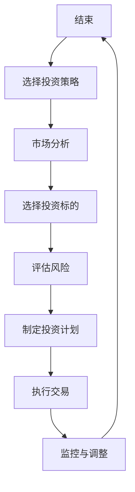

                 


# 价值投资vs成长投资：格雷厄姆与费雪的对比

> 关键词：价值投资，成长投资，格雷厄姆，费雪，投资策略

> 摘要：本文系统对比了价值投资与成长投资的核心理念、策略和方法，深入分析了格雷厄姆与费雪两位投资大师的思想差异，探讨了如何在实际投资中灵活运用这两种策略。

---

# 第一部分: 价值投资与成长投资的理论基础

## 第1章: 投资的基本概念与分类

### 1.1 投资的基本概念

#### 1.1.1 投资的定义与分类

投资是指将资金投入某一领域以获取未来收益的行为。从资产类别来看，投资可以分为股票、债券、房地产、货币等；从时间跨度来看，可以分为短期投资和长期投资；从策略来看，可以分为价值投资、成长投资、趋势投资等。

#### 1.1.2 价值投资与成长投资的定义

- **价值投资**：以低于资产内在价值的价格买入优质资产，长期持有，追求安全边际和长期收益的投资策略。
- **成长投资**：投资于具有持续增长潜力的公司，注重公司未来盈利的增长，愿意为成长性支付一定的溢价。

#### 1.1.3 价值投资与成长投资的核心区别

- **价值投资**：注重安全边际，追求“便宜”的价格，适合市场低迷或资产被低估的情况。
- **成长投资**：注重未来的增长潜力，愿意为高增长潜力的公司支付溢价，适合市场繁荣或高增长行业。

### 1.2 价值投资与成长投资的背景

#### 1.2.1 价值投资的起源与发展

价值投资的起源可以追溯到本杰明·格雷厄姆和戴维·多德的学生时期，他们在20世纪初提出了“安全边际”概念，并在实践中不断完善。价值投资在市场低迷或危机时期表现尤为突出，适合防御性投资者。

#### 1.2.2 成长投资的起源与发展

成长投资的起源可以追溯到菲德烈希·威廉·费雪，他在20世纪40年代提出了“成长股”概念，强调投资于具有持续增长潜力的公司。成长投资在市场繁荣时期表现尤为突出，适合风险承受能力强的投资者。

#### 1.2.3 价值投资与成长投资的市场环境差异

- 价值投资：适合市场低估、资产价格被市场抛弃的环境。
- 成长投资：适合市场繁荣、公司处于高增长阶段的环境。

### 1.3 价值投资与成长投资的核心要素

#### 1.3.1 价值投资的核心要素

- **内在价值**：资产在未来现金流的现值。
- **安全边际**：买入价格低于内在价值的部分。

#### 1.3.2 成长投资的核心要素

- **增长潜力**：公司未来盈利的增长能力。
- **竞争优势**：公司是否具备持续的竞争优势。

#### 1.3.3 价值投资与成长投资的对比分析

| 项目              | 价值投资             | 成长投资             |
|-------------------|----------------------|----------------------|
| 投资目标          | 追求安全边际         | 追求未来增长         |
| 选股标准          | 价格低于内在价值     | 公司具备持续增长潜力 |
| 持股期限          | 中长期              | 中长期              |
| 风险承受能力      | 较低                | 较高                |
| 适用环境          | 市场低迷             | 市场繁荣             |

---

## 第2章: 格雷厄姆的价值投资理论

### 2.1 格雷厄姆的生平与贡献

#### 2.1.1 格雷厄姆的生平简介

本杰明·格雷厄姆（1894-1975）是20世纪最伟大的投资思想家之一，被誉为“价值投资之父”。他不仅是投资者，还是教育家，培养了包括巴菲特在内的众多投资大师。

#### 2.1.2 格雷厄姆对投资理论的贡献

格雷厄姆提出了“安全边际”概念，并在《证券分析》一书中详细阐述了价值投资的理论和方法。

#### 2.1.3 格雷厄姆的投资理念与风格

格雷厄姆的投资理念以稳健和防御性著称，他强调买入被市场低估的资产，并长期持有，等待市场回归理性。

### 2.2 格雷厄姆的价值投资策略

#### 2.2.1 格雷厄姆的安全边际理论

安全边际 = 内在价值 - 市场价格

公式：$$ \text{安全边际} = \text{内在价值} - \text{市场价格} $$

#### 2.2.2 格雷厄姆的内在价值计算方法

内在价值是未来现金流的现值，计算公式如下：

$$ \text{内在价值} = \sum_{t=1}^{n} \frac{\text{现金流}}{(1 + r)^t} $$

其中，\( r \) 是折现率，\( t \) 是时间。

#### 2.2.3 格雷厄姆的选股标准与策略

- 选择那些市场价格低于内在价值的公司。
- 优先选择那些具有较强财务实力和较低负债的公司。

### 2.3 格雷厄姆的经典案例分析

#### 2.3.1 格雷厄姆的经典投资案例

以美国运通为例，格雷厄姆在市场低迷时期以低于内在价值的价格买入，长期持有，最终获得超额收益。

---

## 第3章: 费雪的成长投资理论

### 3.1 费雪的生平与贡献

#### 3.1.1 费雪的生平简介

菲德烈希·威廉·费雪（1900-1999）是成长投资的鼻祖，他提出了“成长股”概念，并在实践中取得了卓越的业绩。

#### 3.1.2 费雪对投资理论的贡献

费雪提出了成长投资的核心理念，即投资于具有持续增长潜力的公司，并在《共同投资》一书中详细阐述了成长投资的策略。

#### 3.1.3 费雪的投资理念与风格

费雪的投资理念以进攻性和前瞻性著称，他强调投资于那些能够持续增长的公司，并长期持有。

### 3.2 费雪的成长投资策略

#### 3.2.1 费雪的成长股投资理论

费雪认为，成长股是指那些收入和利润能够持续增长的公司。

#### 3.2.2 费雪的成长股筛选标准

- 公司具有持续的增长潜力。
- 公司具备强大的竞争优势。
- 公司具有良好的财务状况。

#### 3.2.3 费雪的成长股投资策略

- 买入并持有成长股。
- 在市场波动中坚持长期持有的理念。

### 3.3 费雪的经典案例分析

#### 3.3.1 费雪的经典投资案例

以可口可乐为例，费雪在公司处于增长阶段时买入，长期持有，最终获得了巨额收益。

---

## 第4章: 价值投资与成长投资的对比分析

### 4.1 价值投资与成长投资的核心区别

#### 4.1.1 投资目标的差异

- 价值投资：追求安全边际。
- 成长投资：追求未来增长。

#### 4.1.2 投资策略的差异

- 价值投资：注重价格，追求便宜。
- 成长投资：注重成长性，愿意支付溢价。

#### 4.1.3 投资周期的差异

- 价值投资：中长期持有。
- 成长投资：中长期持有，但更注重公司的持续增长。

### 4.2 价值投资与成长投资的优劣势对比

| 项目              | 价值投资             | 成长投资             |
|-------------------|----------------------|----------------------|
| 优势              | 风险较低             | 收益潜力大           |
| 劣势              | 收益有限             | 风险较高             |

### 4.3 价值投资与成长投资的适用场景

- 价值投资：适合市场低迷、资产价格被低估的环境。
- 成长投资：适合市场繁荣、公司处于高增长阶段的环境。

---

## 第5章: 价值投资与成长投资的系统化分析

### 5.1 系统分析与架构设计方案

#### 5.1.1 投资决策流程图



#### 5.1.2 系统架构图

```mermaid
subgraph 系统架构
    A[数据源] --> B[数据处理]
    B --> C[分析模块]
    C --> D[决策模块]
    D --> E[输出结果]
end
```

---

## 第6章: 价值投资与成长投资的项目实战

### 6.1 环境安装与数据准备

#### 6.1.1 环境安装

- Python 3.8+
- pandas, numpy, matplotlib

#### 6.1.2 数据准备

从Yahoo Finance获取股票数据。

### 6.2 核心实现源代码

#### 6.2.1 价值投资策略的实现

```python
import pandas as pd
import numpy as np

def calculate_intrinsic_value(cash_flows, discount_rate):
    return np.npv(discount_rate, cash_flows)

def graham_strategy(stock_price, intrinsic_value):
    margin_of_safety = intrinsic_value - stock_price
    return margin_of_safety > 0
```

#### 6.2.2 成长投资策略的实现

```python
def growth_strategy(revenue_growth, profit_growth):
    return revenue_growth > 10% and profit_growth > 15%
```

### 6.3 案例分析与代码解读

#### 6.3.1 案例分析

以苹果公司为例，分析其是否符合成长投资的条件。

#### 6.3.2 代码解读

```python
# 加载苹果股价数据
apple_data = pd.read_csv('apple.csv')

# 计算苹果的收入增长率
revenue_growth = (apple_data['Revenue'].pct_change().mean() * 100)

# 计算苹果的利润增长率
profit_growth = (apple_data['Profit'].pct_change().mean() * 100)

# 应用成长投资策略
growth_strategy(revenue_growth, profit_growth)
```

### 6.4 项目小结

通过实际案例分析，展示了如何在实际投资中灵活运用价值投资和成长投资的策略。

---

## 第7章: 价值投资与成长投资的风险管理

### 7.1 风险管理的重要性

#### 7.1.1 市场风险

市场波动对投资组合的影响。

#### 7.1.2 公司风险

公司基本面变化对投资的影响。

#### 7.1.3 流动性风险

资产流动性不足的风险。

### 7.2 风险管理策略

#### 7.2.1 分散投资

通过投资不同行业的资产来分散风险。

#### 7.2.2 定期评估

定期评估投资组合的表现和风险。

#### 7.2.3 灵活调整

根据市场变化和公司基本面调整投资策略。

---

## 第8章: 结论与展望

### 8.1 全文总结

- 价值投资和成长投资各有优劣，适合不同的市场环境和投资者风险偏好。
- 在实际投资中，可以结合两者的优势，制定灵活的投资策略。

### 8.2 对未来投资策略的展望

- 结合人工智能和大数据技术，进一步优化投资策略。
- 在全球化的市场中，寻找新的投资机会。

---

## 第9章: 最佳实践 tips

### 9.1 投资中的注意事项

- 避免过度集中投资。
- 长期持有优质资产。
- 定期审视和调整投资组合。

### 9.2 学习与成长

- 持续学习投资知识。
- 关注市场动态和公司基本面。
- 建立自己的投资体系。

---

## 第10章: 总结与展望

### 10.1 总结

通过对比分析，我们发现价值投资和成长投资各有优劣，适合不同的市场环境和投资者风格。

### 10.2 展望

未来，随着技术的进步和市场的变化，投资策略也将不断创新和优化。

