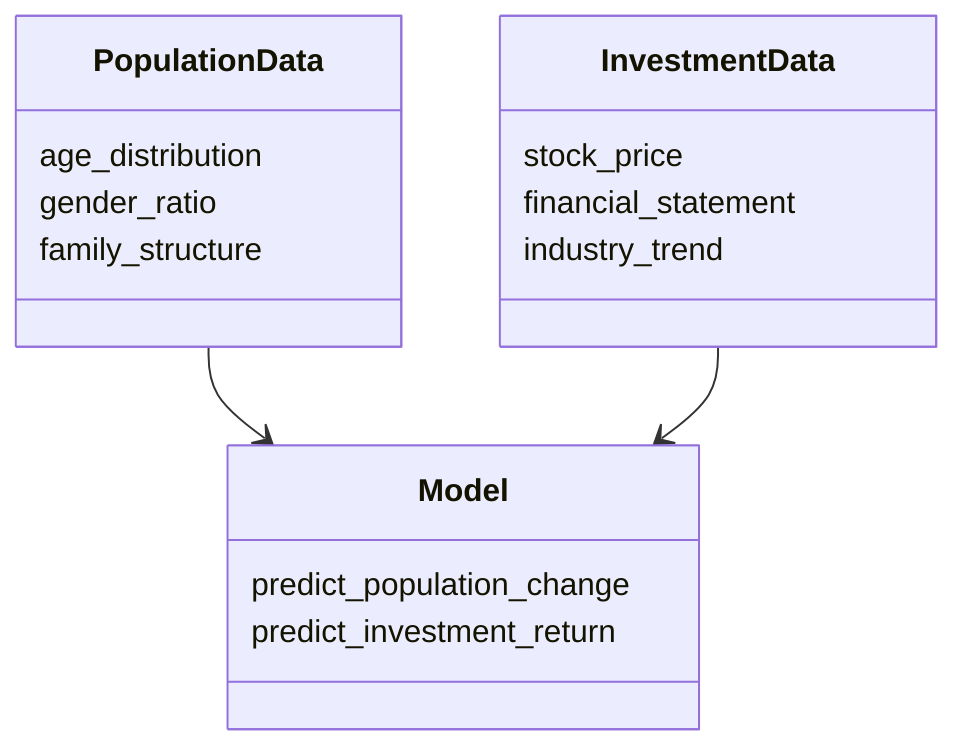
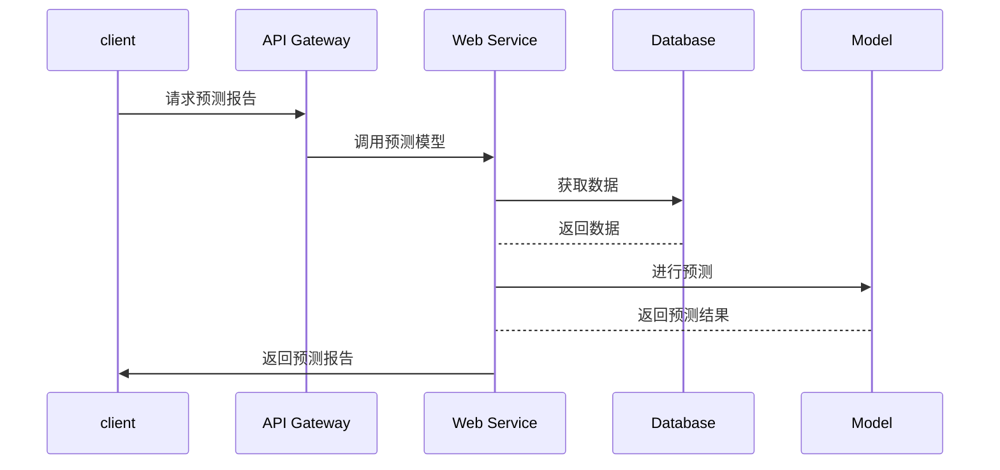

                 


# 价值投资与人口统计学：把握人口结构变化带来的机遇

> 关键词：价值投资，人口统计学，人口结构变化，投资策略，数据驱动，经济趋势

> 摘要：本文探讨了如何将价值投资与人口统计学相结合，分析人口结构变化对投资决策的影响。通过详细分析人口老龄化、城市化等趋势，结合数学模型和算法，为投资者提供数据驱动的决策支持，抓住人口结构变化带来的投资机遇。

---

## 第一部分：价值投资与人口统计学的背景与基础

### 第1章：价值投资与人口统计学概述

#### 1.1 价值投资的核心概念

##### 1.1.1 价值投资的定义与起源
- 价值投资是一种投资策略，强调以低于内在价值的价格买入优质资产。
- 起源于20世纪初，本杰明·格雷厄姆和戴维·多德是这一理论的奠基人。

##### 1.1.2 价值投资的核心理念与原则
- **安全边际**：买入价格低于内在价值。
- **长期视角**：关注企业的长期盈利能力。
- **基本面分析**：通过分析企业的财务报表、行业地位等因素评估其价值。

##### 1.1.3 价值投资与人口统计学的关联
- 人口结构变化影响企业的盈利能力和行业前景。
- 通过人口统计学分析，可以识别出哪些行业将受益于人口变化。

---

#### 1.2 人口统计学的基本概念

##### 1.2.1 人口统计学的定义与研究范围
- 人口统计学是研究人口数量、结构、分布及其变化规律的科学。
- 主要关注人口老龄化、出生率、死亡率、迁移率等指标。

##### 1.2.2 人口结构的核心指标与分析方法
- **年龄结构**：不同年龄段人口的比例。
- **性别比例**：男性和女性人口的分布。
- **家庭结构**：家庭规模和结构的变化。

##### 1.2.3 人口变化对经济和社会的影响
- 人口老龄化可能导致劳动力短缺和养老金压力。
- 人口迁移影响城市的经济发展和房地产市场。

---

#### 1.3 价值投资与人口统计学的结合

##### 1.3.1 人口结构变化对投资决策的影响
- 人口老龄化可能推动医疗、养老等行业的增长。
- 人口年轻化可能促进消费、科技等行业的繁荣。

##### 1.3.2 通过人口统计学预测投资机会
- 分析人口结构变化趋势，提前布局相关行业。
- 例如，老龄化社会可能推动医疗健康行业的投资机会。

##### 1.3.3 价值投资中的数据驱动方法
- 利用人口统计数据筛选具有长期增长潜力的企业。
- 将人口统计学指标作为投资决策的重要参考。

---

## 第二部分：人口结构变化的背景与趋势

### 第2章：全球与中国的

#### 2.1 全球人口结构的变化趋势

##### 2.1.1 人口老龄化趋势
- 全球范围内，人口老龄化问题日益严重。
- 老龄人口比例增加，劳动年龄人口比例下降。

##### 2.1.2 城市化与人口分布的变化
- 城市化进程加快，人口向城市集中。
- 发达国家城市化率高，发展中国家城市化率正在快速提升。

##### 2.1.3 发达国家与发展中国家的人口差异
- 发达国家人口老龄化严重，发展中国家人口增长较快。
- 人口结构的差异影响不同地区的投资机会。

---

#### 2.2 中国人口结构的现状与挑战

##### 2.2.1 中国人口老龄化的问题
- 中国是全球老龄化速度最快的国家之一。
- 老龄人口比例持续上升，劳动年龄人口比例下降。

##### 2.2.2 人口政策与生育率的变化
- 中国实施了多年的计划生育政策，导致生育率下降。
- 近年来，政策调整为放宽生育限制，但效果有限。

##### 2.2.3 人口结构对经济和投资的影响
- 人口老龄化可能导致经济增长放缓，但为医疗、养老等行业带来机遇。

---

#### 2.3 人口结构变化对投资的影响

##### 2.3.1 不同年龄段人口的消费习惯与投资偏好
- 老龄人口更倾向于稳健投资，如债券和房地产。
- 年轻人口更倾向于风险较高的投资，如科技和创业公司。

##### 2.3.2 人口变化对行业的影响
- 医疗健康、养老服务行业的增长潜力。
- 教育、科技行业的年轻化趋势。

##### 2.3.3 通过人口统计学预测投资趋势
- 分析人口结构变化，提前布局受益行业。
- 结合价值投资理念，选择具有长期增长潜力的企业。

---

## 第三部分：价值投资与人口统计学的核心概念与联系

### 第3章：价值投资的核心原理

#### 3.1 价值投资的理论基础

##### 3.1.1 基本面分析的核心要素
- 财务状况：收入、利润、资产负债情况。
- 行业地位：市场占有率、竞争格局。
- 管理团队：管理层能力和战略规划。

##### 3.1.2 股票内在价值的计算方法
- 使用DCF模型（现金流贴现法）评估企业价值。
- 考虑企业的未来盈利能力和成长性。

##### 3.1.3 市场情绪与投资决策的关系
- 市场情绪影响短期股价波动。
- 价值投资者关注长期价值，而非短期市场情绪。

---

#### 3.2 人口统计学在价值投资中的应用

##### 3.2.1 人口结构对行业选择的影响
- 人口老龄化推动医疗、养老等行业的需求增长。
- 年轻人口推动消费、科技等行业的发展。

##### 3.2.2 人口变化对企业盈利的影响
- 企业所处行业的市场需求变化。
- 人口结构影响企业的成本和收益。

##### 3.2.3 通过人口数据预测市场趋势
- 分析人口结构变化，预测行业需求变化。
- 结合价值投资理念，选择具有长期增长潜力的企业。

---

#### 3.3 价值投资与人口统计学的结合模型

##### 3.3.1 模型的基本框架
- 输入：人口统计数据（如年龄、性别、家庭结构）。
- 处理：分析数据，预测行业需求变化。
- 输出：投资建议（如行业配置、个股选择）。

##### 3.3.2 数据的获取与处理
- 数据来源：政府统计数据、市场调研数据。
- 数据清洗：处理缺失值、异常值。
- 数据分析：使用统计方法和机器学习模型。

##### 3.3.3 模型的验证与优化
- 使用历史数据验证模型的准确性。
- 根据实际效果调整模型参数。
- 不断优化模型，提高预测精度。

---

## 第四部分：算法原理与数学模型

### 第4章：算法原理

#### 4.1 人口结构变化预测模型

##### 4.1.1 模型概述
- 使用时间序列分析预测人口变化趋势。
- 考虑历史数据和未来趋势，预测人口结构变化。

##### 4.1.2 算法流程
1. 数据预处理：清洗和标准化数据。
2. 建立模型：选择合适的统计模型或机器学习模型。
3. 模型训练：使用历史数据训练模型。
4. 模型验证：使用测试数据验证模型的准确性。
5. 模型预测：预测未来的人口结构变化。

##### 4.1.3 Python代码实现
```python
import pandas as pd
import numpy as np
from statsmodels.tsa.arima_model import ARIMA

# 加载数据
data = pd.read_csv('population.csv')

# 数据预处理
data = data['population'].values

# 建立ARIMA模型
model = ARIMA(data, order=(1, 1, 1))
model_fit = model.fit()

# 预测未来10年的人口
forecast = model_fit.forecast(steps=10)
print(forecast)
```

---

#### 4.2 投资回报预测模型

##### 4.2.1 模型概述
- 结合人口统计数据和企业基本面数据，预测投资回报。
- 使用多元回归模型分析各因素对投资回报的影响。

##### 4.2.2 算法流程
1. 数据收集：收集人口统计数据和企业财务数据。
2. 数据清洗：处理缺失值和异常值。
3. 建立模型：使用多元回归模型。
4. 模型训练：使用历史数据训练模型。
5. 模型验证：使用测试数据验证模型的准确性。
6. 模型预测：预测未来的企业投资回报。

##### 4.2.3 Python代码实现
```python
import pandas as pd
import numpy as np
from sklearn.linear_model import LinearRegression

# 数据预处理
data = pd.read_csv('investment.csv')
data = data[['population_age', 'revenue_growth', 'return_on_equity']]
data = data.dropna()

# 建立线性回归模型
model = LinearRegression()
model.fit(data[['population_age', 'revenue_growth']], data['return_on_equity'])

# 预测投资回报
new_data = pd.DataFrame({'population_age': [35], 'revenue_growth': [10]})
prediction = model.predict(new_data)
print(prediction)
```

---

## 第五部分：系统分析与架构设计

### 第5章：系统架构设计

#### 5.1 系统功能设计

##### 5.1.1 领域模型


#### 5.2 系统架构设计


#### 5.3 系统接口设计

##### 5.3.1 接口描述
- 输入：人口统计数据和投资数据。
- 输出：投资建议和预测报告。

##### 5.3.2 接口交互流程图


---

## 第六部分：项目实战

### 第6章：项目实战

#### 6.1 环境安装

##### 6.1.1 安装Python和相关库
- 安装Python 3.8及以上版本。
- 安装必要的库：pandas、numpy、scikit-learn、statsmodels。

##### 6.1.2 数据集获取
- 从政府统计网站获取人口数据。
- 从金融数据平台获取投资数据。

#### 6.2 核心代码实现

##### 6.2.1 人口变化预测代码
```python
import pandas as pd
import numpy as np
from statsmodels.tsa.arima_model import ARIMA

# 加载数据
data = pd.read_csv('population.csv')

# 数据预处理
data = data['population'].values

# 建立ARIMA模型
model = ARIMA(data, order=(1, 1, 1))
model_fit = model.fit()

# 预测未来10年的人口
forecast = model_fit.forecast(steps=10)
print(forecast)
```

##### 6.2.2 投资回报预测代码
```python
import pandas as pd
import numpy as np
from sklearn.linear_model import LinearRegression

# 数据预处理
data = pd.read_csv('investment.csv')
data = data[['population_age', 'revenue_growth', 'return_on_equity']]
data = data.dropna()

# 建立线性回归模型
model = LinearRegression()
model.fit(data[['population_age', 'revenue_growth']], data['return_on_equity'])

# 预测投资回报
new_data = pd.DataFrame({'population_age': [35], 'revenue_growth': [10]})
prediction = model.predict(new_data)
print(prediction)
```

#### 6.3 实际案例分析

##### 6.3.1 案例背景
- 分析中国老龄化趋势对医疗行业的影响。
- 结合价值投资理念，选择具有长期增长潜力的医疗企业。

##### 6.3.2 数据分析与预测
- 使用人口统计数据预测未来10年的医疗行业需求。
- 结合企业基本面数据，评估企业的内在价值。

##### 6.3.3 投资建议
- 建议投资者关注医疗健康行业的龙头企业。
- 结合市场情绪和安全边际，选择低估的优质企业。

---

## 第七部分：总结与展望

### 第7章：总结与展望

#### 7.1 最佳实践
- 结合人口统计学和价值投资，制定长期投资策略。
- 定期更新模型，适应新的数据和市场变化。

#### 7.2 小结
- 人口结构变化是影响投资决策的重要因素。
- 通过数据驱动的方法，投资者可以更好地把握人口结构变化带来的机遇。

#### 7.3 注意事项
- 投资有风险，需谨慎决策。
- 结合多种因素，制定多元化的投资策略。

#### 7.4 拓展阅读
- 格雷厄姆的《聪明的投资者》。
- 经济学家关于人口结构变化的研究。

---

以上是《价值投资与人口统计学：把握人口结构变化带来的机遇》的详细大纲，涵盖了从理论到实践的各个方面，结合了技术语言和专业分析，为投资者提供了数据驱动的决策支持。

