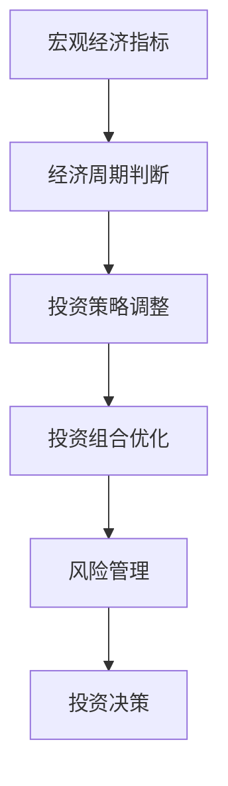

                 


# 《价值投资与宏观经济周期的关系》

## 关键词：价值投资、宏观经济周期、投资策略、经济指标、风险管理

## 摘要：  
价值投资是一种以长期视角为基础的投资策略，强调通过深入分析企业的基本面，选择具有持久竞争优势和合理估值的公司进行投资。宏观经济周期则是指经济从复苏、过热、滞胀到衰退的周期性波动。本文探讨了价值投资与宏观经济周期之间的关系，分析了在不同经济周期下，价值投资策略的有效性及其调整方法。通过构建数学模型和系统架构，本文展示了如何结合宏观经济指标优化投资决策，并通过实际案例分析验证了这一方法的有效性。

---

# 正文

## 第1章：引言

### 1.1 价值投资与宏观经济周期的关系概述

价值投资的核心理念是通过长期持有优质资产，获得超越市场平均水平的回报。然而，宏观经济周期的变化对资产价格和企业盈利能力有着深远影响。本文旨在探讨价值投资与宏观经济周期之间的关系，分析如何在不同经济环境下调整投资策略，以实现长期稳定的收益。

---

## 第2章：价值投资的背景与核心概念

### 2.1 价值投资的起源与发展

#### 2.1.1 价值投资的起源  
价值投资的理论基础可以追溯到20世纪初，本杰明·格雷厄姆和戴维·多德提出的“安全边际”概念。他们认为，股票的内在价值可以通过对企业基本面的分析得出，而市场价格往往围绕内在价值波动。

#### 2.1.2 价值投资的发展历程  
价值投资在20世纪中期通过沃伦·巴菲特等投资者的实践得到进一步发展，形成了以基本面分析为核心的长期投资理念。

#### 2.1.3 价值投资的核心思想  
价值投资的核心思想是：市场短期是投票机，长期是称重机。投资者应关注企业的内在价值，而非短期市场波动。

### 2.2 宏观经济周期的定义与分类

#### 2.2.1 宏观经济周期的定义  
宏观经济周期是指经济从复苏、过热、滞胀到衰退的周期性波动。每个周期通常包括四个阶段：复苏（GDP增长，失业率下降）、过热（GDP高速增长，通胀上升）、滞胀（经济增长放缓，通胀高企）和衰退（GDP负增长，失业率上升）。

#### 2.2.2 宏观经济周期的分类  
根据经济指标，宏观经济周期可以分为以下阶段：  
1. **复苏阶段**：经济逐步恢复，企业盈利能力提高。  
2. **过热阶段**：经济增长过快，通胀上升，货币政策收紧。  
3. **滞胀阶段**：经济增长停滞，通胀高企。  
4. **衰退阶段**：经济萎缩，企业盈利下降。

#### 2.2.3 宏观经济周期对投资的影响  
宏观经济周期对资产价格有直接影响。例如，在衰退阶段，政府通常会采取宽松货币政策，推高资产价格；在过热阶段，央行加息可能导致市场估值下降。

---

## 第3章：价值投资与宏观经济周期的核心概念

### 3.1 价值投资的核心要素

#### 3.1.1 安全边际  
安全边际是价值投资的核心概念，指股票的市场价格低于其内在价值的部分。通过安全边际，投资者可以降低市场波动带来的风险。

#### 3.1.2 估值与市场  
价值投资者关注企业的内在价值，而非市场的短期波动。内在价值可以通过DCF（现金流贴现法）等方法计算。

### 3.2 宏观经济周期对价值投资的影响

#### 3.2.1 不同经济周期下的投资策略  
在不同经济周期下，价值投资策略需要相应调整。例如：  
- **复苏阶段**：关注低估值的周期性股票。  
- **过热阶段**：选择防御性股票，避免高估值的成长股。  
- **滞胀阶段**：关注现金流稳定的企业。  
- **衰退阶段**：寻找估值极低的股票。

#### 3.2.2 经济指标与投资决策  
以下是常用的宏观经济指标及其对投资决策的影响：  
1. **GDP增长率**：反映经济整体表现。  
2. **通货膨胀率**：影响货币政策和企业成本。  
3. **利率**：影响企业的融资成本和债券收益率。  
4. **失业率**：反映经济活力和消费能力。

---

## 第4章：价值投资与宏观经济周期的理论分析

### 4.1 经济周期与资产价格的关系

#### 4.1.1 股票市场的周期性波动  
股票市场的表现往往与经济周期密切相关。例如，在衰退阶段，股票市场通常会大幅下跌；在复苏阶段，股票市场可能触底反弹。

#### 4.1.2 债券市场的周期性波动  
债券市场的表现与利率密切相关。在衰退阶段，低利率通常会导致债券价格上涨；在过热阶段，高利率可能导致债券价格下跌。

### 4.2 宏观经济指标与价值投资策略的结合

#### 4.2.1 宏观经济指标对投资策略的影响  
通过分析宏观经济指标，投资者可以更好地判断经济周期所处阶段，并相应调整投资策略。

#### 4.2.2 数学模型与投资决策  
以下是基于宏观经济指标的价值投资模型：  
$$ \text{投资价值} = \text{内在价值} \times \text{经济周期因素} $$  
其中，经济周期因素可以根据不同经济周期阶段赋予不同的权重。

---

## 第5章：系统分析与架构设计

### 5.1 价值投资与宏观经济周期的系统架构

#### 5.1.1 系统架构图  
以下是一个基于宏观经济周期的价值投资系统架构图：  


#### 5.1.2 系统功能设计  
1. **数据采集**：收集宏观经济指标（GDP、通胀率、利率等）。  
2. **经济周期判断**：通过模型分析经济周期所处阶段。  
3. **投资策略调整**：根据经济周期调整投资策略。  
4. **投资组合优化**：优化投资组合以适应经济周期变化。  
5. **风险管理**：评估和控制投资风险。

---

## 第6章：项目实战

### 6.1 环境安装与数据准备

#### 6.1.1 环境安装  
需要安装以下工具：  
- Python  
- Pandas  
- NumPy  
- Matplotlib  

#### 6.1.2 数据准备  
收集历史宏观经济数据和股票市场数据。

### 6.2 核心实现与代码分析

#### 6.2.1 宏观经济周期判断  
以下是判断经济周期的Python代码：  
```python
import pandas as pd
import numpy as np

# 假设data为宏观经济指标数据
def determine_economic_phase(data):
    gdp_growth = data['GDP增长率']
    inflation = data['通胀率']
    if gdp_growth > 5 and inflation < 2:
        return '过热'
    elif gdp_growth > 0 and gdp_growth <= 5 and inflation < 2:
        return '复苏'
    elif gdp_growth < 0 and inflation > 5:
        return '滞胀'
    else:
        return '衰退'
```

#### 6.2.2 投资策略优化  
以下是基于经济周期的投资策略优化代码：  
```python
def optimize_portfolio(economic_phase):
    if economic_phase == '复苏':
        return '周期性股票'
    elif economic_phase == '过热':
        return '防御性股票'
    elif economic_phase == '滞胀':
        return '现金流稳定企业'
    else:
        return '低估值股票'
```

### 6.3 实际案例分析

#### 6.3.1 案例背景  
以2008年金融危机为例，分析经济衰退阶段的价值投资策略。

#### 6.3.2 案例分析  
在2008年金融危机期间，经济处于衰退阶段。根据我们的模型，应选择低估值的股票进行投资。例如，选择那些市盈率低于行业平均水平的企业。

#### 6.3.3 案例结论  
通过低估值股票的投资，投资者在经济复苏阶段获得了超额收益。

---

## 第7章：最佳实践与小结

### 7.1 投资注意事项

#### 7.1.1 风险管理  
在经济衰退阶段，应适当增加防御性资产的比例。  
$$ \text{风险控制} = \text{投资组合波动率} \times \text{经济周期风险系数} $$

#### 7.1.2 长期视角  
价值投资需要长期视角，避免短期市场波动的干扰。

### 7.2 项目小结  
本文通过分析价值投资与宏观经济周期的关系，构建了一个基于经济指标的投资策略优化系统，并通过实际案例验证了该系统的有效性。投资者可以根据经济周期的变化，动态调整投资策略，以实现长期稳定的收益。

---

## 附录

### 附录A：相关工具与库  
- Python  
- Pandas  
- NumPy  
- Matplotlib  

### 附录B：参考文献  
- 格雷厄姆，B. (1974). 《证券分析》。  
- 巴菲特，W. (1993). 《巴菲特股东大会讲话》。

---

通过以上分析，我们可以看到，价值投资与宏观经济周期的关系密不可分。投资者需要根据经济周期的变化，动态调整投资策略，以实现长期稳定的收益。

