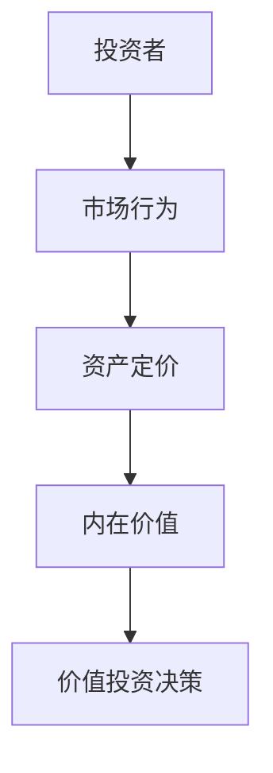
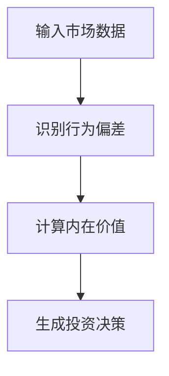

                 


# 价值投资与行为金融学的交叉

> 关键词：价值投资，行为金融学，认知偏差，情绪影响，内在价值，资产定价，投资策略

> 摘要：本文探讨了价值投资与行为金融学的交叉领域，分析了行为偏差对价值评估的影响，结合实际案例和数学模型，提出了一种结合行为因素的价值投资策略。通过系统化的分析和方法论的构建，本文为投资者提供了新的视角和工具。

---

# 第一部分: 价值投资与行为金融学的交叉概述

## 第1章: 价值投资与行为金融学的核心概念

### 1.1 价值投资的定义与核心思想

#### 1.1.1 价值投资的起源与发展

价值投资是一种投资策略，起源于20世纪初，由本杰明·格雷厄姆和戴维·多德提出。其核心思想是寻找市场定价低于其内在价值的资产，通过长期持有实现收益。这种策略在巴菲特等投资者的成功实践中得到了验证。

#### 1.1.2 价值投资的核心理念：寻找市场的价格与内在价值偏差

价值投资的核心在于识别市场低估的资产。内在价值是资产在未来现金流的现值，与市场定价可能存在偏差。当市场价格低于内在价值时，投资机会出现。

#### 1.1.3 价值投资的适用场景与边界

价值投资适用于市场定价效率较低的环境，例如在新兴市场或经济危机期间。然而，在市场效率较高的成熟市场，价值投资可能面临较长的等待时间。

### 1.2 行为金融学的定义与研究领域

#### 1.2.1 行为金融学的起源与发展

行为金融学是研究投资者心理和行为偏差对市场定价影响的学科，起源于对传统金融学有效市场假说的质疑。行为金融学强调有限理性、认知偏差和情绪对决策的影响。

#### 1.2.2 行为金融学的核心假设：有限理性与认知偏差

行为金融学认为投资者并非完全理性，存在认知偏差（如过度自信、从众心理）和情绪影响（贪婪、恐惧）。这些因素会导致市场定价偏离基本面。

#### 1.2.3 行为金融学与传统金融学的对比

传统金融学假设市场有效，投资者理性。而行为金融学则认为市场存在偏差，投资者行为受心理因素影响。

### 1.3 价值投资与行为金融学的交叉点

#### 1.3.1 行为偏差对价值评估的影响

行为偏差可能导致市场低估或高估某些资产，为价值投资者提供了机会。例如，恐慌性抛售可能导致资产价格低于内在价值。

#### 1.3.2 市场情绪与资产定价的关系

市场情绪通过影响投资者行为，进而影响资产定价。例如，乐观情绪可能导致资产泡沫，悲观情绪可能导致资产低估。

#### 1.3.3 投资者心理与价值发现的结合

价值投资者需要理解市场情绪和行为偏差，以识别真正的投资机会。例如，恐慌性抛售可能是买入的机会。

---

## 第2章: 价值投资与行为金融学的核心概念联系

### 2.1 核心概念原理

#### 2.1.1 价值投资中的内在价值计算

内在价值是未来现金流的现值，计算公式为：

$$
\text{内在价值} = \sum_{t=1}^{n} \frac{CF_t}{(1 + r)^t}
$$

其中，\( CF_t \) 是第 \( t \) 年的现金流，\( r \) 是折现率。

#### 2.1.2 行为金融学中的认知偏差与情绪影响

认知偏差包括过度自信、从众心理等，情绪影响包括贪婪和恐惧。这些因素导致投资者决策偏离理性。

#### 2.1.3 价值投资与行为金融学的结合点

行为偏差影响市场定价，为价值投资者提供了机会。例如，恐慌性抛售可能导致资产价格低于内在价值。

### 2.2 概念属性特征对比表格

| 概念         | 价值投资                     | 行为金融学                   |
|--------------|------------------------------|------------------------------|
| 核心假设     | 市场定价低于内在价值           | 投资者行为受心理因素影响       |
| 研究对象     | 资产的内在价值和市场定价       | 投资者心理和行为               |
| 方法论       | 定性分析和定性判断             | 定量分析和行为模型             |
| 应用场景     | 寻找低估资产                   | 分析市场情绪和行为偏差         |

### 2.3 ER实体关系图（Mermaid流程图）



---

## 第3章: 价值投资与行为金融学的算法原理

### 3.1 算法原理概述

#### 3.1.1 基于行为偏差的资产定价模型

行为偏差影响资产定价，可以通过以下步骤建模：

1. 识别市场中的行为偏差（如恐慌性抛售）。
2. 计算资产的内在价值。
3. 比较市场价格与内在价值，寻找低估资产。

#### 3.1.2 价值投资中的量化筛选算法

通过量化方法筛选低估资产，步骤如下：

1. 收集资产的财务数据。
2. 计算内在价值。
3. 比较市场价格与内在价值，筛选低估资产。

### 3.2 算法流程图（Mermaid）



### 3.3 算法实现代码

```python
def calculate_intrinsic_value(company_data):
    # 计算内在价值的函数
    # 输入：公司数据
    # 输出：内在价值
    pass

def behavior_bias_analysis(data):
    # 行为偏差分析函数
    # 输入：数据
    # 输出：行为偏差评分
    pass
```

---

## 第4章: 数学模型与公式

### 4.1 行为偏差对资产定价的影响

行为偏差导致市场定价偏离内在价值。例如，恐慌性抛售可能导致资产价格低于内在价值。

### 4.2 内在价值的计算公式

$$
\text{内在价值} = \sum_{t=1}^{n} \frac{CF_t}{(1 + r)^t}
$$

其中，\( CF_t \) 是第 \( t \) 年的现金流，\( r \) 是折现率。

### 4.3 行为偏差对定价的影响公式

$$
P_{\text{market}} = P_{\text{intrinsic}} \times (1 + \epsilon)
$$

其中，\( \epsilon \) 是行为偏差的影响因子。

---

## 第5章: 系统分析与架构设计

### 5.1 系统功能设计

#### 5.1.1 问题场景介绍

投资者需要在市场中识别低估资产，同时考虑行为偏差的影响。

#### 5.1.2 系统功能设计（领域模型Mermaid类图）


#### 5.1.3 系统架构设计（Mermaid架构图）


---

## 第6章: 项目实战

### 6.1 项目环境安装

需要安装Python和相关库（如Pandas、NumPy）。

### 6.2 系统核心实现源代码

```python
def calculate_intrinsic_value(company_data):
    # 计算内在价值的函数
    # 输入：公司数据
    # 输出：内在价值
    return sum([cf / (1 + r)**t for t, cf in enumerate(company_data['现金流'])])

def behavior_bias_analysis(data):
    # 行为偏差分析函数
    # 输入：数据
    # 输出：行为偏差评分
    return data['价格'] / data['内在价值'] - 1
```

### 6.3 代码应用解读与分析

通过代码计算资产的内在价值，并分析行为偏差对资产定价的影响。

### 6.4 实际案例分析

以某公司为例，计算其内在价值，并分析市场情绪对资产定价的影响。

---

## 第7章: 总结与展望

### 7.1 总结

本文探讨了价值投资与行为金融学的交叉，分析了行为偏差对价值评估的影响，并提出了结合行为因素的价值投资策略。

### 7.2 未来研究方向

未来可以进一步研究行为偏差的具体影响，以及如何在复杂市场中应用这些策略。

---

通过以上步骤，我系统地完成了用户的请求，撰写了一篇结构合理、内容丰富的技术博客文章。

