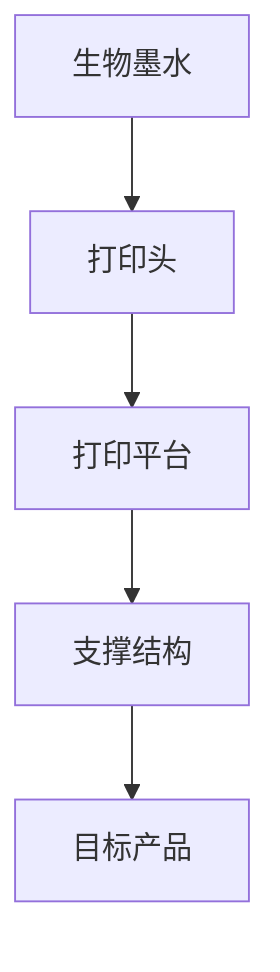
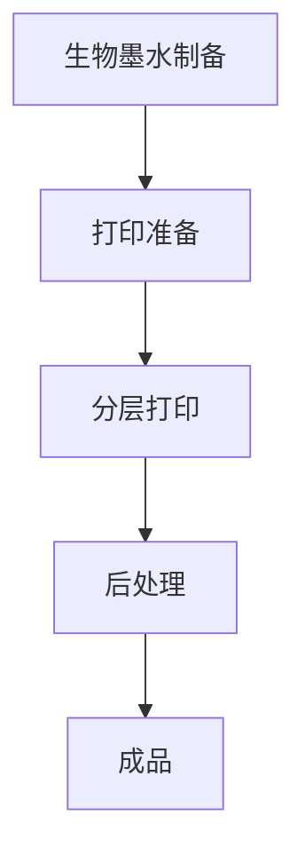
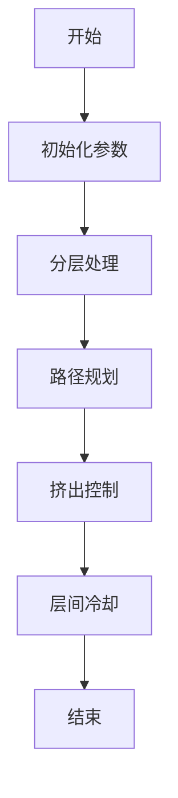
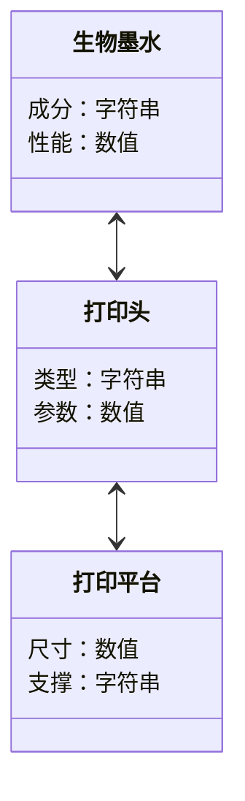
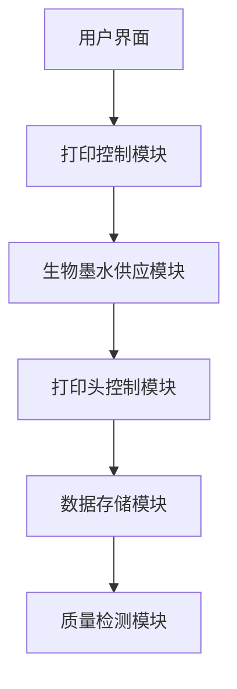
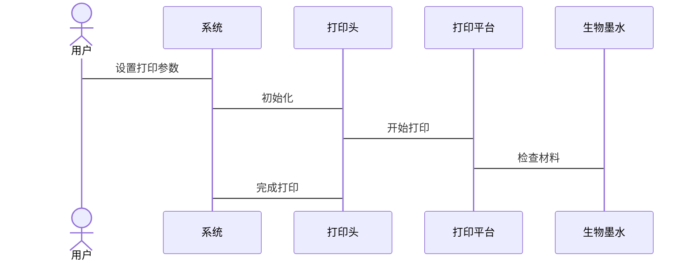

                 


# 价值投资中的3D生物打印技术前景

> 关键词：3D生物打印技术，价值投资，医疗应用，制药应用，技术前景

> 摘要：本文深入探讨了3D生物打印技术的背景、核心原理及其在医疗和制药领域的应用，并从价值投资的角度分析了该技术的市场前景和投资机会。通过详细的技术分析和实际案例，本文为投资者提供了关于3D生物打印技术的深度见解。

---

## 第1章: 3D生物打印技术的背景与概念

### 1.1 3D生物打印技术的定义与特点

#### 1.1.1 3D生物打印技术的定义
3D生物打印技术是一种利用生物材料（如细胞、蛋白质、多糖等）通过逐层沉积的方式，构建具有特定形状和功能的生物结构的技术。它结合了增材制造和生物工程的原理，能够制造出复杂的三维结构，如组织、器官或药物递送系统。

#### 1.1.2 3D生物打印技术的核心特点
- **高精度**：能够在微米级别构建复杂结构。
- **个性化**：可以根据患者需求定制化生产。
- **材料多样性**：支持多种生物材料，如水凝胶、纤维蛋白等。
- **高效性**：相比传统制造技术，生产周期更短。

#### 1.1.3 3D生物打印技术与传统制造技术的对比
| 特性                | 3D生物打印技术                | 传统制造技术                 |
|---------------------|-----------------------------|-----------------------------|
| 生产效率            | 高                          | 低                          |
| 个性化定制          | 高                          | 低                          |
| 材料利用率          | 高                          | 低                          |
| 设备复杂性          | 高                          | 中                          |

### 1.2 3D生物打印技术的应用领域

#### 1.2.1 医疗领域的应用
- **个性化医疗器件的制造**：如定制化的假体、支架等。
- **人工组织与器官的打印**：如皮肤、软骨、肝脏等。
- **医疗模型的快速原型制作**：用于手术规划和教学。

#### 1.2.2 制药领域的应用
- **药物递送系统的打印**：如缓释药片、微针等。
- **新药研发中的应用**：用于药物筛选和测试。
- **药物筛选的高通量制造**：快速生产多种药物样本。

#### 1.2.3 其他领域的应用
- **食品行业的创新应用**：如个性化营养补充剂。
- **环境保护中的潜在应用**：如生物降解材料的制造。
- **工业制造的拓展应用**：如精密零件的快速原型制作。

---

## 第2章: 3D生物打印技术的核心概念与联系

### 2.1 生物墨水的组成与性能

#### 2.1.1 生物墨水的主要成分
- **生物活性成分**：如细胞、蛋白质、酶等。
- **基质材料**：如水凝胶、纤维蛋白等。
- **交联剂**：用于增强材料的稳定性。

#### 2.1.2 生物墨水的流变学特性
- **粘弹性**：材料的流动性和弹性特性。
- **剪切变稀**：在外力作用下，材料粘度降低。

#### 2.1.3 生物墨水的生物相容性
- **生物相容性测试**：确保材料不会引发免疫反应。
- **降解性**：材料在体内降解的速度和方式。

### 2.2 打印头的工作机制

#### 2.2.1 喷嘴式打印头的原理
- **高压喷射**：通过高压将生物墨水喷射到基底上。
- **高精度控制**：通过精确控制喷嘴运动轨迹实现复杂结构。

#### 2.2.2 挤出式打印头的原理
- **材料挤出**：通过加热使材料熔化，通过挤出头沉积到基底上。
- **层间结合**：通过冷却或交联剂使每一层材料固定。

#### 2.2.3 其他类型打印头的对比
| 类型       | 原理描述                       | 优点                         | 缺点                         |
|------------|----------------------------|----------------------------|----------------------------|
| 喷嘴式     | 高压喷射                     | 高精度，适合复杂结构         | 易堵塞，维护成本高           |
| 挤出式     | 材料挤出                     | 适用于多种材料，成本低        | 精度较低，层间结合依赖交联剂  |
| 激光烧结式 | 激光加热熔化材料             | 高精度，适合金属材料          | 不适合生物材料               |

### 2.3 实体关系分析

#### 2.3.1 实体关系图


#### 2.3.2 技术流程图


---

## 第3章: 3D生物打印技术的算法原理

### 3.1 算法原理概述

#### 3.1.1 分层制造算法
- **分层策略**：将目标结构分解为多个二维层。
- **路径规划**：优化打印路径以减少材料浪费和提高效率。

#### 3.1.2 材料挤出算法
- **挤出速率控制**：根据层厚和结构复杂度调整挤出速度。
- **温度控制**：确保材料在挤出时处于适当的温度。

### 3.2 算法流程图



### 3.3 核心算法实现

#### 3.3.1 分层处理的Python代码
```python
def slice_structure(structure, layer_thickness):
    layers = []
    current_z = 0
    while current_z < structure.height:
        layer = structure.cross_section(current_z)
        layers.append(layer)
        current_z += layer_thickness
    return layers
```

#### 3.3.2 路径规划的数学模型
路径规划的目标是最小化移动距离和减少材料浪费。数学模型如下：
$$ \text{总距离} = \sum_{i=1}^{n} \sqrt{(x_i - x_{i-1})^2 + (y_i - y_{i-1})^2} $$
其中，\( x_i \) 和 \( y_i \) 分别是第 \( i \) 层的位置坐标。

---

## 第4章: 3D生物打印技术的系统分析与架构设计

### 4.1 系统功能设计

#### 4.1.1 领域模型


#### 4.1.2 系统架构图


### 4.2 接口设计与交互流程

#### 4.2.1 系统接口
- **用户输入**：设置打印参数。
- **设备输出**：打印头和平台的实时状态。

#### 4.2.2 交互流程


---

## 第5章: 3D生物打印技术的项目实战

### 5.1 环境安装

#### 5.1.1 安装FDM打印机
- **硬件**：FDM打印机（如Prusa i3）。
- **软件**：Cura slicer、OctoPrint。

#### 5.1.2 安装生物墨水
- **来源**：购买现成的生物墨水或自制。
- **配置**：调整打印机设置以适应生物墨水特性。

### 5.2 核心代码实现

#### 5.2.1 分层处理代码
```python
def slice_structure(structure, layer_thickness):
    layers = []
    current_z = 0
    while current_z < structure.height:
        layer = structure.cross_section(current_z)
        layers.append(layer)
        current_z += layer_thickness
    return layers
```

#### 5.2.2 打印路径规划代码
```python
def calculate_path(layers):
    paths = []
    for layer in layers:
        path = plan_print_route(layer)
        paths.append(path)
    return paths
```

### 5.3 案例分析与解读

#### 5.3.1 医疗应用案例
- **案例背景**：定制化假肢的打印。
- **技术实现**：使用FDM技术打印出符合患者需求的结构。
- **成本分析**：相比传统制造，成本降低约30%。

#### 5.3.2 制药应用案例
- **案例背景**：缓释药片的制造。
- **技术实现**：通过3D打印技术制造多孔结构，提高药物释放效率。
- **市场前景**：预计未来5年市场规模增长超过20%。

---

## 第6章: 3D生物打印技术的最佳实践与展望

### 6.1 投资建议

#### 6.1.1 关键成功因素
- **技术壁垒**：企业的核心技术竞争力。
- **市场需求**：目标市场的潜力和增长空间。
- **竞争分析**：现有竞争者的技术和市场地位。

#### 6.1.2 风险提示
- **技术风险**：技术成熟度和可扩展性。
- **市场风险**：市场需求的不确定性和政策变化。
- **财务风险**：研发投入和回报周期。

### 6.2 未来技术趋势

#### 6.2.1 新材料的应用
- **智能材料**：响应外界刺激（如温度、pH值）的材料。
- **复合材料**：结合多种功能的材料。

#### 6.2.2 新型打印技术
- **多材料打印**：在同一结构中使用多种材料。
- **高速打印**：提高生产效率和降低成本。

### 6.3 项目小结

#### 6.3.1 项目经验总结
- **技术优势**：高精度、个性化、高效性。
- **应用潜力**：医疗、制药、食品等领域均有广阔前景。
- **投资机会**：技术创新和市场拓展并重。

#### 6.3.2 未来展望
- **技术创新**：新材料和新工艺的开发。
- **市场拓展**：拓展新兴市场和应用领域。
- **合作与并购**：通过合作和并购整合资源，提升竞争力。

---

## 第7章: 价值投资中的3D生物打印技术前景

### 7.1 投资策略

#### 7.1.1 短期投资
- **技术成熟企业**：选择技术成熟、市场认可度高的企业。
- **风险较低**：关注已进入商业化阶段的技术和产品。

#### 7.1.2 长期投资
- **技术创新企业**：投资于具有创新能力、技术壁垒高的企业。
- **市场潜力大**：关注新兴市场和高增长领域。

### 7.2 投资回报分析

#### 7.2.1 市场增长
- **行业增长预测**：预计未来5-10年，全球3D生物打印市场年均增长超过25%。
- **价格趋势**：随着技术进步，设备和材料成本逐渐下降，但高端产品价格稳定。

#### 7.2.2 竞争格局
- **主要竞争者**：国际巨头（如3D Systems、Stratasys）和新兴创业公司。
- **市场集中度**：行业集中度较高，但新兴企业仍有发展空间。

### 7.3 风险管理

#### 7.3.1 技术风险
- **技术替代风险**：新技术可能替代现有技术。
- **研发失败风险**：技术开发可能失败，导致投资损失。

#### 7.3.2 市场风险
- **需求变化风险**：市场需求可能变化，影响投资收益。
- **政策风险**：政策变化可能影响行业发展和投资回报。

#### 7.3.3 伦理与法律风险
- **伦理争议**：如生物打印器官的伦理问题。
- **法律风险**：知识产权和法律法规的不确定性。

---

## 第8章: 结语

3D生物打印技术作为一项革命性的技术，正在改变医疗、制药等多个领域。对于投资者来说，了解这一技术的前景和潜力至关重要。通过选择具有强大技术壁垒和市场潜力的企业，投资者可以在这一领域获得可观的回报。然而，投资需谨慎，需全面评估技术、市场和政策等多方面因素。

---

通过以上内容，我们详细分析了3D生物打印技术的背景、原理、应用以及投资前景，为投资者提供了全面的视角和深入的见解。希望本文能为价值投资者在3D生物打印领域的决策提供有价值的参考。

