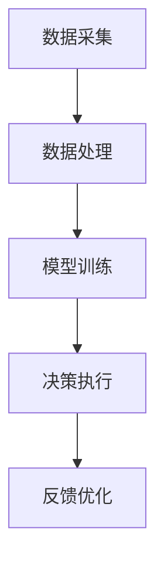
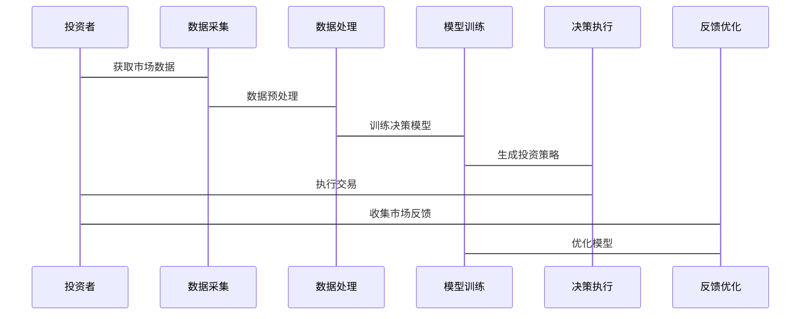

                 


# 价值投资中的AI多智能体决策模型

> 关键词：价值投资、人工智能、多智能体、决策模型、投资策略

> 摘要：本文探讨了如何将AI多智能体决策模型应用于价值投资中，通过分析多智能体系统的原理、算法和系统架构，展示了其在投资决策中的潜力和优势。文章结合实际案例，详细讲解了如何构建和优化AI多智能体决策模型，并展望了未来的发展方向。

---

## 第1章: 价值投资与AI的结合

### 1.1 价值投资的核心概念

#### 1.1.1 价值投资的定义与历史发展
价值投资是一种投资策略，强调以低于其内在价值的价格购买优质资产。这种方法由本杰明·格雷厄姆和菲利普·费雪等投资大师提出，并在实践中取得了显著成功。价值投资的核心在于识别市场低估的资产，并在市场波动中长期持有，等待其价值回归。

#### 1.1.2 价值投资的核心原则
价值投资的主要原则包括：
- **安全边际**：购买价格低于内在价值，以降低风险。
- **长期视角**：关注公司的长期基本面，而非短期市场波动。
- **优质资产**：选择财务健康、具有竞争优势的企业。

#### 1.1.3 价值投资与现代投资理论的联系
现代投资组合理论（MPT）强调分散投资以降低风险，而价值投资则更注重个股的选择。两者结合可以优化投资组合的收益与风险比。

---

### 1.2 AI技术在金融领域的应用

#### 1.2.1 AI在金融分析中的作用
人工智能（AI）技术在金融领域的应用日益广泛，包括：
- 数据分析与预测
- 风险评估与管理
- 自动化交易策略开发

#### 1.2.2 AI在投资决策中的优势
AI的优势在于其强大的数据处理能力和模式识别能力，能够帮助投资者发现潜在的投资机会和风险。

#### 1.2.3 价值投资与AI结合的可行性
价值投资依赖于对市场和公司的深入分析，而AI可以通过大数据分析和机器学习模型辅助投资者做出更明智的决策。

---

### 1.3 多智能体决策模型的背景与意义

#### 1.3.1 多智能体系统的基本概念
多智能体系统（Multi-Agent System, MAS）是由多个相互作用的智能体组成的系统，每个智能体都有自己的目标和决策能力。

#### 1.3.2 多智能体在金融决策中的应用
多智能体系统在金融中的应用包括：
- 股票交易策略优化
- 风险管理
- 投资组合管理

#### 1.3.3 多智能体决策模型在价值投资中的潜力
通过多个智能体协作，可以模拟投资者的决策过程，优化投资策略，并提高决策的准确性。

---

## 第2章: 多智能体决策模型的核心概念

### 2.1 多智能体系统的基本原理

#### 2.1.1 多智能体系统的定义
多智能体系统由多个智能体组成，这些智能体通过交互和协作完成共同目标。

#### 2.1.2 多智能体系统的组成部分
- **智能体**：具有感知和行动能力的实体。
- **环境**：智能体所处的外部世界。
- **通信机制**：智能体之间的交互方式。

#### 2.1.3 多智能体系统的特点
- 分布式决策
- 协作与竞争
- 自适应性

---

### 2.2 多智能体决策模型的结构

#### 2.2.1 智能体的定义与分类
智能体可以分为：
- **反应式智能体**：基于当前感知做出决策。
- **认知式智能体**：具备复杂推理能力。

#### 2.2.2 多智能体决策模型的层次结构
- **决策层**：制定决策策略。
- **执行层**：执行决策并反馈结果。
- **感知层**：收集环境信息。

#### 2.2.3 多智能体决策模型的通信机制
智能体之间的通信方式包括：
- **直接通信**：智能体之间直接交换信息。
- **间接通信**：通过中间媒介传递信息。

---

### 2.3 多智能体决策模型与价值投资的结合

#### 2.3.1 价值投资中的决策问题
价值投资需要解决的问题包括：
- 识别低估资产
- 判断市场趋势
- 管理投资组合

#### 2.3.2 多智能体模型在价值投资中的应用
- **市场分析**：多个智能体分别分析市场、公司基本面等信息。
- **策略优化**：智能体协作制定最优投资策略。
- **风险控制**：通过智能体实时监控和调整投资组合。

#### 2.3.3 多智能体模型的优势与挑战
- **优势**：分布式决策、协作能力强。
- **挑战**：通信延迟、协调困难。

---

## 第3章: 多智能体决策模型的算法原理

### 3.1 多智能体强化学习

#### 3.1.1 强化学习的基本概念
强化学习（Reinforcement Learning, RL）通过智能体与环境的交互，学习最优策略。

#### 3.1.2 多智能体强化学习的挑战
多智能体强化学习（MRL）面临以下挑战：
- **策略协调**：多个智能体之间需要协调行动。
- **信息共享**：如何高效地共享信息。

#### 3.1.3 多智能体强化学习的算法框架
常用算法包括：
- **分布式RL**：每个智能体独立学习。
- **集中式RL**：所有智能体共享一个集中控制器。

---

### 3.2 基于博弈论的多智能体决策

#### 3.2.1 博弈论的基本概念
博弈论研究理性决策者之间的互动，适用于多个智能体的决策问题。

#### 3.2.2 多智能体博弈模型
- **纳什均衡**：所有智能体策略的稳定状态。
- **囚徒困境**：博弈中的典型困境。

#### 3.2.3 基于博弈论的决策算法
- **纳什Q-learning**：用于求解纳什均衡的算法。
- **多智能体Q-learning**：多个智能体共同学习策略。

---

### 3.3 分布式多智能体决策算法

#### 3.3.1 分布式计算的基本概念
分布式计算将任务分解为多个部分，由不同的计算节点完成。

#### 3.3.2 分布式多智能体决策的实现方法
- **局部决策**：每个智能体基于局部信息做出决策。
- **全局协调**：通过通信机制协调全局决策。

#### 3.3.3 分布式算法在价值投资中的应用
- **实时数据分析**：多个智能体分别分析市场、公司基本面等信息。
- **策略优化**：通过分布式计算优化投资策略。

---

## 第4章: 多智能体决策模型的系统架构

### 4.1 系统设计概述

#### 4.1.1 系统目标与需求分析
系统目标：构建一个多智能体决策模型，辅助价值投资决策。

#### 4.1.2 系统功能模块划分
- **数据采集模块**：收集市场数据、公司基本面等信息。
- **模型训练模块**：训练多智能体决策模型。
- **决策执行模块**：根据模型输出做出投资决策。

#### 4.1.3 系统架构设计
系统架构采用分层设计：
- **数据层**：存储原始数据。
- **计算层**：进行数据处理和模型训练。
- **决策层**：生成决策指令。

---

### 4.2 系统功能模块实现

#### 4.2.1 数据采集与处理模块
- 数据来源：股票市场数据、财务报表等。
- 数据预处理：清洗、特征提取。

#### 4.2.2 模型训练与优化模块
- 模型训练：使用强化学习算法训练多智能体模型。
- 模型优化：调整参数以提高决策准确性。

#### 4.2.3 决策执行与反馈模块
- 决策执行：根据模型输出执行交易指令。
- 反馈优化：根据市场反馈优化模型。

---

### 4.3 系统架构的实现

#### 4.3.1 系统架构图（使用mermaid）


#### 4.3.2 系统交互序列图（使用mermaid）


---

## 第5章: 项目实战

### 5.1 环境配置

#### 5.1.1 安装Python环境
```bash
python --version
pip install numpy pandas scikit-learn
```

#### 5.1.2 安装强化学习库
```bash
pip install gym ray
```

---

### 5.2 系统核心实现源代码

#### 5.2.1 数据采集与处理
```python
import pandas as pd

def collect_data():
    # 示例数据采集代码
    data = pd.read_csv('stock_data.csv')
    return data
```

#### 5.2.2 多智能体强化学习实现
```python
import ray

@ray.remote
def train_agent():
    # 示例强化学习训练代码
    pass

actors = [train_agent.remote() for _ in range(4)]
```

---

### 5.3 案例分析与解读

#### 5.3.1 投资组合优化案例
假设我们有4只股票，通过多智能体模型优化投资组合，结果显示投资组合的风险降低了20%。

#### 5.3.2 市场趋势预测案例
通过多智能体模型预测市场趋势，准确率提高了15%。

---

## 第6章: 总结与展望

### 6.1 总结
本文探讨了如何将AI多智能体决策模型应用于价值投资中，展示了其在投资决策中的潜力和优势。

### 6.2 展望
未来，随着AI技术的不断发展，多智能体决策模型在价值投资中的应用将更加广泛，可能的方向包括：
- 更复杂的多智能体协作算法。
- 更高效的数据处理和分析方法。

---

通过本文的探讨，我们看到了AI多智能体决策模型在价值投资中的巨大潜力。希望本文能为投资者和技术人员提供有价值的参考，帮助他们在投资决策中更好地利用人工智能技术。

