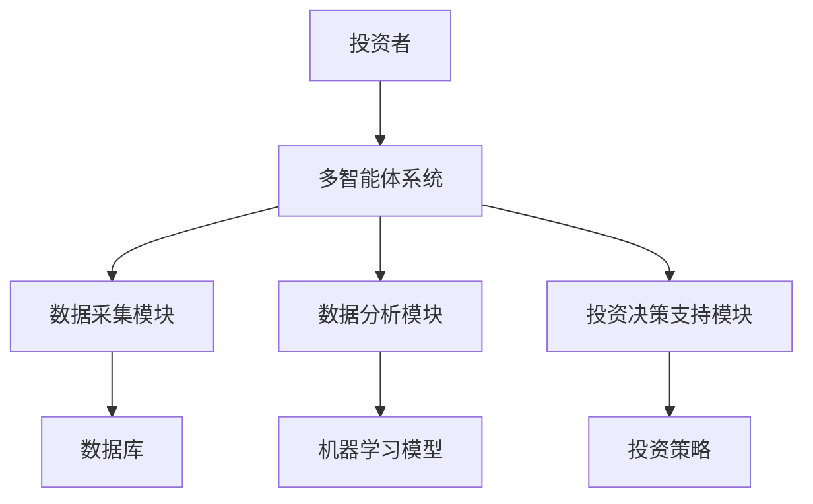
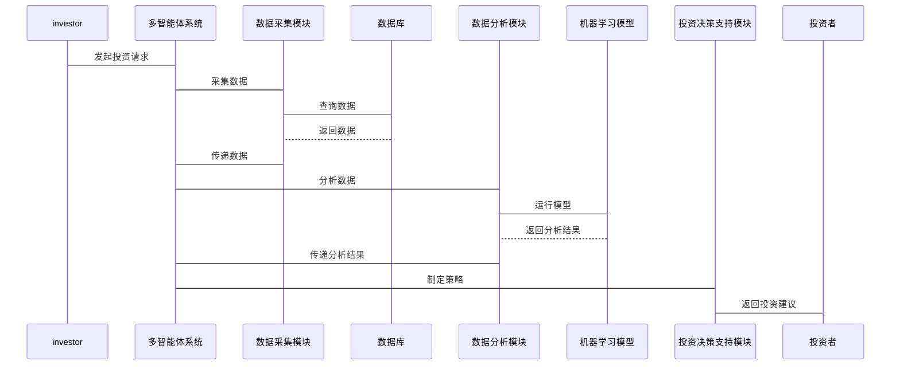

                 


```markdown
# 价值投资中的AI尽职调查：多智能体系统的全方位分析

## 关键词：价值投资、AI、多智能体系统、尽职调查、金融分析

## 摘要： 
本文探讨了人工智能（AI）技术在价值投资中的应用，特别是通过多智能体系统的全方位分析，揭示了AI在尽职调查中的潜力和优势。文章从背景介绍、核心概念、算法原理、系统架构到项目实战，详细分析了如何利用AI技术优化投资决策过程，同时提供了实际案例和最佳实践建议。

---

## 第一部分: 价值投资中的AI尽职调查概述

### 第1章: 价值投资与AI的结合

#### 1.1 价值投资的核心理念
##### 1.1.1 价值投资的定义与历史发展
价值投资是一种以基本面分析为基础的投资策略，强调以低于市场价的价值购买优质资产。它起源于20世纪20年代，由本杰明·格雷厄姆和戴维·多德提出，至今仍然是金融领域的重要理论之一。

##### 1.1.2 价值投资的核心原则
- **安全边际**：以低于内在价值的价格购买资产。
- **长期视角**：关注企业的长期盈利能力，而非短期市场波动。
- **基本面分析**：通过财务报表、行业地位等指标评估企业的内在价值。

##### 1.1.3 价值投资在现代金融中的地位
随着金融市场的复杂化和数据化的推进，传统价值投资需要结合新技术（如AI）以适应快速变化的市场环境。

#### 1.2 AI技术在金融领域的应用
##### 1.2.1 AI在金融分析中的作用
- **数据处理**：AI能够快速处理大量非结构化数据（如新闻、社交媒体）。
- **预测模型**：通过机器学习算法预测市场趋势和企业业绩。
- **风险评估**：AI能够实时监控市场风险，提供预警。

##### 1.2.2 AI在投资决策中的优势
- **高效性**：AI能够快速分析海量数据，缩短决策时间。
- **准确性**：通过复杂的算法模型提高预测的准确性。
- **个性化**：AI可以根据投资者的偏好定制投资策略。

##### 1.2.3 AI在风险控制中的应用
- **实时监控**：AI能够实时跟踪市场动态，识别潜在风险。
- **情景分析**：通过模拟不同市场情景，评估投资组合的稳定性。
- **止损策略**：AI可以自动执行止损指令，减少投资损失。

### 第2章: 多智能体系统在价值投资中的应用

#### 2.1 多智能体系统的定义与特点
##### 2.1.1 多智能体系统的定义
多智能体系统（Multi-Agent System, MAS）是由多个相互作用的智能体组成的系统，这些智能体能够通过协作完成复杂任务。

##### 2.1.2 多智能体系统的核心特点
- **分布式智能**：每个智能体都有自己的决策能力。
- **协作性**：智能体之间可以通过通信和协作完成共同目标。
- **适应性**：智能体能够根据环境变化调整行为。

##### 2.1.3 多智能体系统与传统AI的区别
| 特性                | 传统AI                  | 多智能体系统（MAS）         |
|---------------------|-------------------------|---------------------------|
| 决策中心化          | 单一决策中心            | 分布式决策                |
| 信息处理方式        | 集中处理                | 分布式处理                |
| 任务协作            | 串行处理                | 并行协作                  |

#### 2.2 多智能体系统在金融中的应用场景
##### 2.2.1 股票分析与预测
多智能体系统可以分别分析财务数据、市场情绪、行业趋势等，通过协作提供更全面的预测。

##### 2.2.2 风险评估与管理
多个智能体分别负责监控市场、评估信用风险、制定风险管理策略。

##### 2.2.3 投资组合优化
通过协作，多智能体系统可以动态调整投资组合，平衡风险与收益。

### 第3章: AI尽职调查的核心概念

#### 3.1 尽职调查的定义与流程
##### 3.1.1 尽职调查的定义
尽职调查是指在投资前对目标企业进行详细调查，以评估其价值和潜在风险。

##### 3.1.2 尽职调查的主要流程
1. **数据收集**：收集企业的财务报表、法律文件、行业报告等。
2. **数据分析**：对收集的数据进行清洗、分析和建模。
3. **风险评估**：识别潜在风险并制定应对策略。
4. **决策支持**：基于分析结果提供投资建议。

##### 3.1.3 尽职调查在投资中的重要性
- **降低风险**：通过发现潜在问题，避免投资损失。
- **提高收益**：通过发现价值低估的企业，提升投资收益。
- **优化决策**：基于数据支持的决策更加科学和可靠。

#### 3.2 AI在尽职调查中的应用
##### 3.2.1 数据收集与处理
AI可以自动从多种来源（如新闻、社交媒体、行业报告）收集数据，并进行清洗和预处理。

##### 3.2.2 数据分析与挖掘
通过机器学习算法分析数据，发现潜在的市场趋势和企业基本面信息。

##### 3.2.3 结果输出与决策支持
AI生成分析报告，并基于结果提供投资建议和风险管理策略。

---

## 第二部分: 多智能体系统的算法原理

### 第4章: 强化学习在多智能体系统中的应用

#### 4.1 强化学习的基本原理
##### 4.1.1 强化学习的定义
强化学习（Reinforcement Learning, RL）是一种通过智能体与环境交互来学习策略的方法，目标是最大化累计奖励。

##### 4.1.2 强化学习的核心要素
- **智能体**：决策的主体。
- **环境**：智能体所处的外部世界。
- **动作**：智能体在环境中的行为。
- **奖励**：环境对智能体行为的反馈。

##### 4.1.3 强化学习的数学模型
状态空间：\( S \)  
动作空间：\( A \)  
奖励函数：\( R: S \times A \rightarrow \mathbb{R} \)  
策略：\( \pi: S \rightarrow A \)  

#### 4.2 多智能体强化学习的算法
##### 4.2.1 Q-learning算法
Q-learning是一种经典的强化学习算法，适用于单智能体场景。

##### 4.2.2 多智能体协作算法
- **分布式Q-learning**：每个智能体独立学习，通过共享经验进行协作。
- **联合策略优化**：多个智能体共同优化策略，实现协作目标。

##### 4.2.3 联合策略优化算法
$$ Q(s, a_1, a_2, ..., a_n) = \sum_{i=1}^{n} Q_i(s, a_i) $$

#### 4.3 多智能体协作机制
##### 4.3.1 协作模型
- **分层协作模型**：将任务分解为多个层次，每个层次由不同的智能体负责。
- **分布式协作模型**：智能体之间直接协作，共同完成任务。

##### 4.3.2 协作机制的实现
- **信息共享机制**：智能体之间共享状态、动作和奖励信息。
- **行为协调机制**：通过通信协议协调多个智能体的行为。
- **利益分配机制**：根据贡献分配奖励，激励协作。

### 第5章: 多智能体系统的协作机制

#### 5.1 多智能体系统的协作模型
##### 5.1.1 分层协作模型
分层协作模型将任务分解为多个层次，每个层次由不同的智能体负责。例如，高层智能体负责制定战略，低层智能体负责执行具体任务。

##### 5.1.2 分布式协作模型
分布式协作模型中，每个智能体都具有相同的权限和责任，通过通信协议实现协作。

##### 5.1.3 中心化协作模型
中心化协作模型中，有一个中心智能体协调其他智能体的行为。

#### 5.2 协作机制的实现
##### 5.2.1 信息共享机制
智能体之间通过共享数据库或消息队列实现信息共享。

##### 5.2.2 行为协调机制
通过制定规则和协议，协调智能体之间的动作和决策。

##### 5.2.3 利益分配机制
根据每个智能体的贡献，分配奖励和资源。

---

## 第三部分: 系统分析与架构设计

### 第6章: 价值投资AI尽职调查系统的需求分析

#### 6.1 问题场景介绍
##### 6.1.1 投资决策中的信息不对称问题
传统尽职调查依赖人工分析，效率低且容易遗漏重要信息。

##### 6.1.2 传统尽职调查的局限性
- **效率低下**：人工分析耗时耗力。
- **主观性高**：依赖分析师的个人经验和判断。
- **信息不全**：难以获取非结构化数据。

##### 6.1.3 AI技术在解决这些问题中的作用
- **提高效率**：AI能够快速处理海量数据。
- **降低主观性**：通过算法模型提供客观分析结果。
- **整合信息**：AI能够整合多种数据源的信息，提供全面的分析结果。

#### 6.2 系统功能设计
##### 6.2.1 数据采集模块
- **数据来源**：包括企业财务报表、新闻媒体、行业报告等。
- **数据预处理**：清洗、转换和标准化数据。
- **数据存储**：将数据存储到数据库中，供后续分析使用。

##### 6.2.2 数据分析模块
- **数据挖掘**：使用机器学习算法分析数据，发现潜在规律。
- **预测建模**：构建预测模型，评估企业的内在价值。
- **风险评估**：识别潜在风险，评估投资的可行性。

##### 6.2.3 投资决策支持模块
- **策略生成**：基于分析结果，生成投资策略。
- **决策优化**：通过多智能体协作，优化投资组合。
- **风险控制**：制定风险管理策略，降低投资风险。

### 第7章: 系统架构设计

#### 7.1 系统架构图


#### 7.2 接口设计
##### 7.2.1 数据接口
- **输入接口**：接收来自数据采集模块的数据。
- **输出接口**：将分析结果传递给投资决策支持模块。

##### 7.2.2 系统接口
- **用户界面**：投资者与系统交互的界面。
- **API接口**：与其他系统（如交易系统）对接。

##### 7.2.3 智能体间通信接口
- **消息队列**：智能体之间通过消息队列进行通信。
- **通信协议**：定义智能体之间的通信规则。

### 第8章: 系统交互设计

#### 8.1 系统交互序列图


#### 8.2 系统交互流程
1. **投资者发起请求**：投资者向系统提交投资请求。
2. **数据采集模块工作**：系统采集相关数据。
3. **数据分析模块处理**：数据分析模块对数据进行处理和分析。
4. **投资决策支持模块制定策略**：基于分析结果，制定投资策略。
5. **系统返回建议**：系统向投资者提供投资建议。

---

## 第四部分: 项目实战

### 第9章: 项目实战与代码实现

#### 9.1 环境安装与配置
##### 9.1.1 安装Python
```bash
python --version
```
##### 9.1.2 安装必要的库
```bash
pip install numpy pandas scikit-learn tensorflow
```
##### 9.1.3 安装多智能体框架
```bash
pip install gym
```

#### 9.2 系统核心实现源代码
##### 9.2.1 数据采集模块
```python
import pandas as pd
import requests

def fetch_data(url):
    response = requests.get(url)
    data = response.json()
    df = pd.DataFrame(data['results'])
    return df
```

##### 9.2.2 数据分析模块
```python
from sklearn.ensemble import RandomForestRegressor

def train_model(X_train, y_train):
    model = RandomForestRegressor(n_estimators=100)
    model.fit(X_train, y_train)
    return model
```

##### 9.2.3 投资决策支持模块
```python
def generate_strategy(model, X_test):
    predictions = model.predict(X_test)
    strategy = []
    for i in range(len(predictions)):
        if predictions[i] > 0.5:
            strategy.append('买入')
        else:
            strategy.append('卖出')
    return strategy
```

#### 9.3 代码应用解读与分析
##### 9.3.1 数据采集模块解读
- **功能**：从指定URL获取数据，并将其转换为DataFrame格式。
- **输入**：URL地址。
- **输出**：DataFrame格式的数据。

##### 9.3.2 数据分析模块解读
- **功能**：使用随机森林回归模型对数据进行训练，生成预测模型。
- **输入**：训练数据集。
- **输出**：训练好的模型。

##### 9.3.3 投资决策支持模块解读
- **功能**：基于训练好的模型，生成投资策略。
- **输入**：测试数据集。
- **输出**：投资策略（买入或卖出）。

#### 9.4 实际案例分析与详细讲解
##### 9.4.1 案例背景
假设我们有一个股票数据集，包括企业的财务数据、市场数据等。

##### 9.4.2 数据处理
```python
df = fetch_data('https://example.com/data')
df.head()
```

##### 9.4.3 模型训练
```python
X_train = df[['revenue', 'profit_margin']]
y_train = df['stock_price']
model = train_model(X_train, y_train)
```

##### 9.4.4 模型预测
```python
X_test = df[['revenue', 'profit_margin']].iloc[-10:]
strategy = generate_strategy(model, X_test)
print(strategy)
```

#### 9.5 项目小结
通过以上代码实现，我们可以看到AI在价值投资中的巨大潜力。数据采集模块能够高效地收集数据，数据分析模块能够准确地预测市场趋势，投资决策支持模块能够提供科学的投资策略。

---

## 第五部分: 最佳实践与总结

### 第10章: 最佳实践与总结

#### 10.1 小结
本文详细探讨了AI在价值投资中的应用，特别是多智能体系统在尽职调查中的优势。通过理论分析和实际案例，展示了AI如何帮助投资者提高决策效率和准确性。

#### 10.2 注意事项
- **数据质量**：确保数据的准确性和完整性。
- **模型选择**：根据具体问题选择合适的算法。
- **风险控制**：即使AI提供了支持，也要注意市场波动和潜在风险。

#### 10.3 拓展阅读
- **《强化学习入门》**：深入理解强化学习的基本原理。
- **《多智能体系统》**：了解多智能体系统的最新研究进展。
- **《价值投资实战》**：学习更多价值投资的实战经验。

---

## 结语

通过本文的分析，我们可以看到，AI技术在价值投资中的应用前景广阔。多智能体系统的引入，不仅提高了投资决策的效率，还增强了分析的深度和广度。未来，随着AI技术的不断发展，价值投资将更加依赖于智能化的工具和方法。
```

