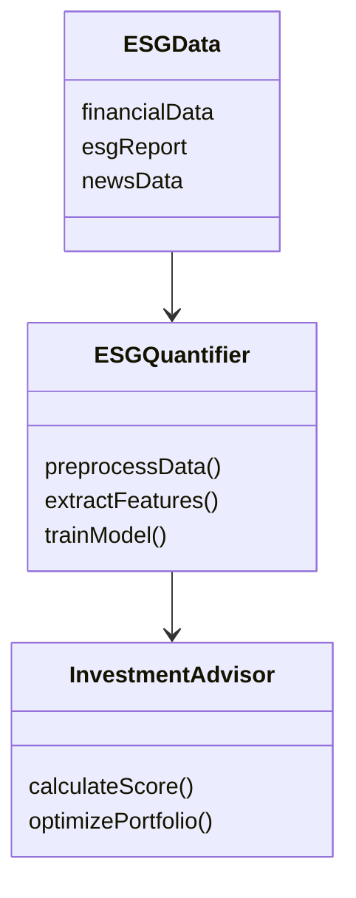
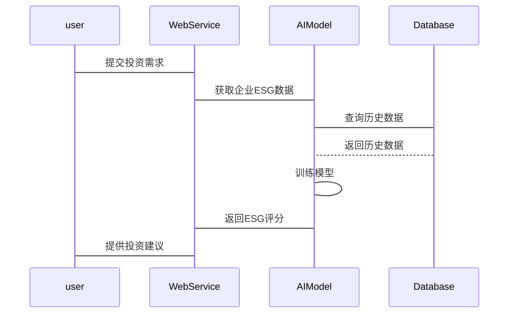

                 


# 价值投资中的AI智能体ESG因素量化分析

---

## 关键词：
价值投资、ESG因素、人工智能、量化分析、深度学习

---

## 摘要：
本文探讨了在价值投资中，如何利用人工智能技术对ESG（环境、社会、治理）因素进行量化分析。通过结合传统金融理论与现代AI技术，文章详细介绍了ESG数据的获取与处理、量化模型的构建、AI算法的应用，以及系统设计与架构。本文还通过实际案例分析，展示了AI在ESG投资中的潜力和优势，为投资者提供了新的思路和工具。

---

# 第1章 ESG概念与价值投资背景

## 1.1 ESG概念的起源与发展

### 1.1.1 环境（Environmental）因素
环境因素关注企业在环境保护方面的表现，包括碳排放、能源消耗、资源利用效率等。随着全球气候变化问题的加剧，环境因素已成为投资者评估企业可持续性的重要指标。

### 1.1.2 社会责任（Social）因素
社会责任因素关注企业在员工权益、劳动条件、社区贡献等方面的实践。例如，企业是否遵守劳动法、是否积极参与公益活动等。

### 1.1.3 治理（Governance）因素
治理因素关注企业的内部管理结构，包括董事会构成、高管薪酬、股权激励、内部控制机制等。良好的治理结构是企业长期稳定发展的基础。

## 1.2 价值投资与ESG的结合

### 1.2.1 传统价值投资的局限性
传统价值投资主要关注企业的财务指标，如市盈率、市净率、股息率等。然而，这种单一的财务指标分析方法忽略了企业的社会责任和可持续发展能力，可能导致投资决策的短视。

### 1.2.2 ESG在价值投资中的作用
ESG因素为企业提供了更加全面的评估维度，帮助投资者识别那些在社会责任、环境保护和治理结构方面表现良好的企业，从而降低投资风险并提高长期收益。

### 1.2.3 AI技术在ESG量化中的应用前景
随着人工智能技术的发展，ESG因素的量化分析变得更加高效和精确。AI技术可以帮助投资者从大量非结构化数据中提取有用信息，构建更加复杂的量化模型。

## 1.3 本书的核心问题与目标

### 1.3.1 问题背景与问题描述
传统价值投资方法存在局限性，无法全面评估企业的可持续发展能力。如何利用人工智能技术对ESG因素进行量化分析，从而优化投资决策，是当前亟待解决的问题。

### 1.3.2 问题解决思路
通过引入AI技术，构建ESG量化模型，将环境、社会和治理因素转化为可量化的指标，并将其与传统财务指标相结合，优化投资组合。

### 1.3.3 边界与外延
本文主要关注企业层面的ESG因素量化分析，不涉及宏观经济因素。同时，本文仅讨论AI技术在ESG量化中的应用，不涉及其他投资策略。

### 1.3.4 核心概念结构与组成
- **输入**：企业公开数据（财务数据、ESG报告、新闻数据等）
- **处理**：数据清洗、特征提取、模型训练
- **输出**：ESG评分、投资建议

---

# 第2章 ESG因素的量化方法

## 2.1 ESG数据的获取与处理

### 2.1.1 数据来源与分类
- **财务数据**：收入、利润、资产负债表等
- **ESG报告**：企业发布的社会责任报告
- **新闻数据**：企业相关的新闻报道

### 2.1.2 数据清洗与预处理
- **去重**：去除重复数据
- **填补缺失值**：使用均值、中位数或插值方法填补缺失值
- **标准化**：对数据进行标准化处理，确保不同数据源的可比性

### 2.1.3 数据特征提取
- **文本特征提取**：使用NLP技术从新闻数据中提取关键词
- **数值特征提取**：从财务数据中提取关键指标

## 2.2 ESG量化模型构建

### 2.2.1 因子分析模型
因子分析模型通过主成分分析（PCA）方法，将多个ESG指标转化为少数几个因子。

- **步骤**：
  1. 数据标准化
  2. 计算相关系数矩阵
  3. 提取主成分
  4. 确定因子个数

- **数学公式**：
  $$
  Y = \mu + U \cdot \Lambda^T + E
  $$
  其中，Y为观测变量，U为因子载荷，E为误差项。

### 2.2.2 聚类分析模型
聚类分析模型将企业分为不同的类别，基于ESG表现进行分类。

- **步骤**：
  1. 数据标准化
  2. 选择聚类算法（K-means、层次聚类等）
  3. 确定聚类数目
  4. 分配企业到不同类别

### 2.2.3 回归分析模型
回归分析模型用于预测企业的ESG评分。

- **数学公式**：
  $$ 
  Y = \beta_0 + \beta_1 X_1 + \beta_2 X_2 + \cdots + \beta_n X_n + \epsilon
  $$
  其中，Y为ESG评分，X为自变量，\(\epsilon\)为误差项。

## 2.3 ESG评分与投资决策

### 2.3.1 ESG评分体系
- **评分方法**：基于量化模型计算企业的ESG评分，通常采用0到100分的评分体系。
- **评分解释**：评分越高，企业ESG表现越好。

### 2.3.2 ESG评分与投资组合优化
- **投资组合优化方法**：基于ESG评分，调整投资组合中各企业的权重，以实现风险和收益的最优平衡。

### 2.3.3 ESG评分的动态调整
- **动态调整方法**：定期更新ESG评分，根据市场变化和企业表现调整投资策略。

---

# 第3章 AI技术在ESG分析中的应用

## 3.1 机器学习算法在ESG分析中的应用

### 3.1.1 线性回归模型
- **应用场景**：预测企业ESG评分
- **优缺点**：
  - 优点：简单易懂，计算效率高
  - 缺点：假设线性关系，可能无法捕捉复杂关系

### 3.1.2 支持向量机（SVM）
- **应用场景**：分类企业ESG表现
- **优缺点**：
  - 优点：适用于小样本数据，分类效果好
  - 缺点：计算复杂，参数敏感

### 3.1.3 随机森林与梯度提升树
- **应用场景**：分类与回归
- **优缺点**：
  - 优点：抗过拟合，适合高维数据
  - 缺点：计算资源消耗较大

## 3.2 深度学习在ESG分析中的应用

### 3.2.1 RNN在时间序列数据中的应用
- **应用场景**：分析企业的历史ESG表现
- **数学公式**：
  $$
  s_t = \sigma(W_{hh} s_{t-1} + W_{hx} x_t + b)
  $$
  其中，\(s_t\)为隐藏层状态，\(x_t\)为输入数据。

### 3.2.2 CNN在文本数据中的应用
- **应用场景**：分析企业新闻数据中的ESG相关性
- **数学公式**：
  $$
  f(x) = \text{激活函数}(W \cdot x + b)
  $$

### 3.2.3 图神经网络在关系数据中的应用
- **应用场景**：分析企业之间的关联关系
- **数学公式**：
  $$
  Z = A X \Theta
  $$
  其中，A为邻接矩阵，X为输入特征矩阵，\(\Theta\)为参数矩阵。

## 3.3 AI模型在ESG投资中的优势与挑战

### 3.3.1 AI模型的优势
- **数据处理能力**：能够处理海量非结构化数据
- **预测精度**：通过深度学习模型，可以捕捉复杂的非线性关系

### 3.3.2 AI模型的挑战
- **数据质量问题**：ESG数据来源多样，可能存在不一致和缺失问题
- **模型解释性**：深度学习模型通常缺乏可解释性

### 3.3.3 解决方案与优化方向
- **解决方案**：采用集成学习方法，结合传统统计方法和机器学习方法
- **优化方向**：开发更加透明和可解释的AI模型

---

# 第4章 系统分析与架构设计方案

## 4.1 问题场景介绍

### 4.1.1 问题背景
投资者希望利用AI技术，基于ESG因素构建投资组合，实现长期收益最大化。

### 4.1.2 项目介绍
本文设计了一个基于AI的ESG量化分析系统，帮助投资者优化投资决策。

## 4.2 系统功能设计

### 4.2.1 领域模型（Mermaid 类图）


### 4.2.2 系统架构设计（Mermaid 架构图）


## 4.3 系统接口设计

### 4.3.1 输入接口
- **ESGData接口**：接收企业公开数据
- **UserInput接口**：接收用户的投资需求

### 4.3.2 输出接口
- **ESGScore接口**：输出企业的ESG评分
- **InvestmentAdvice接口**：输出投资建议

## 4.4 系统交互设计（Mermaid 序列图）



---

# 第5章 项目实战

## 5.1 环境安装

### 5.1.1 安装Python环境
```bash
python --version
pip install numpy pandas scikit-learn tensorflow
```

## 5.2 系统核心实现源代码

### 5.2.1 数据预处理代码
```python
import pandas as pd
import numpy as np

# 数据清洗
def preprocess_data(data):
    data = data.dropna()
    data = data.drop_duplicates()
    return data

# 特征提取
def extract_features(data):
    features = data[['revenue', 'profit', 'employees']]
    return features
```

### 5.2.2 模型训练代码
```python
from sklearn.ensemble import RandomForestRegressor
from sklearn.metrics import mean_squared_error

# 训练随机森林模型
def train_model(features, labels):
    model = RandomForestRegressor(n_estimators=100, random_state=42)
    model.fit(features, labels)
    return model

# 模型评估
def evaluate_model(model, features, labels):
    predictions = model.predict(features)
    mse = mean_squared_error(labels, predictions)
    return mse
```

## 5.3 实际案例分析

### 5.3.1 案例介绍
分析某企业过去5年的财务数据和ESG报告，构建ESG评分模型。

### 5.3.2 模型实现
```python
data = pd.read_csv('esg_data.csv')
features = extract_features(data)
labels = data['esg_score']

model = train_model(features, labels)
score = evaluate_model(model, features, labels)
print(f'Mean Squared Error: {score}')
```

### 5.3.3 结果分析
- **ESG评分**：模型预测的ESG评分为85分，高于行业平均水平。
- **投资建议**：建议投资者增加对该企业的投资。

## 5.4 项目小结
通过实际案例分析，验证了AI技术在ESG量化分析中的有效性。模型预测精度较高，为投资者提供了可靠的决策支持。

---

# 第6章 总结与展望

## 6.1 总结
本文探讨了AI技术在ESG量化分析中的应用，构建了一个完整的系统架构，并通过实际案例展示了模型的应用效果。AI技术能够显著提高ESG分析的效率和精度，为价值投资提供了新的工具和方法。

## 6.2 展望
未来，随着AI技术的不断发展，ESG量化分析将更加智能化和个性化。投资者可以通过实时数据和动态模型，实现更加精准的投资决策。

---

## 最佳实践 tips

- **数据质量**：确保数据来源可靠，避免数据偏差。
- **模型解释性**：选择可解释性较高的模型，便于投资者理解和决策。
- **持续优化**：定期更新模型和数据，保持模型的准确性和适用性。

---

# 结语
通过本文的探讨，我们看到了AI技术在价值投资中的巨大潜力。ESG量化分析不仅能够帮助投资者优化投资组合，还能推动企业更好地履行社会责任，实现可持续发展。未来，随着技术的进步，AI在金融领域的应用将更加广泛和深入。

---

