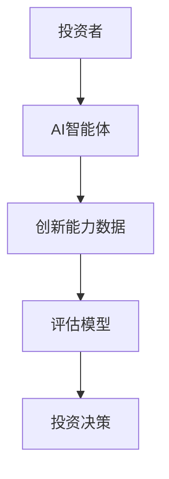
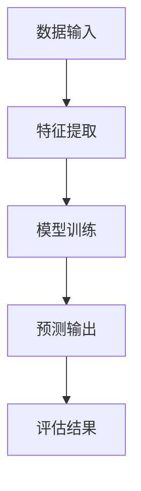

                 


# 价值投资中的AI智能体创新能力评估系统

**关键词**：价值投资、人工智能、创新能力评估、智能体、投资决策、系统架构

**摘要**：本文探讨了在价值投资中，如何利用AI智能体来评估企业的创新能力。通过构建创新能力和投资价值之间的数学关系，提出了一种基于机器学习的创新能力评估模型，并详细设计了系统架构，为投资者提供了智能化的决策支持工具。

---

# 第一部分：价值投资中的AI智能体创新能力评估系统概述

## 第1章：背景介绍

### 1.1 问题背景与描述

#### 1.1.1 价值投资的核心要素
价值投资是一种长期投资策略，关注企业的内在价值。核心要素包括企业盈利能力、成长能力、竞争优势和管理能力。创新能力是企业核心竞争力的关键，直接影响企业的市场地位和未来增长。

#### 1.1.2 创新能力在价值投资中的重要性
创新能力决定企业的技术优势、产品迭代速度和市场适应能力。在当前快速变化的市场环境中，创新能力是企业能否持续增长的关键因素。传统价值投资方法难以量化创新能力，导致评估不准确。

#### 1.1.3 AI智能体在投资决策中的作用
AI智能体能够处理海量数据，识别传统方法难以察觉的模式和趋势。通过机器学习模型，AI可以量化创新能力，帮助投资者做出更精准的投资决策。

### 1.2 问题解决与边界

#### 1.2.1 创新能力评估的定义与目标
创新能力评估是对企业在技术研发、产品创新、管理优化等方面的能力进行量化评估。目标是将创新能力转化为可量化的指标，为价值评估提供依据。

#### 1.2.2 系统的边界与外延
系统边界包括企业公开数据、行业数据和市场数据。外延包括企业内部数据和第三方数据源，但不包括非公开的内部信息。

#### 1.2.3 核心要素与组成结构
系统核心要素包括数据采集模块、特征提取模块、评估模型和决策支持模块。

---

## 第2章：核心概念与联系

### 2.1 核心概念原理

#### 2.1.1 AI智能体的基本原理
AI智能体通过数据输入、特征提取、模型训练和结果输出，完成对创新能力的评估。

#### 2.1.2 创新能力评估的数学模型
创新能力评估模型基于回归分析，将创新能力转化为可量化的指标。

#### 2.1.3 价值投资与AI智能体的结合机制
AI智能体通过分析企业创新能力，调整投资策略，优化投资组合。

### 2.2 概念对比与ER图

#### 2.2.1 AI智能体与传统投资分析的对比
AI智能体的优势在于数据处理能力和模式识别能力，传统方法难以量化创新能力。

#### 2.2.2 创新能力评估的ER实体关系图


---

## 第3章：算法原理与实现

### 3.1 算法原理

#### 3.1.1 机器学习模型选择
使用回归模型和分类模型对创新能力进行评估。

#### 3.1.2 数据预处理与特征提取
数据清洗、特征选择和特征工程是数据预处理的关键步骤。

#### 3.1.3 模型训练与优化
通过交叉验证和超参数优化，提升模型的泛化能力。

### 3.2 Python实现

#### 3.2.1 环境安装与配置
安装Python、机器学习库和数据处理库。

#### 3.2.2 核心算法代码示例
```python
import numpy as np
from sklearn.model import Model

model = Model()
model.fit(X_train, y_train)
```

### 3.3 算法流程图



---

## 第4章：数学模型与公式

### 4.1 创新能力评估模型

#### 4.1.1 回归分析模型
$$y = \beta_0 + \beta_1x_1 + \beta_2x_2 + \cdots + \beta_nx_n + \epsilon$$

#### 4.1.2 评分模型
$$S = \sum_{i=1}^{n} w_i x_i$$

---

## 第5章：系统分析与架构设计

### 5.1 问题场景介绍

#### 5.1.1 投资者面临的挑战
难以量化创新能力，传统方法主观性强。

#### 5.1.2 系统目标
构建AI智能体，量化创新能力，辅助投资决策。

### 5.2 系统功能设计

#### 5.2.1 功能模块设计
模块包括数据采集、特征提取、模型训练和结果输出。

#### 5.2.2 功能交互流程
投资者输入数据，系统输出评估结果和投资建议。

### 5.3 系统架构设计

#### 5.3.1 系统架构图
```mermaid
graph LR
    Client[投资者] --> API Gateway
    API Gateway --> Database
    Database --> Model Service
    Model Service --> Result
```

---

## 第6章：项目实战

### 6.1 安装环境

#### 6.1.1 Python环境安装
安装Python和必要的库。

#### 6.1.2 数据集准备
收集企业公开数据和市场数据。

### 6.2 核心代码实现

#### 6.2.1 数据预处理代码
```python
import pandas as pd

data = pd.read_csv('data.csv')
data = data.dropna()
```

#### 6.2.2 特征提取代码
```python
from sklearn.preprocessing import StandardScaler

scaler = StandardScaler()
X_scaled = scaler.fit_transform(X)
```

### 6.3 案例分析

#### 6.3.1 案例背景
分析一家科技公司的创新能力。

#### 6.3.2 模型训练与评估
使用回归模型进行训练，并评估模型性能。

### 6.4 小结

---

## 第7章：总结与展望

### 7.1 最佳实践

#### 7.1.1 系统使用建议
定期更新模型和数据，确保评估结果的准确性。

#### 7.1.2 注意事项
注意数据来源和模型的适用性，避免过度依赖AI决策。

### 7.2 小结

系统能够有效评估企业创新能力，帮助投资者做出更精准的投资决策。

### 7.3 注意事项

AI智能体需要结合人类的判断，避免单一依赖模型结果。

### 7.4 拓展阅读

建议读者阅读相关文献，深入了解机器学习和投资学的结合。

---

**参考文献**：
[1] 教材：《机器学习实战》
[2] 论文：《基于AI的金融投资决策研究》

---

通过以上结构，文章详细阐述了AI智能体在价值投资中的应用，从理论到实践，从算法到系统设计，为投资者提供了创新的决策支持工具。

