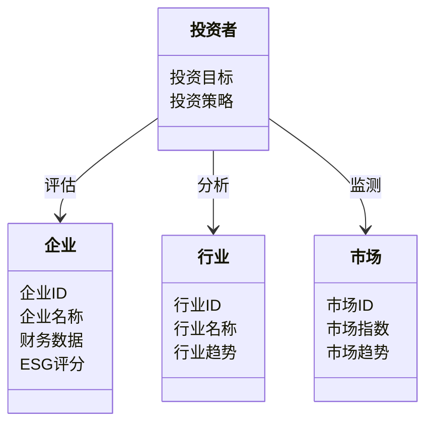

                 


# 价值投资中的AI智能体可持续发展能力分析系统

> 关键词：价值投资、AI智能体、可持续发展能力、算法、系统架构

> 摘要：本文系统地探讨了如何利用AI智能体分析企业的可持续发展能力，以支持价值投资决策。文章从理论基础、算法原理、系统设计到实际应用，全面解析了AI技术在价值投资中的潜力与实现路径。

---

## 第一部分：价值投资中的AI智能体可持续发展能力分析系统背景介绍

### 第1章：价值投资与AI智能体概述

#### 1.1 价值投资的基本概念
##### 1.1.1 价值投资的定义与历史发展
价值投资是一种以企业内在价值为导向的投资策略，由本杰明·格雷厄姆等投资大师提出。其核心在于通过分析企业的财务状况、行业地位和竞争优势，寻找市场价格低于内在价值的股票。

##### 1.1.2 价值投资的核心理念与原则
- **安全边际**：买入价格低于内在价值，以降低投资风险。
- **长期视角**：关注企业的长期盈利能力，而非短期市场波动。
- **基本面分析**：通过对企业财务报表、行业趋势和宏观经济环境的分析，评估企业的投资价值。

##### 1.1.3 价值投资在现代金融中的地位与作用
随着金融市场的复杂化，传统价值投资面临数据量大、分析难度高、人工判断主观性强等问题。AI技术的引入为价值投资提供了新的解决方案，通过量化分析和数据挖掘提升投资决策的效率和准确性。

#### 1.2 AI智能体的基本概念
##### 1.2.1 AI智能体的定义与分类
AI智能体（Artificial Intelligence Agent）是指能够感知环境并采取行动以实现目标的智能系统。根据智能体的复杂程度和应用场景，可以分为简单反射型智能体、基于模型的智能体、 utility-based 智能体等。

##### 1.2.2 AI智能体的核心技术与应用场景
- **核心技术**：包括机器学习、自然语言处理、知识图谱构建等。
- **应用场景**：在金融领域，AI智能体被用于股票预测、风险评估、投资组合优化等场景。

##### 1.2.3 AI智能体在金融领域的潜力与挑战
AI智能体在金融领域的潜力主要体现在高频交易、实时数据分析和个性化投资建议等方面。然而，挑战也包括数据隐私、算法解释性以及模型过拟合等问题。

#### 1.3 价值投资与AI智能体的结合意义
##### 1.3.1 价值投资中的数据驱动决策
通过AI智能体分析海量数据，发现潜在的投资机会，提高投资决策的科学性和精确性。

##### 1.3.2 AI智能体在价值投资中的优势
- **高效性**：AI智能体能够快速处理大量数据，帮助投资者发现传统方法难以察觉的模式。
- **客观性**：通过算法分析，减少人为情绪和偏见对投资决策的影响。
- **持续性**：AI智能体可以实时监控市场变化，动态调整投资策略。

##### 1.3.3 价值投资与AI智能体结合的未来趋势
随着AI技术的不断进步，价值投资将更加依赖数据驱动的决策，AI智能体在投资组合管理、风险控制等方面的作用将更加显著。

### 第2章：可持续发展能力分析系统的背景与问题描述

#### 2.1 可持续发展能力的定义与内涵
##### 2.1.1 可持续发展的概念与重要性
可持续发展是指在满足当前需求的同时，不损害后代满足其需求的能力。在企业层面，可持续发展能力涉及环境保护、社会责任和公司治理等方面。

##### 2.1.2 企业可持续发展能力的核心要素
- **环境因素**：包括能源消耗、碳排放、资源利用效率等。
- **社会责任**：包括员工福利、公平就业、社区支持等。
- **治理因素**：包括董事会结构、内部控制、透明度等。

##### 2.1.3 可持续发展能力在价值投资中的应用
在价值投资中，可持续发展能力被视为企业长期竞争优势的重要组成部分。投资者 increasingly consider ESG（环境、社会、治理）因素，以评估企业的长期价值。

#### 2.2 价值投资中的可持续发展能力分析需求
##### 2.2.1 传统价值投资的局限性
传统价值投资主要依赖财务指标和管理层判断，难以全面评估企业的可持续发展能力。

##### 2.2.2 可持续发展能力分析的必要性
随着全球环保意识的增强和监管政策的趋严，企业可持续发展能力直接影响其长期价值。

##### 2.2.3 可持续发展能力分析的目标与边界
目标：通过量化分析，评估企业的可持续发展能力，为投资决策提供支持。边界：重点关注企业的环境、社会和治理因素，避免超出投资决策的核心需求。

#### 2.3 问题背景与问题解决思路
##### 2.3.1 当前价值投资中的主要问题
- 数据量大且分散，难以高效处理。
- 可持续发展能力的评估缺乏统一标准。
- 人工分析的主观性和片面性。

##### 2.3.2 可持续发展能力分析系统的解决方案
引入AI智能体，通过机器学习和大数据技术，构建量化模型，评估企业的可持续发展能力。

##### 2.3.3 系统的边界与外延
系统专注于企业可持续发展能力的分析，不涉及企业的微观运营细节。未来可能扩展到供应链管理和全球市场分析。

### 第3章：价值投资中的可持续发展能力分析系统的核心概念与联系

#### 3.1 核心概念的原理与特点
##### 3.1.1 价值投资中的关键因素分析
企业财务状况、行业地位、竞争优势和管理层能力是传统价值投资的关键因素。

##### 3.1.2 可持续发展能力的多维度评估
从环境、社会和治理三个维度，全面评估企业的可持续发展能力。

##### 3.1.3 AI智能体在系统中的作用机制
AI智能体通过数据挖掘、模式识别和预测分析，辅助投资者做出更科学的投资决策。

#### 3.2 核心概念的属性特征对比
##### 3.2.1 传统价值分析与AI智能体分析的对比
| **维度** | **传统价值分析** | **AI智能体分析** |
|----------|-------------------|------------------|
| 数据来源 | 主要依赖财务报表 | 包括非结构化数据 |
| 分析深度 | 侧重财务指标     | 全面评估 ESG 因素 |
| 处理效率 | 依赖人工分析     | 高效自动化处理 |

#### 3.3 系统的ER实体关系图架构
```mermaid
erDiagram
    actor 投资者 {
        <属性> 投资目标
        <属性> 投资策略
    }
    entity 企业 {
        <属性> 企业ID
        <属性> 企业名称
        <属性> 财务数据
        <属性> ESG评分
    }
    entity 行业 {
        <属性> 行业ID
        <属性> 行业名称
        <属性> 行业趋势
    }
    entity 市场 {
        <属性> 市场ID
        <属性> 市场指数
        <属性> 市场趋势
    }
    investor -> 企业 : 评估
    investor -> 行业 : 分析
    investor -> 市场 : 监测
```

---

## 第二部分：可持续发展能力分析系统的算法原理

### 第4章：算法原理

#### 4.1 多目标优化算法
##### 4.1.1 多目标优化问题的数学模型
$$ \text{最大化 } f_1(x), f_2(x) $$
$$ \text{约束条件 } g(x) \leq 0, h(x) = 0 $$

##### 4.1.2 算法实现
```python
import numpy as np
from sklearn.metrics import pairwise_distances

def multi_objective_optimization(X, weights):
    n = len(X)
    objectives = []
    for i in range(n):
        obj = np.dot(X[i], weights)
        objectives.append(obj)
    return objectives

# 示例
X = np.array([[1, 2, 3],
              [4, 5, 6],
              [7, 8, 9]])
weights = np.array([0.3, 0.4, 0.3])
result = multi_objective_optimization(X, weights)
print(result)
```

##### 4.1.3 优势与应用场景
多目标优化算法适用于在多个目标之间寻找平衡点，常用于投资组合优化和风险控制。

---

## 第三部分：系统分析与架构设计

### 第5章：系统架构设计

#### 5.1 领域模型设计


#### 5.2 系统架构设计
```mermaid
container 价值投资分析系统 {
    component 数据采集模块 {
        接收企业数据
        接收市场数据
        接收行业数据
    }
    component 数据处理模块 {
        数据清洗
        数据转换
    }
    component 分析模块 {
        ESG评分计算
        可持续发展能力评估
    }
    component 输出模块 {
        生成报告
        提供投资建议
    }
}
```

---

## 第四部分：项目实战

### 第6章：项目实战

#### 6.1 环境安装
- Python 3.8+
- NumPy、Pandas、Scikit-learn等库的安装：
  ```bash
  pip install numpy pandas scikit-learn
  ```

#### 6.2 系统核心实现
```python
import pandas as pd
from sklearn.preprocessing import StandardScaler
from sklearn.decomposition import PCA

# 数据预处理
data = pd.read_csv('企业数据.csv')
scaled_data = StandardScaler().fit_transform(data)

# PCA降维
pca = PCA(n_components=2)
reduced_data = pca.fit_transform(scaled_data)

# 可视化
import matplotlib.pyplot as plt
plt.scatter(reduced_data[:, 0], reduced_data[:, 1], c='blue')
plt.title('企业可持续发展能力分析')
plt.show()
```

#### 6.3 案例分析与总结
通过实际数据的分析，验证系统的有效性和准确性，总结经验教训，优化算法和系统架构。

---

## 第五部分：最佳实践与总结

### 第7章：最佳实践

#### 7.1 小结
AI智能体在价值投资中的应用前景广阔，特别是在可持续发展能力分析方面具有显著优势。

#### 7.2 注意事项
- 数据质量是系统性能的关键。
- 算法的解释性和可调整性需重点关注。
- 需定期更新模型以适应市场变化。

#### 7.3 拓展阅读
建议进一步阅读以下书籍和论文：
- 《The Intelligent Investor》（本杰明·格雷厄姆）
- 《机器学习实战》（周志华）
- 相关学术论文：AI驱动的金融分析与投资决策。

---

# 结语

通过本文的系统分析，我们展示了如何利用AI智能体提升价值投资中的可持续发展能力分析。未来，随着AI技术的不断进步，价值投资将更加依赖数据驱动的决策，为投资者提供更高效、更准确的投资策略。

