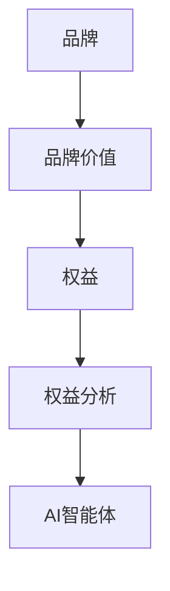
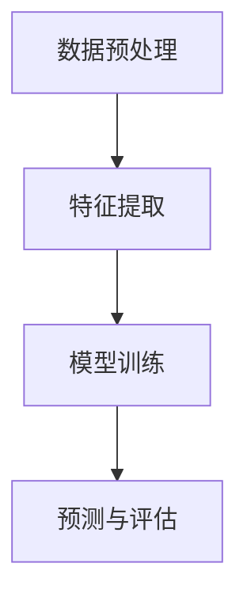
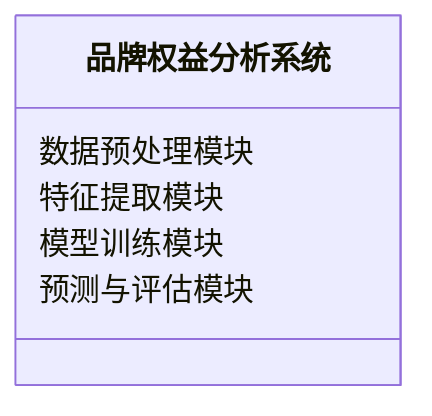
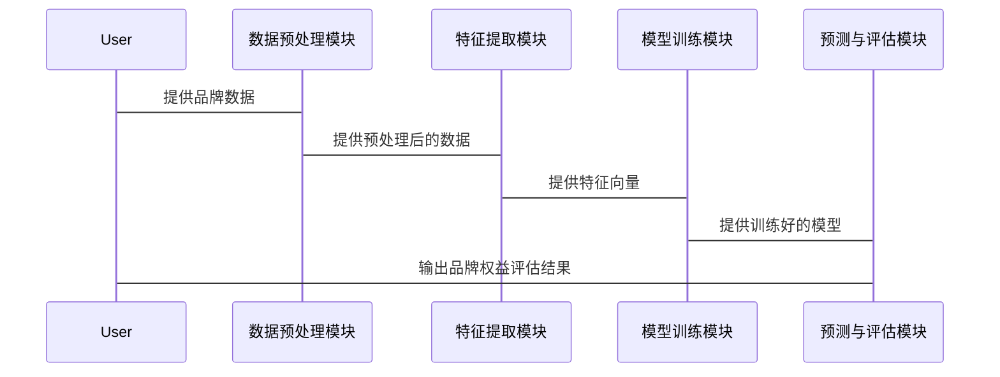

                 


# 价值投资中的AI智能体品牌权益分析系统

> 关键词：价值投资，AI智能体，品牌权益，数据分析，机器学习，投资策略

> 摘要：本文将介绍如何利用AI智能体进行品牌权益分析，帮助投资者在价值投资中做出更明智的决策。通过详细讲解品牌权益的定义、AI智能体的构建与训练、数学模型的建立与应用，以及系统架构的设计与实现，本文将为读者提供一套完整的品牌权益分析系统解决方案。文章内容涵盖从理论到实践的全过程，包括环境安装、代码实现、案例分析和最佳实践等内容，帮助读者快速掌握AI智能体在价值投资中的应用方法。

---

## 第1章 背景介绍

### 1.1 问题背景

#### 1.1.1 品牌价值与权益分析的重要性
品牌价值是企业核心竞争力的体现，而品牌权益则是品牌价值的重要组成部分。在价值投资中，品牌权益的评估是判断企业长期发展潜力的关键因素之一。

#### 1.1.2 当前品牌权益分析的痛点
传统品牌权益分析方法依赖人工经验，存在主观性强、效率低、成本高等问题，难以满足现代价值投资中对高效、精准分析的需求。

#### 1.1.3 AI技术在品牌权益分析中的应用潜力
AI技术可以通过大数据分析和机器学习算法，快速提取品牌权益相关特征，建立数学模型，实现品牌权益的自动化评估和预测。

### 1.2 问题描述

#### 1.2.1 品牌权益的定义与构成
品牌权益包括品牌知名度、品牌忠诚度、品牌认知度等多个维度，是品牌在市场中的综合价值表现。

#### 1.2.2 价值投资中的品牌权益分析需求
投资者需要通过品牌权益分析，评估企业的市场竞争力和长期发展潜力，从而做出更精准的投资决策。

#### 1.2.3 当前品牌权益分析的局限性
传统方法依赖人工经验，数据量大、维度多时难以处理，且结果可能存在偏差。

### 1.3 问题解决

#### 1.3.1 AI智能体在品牌权益分析中的作用
AI智能体可以通过数据挖掘、特征提取和模型训练，自动分析品牌权益的多维度特征，提供客观、精准的评估结果。

#### 1.3.2 数据驱动的品牌权益评估方法
通过收集和分析海量数据，利用机器学习算法建立品牌权益评估模型，实现品牌权益的自动化评估和预测。

#### 1.3.3 价值投资中的品牌权益分析目标
通过AI智能体的品牌权益分析系统，投资者可以快速获取品牌权益的评估结果，辅助投资决策。

### 1.4 边界与外延

#### 1.4.1 品牌权益分析的边界条件
- 数据来源的限制：品牌权益分析依赖于数据的完整性和准确性。
- 分析范围的限制：主要关注品牌在市场中的表现，不涉及企业的内部运营。

#### 1.4.2 与相关领域的区别与联系
- 与企业价值评估的区别：品牌权益分析更关注品牌的市场表现，而企业价值评估更全面。
- 与财务分析的联系：品牌权益分析可以结合财务数据，提供更全面的企业评估结果。

#### 1.4.3 价值投资中的品牌权益分析的外延
- 应用场景：品牌价值评估、投资决策支持、市场趋势预测。
- 发展方向：结合更多数据源，优化模型，提升分析精度。

### 1.5 核心要素组成

#### 1.5.1 数据来源与处理
- 数据来源：社交媒体数据、新闻数据、销售数据、行业报告等。
- 数据预处理：清洗、特征提取、数据标准化。

#### 1.5.2 智能体的构建与训练
- 智能体的功能：数据采集、特征提取、模型训练、结果输出。
- 智能体的训练数据：品牌相关的多维度数据。

#### 1.5.3 价值评估模型的设计
- 模型输入：品牌相关特征。
- 模型输出：品牌权益评估结果。

---

## 第2章 核心概念与联系

### 2.1 核心概念原理

#### 2.1.1 品牌价值的定义与计算
品牌价值是品牌在市场中的综合价值表现，可以通过多种方法进行评估，如品牌资产模型、市场比较法等。

#### 2.1.2 权益分析的数学模型
权益分析是通过数学模型对品牌权益进行量化评估的过程，常用的模型包括回归分析、聚类分析等。

#### 2.1.3 AI智能体的学习机制
AI智能体通过机器学习算法，从海量数据中提取特征，建立数学模型，实现品牌权益的自动化评估。

### 2.2 概念属性特征对比

#### 2.2.1 品牌价值与企业价值的对比
| 维度       | 品牌价值       | 企业价值       |
|------------|----------------|----------------|
| 定义       | 品牌在市场中的综合价值表现。 | 企业的整体市场价值，包括品牌价值、资产价值等。 |
| 评估方法   | 品牌资产模型、市场比较法。 | 股权价值、企业价值倍数法。 |
| 用途       | 品牌管理、投资决策。 | 企业估值、并购决策。 |

#### 2.2.2 权益分析与财务分析的对比
| 维度       | 权益分析       | 财务分析       |
|------------|----------------|----------------|
| 定义       | 品牌权益的量化评估。 | 企业的财务状况分析。 |
| 数据来源   | 品牌相关数据。 | 财务报表数据。 |
| 方法       | 机器学习模型。 | 财务指标分析。 |

#### 2.2.3 AI智能体与其他分析工具的对比
| 维度       | AI智能体       | 传统分析工具   |
|------------|----------------|----------------|
| 数据处理   | 支持海量数据，自动化处理。 | 数据量有限，人工处理为主。 |
| 分析速度   | 高效快速。 | 较慢。 |
| 分析精度   | 高，基于大数据和机器学习模型。 | 依赖人工经验，精度可能有限。 |

### 2.3 ER实体关系图



---

## 第3章 算法原理讲解

### 3.1 算法流程图



### 3.2 算法实现代码

```python
import numpy as np
import pandas as pd
from sklearn.model import LinearRegression

# 数据预处理
data = pd.read_csv('brand_data.csv')
X = data[['feature1', 'feature2', 'feature3']]
y = data['brand_value']

# 特征提取
X_encoded = pd.get_dummies(X)

# 模型训练
model = LinearRegression()
model.fit(X_encoded, y)

# 预测与评估
predicted = model.predict(X_encoded)
print('预测结果:', predicted)
```

### 3.3 数学模型

品牌权益评估模型可以表示为：

$$ \text{Brand Value} = \beta_0 + \beta_1 x_1 + \beta_2 x_2 + \dots + \beta_n x_n + \epsilon $$

其中，$x_i$ 是品牌相关的特征，$\beta_i$ 是回归系数，$\epsilon$ 是误差项。

---

## 第4章 数学模型与公式

### 4.1 品牌权益评估模型

品牌权益的评估公式可以表示为：

$$ \text{Brand Equity} = \sum_{i=1}^{n} w_i \cdot x_i $$

其中，$w_i$ 是特征 $x_i$ 的权重，$x_i$ 是品牌相关的特征。

### 4.2 回归分析模型

线性回归模型用于品牌权益预测：

$$ y = \beta_0 + \beta_1 x_1 + \beta_2 x_2 + \dots + \beta_k x_k + \epsilon $$

---

## 第5章 系统分析与架构设计

### 5.1 问题场景介绍

系统需要实现品牌权益的自动化分析，支持投资者进行价值投资决策。

### 5.2 系统功能设计

#### 5.2.1 领域模型



### 5.3 系统架构设计


### 5.4 系统接口设计

- 输入接口：品牌相关数据。
- 输出接口：品牌权益评估结果。

### 5.5 系统交互流程



---

## 第6章 项目实战

### 6.1 环境安装

安装所需的Python库：

```bash
pip install numpy pandas scikit-learn mermaid
```

### 6.2 系统核心实现

```python
import numpy as np
import pandas as pd
from sklearn.model import LinearRegression

# 数据预处理
data = pd.read_csv('brand_data.csv')
X = data[['feature1', 'feature2', 'feature3']]
y = data['brand_value']

# 特征提取
X_encoded = pd.get_dummies(X)

# 模型训练
model = LinearRegression()
model.fit(X_encoded, y)

# 预测与评估
predicted = model.predict(X_encoded)
print('预测结果:', predicted)
```

### 6.3 案例分析

假设我们有以下数据：

| feature1 | feature2 | feature3 | brand_value |
|----------|----------|----------|-------------|
| 1        | A        | High     | 100         |
| 2        | B        | Medium   | 150         |
| 3        | C        | Low      | 200         |

训练模型后，预测新的品牌价值：

```python
new_data = pd.DataFrame({'feature1': [4], 'feature2': ['D'], 'feature3': ['High']})
new_data_encoded = pd.get_dummies(new_data)
predicted_value = model.predict(new_data_encoded)
print('预测品牌价值:', predicted_value[0])
```

---

## 第7章 最佳实践

### 7.1 小结

本文详细介绍了如何利用AI智能体进行品牌权益分析，为投资者提供了高效、精准的分析工具。

### 7.2 注意事项

- 数据的准确性和完整性对模型性能影响较大。
- 模型的可解释性可能较弱，需要结合业务知识进行解释。
- 定期更新模型，以适应市场变化。

### 7.3 拓展阅读

- 《机器学习实战》
- 《数据挖掘导论》
- 《投资学原理》

---

## 结语

通过本文的介绍，读者可以了解到如何利用AI技术进行品牌权益分析，为价值投资提供有力支持。未来，随着技术的不断发展，AI智能体在品牌权益分析中的应用将更加广泛和深入。

