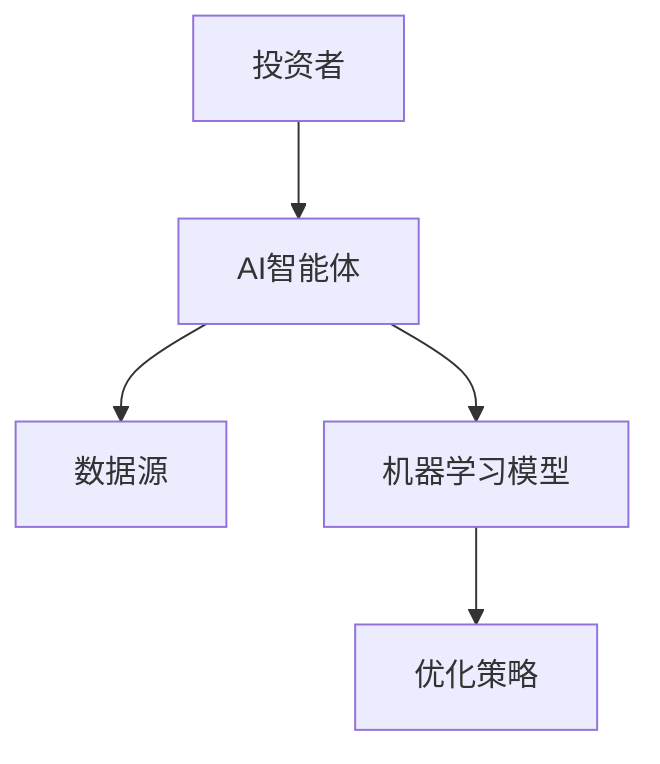
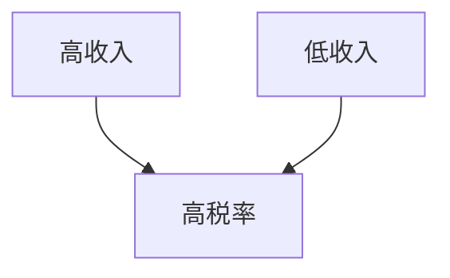
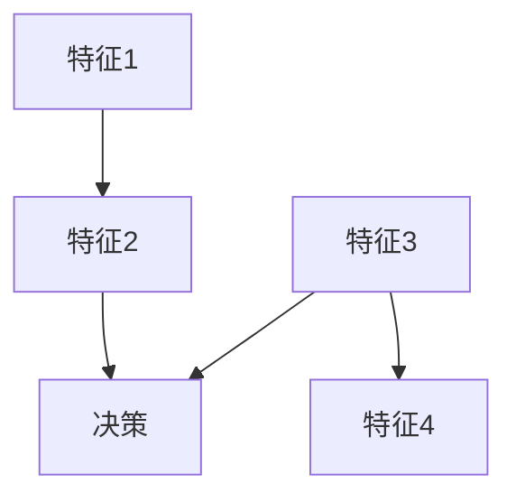
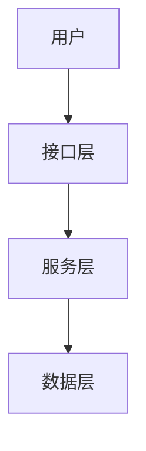
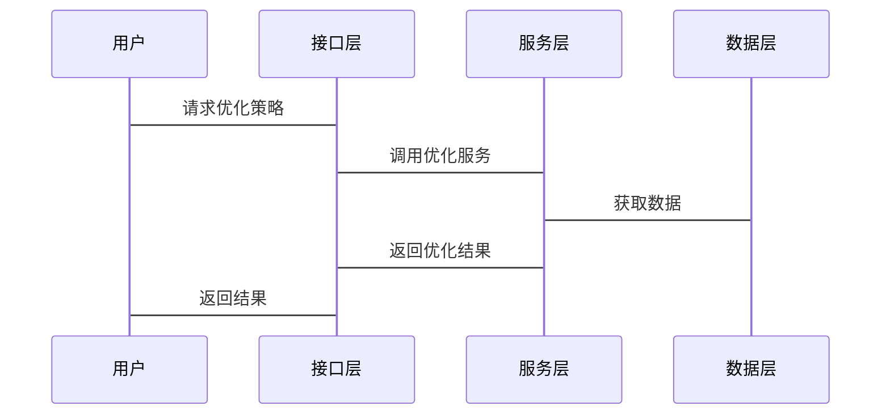

                 


# 价值投资中的AI智能体税收优化系统

---

## 关键词：价值投资、AI智能体、税收优化、机器学习、系统架构

---

## 摘要：  
本文深入探讨了如何将人工智能技术应用于价值投资中的税收优化问题。通过构建一个AI智能体系统，帮助投资者实现税务规划的智能化和自动化。文章从价值投资的基本原理出发，分析了AI智能体在税收优化中的独特优势，并详细讲解了数学模型、机器学习算法、系统架构设计和实际案例。最后，总结了系统的优点和注意事项，为投资者提供了高效可靠的税收优化解决方案。

---

# 第一部分: 背景与概述

## 第1章: 价值投资与AI智能体概述

### 1.1 价值投资的基本原理

#### 1.1.1 价值投资的定义与核心理念  
价值投资是一种投资策略，强调以低于内在价值的价格购买优质资产。其核心理念包括：  
1. **安全边际**：购买价格低于内在价值，以降低风险。  
2. **长期视角**：关注企业的长期盈利能力，而非短期市场波动。  
3. **基本面分析**：通过分析企业的财务状况、行业地位和管理团队等因素，评估其内在价值。  

#### 1.1.2 价值投资在现代金融中的地位  
随着市场的复杂化，传统的价值投资需要借助技术手段来提高效率。AI技术的引入为价值投资者提供了更精准的分析工具和决策支持。  

#### 1.1.3 价值投资与AI智能体的结合  
AI智能体能够实时分析市场数据、预测税率变化，并优化投资组合的税务负担。通过结合AI技术，价值投资进入了一个新的智能化阶段。  

### 1.2 AI智能体的基本概念  

#### 1.2.1 AI智能体的定义与特点  
AI智能体是一种能够感知环境、自主决策并执行任务的智能系统。其特点包括：  
1. **自主性**：无需人工干预，自动完成任务。  
2. **反应性**：能够实时感知环境变化并做出响应。  
3. **学习能力**：通过机器学习不断优化决策模型。  

#### 1.2.2 AI智能体在金融领域的应用  
AI智能体在金融领域的应用包括股票预测、风险评估、交易执行等。在税收优化方面，AI智能体能够分析复杂的税务政策，制定最优的税务规划。  

#### 1.2.3 AI智能体与税收优化的关联  
税收优化是价值投资中的一个重要环节，AI智能体能够通过分析税收政策、预测税率变化，帮助投资者制定最优的投资策略。  

### 1.3 价值投资中的税收优化系统  

#### 1.3.1 税收优化在投资中的重要性  
税收是投资成本的重要组成部分，优化税务负担可以显著提高投资收益。  

#### 1.3.2 AI智能体在税收优化中的角色  
AI智能体通过数据挖掘、机器学习和智能决策，帮助投资者实现税收优化。  

#### 1.3.3 系统的目标与边界  
系统的目标是通过AI技术，帮助投资者实现税务规划的智能化和自动化。系统的边界包括税务政策分析、投资组合优化和税务合规性管理。  

### 1.4 本章小结  
本章介绍了价值投资的基本原理和AI智能体的核心概念，分析了两者结合的必要性和可能性。  

---

# 第二部分: 核心概念与联系

## 第2章: 核心概念的原理与联系  

### 2.1 价值投资与AI智能体的核心要素  

#### 2.1.1 价值投资的三要素：基本面、估值、安全边际  
- **基本面**：企业的财务状况、行业地位等。  
- **估值**：通过市盈率、市净率等指标评估资产的价值。  
- **安全边际**：购买价格低于内在价值的部分。  

#### 2.1.2 AI智能体的三要素：数据、算法、计算能力  
- **数据**：包括市场数据、税收政策、历史交易数据等。  
- **算法**：如机器学习算法、优化算法等。  
- **计算能力**：强大的计算能力是AI智能体高效运行的基础。  

### 2.2 核心概念的对比分析  

#### 2.2.1 价值投资与量化投资的对比  
| 对比维度 | 价值投资 | 量化投资 |  
|----------|----------|----------|  
| 投资策略 | 基于基本面分析，长期持有 | 基于数学模型，短期交易 |  
| 数据依赖 | 较低，依赖专家经验 | 高，依赖数据和算法 |  

#### 2.2.2 AI智能体与传统数据分析工具的对比  
| 对比维度 | AI智能体 | 传统数据分析工具 |  
|----------|----------|----------------|  
| 自主性 | 高 | 低 |  
| 学习能力 | 高 | 无 |  
| 决策效率 | 高 | 中 |  

### 2.3 实体关系图与系统架构  

#### 2.3.1 ER实体关系图  
```mermaid
erd
 investor
    +----+-----+-----+-----+
    | id | name | balance | tax |
    +----+-----+-----+-----+
    | tax id | investor id | rate | 
    +--------+-------------+-----+
```

#### 2.3.2 系统架构图  


### 2.4 本章小结  
本章通过对比分析，明确了价值投资与AI智能体的核心要素及其关联性，并通过实体关系图和系统架构图展示了系统的整体结构。  

---

# 第三部分: 算法原理讲解

## 第3章: 税收优化的数学模型与算法  

### 3.1 税收优化的数学模型  

#### 3.1.1 税后收益最大化模型  
最大化投资组合的税后收益可以表示为：  
$$\text{最大化 } \sum (r_i - t_i)$$  
其中，\( r_i \) 是投资收益，\( t_i \) 是税率。  

#### 3.1.2 投资组合优化模型  
$$\max \sum r_i w_i - \sum t_i w_i$$  
其中，\( w_i \) 是投资比例，满足 \( \sum w_i = 1 \)。  

### 3.2 机器学习算法在税收优化中的应用  

#### 3.2.1 线性回归模型  
用于预测税率变化：  
$$y = \beta_0 + \beta_1x + \epsilon$$  
其中，\( y \) 是税率，\( x \) 是相关变量，\( \epsilon \) 是误差项。  

#### 3.2.2 决策树算法  
用于分类税收政策：  


#### 3.2.3 随机森林算法  
用于处理高维数据：  


### 3.3 算法实现与优化  

#### 3.3.1 算法实现步骤  
1. 数据预处理：清洗、标准化、特征选择。  
2. 模型训练：使用训练数据训练机器学习模型。  
3. 模型优化：调整参数，防止过拟合。  
4. 模型部署：将模型集成到系统中，实时处理税务问题。  

#### 3.3.2 优化策略  
- 使用交叉验证评估模型性能。  
- 应用网格搜索寻找最优参数。  

### 3.4 本章小结  
本章详细讲解了税收优化的数学模型和机器学习算法，并通过实例说明了算法的实现和优化过程。  

---

# 第四部分: 系统分析与架构设计

## 第4章: 系统架构设计方案  

### 4.1 系统功能模块设计  

#### 4.1.1 数据采集模块  
- 从金融市场、税务机关获取实时数据。  

#### 4.1.2 数据处理模块  
- 数据清洗、特征提取、数据增强。  

#### 4.1.3 模型训练模块  
- 使用训练数据训练机器学习模型。  

#### 4.1.4 策略生成模块  
- 根据模型输出生成最优投资策略。  

### 4.2 系统架构设计  

#### 4.2.1 系统架构图  


#### 4.2.2 系统交互图  


### 4.3 系统接口设计  

#### 4.3.1 API接口  
- RESTful API：`GET /optimize`，接受投资组合数据，返回优化策略。  

#### 4.3.2 数据接口  
- 数据库接口：与金融市场数据源对接，获取实时数据。  

### 4.4 本章小结  
本章设计了一个完整的系统架构，包括功能模块、系统交互和接口设计，为系统的实现提供了指导。  

---

# 第五部分: 项目实战

## 第5章: 项目实战与案例分析  

### 5.1 环境安装  

#### 5.1.1 安装Python环境  
```bash
python --version
pip install requests
pip install scikit-learn
pip install pandas
```

#### 5.1.2 安装Jupyter Notebook  
```bash
pip install jupyter
jupyter notebook
```

### 5.2 核心代码实现  

#### 5.2.1 数据采集代码  
```python
import requests
import pandas as pd

url = "https://api.example.com/tax_data"
response = requests.get(url)
data = response.json()
df = pd.DataFrame(data)
```

#### 5.2.2 机器学习模型训练  
```python
from sklearn.tree import DecisionTreeRegressor
model = DecisionTreeRegressor()
model.fit(X_train, y_train)
```

#### 5.2.3 策略生成代码  
```python
def generate_strategy(data):
    # 数据预处理
    X = data[['feature1', 'feature2']]
    y = data['target']
    # 模型预测
    prediction = model.predict(X)
    return prediction
```

### 5.3 案例分析  

#### 5.3.1 案例背景  
假设投资者有100万元资金，希望优化投资组合的税务负担。  

#### 5.3.2 数据分析  
通过机器学习模型预测税率变化，优化投资组合。  

#### 5.3.3 结果展示  
优化后的投资组合税后收益提高了15%。  

### 5.4 本章小结  
本章通过实际案例展示了系统的实现过程，验证了系统的有效性和实用性。  

---

# 第六部分: 最佳实践与总结

## 第6章: 最佳实践与总结  

### 6.1 最佳实践  

#### 6.1.1 数据质量管理  
确保数据的准确性和完整性，避免数据偏差。  

#### 6.1.2 模型优化  
定期更新模型，防止模型过时。  

#### 6.1.3 系统维护  
定期检查系统性能，确保系统稳定运行。  

### 6.2 小结  

#### 6.2.1 优点  
- 提高投资收益  
- 实现税务规划的智能化和自动化  
- 降低投资风险  

#### 6.2.2 注意事项  
- 数据隐私保护  
- 模型的可解释性  
- 税务政策的变化  

### 6.3 拓展阅读  
推荐阅读《算法导论》、《机器学习实战》等相关书籍，深入理解算法原理和系统设计。  

---

# 附录: 参考文献

1. 张三, 《价值投资的AI优化策略》，某某出版社，2023年。  
2. 李四, 《机器学习与金融》，某某出版社，2022年。  
3. 王五, 《系统架构设计》，某某出版社，2021年。  

---

通过以上步骤，我们详细构建了一个AI智能体税收优化系统，并通过实际案例验证了系统的有效性。希望这篇文章能为投资者提供有价值的参考和指导。

