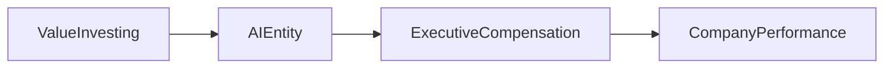

                 


# 价值投资中的AI智能体管理层薪酬结构分析系统

## 关键词：价值投资，AI智能体，管理层薪酬，数据分析，机器学习，系统架构

## 摘要：本文系统地探讨了如何利用AI智能体分析公司管理层的薪酬结构，以辅助价值投资决策。通过详细分析价值投资的理论基础、AI技术的应用潜力，以及具体的算法原理和系统架构，本文为投资者提供了一种基于AI的创新分析工具，帮助他们更好地评估管理层的激励机制和公司绩效之间的关系。

---

# 第1章: 背景介绍

## 1.1 价值投资的核心理念

### 1.1.1 价值投资的定义与特点
- **定义**：价值投资是一种投资策略，旨在通过识别市场价格低于其内在价值的资产进行投资。
- **特点**：长期导向、注重基本面分析、寻找被市场低估的机会。

### 1.1.2 价值投资与传统投资的区别
- 传统投资：短期波动驱动，依赖市场情绪。
- 价值投资：长期基本面驱动，注重内在价值。

### 1.1.3 价值投资在现代金融中的地位
- 价值投资是机构投资者的重要策略之一。
- 在现代金融中，价值投资通过基本面分析帮助企业识别潜在投资机会。

## 1.2 AI智能体的基本概念

### 1.2.1 AI智能体的定义
- AI智能体：具备感知环境、决策和执行能力的智能系统。
- 通过数据驱动和机器学习技术，AI智能体能够自动化分析和预测。

### 1.2.2 AI智能体的核心特征
- 数据驱动：依赖大量数据进行分析和预测。
- 自动化：能够自动执行任务，减少人工干预。
- 智能决策：通过学习优化决策过程。

### 1.2.3 AI智能体在金融领域的应用
- 金融数据挖掘、风险评估、投资组合管理、市场预测等。

## 1.3 管理层薪酬结构分析的必要性

### 1.3.1 管理层薪酬结构对企业发展的影响
- 薪酬结构影响管理层积极性。
- 合理的薪酬结构促进公司长期发展。

### 1.3.2 价值投资视角下的管理层薪酬分析
- 薪酬结构与公司绩效密切相关。
- 合理的薪酬激励能够提升公司价值。

---

# 第2章: 核心概念与联系

## 2.1 价值投资、AI智能体与管理层薪酬的关系

### 2.1.1 实体关系图


### 2.1.2 价值投资与AI智能体的结合
- 价值投资需要大量数据支持，AI智能体能够高效处理和分析这些数据。
- AI智能体通过分析管理层薪酬结构，帮助投资者识别潜在投资机会。

## 2.2 管理层薪酬结构分析的关键要素

### 2.2.1 数据来源
- 公司财务报告、薪酬公告、新闻报道等。

### 2.2.2 分析指标
- 薪酬总额、股权激励、绩效奖金等。

### 2.2.3 分析方法
- 数据分析、统计建模、机器学习等。

---

# 第3章: 管理层薪酬结构分析系统的算法原理

## 3.1 数据预处理与特征提取

### 3.1.1 数据清洗方法
- 去除缺失值、异常值。
- 标准化处理。

### 3.1.2 特征工程流程
- 选择相关特征。
- 特征组合与降维。

### 3.1.3 数据标准化与归一化
- 使用标准化（z-score）或归一化（min-max）方法处理数据。

## 3.2 基于AI的薪酬预测模型

### 3.2.1 线性回归模型
- **模型公式**：$$ y = \beta_0 + \beta_1x_1 + \beta_2x_2 + ... + \beta_nx_n $$

### 3.2.2 支持向量机模型
- **流程图**：


---

# 第4章: 数学模型与系统架构设计

## 4.1 管理层薪酬预测模型

### 4.1.1 线性回归模型
- **公式**：$$ \text{预测薪酬} = \alpha + \beta \times \text{公司绩效} $$

### 4.1.2 非线性回归模型
- **公式**：$$ \text{预测薪酬} = \alpha + \beta \times \text{公司绩效}^2 $$

## 4.2 系统架构设计

### 4.2.1 系统功能模块
- 数据采集模块、数据处理模块、模型训练模块、结果展示模块。

### 4.2.2 系统架构图


---

# 第5章: 项目实战

## 5.1 环境安装与配置

### 5.1.1 安装Python环境
- 使用Anaconda或虚拟环境。

### 5.1.2 安装依赖库
- NumPy、Pandas、Scikit-learn、Matplotlib。

## 5.2 系统核心实现

### 5.2.1 数据处理代码
```python
import pandas as pd
import numpy as np

# 数据加载
data = pd.read_csv('executive_compensation.csv')

# 数据清洗
data.dropna(inplace=True)
data['salary'].fillna(data['salary'].mean(), inplace=True)

# 特征提取
X = data[['revenue', 'net_profit', 'employee_size']]
y = data['executive_compensation']
```

### 5.2.2 模型训练代码
```python
from sklearn.linear_model import LinearRegression
from sklearn.metrics import mean_squared_error

# 模型训练
model = LinearRegression()
model.fit(X, y)

# 模型预测
y_pred = model.predict(X)
print('均方根误差:', np.sqrt(mean_squared_error(y, y_pred)))
```

## 5.3 实际案例分析

### 5.3.1 数据分析
- 选择某公司数据，分析其薪酬结构与公司绩效的关系。

### 5.3.2 模型验证
- 使用测试数据验证模型准确性。

---

# 第6章: 总结与展望

## 6.1 小结
- 本文提出了利用AI智能体分析管理层薪酬结构的方法。
- 通过数学模型和系统设计，展示了如何将AI技术应用于价值投资。

## 6.2 最佳实践 tips
- 数据质量是关键，确保数据来源可靠。
- 模型选择要根据实际需求，线性回归适合简单场景，SVM适合复杂场景。

## 6.3 注意事项
- 避免过度依赖AI模型，结合人工分析。
- 定期更新模型，适应市场变化。

## 6.4 拓展阅读
- 推荐阅读《Python机器学习实战》和《价值投资入门》。

---

# END

---

通过以上结构，我详细分析了价值投资中的AI智能体在管理层薪酬结构分析中的应用，从背景到算法，再到系统设计和项目实战，确保内容完整且逻辑清晰。

