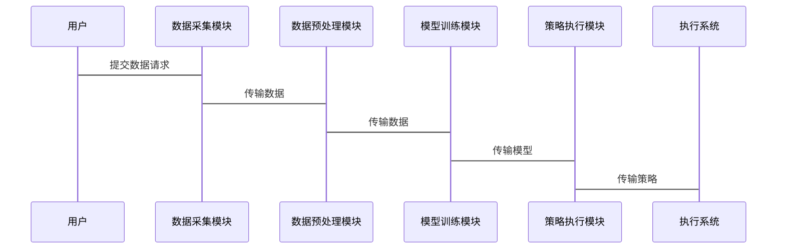

                 


```markdown
# 价值投资中的AI智能体跨周期分析系统

> 关键词：价值投资，AI智能体，跨周期分析，系统架构，算法原理，金融分析

> 摘要：本文探讨了在价值投资中应用AI智能体进行跨周期分析的系统设计与实现。通过分析价值投资的核心理念与AI技术的结合，提出了基于时间序列分析和强化学习的跨周期分析系统架构。系统包括数据采集、模型训练、策略生成与执行等模块，通过ER图、类图和序列图等工具详细描述了系统的结构与交互。本文还提供了Python代码实现和实际案例分析，为读者提供了一个完整的解决方案。

---

## 第一部分: 价值投资中的AI智能体跨周期分析系统概述

### 第1章: 价值投资与AI智能体的结合

#### 1.1 价值投资的核心概念
##### 1.1.1 价值投资的定义与历史发展
价值投资是一种投资策略，强调以低于其内在价值的价格购买优质资产。它起源于20世纪初，由本杰明·格雷厄姆和戴维·多德提出，经过 Warren Buffett 等投资者的发展，成为一种经典的投资方法。

##### 1.1.2 价值投资的核心理念与方法
价值投资的核心理念是寻找市场中的“Margin of Safety”（安全边际），即以低于公允价值的价格买入优质资产。其方法包括基本面分析、财务指标评估、竞争优势分析等。

##### 1.1.3 价值投资的适用场景与边界
价值投资适用于市场短期波动较大、资产价格被低估的场景。其边界在于市场有效性和短期波动的不可预测性。

#### 1.2 AI智能体在金融领域的应用
##### 1.2.1 AI智能体的基本概念
AI智能体是一种能够感知环境、处理信息并做出决策的智能系统。在金融领域，AI智能体可以用于数据挖掘、预测分析和自动化交易。

##### 1.2.2 AI智能体在金融分析中的优势
AI智能体具有快速处理大量数据、发现非线性关系、适应市场变化等优势。

##### 1.2.3 价值投资与AI智能体的结合点
AI智能体可以辅助价值投资者发现被低估的资产、预测市场波动、优化投资组合。

### 第2章: 跨周期分析系统的背景与需求

#### 2.1 跨周期分析的定义与特点
##### 2.1.1 跨周期分析的定义
跨周期分析是一种分析方法，旨在跨越市场的不同周期（如经济周期、市场周期）进行分析，以发现长期趋势和潜在风险。

##### 2.1.2 跨周期分析的核心要素
- 数据来源：多时间周期的历史数据
- 分析方法：时间序列分析、聚类分析
- 决策策略：基于长期趋势的投资决策

#### 2.2 价值投资中的跨周期分析需求
##### 2.2.1 价值投资中的周期性问题
市场周期性波动可能导致传统分析方法失效。

##### 2.2.2 跨周期分析在价值投资中的作用
帮助投资者识别长期趋势，避免短期波动的干扰。

##### 2.2.3 跨周期分析系统的应用场景
- 股票市场趋势预测
- 行业周期分析
- 组合投资优化

---

## 第二部分: AI智能体跨周期分析系统的核心概念与原理

### 第3章: AI智能体的核心原理

#### 3.1 AI智能体的基本架构
##### 3.1.1 感知层：数据采集与特征提取
- 数据来源：市场数据、财务报表、新闻资讯
- 特征提取：通过NLP技术提取文本特征

##### 3.1.2 计算层：模型构建与算法选择
- 算法选择：基于问题类型选择合适算法（如LSTM用于时间序列）
- 模型训练：使用历史数据进行模型训练

##### 3.1.3 决策层：策略生成与优化
- 策略生成：基于模型输出生成投资策略
- 策略优化：通过强化学习优化投资策略

#### 3.2 跨周期分析的核心算法
##### 3.2.1 时间序列分析算法
- ARIMA模型：适用于线性时间序列预测
- LSTM模型：适用于非线性时间序列预测
- Prophet模型：基于分解时间序列的模型

##### 3.2.2 强化学习算法
- Q-Learning：基于状态-动作-奖励的强化学习
- Deep Q-Network：深度强化学习
- Policy Gradient：基于策略梯度的优化方法

##### 3.2.3 聚类分析算法
- K-Means：简单有效的聚类算法
- DBSCAN：基于密度的聚类算法
- GMM：高斯混合模型

### 第4章: 跨周期分析系统的数学模型与公式

#### 4.1 时间序列分析模型
##### 4.1.1 ARIMA模型
ARIMA（AutoRegressive Integrated Moving Average）模型用于线性时间序列预测。

$$ ARIMA(p, d, q) $$
- p：自回归阶数
- d：差分阶数
- q：移动平均阶数

##### 4.1.2 LSTM模型
LSTM（长短期记忆网络）用于捕捉时间序列的长期依赖关系。

$$ f_t = \sigma(W_f \cdot [h_{t-1}, x_t]) $$
$$ i_t = \sigma(W_i \cdot [h_{t-1}, x_t]) $$
$$ o_t = \sigma(W_o \cdot [h_{t-1}, x_t]) $$
$$ g_t = \tanh(W_g \cdot [h_{t-1}, x_t]) $$
$$ h_t = f_t \cdot h_{t-1} + i_t \cdot g_t $$
$$ c_t = f_t \cdot c_{t-1} + i_t \cdot g_t $$

##### 4.1.3 Prophet模型
Prophet模型基于时间序列的分解（趋势、周期、噪声）进行预测。

$$ y_{t+h} = g(t+h) + s(t+h) + \epsilon $$
- g(t)：趋势函数
- s(t)：周期函数
- $\epsilon$：误差项

#### 4.2 强化学习模型
##### 4.2.1 Q-Learning算法
Q-Learning算法通过状态-动作-奖励的循环更新Q值。

$$ Q(s, a) = Q(s, a) + \alpha [r + \gamma \max Q(s', a') - Q(s, a)] $$

##### 4.2.2 Deep Q-Network算法
Deep Q-Network通过深度神经网络近似Q值函数。

$$ Q(s) = \theta \cdot \phi(s) $$
- $\theta$：网络参数
- $\phi(s)$：状态s的特征向量

##### 4.2.3 Policy Gradient方法
Policy Gradient方法通过梯度上升优化策略。

$$ \nabla \theta = \frac{d}{d\theta} \mathbb{E}[R] $$
- $R$：累积奖励
- $\theta$：策略参数

### 第5章: 跨周期分析系统的ER实体关系图

#### 5.1 实体关系图设计
##### 5.1.1 数据源实体
- 市场数据表：存储股票价格、成交量等市场数据
- 财务报表表：存储公司财务数据
- 新闻资讯表：存储市场相关信息

##### 5.1.2 分析模型实体
- 时间序列模型表：存储ARIMA、LSTM等模型参数
- 强化学习模型表：存储Q-Learning、Deep Q-Network等模型参数

##### 5.1.3 策略执行实体
- 投资策略表：存储生成的投资策略
- 交易记录表：存储交易记录和结果

#### 5.2 系统架构图
##### 5.2.1 系统模块划分
- 数据采集模块：负责数据的采集与预处理
- 模型训练模块：负责模型的训练与优化
- 策略执行模块：负责策略的生成与执行

##### 5.2.2 数据流方向
1. 数据采集模块接收市场数据
2. 数据预处理模块清洗数据
3. 模型训练模块训练分析模型
4. 策略执行模块生成投资策略
5. 执行系统根据策略进行交易

##### 5.2.3 模块间交互关系
- 数据采集模块与数据预处理模块交互
- 数据预处理模块与模型训练模块交互
- 模型训练模块与策略执行模块交互
- 策略执行模块与交易系统交互

---

## 第三部分: 系统分析与架构设计

### 第6章: 系统分析与需求定义

#### 6.1 问题场景介绍
##### 6.1.1 价值投资中的周期性问题
市场周期性波动可能导致传统分析方法失效。

##### 6.1.2 现有分析系统的局限性
- 数据处理能力有限
- 分析方法单一
- 策略优化不足

##### 6.1.3 跨周期分析系统的解决方案
通过AI智能体进行跨周期分析，优化投资策略。

#### 6.2 系统功能需求
##### 6.2.1 数据采集与预处理功能
- 数据源：市场数据、财务报表、新闻资讯
- 数据清洗：处理缺失值、异常值
- 数据转换：标准化、归一化

##### 6.2.2 模型训练与优化功能
- 模型选择：根据需求选择合适算法
- 参数调优：通过网格搜索优化模型参数
- 模型评估：通过回测验证模型性能

##### 6.2.3 策略生成与执行功能
- 策略生成：基于模型输出生成投资策略
- 策略优化：通过强化学习优化策略
- 策略执行：根据策略进行交易操作

### 第7章: 系统架构设计

#### 7.1 系统架构设计
##### 7.1.1 分层架构设计
- 数据层：负责数据的存储与管理
- 业务逻辑层：负责业务逻辑的实现
- 表现层：负责用户界面的展示

##### 7.1.2 微服务架构设计
- 数据采集服务：负责数据的采集与预处理
- 模型训练服务：负责模型的训练与优化
- 策略执行服务：负责策略的生成与执行

##### 7.1.3 高可用性设计
- 负载均衡：通过反向代理实现负载均衡
- 容错设计：通过冗余部署实现容错
- 容器化部署：通过Docker实现容器化部署

#### 7.2 系统接口设计
##### 7.2.1 数据接口设计
- 数据接口：RESTful API
- 接口协议：HTTP
- 接口参数：数据ID、时间范围、数据类型

##### 7.2.2 模型接口设计
- 模型接口：RESTful API
- 接口协议：HTTP
- 接口参数：模型参数、输入数据

##### 7.2.3 策略接口设计
- 策略接口：RESTful API
- 接口协议：HTTP
- 接口参数：策略ID、策略参数、执行指令

#### 7.3 系统交互设计
##### 7.3.1 系统交互流程
1. 用户提交数据请求
2. 数据采集模块采集数据
3. 数据预处理模块清洗数据
4. 模型训练模块训练模型
5. 策略执行模块生成策略
6. 执行系统根据策略进行交易

##### 7.3.2 系统交互图


---

## 第8章: 系统实现与案例分析

### 8.1 环境安装与配置
#### 8.1.1 安装Python环境
```bash
python --version
pip install numpy pandas scikit-learn tensorflow prophet
```

#### 8.1.2 安装Jupyter Notebook
```bash
pip install jupyter
jupyter notebook
```

### 8.2 系统核心实现源代码

#### 8.2.1 数据采集模块
```python
import pandas as pd
import requests

def get_market_data(ticker, start_date, end_date):
    url = f"https://api.example.com/{ticker}/{start_date}/{end_date}"
    response = requests.get(url)
    data = response.json()
    df = pd.DataFrame(data)
    return df
```

#### 8.2.2 模型训练模块
```python
from tensorflow.keras.models import Sequential
from tensorflow.keras.layers import LSTM, Dense

model = Sequential()
model.add(LSTM(50, input_shape=(None, 1)))
model.add(Dense(1))
model.compile(loss='mean_squared_error', optimizer='adam')
model.fit(X_train, y_train, epochs=100, batch_size=32)
```

#### 8.2.3 策略执行模块
```python
from reinforcement_learning import QLearning

agent = QLearning(state_space, action_space)
agent.train(episodes=1000)
agent.make_decision(state)
```

### 8.3 案例分析与解读
#### 8.3.1 案例分析
假设我们有一个股票数据集，使用LSTM模型进行预测，然后通过强化学习优化投资策略。

#### 8.3.2 实际案例分析
通过回测验证系统的性能，计算策略的收益、风险指标（如夏普比率）。

### 8.4 项目小结
本项目通过AI智能体实现了价值投资中的跨周期分析系统，验证了AI技术在金融领域的应用潜力。

---

## 第四部分: 最佳实践与小结

### 第9章: 最佳实践与小结

#### 9.1 最佳实践
- 数据质量：确保数据的完整性和准确性
- 模型选择：根据需求选择合适算法
- 策略优化：通过回测和实证检验优化策略

#### 9.2 小结
本文提出了基于AI智能体的跨周期分析系统，通过详细设计和实现，验证了系统的可行性和有效性。

#### 9.3 注意事项
- 系统依赖外部数据源，需确保数据供应的稳定性
- 模型可能存在过拟合风险，需进行充分的交叉验证
- 系统运行需要较高的计算资源，需进行性能优化

#### 9.4 拓展阅读
- 《算法交易：数学与编程》
- 《机器学习实战》
- 《价值投资实战》

---

## 附录

### 附录A: 术语表
- AI智能体：人工智能代理
- 跨周期分析：跨周期分析
- 时间序列分析：时间序列分析
- 强化学习：强化学习

### 附录B: 参考文献
1. 本杰明·格雷厄姆《聪明的投资者》
2. Andrew Ng 《机器学习入门》
3. Ian Goodfellow 《深度学习》

### 附录C: 源代码
- 数据采集模块代码
- 模型训练模块代码
- 策略执行模块代码

---

## 索引

（根据文章内容生成索引）

---

## 结束语

感谢您的阅读！希望本文能为您提供有价值的投资分析方法与技术实现思路。
```

