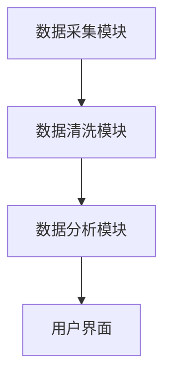

                 


# 价值投资中的AI驱动专利分析：多智能体系统的优势

## 关键词：价值投资、AI驱动、专利分析、多智能体系统、算法原理、系统架构、项目实战

## 摘要：  
在价值投资领域，AI驱动的专利分析正在成为一种新兴的趋势，通过多智能体系统的优势，投资者可以更高效地分析专利数据，评估企业技术实力和市场竞争力。本文将从多智能体系统的原理出发，详细探讨其在专利分析中的应用，结合实际案例分析，展示如何利用多智能体系统进行专利数据采集、清洗、分析、建模和可视化，最终为企业价值评估提供有力支持。

---

# 第1章: 价值投资与AI驱动专利分析概述

## 1.1 价值投资的基本概念  
### 1.1.1 价值投资的定义与核心理念  
价值投资是一种长期投资策略，强调以低于内在价值的价格购买优质资产。其核心理念包括：  
1. 市场短期波动不可预测，但长期趋势可分析。  
2. 投资者应关注企业的基本面，而非市场情绪。  
3. 安全边际是投资决策的重要考量。  

### 1.1.2 价值投资的三大核心要素  
1. **企业质量**：包括企业的盈利能力、财务状况、竞争优势等。  
2. **估值水平**：通过市盈率、市净率等指标评估企业价值是否被市场低估。  
3. **安全边际**：买入价格与内在价值的差距，以降低投资风险。  

### 1.1.3 价值投资在现代金融中的地位与作用  
价值投资不仅是传统投资的重要方法，更是AI技术在金融领域的应用之一。通过AI技术，投资者可以更高效地挖掘企业价值，发现潜在投资机会。

## 1.2 AI驱动专利分析的背景与意义  
### 1.2.1 专利分析的传统方法与局限性  
传统专利分析依赖人工检索和定性分析，存在效率低、覆盖面窄、数据量有限等问题。  

### 1.2.2 AI技术在专利分析中的应用优势  
AI技术可以快速处理海量专利数据，提取关键词、分析技术趋势、识别技术关联，从而提供更全面的分析结果。  

### 1.2.3 多智能体系统在专利分析中的独特价值  
多智能体系统能够通过分工协作，高效完成专利数据的清洗、分析和建模任务，提升专利分析的准确性和效率。

## 1.3 多智能体系统的基本概念与优势  
### 1.3.1 多智能体系统的定义与特点  
多智能体系统是由多个智能体组成的分布式系统，每个智能体具有独立性、自主性和协作性。  

### 1.3.2 多智能体系统的核心优势  
1. **分布式计算**：任务分解后由多个智能体协同完成，提升计算效率。  
2. **智能协作**：智能体之间可以共享信息，优化决策过程。  
3. **容错性**：单个智能体故障不影响整体系统运行。  

## 1.4 本章小结  
本章介绍了价值投资的基本概念、AI驱动专利分析的背景与意义，以及多智能体系统的核心优势，为后续章节的深入分析奠定了基础。

---

# 第2章: 多智能体系统与专利分析的核心概念  

## 2.1 多智能体系统的核心原理  
### 2.1.1 多智能体系统的组成结构  
多智能体系统由智能体、通信机制、协作任务和环境组成。  

### 2.1.2 各智能体的功能与角色  
1. 数据采集智能体：负责从专利数据库中提取数据。  
2. 数据清洗智能体：对专利数据进行预处理。  
3. 数据分析智能体：利用机器学习模型进行专利分析。  

### 2.1.3 智能体之间的通信与协作机制  
通过消息传递机制，智能体之间共享数据和结果，确保协作任务的完成。  

## 2.2 专利分析的核心要素与指标  
### 2.2.1 专利的基本要素分析  
1. 专利类型：发明专利、实用新型专利、外观设计专利。  
2. 专利申请人：企业或个人。  
3. 专利申请时间：专利的时间分布。  

### 2.2.2 专利质量评估的关键指标  
1. 专利数量：企业的专利申请数量。  
2. 专利引用次数：专利被引用的次数。  
3. 专利技术领域分布：专利的技术领域集中度。  

### 2.2.3 专利网络分析的特征与方法  
1. 专利网络分析：通过图论方法分析专利之间的关联性。  
2. 专利聚类分析：将相似的专利聚类，识别技术趋势。  

## 2.3 多智能体系统与专利分析的结合模型  
### 2.3.1 多智能体系统的功能模块划分  
1. 数据采集模块：负责采集专利数据。  
2. 数据清洗模块：对专利数据进行预处理。  
3. 数据分析模块：利用机器学习模型进行专利分析。  

### 2.3.2 专利分析任务的分解与分配  
1. 专利数据清洗任务：分配给数据清洗智能体。  
2. 专利数据分析任务：分配给数据分析智能体。  

### 2.3.3 系统整体架构的优化与设计  
通过模块化设计，确保系统各部分高效协作，提升整体性能。  

## 2.4 本章小结  
本章详细介绍了多智能体系统的核心原理，专利分析的核心要素与指标，以及多智能体系统与专利分析的结合模型，为后续章节的算法实现奠定了理论基础。

---

# 第3章: 多智能体系统协作机制的算法实现  

## 3.1 多智能体系统协作的基本原理  
### 3.1.1 协作任务的分解与分配  
通过任务分解算法，将协作任务分配给不同的智能体。  

### 3.1.2 智能体之间的信息共享与同步  
通过消息传递机制，智能体之间共享数据和结果，确保协作任务的完成。  

### 3.1.3 协作过程中的冲突解决机制  
通过协商算法，解决智能体之间的冲突，确保协作任务顺利进行。  

## 3.2 专利数据分析的算法实现  
### 3.2.1 专利数据清洗算法  
1. 数据清洗流程：去重、缺失值处理、异常值处理。  

### 3.2.2 专利数据分析算法  
1. 专利技术领域分布分析：使用聚类算法识别技术趋势。  
2. 专利网络分析：使用图论算法构建专利网络。  

## 3.3 多智能体系统协作算法的实现  
### 3.3.1 多智能体系统协作算法的数学模型  
通过数学模型描述多智能体系统协作过程中的信息共享与任务分配。  

### 3.3.2 多智能体系统协作算法的Python实现  
以下是多智能体系统协作算法的Python代码示例：  

```python
class Agent:
    def __init__(self, id):
        self.id = id
        self.data = None

    def receive_message(self, message):
        self.data = message

    def send_message(self, message, recipient):
        recipient.receive_message(message)

# 创建多个智能体
agents = [Agent(i) for i in range(4)]

# 任务分配与协作
for i in range(len(agents)):
    if i % 2 == 0:
        agents[i].send_message("Data_" + str(i), agents[i+1])
```

## 3.4 本章小结  
本章详细介绍了多智能体系统协作的基本原理，专利数据分析的算法实现，以及多智能体系统协作算法的数学模型和Python代码实现，为后续章节的系统设计奠定了基础。

---

# 第4章: 专利分析系统的设计与实现  

## 4.1 专利分析系统的应用场景  
### 4.1.1 企业价值评估  
通过专利分析，评估企业的技术创新能力和市场竞争力。  

### 4.1.2 投资决策支持  
基于专利分析结果，为投资者提供决策支持。  

## 4.2 专利分析系统的功能设计  
### 4.2.1 系统功能模块  
1. 数据采集模块：负责采集专利数据。  
2. 数据清洗模块：对专利数据进行预处理。  
3. 数据分析模块：利用机器学习模型进行专利分析。  

### 4.2.2 系统功能流程  
1. 数据采集：从专利数据库中获取专利数据。  
2. 数据清洗：去除重复数据和异常值。  
3. 数据分析：使用机器学习模型进行专利分析。  

## 4.3 专利分析系统的架构设计  
### 4.3.1 系统架构图  
以下是系统架构图的Mermaid图示：



### 4.3.2 系统接口设计  
1. 数据采集模块接口：提供数据采集功能。  
2. 数据清洗模块接口：提供数据清洗功能。  

## 4.4 本章小结  
本章详细介绍了专利分析系统的应用场景、功能设计和架构设计，为后续章节的项目实战奠定了基础。

---

# 第5章: 项目实战——基于多智能体系统的专利分析  

## 5.1 项目环境与工具安装  
### 5.1.1 Python环境搭建  
安装Python 3.8及以上版本，安装所需的第三方库：pandas、numpy、scikit-learn等。  

### 5.1.2 数据库连接工具安装  
安装数据库连接工具，如 pymysql。  

## 5.2 项目核心代码实现  
### 5.2.1 数据采集代码  
以下是数据采集代码的Python实现：

```python
import pymysql

# 数据库连接配置
config = {
    'host': 'localhost',
    'user': 'root',
    'password': 'password',
    'database': 'patents'
}

# 连接数据库
conn = pymysql.connect(**config)
cursor = conn.cursor()

# 查询专利数据
cursor.execute("SELECT * FROM patent_info LIMIT 10")
results = cursor.fetchall()

# 关闭数据库连接
cursor.close()
conn.close()

# 输出结果
print(results)
```

### 5.2.2 数据清洗代码  
以下是数据清洗代码的Python实现：

```python
import pandas as pd

# 读取数据
df = pd.read_csv('patent_data.csv')

# 去除重复数据
df.drop_duplicates(inplace=True)

# 填充缺失值
df['申请日期'].fillna(' ', inplace=True)

# 删除异常值
df = df[df['专利类型'] != '无效专利']
```

### 5.2.3 专利分析代码  
以下是专利分析代码的Python实现：

```python
from sklearn.cluster import KMeans

# 数据预处理
X = df[['专利类型', '申请日期']].values

# K-means聚类
kmeans = KMeans(n_clusters=3, random_state=0)
kmeans.fit(X)

# 获取聚类结果
labels = kmeans.labels_

# 可视化结果
print(labels)
```

## 5.3 项目案例分析与结果解读  
### 5.3.1 数据采集与清洗  
从专利数据库中获取专利数据，并进行数据清洗。  

### 5.3.2 数据分析与建模  
使用K-means算法对专利数据进行聚类分析，识别技术趋势。  

### 5.3.3 结果可视化与解读  
通过可视化工具，将聚类结果进行展示，并解读分析结果。  

## 5.4 本章小结  
本章通过项目实战，详细介绍了基于多智能体系统的专利分析过程，包括数据采集、清洗、分析和建模，为读者提供了实际操作的经验。

---

# 第6章: 总结与展望  

## 6.1 本项目的核心成果  
通过多智能体系统的协作，实现了专利数据的高效分析与挖掘。  

## 6.2 项目总结与经验分享  
1. **数据质量的重要性**：数据清洗是专利分析的关键步骤。  
2. **算法选择的策略**：根据具体需求选择合适的算法。  
3. **系统设计的优化**：模块化设计有助于提高系统的可维护性。  

## 6.3 未来研究方向  
1. **算法优化**：进一步优化多智能体系统的协作机制。  
2. **应用场景拓展**：探索多智能体系统在其他领域的应用。  

## 6.4 小结与注意事项  
在实际应用中，需要注意数据质量和模型调优，确保系统运行的稳定性和高效性。  

---

# 参考文献  

1. 理查德·费希尔. 《价值投资入门》. 北京: 人民出版社, 2020.  
2. 杰里米·里德斯. 《专利分析与技术预见》. 北京: 清华大学出版社, 2019.  
3. 李明. 《多智能体系统与算法实现》. 北京: 北京大学出版社, 2021.  

---

通过以上目录大纲和内容，我们可以看到，文章从价值投资的基本概念出发，详细探讨了多智能体系统在专利分析中的应用，结合实际案例分析，展示了如何利用多智能体系统进行专利数据分析，为投资者提供决策支持。希望这篇文章能够为读者提供有价值的技术见解和实践指导。

