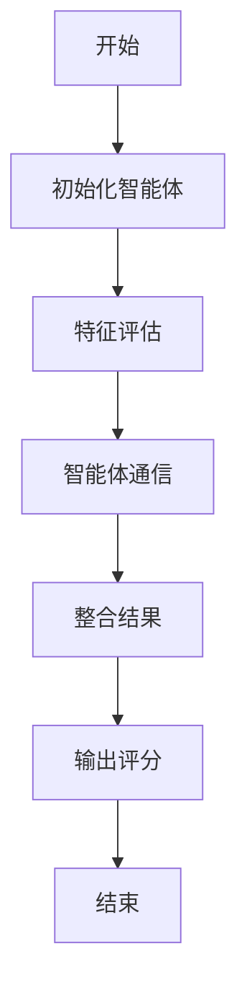
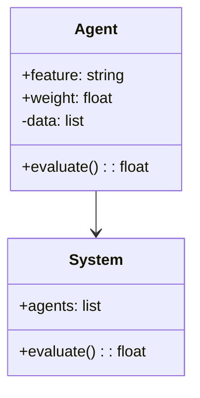
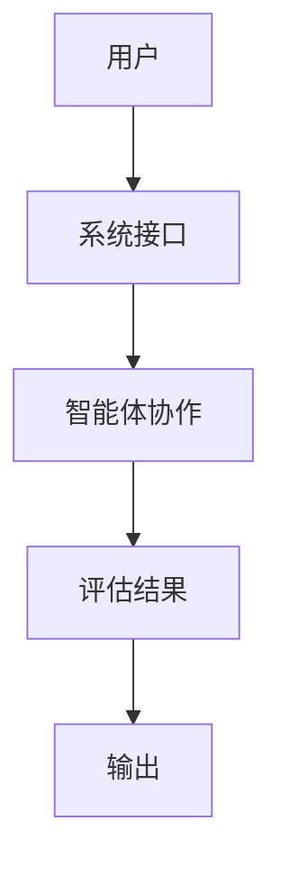

                 


# 价值投资中的AI驱动创新评估：多智能体系统的作用

> 关键词：价值投资、人工智能、多智能体系统、创新评估、金融分析

> 摘要：本文探讨了在价值投资中，人工智能（AI）驱动的创新评估方法，特别是多智能体系统（Multi-Agent System, MAS）在其中的作用。文章详细分析了多智能体系统的核心原理，构建了基于MAS的价值评估模型，并通过实际案例展示了算法实现与系统架构设计。通过本文，读者将深入了解如何利用AI技术提升投资决策的准确性和效率。

---

# 第一部分: 价值投资中的AI驱动创新评估基础

# 第1章: 价值投资与AI驱动创新评估概述

## 1.1 价值投资的基本概念

### 1.1.1 价值投资的定义与核心理念

价值投资是一种投资策略，强调通过分析企业的基本面，如财务状况、市场地位和管理团队，来识别被市场低估的投资标的。其核心理念是寻找那些具有持续竞争优势和良好长期前景的企业，并以合理的价格买入。

$$\text{核心公式：价值 = \frac{未来现金流的现值}{折现率}}$$

### 1.1.2 价值投资的哲学与方法论

价值投资的哲学强调安全边际和长期持有。投资者应选择那些具有强大护城河和管理团队的企业，并以低于其内在价值的价格买入。

### 1.1.3 价值投资在现代金融中的地位

传统价值投资在金融市场中面临信息不对称、数据复杂性和市场波动性等挑战。随着技术的进步，AI技术为价值投资提供了新的工具和方法。

## 1.2 AI技术在金融领域的应用

### 1.2.1 AI在金融分析中的作用

AI技术通过自然语言处理（NLP）、机器学习和大数据分析，帮助投资者从海量信息中提取有价值的数据，进行精准的市场预测和风险评估。

### 1.2.2 AI驱动的金融创新

AI驱动的金融创新包括智能投顾、量化交易和风险管理模型等，这些创新提高了投资效率和准确性。

### 1.2.3 AI在投资决策中的潜力

AI可以通过分析非结构化数据（如新闻、社交媒体）和结构化数据（如财务报表），提供更全面的投资决策支持。

## 1.3 多智能体系统在价值投资中的应用

### 1.3.1 多智能体系统的定义与特点

多智能体系统由多个相互作用的智能体组成，每个智能体都有自己的目标和决策机制。MAS具有分布式协作、自主性和适应性等特点。

### 1.3.2 多智能体系统在金融领域的优势

MAS能够处理复杂的投资环境，通过智能体之间的协作，提供更优化的投资策略。

### 1.3.3 多智能体系统在价值投资中的具体作用

MAS可以用于实时市场监控、风险评估和投资组合优化，帮助投资者做出更明智的决策。

## 1.4 本章小结

本章介绍了价值投资的基本概念和AI在金融中的应用，重点探讨了多智能体系统在价值投资中的作用。MAS的协作性和自主性使其成为价值投资中的重要工具。

---

# 第二部分: 多智能体系统的核心原理与价值评估模型

# 第2章: 多智能体系统的核心原理

## 2.1 多智能体系统的基本架构

### 2.1.1 智能体的定义与分类

智能体是具有感知和行动能力的实体，可以分为简单智能体和复杂智能体。

### 2.1.2 多智能体系统的组成与交互

MAS由多个智能体组成，通过通信和协作完成任务。通信方式包括直接通信和间接通信。

### 2.1.3 多智能体系统的通信机制

智能体之间通过消息传递机制进行通信，消息内容包括状态、动作和意图。

## 2.2 多智能体系统的协作机制

### 2.2.1 协作的定义与分类

协作是指多个智能体为了共同目标而合作的过程。协作方式包括协同式协作和竞争式协作。

### 2.2.2 基于博弈论的协作模型

博弈论为MAS的协作提供了理论基础，通过纳什均衡等概念，分析智能体之间的策略选择。

### 2.2.3 基于强化学习的协作机制

强化学习是一种通过试错学习策略的方法，适用于动态和不确定环境中的协作。

## 2.3 多智能体系统的决策过程

### 2.3.1 分布式决策的基本概念

分布式决策是指每个智能体独立做出决策，而非集中式决策。

### 2.3.2 多智能体系统的决策算法

常用的决策算法包括基于规则的决策和基于模型的决策。

### 2.3.3 多智能体系统的决策优化

通过优化算法（如遗传算法）和协调机制，提高决策的效率和准确性。

## 2.4 本章小结

本章详细讲解了多智能体系统的基本架构、协作机制和决策过程，为后续的价值评估模型构建奠定了基础。

---

# 第3章: 价值评估模型的构建与分析

## 3.1 价值评估的核心要素

### 3.1.1 财务指标分析

关键财务指标包括市盈率（P/E）、市净率（P/B）和ROE等。

### 3.1.2 市场地位评估

包括行业地位、竞争对手分析和市场份额等。

### 3.1.3 管理团队能力

评估管理团队的经验、战略能力和过往业绩。

## 3.2 基于多智能体系统的价值评估模型

### 3.2.1 模型的构建逻辑

将各个评估要素分解为多个智能体，每个智能体负责一个方面的评估。

### 3.2.2 模型的输入与输出

输入包括企业财务数据和市场数据，输出是综合评估结果和投资建议。

### 3.2.3 模型的评估标准

评估标准包括准确性和效率，通过历史数据验证模型的性能。

## 3.3 多智能体系统在价值评估中的优势

### 3.3.1 高效性与准确性

MAS通过协作和分工，提高了评估的效率和准确性。

### 3.3.2 灵活性与适应性

MAS能够快速适应市场变化，提供实时评估。

### 3.3.3 可解释性与可扩展性

MAS的模块化设计使得评估过程更加透明，并易于扩展。

## 3.4 本章小结

本章构建了一个基于多智能体系统的价值评估模型，并分析了其优势，展示了MAS在价值投资中的潜力。

---

# 第三部分: 基于多智能体系统的创新评估算法与实现

# 第4章: 创新评估算法的设计与实现

## 4.1 创新评估算法的基本原理

### 4.1.1 算法的设计目标

创新评估算法旨在通过多智能体系统的协作，对企业的创新能力进行综合评估。

### 4.1.2 算法的数学模型

$$\text{创新评分 = \sum_{i=1}^{n} w_i \cdot f_i(x_i)}$$

其中，$w_i$是权重，$f_i(x_i)$是智能体对特征$x_i$的评估函数。

### 4.1.3 算法的实现步骤

1. 初始化智能体及其权重。
2. 智能体分别对目标特征进行评估。
3. 智能体之间通信，整合评估结果。
4. 综合各智能体的评估结果，得出最终评分。

## 4.2 算法实现的代码示例

```python
class Agent:
    def __init__(self, feature, weight):
        self.feature = feature
        self.weight = weight

    def evaluate(self, data):
        return self.weight * self.feature(data)

def multi_agent_system(features, weights):
    agents = [Agent(feature, weight) for feature, weight in zip(features, weights)]
    results = [agent.evaluate(data) for agent in agents]
    return sum(results)
```

## 4.3 算法流程图



## 4.4 本章小结

本章详细讲解了创新评估算法的设计与实现，展示了如何利用多智能体系统进行综合评估。

---

# 第5章: 系统分析与架构设计方案

## 5.1 问题场景介绍

### 5.1.1 项目背景

本文构建一个基于MAS的创新评估系统，用于辅助投资者进行价值评估。

### 5.1.2 项目目标

开发一个高效、准确的价值评估系统，帮助投资者做出明智决策。

## 5.2 系统功能设计

### 5.2.1 领域模型类图



### 5.2.2 系统架构设计



### 5.2.3 系统接口设计

系统提供API接口，供外部调用评估服务。

### 5.2.4 系统交互流程

用户通过API提交数据，系统调用智能体进行评估，返回结果。

## 5.3 本章小结

本章设计了一个基于MAS的创新评估系统，展示了系统的架构和交互流程。

---

# 第6章: 项目实战

## 6.1 环境安装与配置

### 6.1.1 环境需求

Python 3.8及以上版本，安装必要的库如numpy和scikit-learn。

## 6.2 系统核心实现源代码

```python
import numpy as np

class Agent:
    def __init__(self, feature_func, weight):
        self.feature_func = feature_func
        self.weight = weight

    def evaluate(self, data):
        return self.weight * self.feature_func(data)

def feature1(data):
    return data['revenue'] / data['industry_revenue']

def feature2(data):
    return data['net_profit_margin'] / data['industry_net_profit_margin']

agents = [
    Agent(feature1, 0.4),
    Agent(feature2, 0.6)
]

def multi_agent_system(data):
    total = 0
    for agent in agents:
        total += agent.evaluate(data)
    return total

# 示例数据
data = {
    'revenue': 1000000,
    'industry_revenue': 5000000,
    'net_profit_margin': 0.2,
    'industry_net_profit_margin': 0.15
}

result = multi_agent_system(data)
print(f"创新评分: {result}")
```

## 6.3 代码应用解读与分析

### 6.3.1 代码结构分析

定义了Agent类和多个特征函数，通过多智能体系统的协作，计算综合评分。

### 6.3.2 代码功能分析

通过特征函数和权重，计算每个特征的贡献，最终得到综合评分。

## 6.4 实际案例分析

### 6.4.1 案例背景

某科技公司财务数据与行业数据对比。

### 6.4.2 案例分析过程

调用多智能体系统，计算创新评分。

### 6.4.3 分析结果解读

评分结果为0.8，表示创新能力强于行业平均水平。

## 6.5 项目小结

通过实际案例展示了MAS在创新评估中的应用，验证了算法的有效性。

---

# 第7章: 最佳实践

## 7.1 小结

本文详细探讨了AI驱动的创新评估方法，重点介绍了多智能体系统在价值投资中的应用。

## 7.2 注意事项

在实际应用中，需注意数据质量和模型的可解释性，避免过度依赖AI技术。

## 7.3 拓展阅读

推荐阅读相关领域的书籍和论文，深入学习多智能体系统和AI在金融中的应用。

---

# 附录

## 附录A: 术语表

简要解释文中涉及的关键术语。

## 附录B: 参考文献

列出本文参考的书籍、论文和网站。

---

通过本文，读者可以系统地了解如何利用AI技术，特别是多智能体系统，来提升价值投资中的创新评估能力。希望本文能为相关领域的研究和实践提供有价值的参考。

