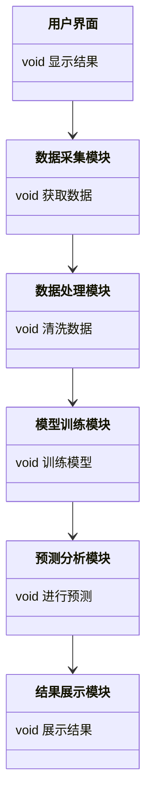

                 


# 价值投资中的AI驱动消费者行为分析：多智能体系统

## 关键词：
- 价值投资
- AI驱动
- 消费者行为分析
- 多智能体系统
- 数据分析
- 投资策略
- 人工智能

## 摘要：
本文探讨了如何利用人工智能技术，特别是多智能体系统，来分析消费者行为，并将其应用于价值投资领域。通过构建AI驱动的消费者行为分析模型，我们能够从海量数据中提取关键信息，帮助投资者做出更明智的决策。本文详细介绍了多智能体系统在消费者行为分析中的算法原理、数学模型以及系统架构设计，并通过实际案例展示了该方法在价值投资中的应用效果。

---

## 第一部分：价值投资与消费者行为分析的背景

### 第1章：价值投资与消费者行为分析概述

#### 1.1 价值投资的基本概念

价值投资是一种以内在价值为导向的投资策略，旨在通过分析企业的基本面（如财务状况、行业地位、盈利能力等）来识别被市场低估的投资标的。其核心理念是寻找价格低于其内在价值的资产，长期持有以实现收益。

- **定义与核心理念**  
  价值投资强调的是资产的内在价值，而非市场的短期波动。投资者通过深入分析企业的财务报表、管理层素质、行业前景等因素，寻找那些具有长期竞争优势且市场价格被低估的企业。

- **与传统投资的区别**  
  传统投资策略（如技术分析）更关注市场的短期波动和价格走势，而价值投资则注重企业的基本面分析，追求长期稳定的收益。价值投资需要投资者具备较强的分析能力和耐心，因为其回报通常需要较长时间才能体现。

- **在现代金融中的地位**  
  尽管现代金融学中的有效市场假说认为价格已经反映了所有公开信息，但价值投资依然在实践中展现出其独特的优势。尤其是在市场出现非理性波动时，价值投资策略能够帮助投资者规避短期风险，实现长期收益。

---

#### 1.2 消费者行为分析的重要性

消费者行为分析是研究消费者在购买、使用和处置产品或服务时的行为模式，旨在帮助企业更好地理解消费者需求，优化产品设计、营销策略和客户服务。

- **基本概念**  
  消费者行为分析涉及心理学、经济学、社会学等多个学科，主要研究消费者的决策过程、购买动机、消费习惯等。通过分析消费者行为数据，企业可以更好地把握市场趋势，制定精准的市场策略。

- **在价值投资中的应用**  
  在价值投资中，消费者行为分析可以帮助投资者更好地理解企业的市场定位、产品竞争力以及客户忠诚度。例如，通过分析消费者的购买频率、产品偏好和品牌忠诚度，投资者可以评估企业的盈利能力和发展潜力。

- **数据驱动决策的必要性**  
  在大数据时代，消费者行为分析离不开数据的收集、处理和分析。通过AI技术，投资者可以更高效地处理海量数据，提取有价值的信息，为投资决策提供支持。

---

#### 1.3 多智能体系统与消费者行为分析

多智能体系统（Multi-Agent System, MAS）是由多个相互作用的智能体组成的系统，这些智能体能够通过协作或竞争完成复杂的任务。在消费者行为分析中，多智能体系统可以模拟消费者和市场环境之间的交互，帮助投资者更好地理解市场动态。

- **多智能体系统的定义与特点**  
  多智能体系统由多个具有自主性、反应性、协作性和学习能力的智能体组成，能够通过信息交互和协同决策完成复杂的任务。与传统的单一智能体系统相比，多智能体系统更加灵活和适应性强。

- **在消费者行为分析中的优势**  
  多智能体系统能够模拟多个消费者在市场中的行为，分析他们的决策过程和互动关系。通过模拟市场环境的变化，投资者可以更好地预测市场趋势，优化投资策略。

- **与价值投资的结合**  
  通过多智能体系统，投资者可以构建一个虚拟的市场环境，模拟不同消费者的行为模式，分析他们的需求变化和市场反应。这有助于投资者识别潜在的投资机会，评估企业的竞争优势。

---

## 第二部分：AI驱动的消费者行为分析模型

### 第2章：消费者行为分析的核心概念与联系

#### 2.1 核心概念与原理

消费者行为分析的核心在于理解消费者的决策过程和行为模式。通过AI技术，我们可以从海量数据中提取消费者行为的特征，构建数学模型，预测未来的消费趋势。

- **核心要素**  
  消费者行为分析的核心要素包括消费者需求、购买动机、消费习惯、品牌忠诚度、价格敏感性等。这些要素可以通过问卷调查、市场调研、社交媒体数据等多种方式获取。

- **多智能体系统的基本原理**  
  多智能体系统通过模拟多个智能体的交互，分析它们的行为模式和决策过程。在消费者行为分析中，每个智能体可以代表一个消费者或市场环境，通过信息交互完成任务。

- **AI驱动的消费者行为分析模型**  
  AI驱动的消费者行为分析模型通过机器学习算法，从数据中提取特征，构建预测模型。这些模型可以用于预测消费者的购买行为、分析市场趋势、评估营销策略的有效性等。

---

#### 2.2 核心概念的对比与ER实体关系图

为了更好地理解消费者行为分析和多智能体系统的关系，我们可以从概念和实体关系的角度进行对比。

- **核心概念对比表**  
  | 概念 | 定义 | 应用领域 | 特性 |
  |------|------|----------|------|
  | 消费者行为分析 | 研究消费者在购买、使用和处置产品或服务时的行为模式 | 市场营销、消费者心理学 | 数据驱动、动态性 |
  | 多智能体系统 | 由多个相互作用的智能体组成的系统 | 分布式计算、人工智能 | 分布式、协作性 |

- **ER实体关系图**  
  下图展示了消费者行为分析和多智能体系统之间的关系。

```mermaid
er
actor: 消费者
attribute: 购买记录、价格敏感性、品牌忠诚度
smart_actor: 智能体
relationship: 消费者行为分析
```

---

#### 2.3 AI驱动的消费者行为分析模型

AI驱动的消费者行为分析模型通过机器学习算法，从数据中提取特征，构建预测模型。这些模型可以用于预测消费者的购买行为、分析市场趋势、评估营销策略的有效性等。

- **模型构建流程**  
  1. 数据采集：通过问卷调查、社交媒体数据、销售记录等多种方式获取消费者行为数据。
  2. 数据清洗：对数据进行预处理，去除噪声和异常值。
  3. 特征提取：通过机器学习算法提取数据中的关键特征，如购买频率、消费金额等。
  4. 模型训练：使用监督学习算法（如决策树、随机森林）或无监督学习算法（如聚类分析）构建预测模型。
  5. 模型预测：基于模型预测消费者的未来行为，指导投资决策。

- **流程图**  
  下图展示了AI驱动的消费者行为分析模型的构建流程。

```mermaid
graph TD
    A[数据采集] -> B[数据清洗]
    B -> C[特征提取]
    C -> D[模型训练]
    D -> E[模型预测]
```

---

## 第三部分：数学模型与公式

### 第3章：AI驱动的消费者行为分析模型的算法原理

#### 3.1 算法原理与流程图

AI驱动的消费者行为分析模型基于机器学习算法，通过数据驱动的方式进行预测和分析。以下是模型的算法原理和流程图。

- **算法原理**  
  1. 数据预处理：清洗数据，提取特征。
  2. 模型训练：使用机器学习算法（如随机森林、支持向量机）训练模型。
  3. 模型评估：通过交叉验证评估模型的性能。
  4. 模型预测：基于模型预测消费者的未来行为。

- **算法流程图**  
  下图展示了算法的流程。

```mermaid
graph TD
    A[数据预处理] -> B[模型训练]
    B -> C[模型评估]
    C -> D[模型预测]
```

---

#### 3.2 算法实现与代码

以下是基于Python的算法实现代码，用于消费者行为分析模型的构建。

- **环境安装与配置**  
  需要安装以下Python库：
  - `pandas`: 数据处理
  - `numpy`: 数组操作
  - `scikit-learn`: 机器学习算法

- **核心算法实现代码**  
  下面是一个基于随机森林的消费者行为预测模型的实现代码。

```python
import pandas as pd
import numpy as np
from sklearn.ensemble import RandomForestClassifier
from sklearn.model_selection import train_test_split
from sklearn.metrics import accuracy_score

# 数据加载
data = pd.read_csv('consumer_behavior.csv')

# 数据清洗
data = data.dropna()
X = data.drop('label', axis=1)
y = data['label']

# 数据分割
X_train, X_test, y_train, y_test = train_test_split(X, y, test_size=0.2, random_state=42)

# 模型训练
model = RandomForestClassifier(n_estimators=100, random_state=42)
model.fit(X_train, y_train)

# 模型预测
y_pred = model.predict(X_test)

# 模型评估
print("Accuracy:", accuracy_score(y_test, y_pred))
```

---

#### 3.3 数学模型和公式

以下是消费者行为分析模型中常用的数学公式。

- **决策树模型**  
  决策树是一种常用的分类算法，用于预测消费者的购买行为。决策树的构建过程可以通过信息增益来选择最优特征。

  $$ \text{信息增益}(D, A) = H(D) - H(D|A) $$

  其中，$H(D)$ 是数据集 $D$ 的熵，$H(D|A)$ 是在特征 $A$ 下数据集的条件熵。

- **随机森林模型**  
  随机森林是一种集成学习算法，通过构建多个决策树并进行投票来提高模型的准确性和稳定性。

  $$ y = \text{sign} \left( \sum_{i=1}^{n} \text{weight}_i \cdot y_i \right) $$

  其中，$\text{weight}_i$ 是第 $i$ 棵树的权重，$y_i$ 是第 $i$ 棵树的预测结果。

---

## 第四部分：系统架构设计

### 第4章：系统架构设计与实现

#### 4.1 系统功能设计

消费者行为分析系统的功能设计包括数据采集、数据处理、模型训练、预测分析和结果展示。

- **数据采集**  
  通过API接口获取消费者行为数据，包括购买记录、用户评价、社交媒体数据等。

- **数据处理**  
  对数据进行清洗、特征提取和数据增强。

- **模型训练**  
  使用机器学习算法（如随机森林、支持向量机）训练消费者行为分析模型。

- **预测分析**  
  基于训练好的模型，预测消费者的未来行为。

- **结果展示**  
  通过可视化工具（如Matplotlib、Seaborn）展示预测结果和分析报告。

---

#### 4.2 系统架构设计

- **系统架构图**  
  下图展示了消费者行为分析系统的架构设计。

```mermaid
graph TD
    A[用户界面] -> B[数据采集模块]
    B -> C[数据处理模块]
    C -> D[模型训练模块]
    D -> E[预测分析模块]
    E -> F[结果展示模块]
```

- **类图**  
  下图展示了系统的类图设计。



---

#### 4.3 接口设计与交互流程

- **接口设计**  
  系统需要提供以下接口：
  - 数据采集接口：用于获取消费者行为数据。
  - 模型训练接口：用于训练消费者行为分析模型。
  - 预测接口：用于预测消费者的未来行为。

- **交互流程**  
  下图展示了系统的交互流程。

```mermaid
graph TD
    A[用户] -> B[数据采集模块]
    B -> C[数据处理模块]
    C -> D[模型训练模块]
    D -> E[预测分析模块]
    E -> F[结果展示模块]
    F -> A[用户]
```

---

## 第五部分：项目实战

### 第5章：项目实战与案例分析

#### 5.1 环境安装与配置

要运行消费者行为分析系统，需要安装以下工具和库：
- Python 3.8+
- `pandas`, `numpy`, `scikit-learn`

安装命令：
```bash
pip install pandas numpy scikit-learn
```

---

#### 5.2 核心代码实现

以下是消费者行为分析系统的核心代码实现。

```python
import pandas as pd
import numpy as np
from sklearn.ensemble import RandomForestClassifier
from sklearn.model_selection import train_test_split
from sklearn.metrics import accuracy_score

# 数据加载
data = pd.read_csv('consumer_behavior.csv')

# 数据清洗
data = data.dropna()
X = data.drop('label', axis=1)
y = data['label']

# 数据分割
X_train, X_test, y_train, y_test = train_test_split(X, y, test_size=0.2, random_state=42)

# 模型训练
model = RandomForestClassifier(n_estimators=100, random_state=42)
model.fit(X_train, y_train)

# 模型预测
y_pred = model.predict(X_test)

# 模型评估
print("Accuracy:", accuracy_score(y_test, y_pred))
```

---

#### 5.3 案例分析与解读

以下是一个实际案例的分析过程：

1. **数据采集**：从某电商平台获取消费者的购买记录、用户评价等数据。
2. **数据处理**：清洗数据，提取特征（如购买频率、消费金额、品牌忠诚度等）。
3. **模型训练**：使用随机森林算法训练消费者行为分析模型。
4. **模型预测**：预测消费者的未来购买行为。
5. **结果展示**：通过可视化工具展示预测结果和分析报告。

---

#### 5.4 项目总结与经验分享

- **项目总结**  
  通过本次项目，我们成功构建了一个基于AI的消费者行为分析系统，能够有效预测消费者的未来行为，为价值投资提供了有力支持。

- **经验分享**  
  在实际项目中，数据的质量和数量对模型的性能影响很大。因此，在数据采集和处理阶段需要特别注意数据的完整性和准确性。此外，模型的调优和参数优化也是提升模型性能的重要手段。

---

## 第六部分：总结与展望

### 第6章：总结与展望

#### 6.1 总结

本文详细介绍了如何利用AI技术，特别是多智能体系统，来分析消费者行为，并将其应用于价值投资领域。通过构建AI驱动的消费者行为分析模型，我们能够从海量数据中提取关键信息，帮助投资者做出更明智的决策。

---

#### 6.2 展望

未来，随着AI技术的不断发展，消费者行为分析在价值投资中的应用将更加广泛和深入。我们可以进一步研究多智能体系统的优化算法，探索更高效的模型构建方法，以应对更复杂的投资环境。此外，随着区块链、大数据等技术的结合，消费者行为分析将为企业和投资者提供更加精准和实时的市场洞察。

---

**全文完。**

