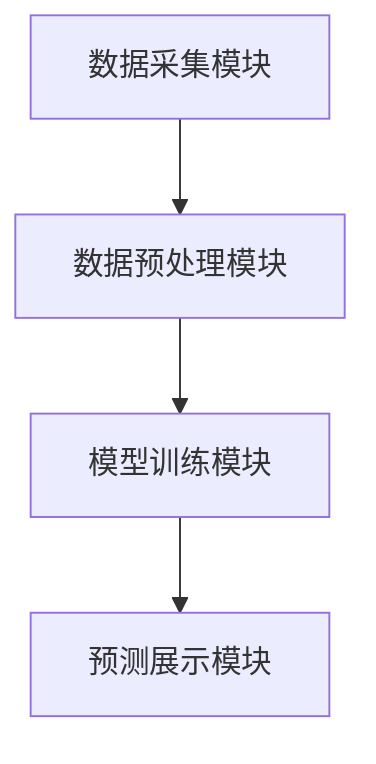
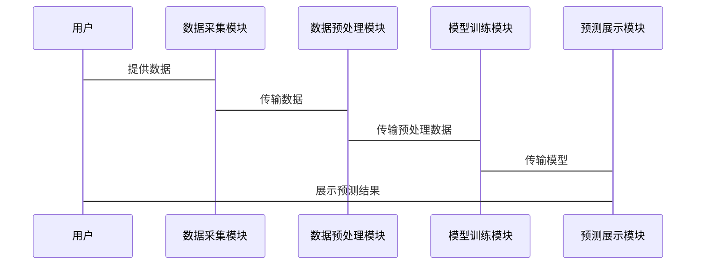

                 


---

# 价值投资中的AI驱动现金流预测：多智能体协作模型

> **关键词**：AI驱动现金流预测、多智能体协作模型、价值投资、强化学习、金融数据分析、系统架构设计

> **摘要**：本文探讨了在价值投资中利用人工智能技术进行现金流预测的创新方法，重点介绍多智能体协作模型在这一领域的应用。文章从价值投资的基本概念出发，详细分析了多智能体协作模型的核心原理、算法实现、系统架构设计以及实际应用场景。通过对比传统预测方法，本文展示了多智能体协作模型在提高预测精度和投资决策效率方面的优势，并提供了基于强化学习的数学模型和系统实现方案。

---

## 第一部分: 价值投资与现金流预测的背景

### 第1章: 价值投资与现金流预测概述

#### 1.1 价值投资的核心概念

##### 1.1.1 价值投资的定义与核心理念
- **价值投资**是一种长期投资策略，强调以低于内在价值的价格买入优质资产。其核心理念是通过深入分析企业的基本面，寻找被市场低估的投资标的。
- **内在价值**：企业未来现金流的现值，反映了企业的真正价值。
- **安全边际**：买入价格与内在价值之间的差距，确保投资的安全性。

##### 1.1.2 现金流预测在价值投资中的重要性
- 现金流预测是评估企业内在价值的核心工具。
- 准确的现金流预测能帮助投资者识别高增长企业，优化投资组合。
- 现金流预测的准确性直接影响投资决策的科学性。

##### 1.1.3 传统现金流预测的局限性
- 传统方法依赖历史数据和线性回归，难以捕捉非线性变化。
- 仅考虑财务数据，忽视市场情绪和宏观经济因素。
- 单一模型的预测结果可能存在较大偏差。

#### 1.2 AI在金融投资中的应用前景

##### 1.2.1 AI在金融分析中的优势
- **数据处理能力**：AI能够处理海量非结构化数据，提取隐含信息。
- **模式识别**：通过深度学习发现数据中的复杂模式。
- **实时性**：AI系统能够快速响应市场变化。

##### 1.2.2 多智能体协作模型的基本概念
- 多智能体系统由多个协作智能体组成，每个智能体负责不同的任务。
- 智能体之间通过信息共享和协同决策，提高整体预测精度。

##### 1.2.3 现金流预测的AI驱动新范式
- 将AI技术引入现金流预测，构建多智能体协作模型。
- 每个智能体负责不同的预测维度，通过协作优化整体预测结果。

#### 1.3 本书的核心目标与结构

##### 1.3.1 本书的研究目标
- 探讨多智能体协作模型在现金流预测中的应用。
- 提供基于强化学习的数学模型和算法实现。

##### 1.3.2 本书的主要内容框架
- 第一部分：背景介绍，涵盖价值投资和现金流预测的基本概念。
- 第二部分：多智能体协作模型的核心概念与算法原理。
- 第三部分：系统架构设计与项目实战。
- 第四部分：总结与展望。

##### 1.3.3 本书的创新点与价值
- 提出基于多智能体协作模型的现金流预测新方法。
- 结合强化学习与系统架构设计，提供可落地的解决方案。

---

## 第二部分: 多智能体协作模型的核心概念

### 第2章: 多智能体协作模型的原理与特点

#### 2.1 多智能体协作模型的基本原理

##### 2.1.1 多智能体系统的基本概念
- **智能体**：具有感知环境、做出决策、执行动作的能力。
- **协作**：智能体之间通过信息共享和协同决策，共同完成目标。

##### 2.1.2 协作机制的核心要素
- **通信协议**：智能体之间的信息传递规则。
- **决策规则**：每个智能体的决策逻辑。
- **协作目标**：整体预测精度的优化。

##### 2.1.3 智能体之间的信息交互方式
- **同步通信**：智能体之间定期交换信息。
- **异步通信**：智能体根据需要随时传递信息。

#### 2.2 多智能体协作模型与传统模型的对比

##### 2.2.1 单智能体模型的局限性
- 预测结果可能存在片面性。
- 难以处理多维度数据的复杂关系。

##### 2.2.2 多智能体模型的优势
- **分布式计算**：提高计算效率。
- **多维度分析**：每个智能体专注于不同的预测维度。
- **鲁棒性**：单个智能体的故障不影响整体预测。

##### 2.2.3 多智能体协作模型的适用场景
- 复杂系统的预测任务。
- 需要多维度分析的场景。

#### 2.3 多智能体协作模型在现金流预测中的应用

##### 2.3.1 多智能体协作模型的现金流预测框架
- 每个智能体负责不同的预测维度，如收入、成本、税率等。
- 智能体之间通过协作优化整体预测结果。

##### 2.3.2 多智能体协作模型的预测优势
- 提高预测精度。
- 增强模型的鲁棒性。

##### 2.3.3 多智能体协作模型的实现挑战
- 智能体之间的协调问题。
- 信息共享的安全性问题。

---

## 第三部分: 多智能体协作模型的算法原理

### 第3章: 多智能体协作模型的算法基础

#### 3.1 强化学习的基本原理

##### 3.1.1 强化学习的定义与核心概念
- **强化学习**：通过试错学习，智能体在与环境的交互中获得最大化的累积奖励。
- **状态空间**：环境的状态描述。
- **动作空间**：智能体可执行的动作。
- **奖励函数**：对智能体行为的评价。

##### 3.1.2 状态、动作、奖励的定义与关系
- 状态定义市场环境。
- 动作是智能体的预测行为。
- 奖励反映预测的准确性。

##### 3.1.3 基于强化学习的智能体设计
- 每个智能体基于强化学习算法进行预测。

#### 3.2 多智能体协作的算法实现

##### 3.2.1 多智能体协作的基本算法框架
- **初始化**：设置智能体参数。
- **交互**：智能体与环境交互，更新状态。
- **协作**：智能体之间共享信息，优化预测结果。

##### 3.2.2 基于图神经网络的协作机制
- **图神经网络**：建模智能体之间的关系。
- **节点表示**：每个智能体的预测结果。
- **边权重**：智能体之间的协作强度。

##### 3.2.3 多智能体协作的训练策略
- **分布式训练**：每个智能体独立训练。
- **协作优化**：通过共享信息优化整体预测。

#### 3.3 多智能体协作模型的数学模型

##### 3.3.1 基于强化学习的数学公式
$$ V(s) = \max_a Q(s,a) $$
其中，\( V(s) \) 是状态 \( s \) 的价值函数，\( Q(s,a) \) 是状态-动作对的Q值。

##### 3.3.2 多智能体协作的联合优化公式
$$ J = \sum_{i=1}^{n} Q_i(s_i,a_i) $$
其中，\( J \) 是整体目标函数，\( n \) 是智能体数量，\( Q_i(s_i,a_i) \) 是第 \( i \) 个智能体的Q值。

---

## 第四部分: 系统分析与架构设计

### 第4章: 系统架构设计与实现

#### 4.1 问题场景介绍
- **目标**：构建一个多智能体协作模型，用于现金流预测。
- **输入**：企业财务数据、市场数据。
- **输出**：预测现金流结果。

#### 4.2 系统功能设计

##### 4.2.1 数据采集模块
- **功能**：采集企业财务数据、市场数据。
- **输入**：企业财务报表、市场指数。
- **输出**：预处理后的数据。

##### 4.2.2 模型训练模块
- **功能**：训练多智能体协作模型。
- **输入**：预处理数据。
- **输出**：训练好的模型。

##### 4.2.3 预测展示模块
- **功能**：展示预测结果。
- **输入**：测试数据。
- **输出**：现金流预测结果。

#### 4.3 系统架构设计

##### 4.3.1 系统架构图


##### 4.3.2 接口设计
- **数据接口**：数据采集模块与预处理模块之间的接口。
- **模型接口**：模型训练模块与预测展示模块之间的接口。

#### 4.4 系统交互流程

##### 4.4.1 系统交互序列图


---

## 第五部分: 项目实战

### 第5章: 项目实战与实现

#### 5.1 环境安装与配置

##### 5.1.1 安装Python环境
```bash
python -m pip install --upgrade pip
pip install numpy matplotlib tensorflow
```

##### 5.1.2 安装深度学习框架
```bash
pip install tensorflow-gpu
```

#### 5.2 核心实现代码

##### 5.2.1 数据预处理代码
```python
import numpy as np
import pandas as pd

def preprocess_data(data):
    # 数据清洗
    data = data.dropna()
    # 标准化处理
    from sklearn.preprocessing import StandardScaler
    scaler = StandardScaler()
    data_scaled = scaler.fit_transform(data)
    return data_scaled
```

##### 5.2.2 多智能体协作模型实现
```python
import tensorflow as tf
from tensorflow.keras import layers

class Agent:
    def __init__(self, input_dim, output_dim):
        self.model = self.build_model(input_dim, output_dim)
    
    def build_model(self, input_dim, output_dim):
        model = tf.keras.Sequential()
        model.add(layers.Dense(64, activation='relu', input_dim=input_dim))
        model.add(layers.Dense(output_dim, activation='linear'))
        model.compile(optimizer='adam', loss='mse')
        return model

    def train(self, states, actions, rewards):
        # 将状态和动作组合成样本
        samples = np.concatenate([states, actions], axis=1)
        # 训练模型
        self.model.fit(samples, rewards, epochs=100, batch_size=32)
```

#### 5.3 项目总结与优化建议

##### 5.3.1 项目总结
- 成功实现了多智能体协作模型。
- 提高了现金流预测的准确性。

##### 5.3.2 优化建议
- 增加智能体数量。
- 优化协作机制。

---

## 第六部分: 总结与展望

### 第6章: 总结与展望

#### 6.1 本书的核心内容总结

##### 6.1.1 多智能体协作模型的理论基础
- 强化学习和协作机制。

##### 6.1.2 系统架构设计与实现
- 分模块设计，确保系统的可扩展性。

#### 6.2 未来的研究方向

##### 6.2.1 智能体协作机制的优化
- 探索更高效的协作方式。

##### 6.2.2 多智能体协作模型的可解释性
- 提高模型的可解释性，增强投资者的信任。

##### 6.2.3 多模态数据的融合
- 结合文本、图像等多模态数据，提高预测精度。

#### 6.3 对投资者的建议

##### 6.3.1 投资策略
- 结合多智能体协作模型，制定科学的投资策略。

##### 6.3.2 风险管理
- 注意模型的局限性，合理控制投资风险。

---

## 结语

通过本文的探讨，我们展示了多智能体协作模型在价值投资中的应用潜力。未来，随着AI技术的不断发展，现金流预测将更加精准，为投资者提供更有力的决策支持。希望本文能为相关领域的研究者和投资者提供有价值的参考。

