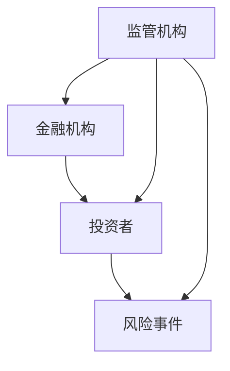
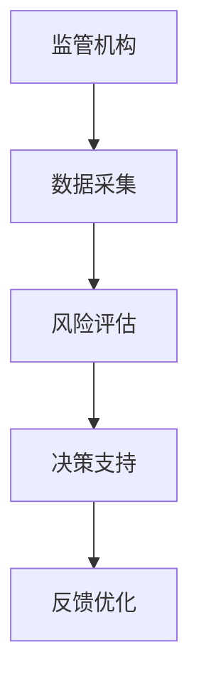
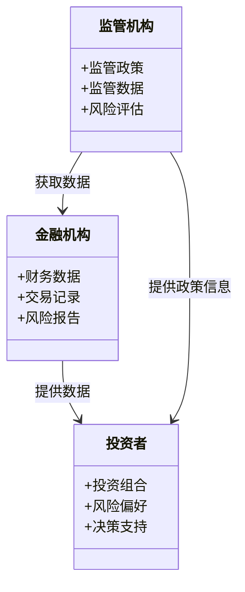
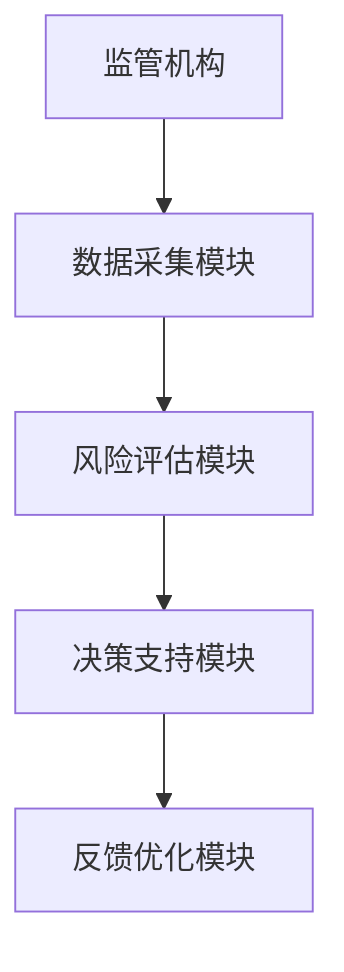
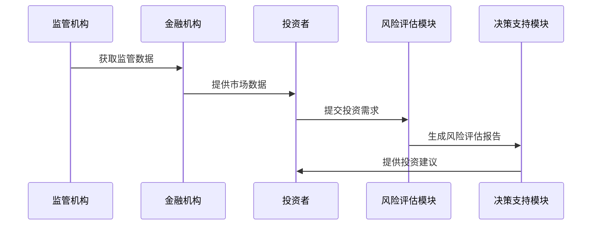

                 


# 价值投资中的AI驱动监管风险评估：多智能体协作模型

> 关键词：价值投资、AI驱动、监管风险评估、多智能体协作模型、强化学习、博弈论、金融监管

> 摘要：本文探讨了在价值投资中利用AI驱动的多智能体协作模型进行监管风险评估的方法。通过分析监管风险评估的背景、多智能体协作模型的核心概念，以及基于强化学习和博弈论的算法原理，本文为读者提供了从理论到实践的全面指导。通过实际案例分析和系统设计，展示了如何利用多智能体协作模型提升监管风险评估的准确性和效率，为价值投资提供有力支持。

---

## 第一部分: 价值投资中的监管风险评估基础

### 第1章: 监管风险评估的背景与价值投资

#### 1.1 监管风险评估的背景

##### 1.1.1 金融监管的基本概念
金融监管是政府或监管机构为了维护金融市场秩序、保护投资者利益、促进金融稳定而采取的一系列措施。监管机构通过制定规则、监督执行和处理违规行为，确保金融机构的合规性。

##### 1.1.2 监管风险的定义与分类
监管风险是指由于监管政策的变化、监管机构的执法力度、监管框架的不完善等因素，可能导致金融机构或投资者面临损失的风险。监管风险可以分为政策风险、合规风险和操作风险三类。

##### 1.1.3 监管风险对价值投资的影响
价值投资是一种长期投资策略，强调以低于内在价值的价格买入优质资产。监管风险可能影响资产的估值、流动性以及投资环境的稳定性，因此在价值投资中必须重视监管风险的评估与管理。

#### 1.2 价值投资的基本原理

##### 1.2.1 价值投资的核心理念
价值投资的核心理念是寻找市场定价低于其内在价值的资产。投资者通过分析财务数据、行业趋势和宏观经济环境，识别具有长期竞争优势的企业，进行投资。

##### 1.2.2 价值投资中的风险因素
价值投资面临的主要风险包括市场风险、流动性风险、信用风险和操作风险。其中，监管风险作为外部因素，对投资决策和资产估值具有重要影响。

##### 1.2.3 价值投资与监管风险的关联
监管政策的变化可能直接影响市场的流动性、资产的估值和交易成本。因此，在进行价值投资时，必须将监管风险作为重要的考量因素，并通过有效的风险评估模型进行管理。

#### 1.3 人工智能在金融监管中的应用前景

##### 1.3.1 AI在金融监管中的优势
人工智能技术具有高效的数据处理能力、强大的模式识别能力和自动化的决策能力，能够显著提高监管效率和准确性。

##### 1.3.2 多智能体协作模型的潜力
多智能体协作模型通过多个智能体的协同工作，能够更好地捕捉市场中的复杂关系，提高监管风险评估的精度和全面性。

##### 1.3.3 未来监管风险评估的发展趋势
随着AI技术的不断发展，监管风险评估将更加智能化、自动化和动态化，能够实时捕捉市场变化，为价值投资提供更有力的支持。

---

### 第2章: 多智能体协作模型的核心概念

#### 2.1 多智能体协作模型的定义与特点

##### 2.1.1 多智能体系统的定义
多智能体系统是由多个具有自主性、反应性和协作性的智能体组成的系统。这些智能体能够通过信息共享和协作，共同完成复杂任务。

##### 2.1.2 多智能体协作模型的核心特点
多智能体协作模型具有分布式性、协作性和动态性等特点。分布式性意味着每个智能体负责不同的任务；协作性意味着智能体之间需要通过信息共享和协同决策；动态性意味着系统能够适应环境的变化。

##### 2.1.3 多智能体协作模型与传统监管模型的对比
传统监管模型通常基于单一的监管机构和静态的规则，而多智能体协作模型通过多个智能体的协同工作，能够更好地应对复杂的监管环境。

#### 2.2 多智能体协作模型的实体关系图



该图展示了监管机构、金融机构、投资者和风险事件之间的关系。监管机构与金融机构和投资者之间存在直接联系，同时投资者可能面临风险事件，监管机构也关注风险事件的发生。

#### 2.3 多智能体协作模型的协作流程



该图展示了多智能体协作模型的协作流程：监管机构通过数据采集获取信息，进行风险评估，提供决策支持，并通过反馈优化模型。

---

## 第二部分: 多智能体协作模型的算法原理

### 第3章: 多智能体协作模型的算法原理

#### 3.1 强化学习算法

##### 3.1.1 强化学习的基本概念
强化学习是一种通过智能体与环境交互，通过奖励机制来优化决策策略的机器学习方法。

##### 3.1.2 多智能体强化学习的挑战
多智能体强化学习面临通信开销大、策略协调困难和博弈关系复杂等挑战。

##### 3.1.3 基于强化学习的风险评估模型
通过强化学习算法，智能体能够根据市场环境的变化，动态调整投资策略，降低监管风险。

#### 3.2 博弈论与多智能体协作

##### 3.2.1 博弈论的基本原理
博弈论研究多个决策主体在策略选择中的互动关系，能够帮助理解多智能体协作中的竞争与合作。

##### 3.2.2 多智能体博弈模型
多智能体博弈模型通过分析各智能体的策略选择，预测市场中的监管风险。

##### 3.2.3 博弈论在风险评估中的应用
通过博弈论模型，可以预测监管政策的变化对市场的影响，帮助投资者制定更有效的风险管理策略。

#### 3.3 多智能体协作模型的数学公式

##### 3.3.1 强化学习的Q-learning算法
Q-learning算法通过更新Q值函数，优化智能体的决策策略。其数学公式为：

$$
Q(s, a) \leftarrow Q(s, a) + \alpha \left[r + \gamma \max_{a'} Q(s', a') - Q(s, a)\right]
$$

其中，$s$是当前状态，$a$是当前动作，$r$是奖励，$\gamma$是折扣因子，$\alpha$是学习率。

##### 3.3.2 多智能体协作的博弈模型
博弈模型通过纳什均衡分析多智能体之间的策略互动。纳什均衡的数学表达式为：

$$
\forall i, u_i(s_i, \{s_{-i}\}) \geq u_i(a_i, \{s_{-i}\})
$$

其中，$u_i$是玩家i的效用函数，$s_i$是玩家i的策略，$s_{-i}$是其他玩家的策略组合。

---

## 第三部分: 系统分析与架构设计

### 第4章: 系统分析与架构设计方案

#### 4.1 问题场景介绍
本文设计了一个基于多智能体协作模型的监管风险评估系统，用于支持价值投资决策。

#### 4.2 系统功能设计

##### 4.2.1 领域模型


#### 4.3 系统架构设计

##### 4.3.1 系统架构图


#### 4.4 系统接口设计
系统接口包括监管机构接口、金融机构接口和投资者接口，分别用于数据交换和信息共享。

#### 4.5 系统交互设计



---

## 第四部分: 项目实战

### 第5章: 项目实战

#### 5.1 环境安装
需要安装Python、TensorFlow、OpenAI Gym等工具。

#### 5.2 系统核心实现源代码

##### 5.2.1 数据采集模块
```python
import pandas as pd

def collect_data():
    # 从监管机构获取监管数据
    data = pd.read_csv('regulatory_data.csv')
    return data
```

##### 5.2.2 风险评估模块
```python
def risk_assessment(data):
    # 使用强化学习模型进行风险评估
    model = QLearningModel()
    return model.predict(data)
```

##### 5.2.3 决策支持模块
```python
def decision_support(risk):
    # 提供投资建议
    if risk > 0.8:
        return "建议卖出"
    elif risk > 0.5:
        return "建议持有"
    else:
        return "建议买入"
```

#### 5.3 代码解读与分析
通过上述代码，可以实现监管数据的采集、风险评估和投资决策支持。数据采集模块从监管机构获取数据，风险评估模块利用强化学习模型进行评估，决策支持模块根据评估结果提供投资建议。

#### 5.4 实际案例分析
通过一个具体案例，展示多智能体协作模型在监管风险评估中的应用效果。

#### 5.5 项目小结
本项目展示了如何利用多智能体协作模型进行监管风险评估，为价值投资提供了有力支持。

---

## 第五部分: 总结与展望

### 第6章: 总结与展望

#### 6.1 本文总结
本文探讨了在价值投资中利用AI驱动的多智能体协作模型进行监管风险评估的方法，分析了监管风险评估的背景、多智能体协作模型的核心概念，以及基于强化学习和博弈论的算法原理。

#### 6.2 未来研究方向
未来的研究可以进一步优化多智能体协作模型，探索更高效的算法和更广泛的应用场景。

#### 6.3 最佳实践tips
在实际应用中，建议投资者结合多智能体协作模型和传统监管模型，综合考虑各种风险因素，制定科学的投资策略。

---

以上是文章的完整大纲和内容，接下来是具体的章节内容。

