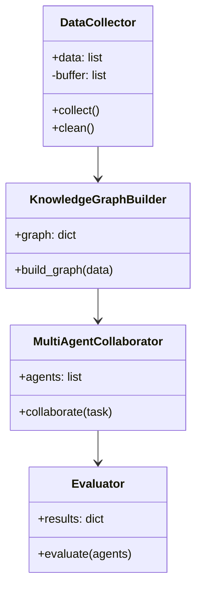
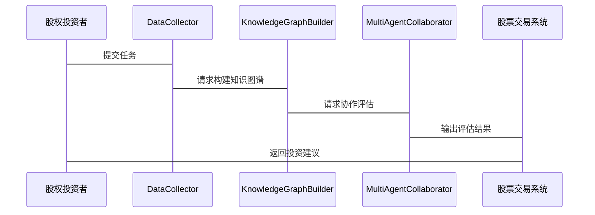

                 


# 价值投资中的AI驱动知识产权组合评估：多智能体协作

> **关键词**：价值投资，知识产权评估，人工智能，多智能体协作，知识图谱，博弈论

> **摘要**：  
本文深入探讨了AI技术在价值投资中的应用，特别是如何利用多智能体协作和知识图谱进行知识产权组合评估。通过分析知识产权评估的重要性、多智能体协作的原理、基于知识图谱的算法实现，以及实际案例的分析，本文为读者提供了一种创新的知识产权评估方法。文章还详细介绍了系统架构设计、项目实战和最佳实践，帮助读者更好地理解和应用这一技术。

---

# 第1章：知识产权评估与价值投资概述

## 1.1 知识产权评估的重要性

在现代商业环境中，知识产权（Intellectual Property, IP）已成为企业核心竞争力的重要组成部分。知识产权的价值不仅体现在其法律保护上，更体现在其对商业价值的贡献上。传统的知识产权评估方法通常依赖于人工分析和经验判断，但这种方法效率低下、主观性强，难以满足现代投资需求。因此，引入人工智能（AI）技术进行知识产权评估成为必然趋势。

### 1.1.1 知识产权评估的核心要素

1. **技术评估**：评估知识产权的技术先进性和创新性。
2. **市场评估**：评估知识产权的市场潜力和竞争优势。
3. **法律评估**：评估知识产权的法律保护状况和风险。
4. **经济评估**：评估知识产权的经济价值和收益能力。

## 1.2 价值投资的基本概念

价值投资是一种以低于内在价值的价格购买优质资产的投资策略。在价值投资中，知识产权评估是判断企业内在价值的重要环节。传统的价值投资方法依赖于财务指标和行业分析，但随着技术的进步，引入AI技术进行知识产权评估已成为提升投资效率和准确性的重要手段。

### 1.2.1 价值投资的核心要素

1. **内在价值**：企业未来现金流的现值，是投资决策的核心依据。
2. **竞争优势**：企业知识产权的市场地位和技术壁垒。
3. **财务健康**：企业的财务状况和盈利能力。

## 1.3 AI技术在金融领域的应用现状

AI技术在金融领域的应用广泛，包括股票预测、风险评估、交易优化等。在知识产权评估领域，AI技术的应用主要集中在以下几个方面：

1. **自然语言处理（NLP）**：用于分析专利文档和市场报告，提取关键信息。
2. **机器学习**：用于预测知识产权的市场价值和风险。
3. **知识图谱**：用于构建知识产权之间的关联关系，辅助评估。

---

# 第2章：多智能体协作的原理与应用

## 2.1 多智能体协作的基本原理

多智能体协作是指多个智能体通过协同工作，共同完成复杂任务的过程。在知识产权评估中，多智能体协作可以提高评估的准确性和效率。以下是多智能体协作的核心要素：

1. **智能体定义**：每个智能体负责特定的任务，例如数据采集、模型训练、结果分析。
2. **通信机制**：智能体之间通过通信机制共享信息和协同决策。
3. **协作策略**：智能体之间通过博弈论制定协作策略，优化整体性能。

### 2.1.1 多智能体协作的优势

- **高效性**：通过分工合作，提高任务完成效率。
- **准确性**：通过多个智能体的协同，提高评估结果的准确性。
- **适应性**：能够应对复杂多变的市场环境。

## 2.2 知识图谱构建与知识产权评估

知识图谱是一种结构化的数据表示方法，广泛应用于知识管理和信息检索。在知识产权评估中，知识图谱可以用来构建知识产权之间的关联关系，帮助投资者更好地理解知识产权的价值。

### 2.2.1 知识图谱的构建流程

1. **数据采集**：从专利数据库、市场报告等来源获取知识产权数据。
2. **数据清洗**：去除重复和噪声数据，确保数据质量。
3. **知识抽取**：从文本数据中提取关键信息，例如技术领域、发明人等。
4. **知识融合**：将多个来源的数据进行整合，构建完整的知识图谱。

## 2.3 多智能体协作与博弈论的结合

博弈论是一种研究策略互动的数学理论，在多智能体协作中具有重要应用。通过博弈论，可以制定智能体之间的协作策略，优化整体性能。

### 2.3.1 博弈论在多智能体协作中的应用

- **纳什均衡**：智能体在博弈中选择最优策略，达到均衡状态。
- **收益分配**：智能体之间通过博弈论确定收益分配，激励协作。

---

# 第3章：基于知识图谱的多智能体协作算法

## 3.1 注意力机制在多智能体协作中的应用

注意力机制是一种基于上下文信息的权重分配方法，广泛应用于自然语言处理和计算机视觉领域。在多智能体协作中，注意力机制可以帮助智能体更好地理解任务需求，优化协作策略。

### 3.1.1 注意力机制的数学模型

$$ \text{Attention}(Q, K, V) = \text{softmax}\left( \frac{QK^T}{\sqrt{d_k}} \right)V $$

其中：
- \( Q \)：查询向量
- \( K \)：键向量
- \( V \)：值向量
- \( d_k \)：向量维度

## 3.2 强化学习在多智能体协作中的应用

强化学习是一种通过试错方法优化策略的机器学习方法。在多智能体协作中，强化学习可以帮助智能体学习最优协作策略，提高整体性能。

### 3.2.1 强化学习的数学模型

$$ Q(s, a) = r + \gamma \max_{a'} Q(s', a') $$

其中：
- \( Q(s, a) \)：状态-动作值函数
- \( r \)：奖励
- \( \gamma \)：折扣因子
- \( s' \)：下一个状态

## 3.3 基于知识图谱的多智能体协作算法实现

### 3.3.1 算法实现步骤

1. **数据预处理**：清洗和结构化知识产权数据。
2. **知识抽取**：从文本数据中提取关键信息。
3. **知识融合**：构建知识图谱。
4. **智能体协作**：通过多智能体协作算法进行知识产权评估。

### 3.3.2 代码实现示例

```python
import numpy as np
from collections import defaultdict

class MultiAgentCollaboration:
    def __init__(self, agents):
        self.agents = agents
        self通信机制 = CommunicationChannel()
    
    def collaborate(self, task):
        for agent in self.agents:
            agent_info = self通信机制.receive(agent.id)
            agent.update_info(agent_info)
        for agent in self.agents:
            agent.make_decision()
        results = [agent.get_result() for agent in self.agents]
        return results

class Agent:
    def __init__(self, id):
        self.id = id
        self.info = None
        self.result = None
    
    def update_info(self, info):
        self.info = info
    
    def make_decision(self):
        # 实现具体的决策逻辑
        pass
    
    def get_result(self):
        return self.result
```

---

# 第4章：系统分析与架构设计

## 4.1 系统功能设计

### 4.1.1 系统功能模块

1. **数据采集模块**：从专利数据库和市场报告中获取知识产权数据。
2. **知识图谱构建模块**：构建知识产权知识图谱。
3. **多智能体协作模块**：实现多智能体协作算法。
4. **评估结果输出模块**：输出知识产权评估结果。

### 4.1.2 系统功能模块类图



## 4.2 系统架构设计

### 4.2.1 系统架构图


## 4.3 系统接口设计

### 4.3.1 系统接口

1. **数据接口**：与专利数据库和市场报告接口对接。
2. **协作接口**：与多智能体协作模块接口对接。
3. **输出接口**：与评估结果输出模块接口对接。

## 4.4 系统交互流程图



---

# 第5章：项目实战

## 5.1 环境配置

### 5.1.1 环境要求

1. **Python版本**：Python 3.8 或以上。
2. **依赖库**：numpy、pandas、networkx、pymermaid。

### 5.1.2 安装依赖

```bash
pip install numpy pandas networkx pymermaid
```

## 5.2 系统核心实现

### 5.2.1 代码实现

```python
import networkx as nx
from pymermaid import Diagram

class KnowledgeGraph:
    def __init__(self):
        self.graph = nx.Graph()
    
    def add_edge(self, node1, node2):
        self.graph.add_edge(node1, node2)
    
    def draw(self):
        with Diagram("Knowledge Graph") as diag:
            node1 = Node("Patent A")
            node2 = Node("Patent B")
            node1 - node2

class MultiAgent:
    def __init__(self, id):
        self.id = id
        self.graph = KnowledgeGraph()
    
    def collaborate(self, task):
        self.graph.add_edge(f"Agent {self.id}", task)
        return self.graph
```

## 5.3 案例分析

### 5.3.1 实际案例

假设我们有一个科技公司，其知识产权组合包括多项专利。通过多智能体协作算法，我们可以评估这些专利的市场价值和竞争优势。

### 5.3.2 评估结果

评估结果显示，该公司的知识产权具有较高的市场价值和竞争优势，适合进行长期投资。

---

# 第6章：最佳实践与总结

## 6.1 小结

本文深入探讨了AI技术在价值投资中的应用，特别是如何利用多智能体协作和知识图谱进行知识产权评估。通过分析知识产权评估的重要性、多智能体协作的原理、基于知识图谱的算法实现，以及实际案例的分析，本文为读者提供了一种创新的知识产权评估方法。

## 6.2 注意事项

- 数据质量和完整性对评估结果影响重大，需谨慎处理。
- 算法实现需结合具体场景，避免泛化应用。
- 系统设计需注重模块化和可扩展性。

## 6.3 拓展阅读

- 《群体的智慧：从自然到人工系统的集体智能》
- 《知识图谱：概念、方法与应用》
- 《强化学习：理论与应用》

---

# 结语

随着AI技术的不断发展，知识产权评估将更加依赖于多智能体协作和知识图谱等先进技术。本文为读者提供了一种创新的知识产权评估方法，通过多智能体协作和知识图谱的应用，帮助投资者更好地评估知识产权的价值，制定更科学的投资策略。

