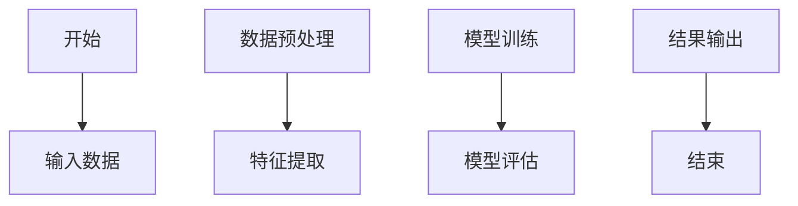

                 


# 价值投资中的AI驱动破产风险评估：多智能体协作模型

> **关键词**：价值投资，AI驱动，破产风险评估，多智能体协作模型，风险评估，人工智能，协作机制

> **摘要**：本文深入探讨了在价值投资中利用AI技术进行破产风险评估的方法，重点介绍了多智能体协作模型的应用。通过分析多智能体协作模型的原理、算法实现以及实际应用案例，展示了如何通过AI技术提升破产风险评估的准确性和效率，为投资者提供更可靠的决策支持。

---

## 第一部分：背景介绍与核心概念

### 第1章：破产风险评估的背景与挑战

#### 1.1 问题背景
- **1.1.1 破产风险评估的重要性**  
  破产风险评估是企业风险管理的核心环节，能够帮助企业提前识别潜在的财务危机，避免重大损失。在价值投资中，准确的破产风险评估能够帮助投资者规避高风险企业，降低投资损失，提升投资回报率。

- **1.1.2 传统破产风险评估方法的局限性**  
  传统的破产风险评估方法，如Z-score模型和Altman指标，虽然在一定程度上能够预测企业的破产风险，但这些方法通常基于单一的财务指标，难以全面捕捉企业的复杂风险因素，且缺乏动态调整能力。

- **1.1.3 价值投资中的破产风险评估需求**  
  在价值投资中，投资者需要对企业的长期价值进行评估，而破产风险是影响企业价值的重要因素。传统的评估方法难以满足现代投资对动态、多维度风险评估的需求，因此引入AI技术成为必然选择。

---

#### 1.2 问题描述
- **1.2.1 破产风险评估的核心目标**  
  破产风险评估的核心目标是通过分析企业的财务、市场和运营数据，预测企业在未来一定时间内发生破产的概率。

- **1.2.2 破产风险评估的关键因素**  
  破产风险评估的关键因素包括企业的财务状况（如资产负债率、盈利能力）、市场环境（如行业竞争状况）、管理能力（如高管团队稳定性）等。

- **1.2.3 价值投资中的破产风险评估场景**  
  在价值投资中，破产风险评估通常用于筛选潜在投资标的、评估投资组合的风险敞口以及制定风险管理策略。

---

#### 1.3 问题解决
- **1.3.1 AI技术在破产风险评估中的优势**  
  AI技术能够处理海量数据，提取非线性特征，并通过机器学习算法构建高精度的预测模型，显著提升了破产风险评估的准确性和效率。

- **1.3.2 多智能体协作模型的应用潜力**  
  多智能体协作模型能够从多个维度同时分析企业的风险因素，通过智能体之间的协作优化评估结果，为价值投资提供更全面的支持。

- **1.3.3 价值投资中的破产风险评估解决方案**  
  通过构建一个多智能体协作模型，整合企业的财务、市场和运营数据，利用AI技术进行实时分析和预测，为投资者提供动态的风险评估结果。

---

#### 1.4 边界与外延
- **1.4.1 破产风险评估的边界条件**  
  破产风险评估的边界条件包括数据的完整性、模型的适用性和评估的时间窗口。

- **1.4.2 多智能体协作模型的适用范围**  
  多智能体协作模型适用于复杂系统的风险评估，尤其在需要多维度分析的场景中表现突出。

- **1.4.3 价值投资中的破产风险评估的局限性**  
  破产风险评估的准确性依赖于数据质量和模型的泛化能力，同时受到市场环境和企业内部信息的限制。

---

#### 1.5 概念结构与核心要素
- **1.5.1 破产风险评估的核心要素**  
  破产风险评估的核心要素包括企业的财务状况、市场环境、管理能力和运营效率。

- **1.5.2 多智能体协作模型的构成要素**  
  多智能体协作模型由多个智能体、协作任务、协作规则和协作结果组成。

- **1.5.3 价值投资中的破产风险评估的系统架构**  
  系统架构包括数据采集模块、特征提取模块、模型训练模块和结果输出模块。

---

## 第二部分：核心概念与联系

### 第2章：多智能体协作模型的核心原理

#### 2.1 多智能体协作模型的定义与特点
- **2.1.1 多智能体协作模型的定义**  
  多智能体协作模型是一种通过多个智能体协作完成特定任务的分布式计算模型，能够从多个维度同时分析问题。

- **2.1.2 多智能体协作模型的核心特点**  
  多智能体协作模型具有分布式计算、协作优化和动态适应等特点。

- **2.1.3 多智能体协作模型与传统模型的区别**  
  与传统模型相比，多智能体协作模型能够更好地处理复杂系统的动态问题，具有更高的灵活性和适应性。

---

#### 2.2 多智能体协作模型的协作机制
- **2.2.1 协作目标的定义**  
  协作目标是指多个智能体共同完成的任务，例如在破产风险评估中，多个智能体分别负责分析企业的财务、市场和运营数据。

- **2.2.2 协作规则的建立**  
  协作规则是指智能体之间如何协作完成任务的规则，例如信息共享规则和任务分配规则。

- **2.2.3 协作过程的优化**  
  协作过程的优化是指通过不断调整协作规则和任务分配，提升协作效率和结果准确性。

---

#### 2.3 多智能体协作模型的属性特征对比
- **2.3.1 智能体的独立性与依赖性对比**  
  智能体在协作过程中既有独立性又有依赖性，独立性体现在每个智能体能够独立完成部分任务，依赖性体现在协作过程中需要共享信息和资源。

- **2.3.2 协作任务的复杂性与简单性对比**  
  协作任务的复杂性与简单性取决于任务的性质，复杂任务需要多个智能体协同完成，而简单任务可以由单个智能体完成。

- **2.3.3 协作结果的准确性与效率性对比**  
  协作结果的准确性通常高于单个智能体的独立分析，但协作过程可能会增加计算复杂度，影响效率。

---

#### 2.4 多智能体协作模型的ER实体关系图
```mermaid
graph TD
A[智能体1] --> B[协作任务]
C[智能体2] --> B
D[协作规则] --> B
E[协作结果] <-- B
```

---

## 第三部分：算法原理讲解

### 第3章：多智能体协作模型的算法原理

#### 3.1 算法概述
- **3.1.1 算法的基本流程**  
  算法的基本流程包括数据预处理、特征提取、模型训练和结果输出。

- **3.1.2 算法的核心思想**  
  算法的核心思想是通过多个智能体协作，共同完成复杂任务，提升结果的准确性和效率。

- **3.1.3 算法的输入输出**  
  输入包括企业的财务、市场和运营数据，输出包括企业的破产概率和风险管理建议。

---

#### 3.2 算法流程图


---

#### 3.3 算法的数学模型
- **3.3.1 模型的数学表达式**  
  破产风险评估模型可以表示为一个分类问题，使用逻辑回归模型：
  $$P(\text{破产}) = \frac{1}{1 + e^{-\beta X}}$$  
  其中，$X$ 是输入特征向量，$\beta$ 是模型参数。

- **3.3.2 模型的训练过程**  
  模型的训练过程包括特征提取、数据预处理和模型优化，最终得到最优参数 $\beta^*$。

---

## 第四部分：系统分析与架构设计方案

### 第4章：系统架构设计

#### 4.1 项目介绍
- **4.1.1 项目背景**  
  本项目旨在构建一个多智能体协作模型，用于价值投资中的破产风险评估。

- **4.1.2 项目目标**  
  项目目标是通过AI技术提升破产风险评估的准确性和效率，为投资者提供可靠的决策支持。

---

#### 4.2 系统功能设计
- **4.2.1 领域模型类图**  
  ```mermaid
  classDiagram
  class 智能体1 {
    - 输入特征
    - 输出结果
    + process()
  }
  class 智能体2 {
    - 输入特征
    - 输出结果
    + process()
  }
  class 协作任务 {
    - 任务目标
    - 任务规则
    + assign()
  }
  class 破产风险评估系统 {
    - 输入数据
    - 输出结果
    + evaluate()
  }
  ```

---

#### 4.3 系统架构设计
- **4.3.1 系统架构图**  
  ```mermaid
  graph TD
  A[智能体1] --> B[协作任务]
  C[智能体2] --> B
  D[协作规则] --> B
  E[协作结果] <-- B
  F[破产风险评估系统] --> E
  ```

---

## 第五部分：项目实战

### 第5章：项目实战

#### 5.1 环境配置
- **5.1.1 环境要求**  
  需要安装Python 3.8及以上版本，安装TensorFlow、Scikit-learn和Mermaid工具。

---

#### 5.2 系统核心实现
- **5.2.1 数据预处理**  
  ```python
  import pandas as pd
  df = pd.read_csv('data.csv')
  df = df.dropna()
  ```

- **5.2.2 特征提取**  
  ```python
  from sklearn.feature_selection import SelectKBest
  selector = SelectKBest(k=10)
  X_selected = selector.fit_transform(df)
  ```

- **5.2.3 模型训练**  
  ```python
  from sklearn.linear_model import LogisticRegression
  model = LogisticRegression()
  model.fit(X_selected, y)
  ```

---

#### 5.3 应用解读与分析
- **5.3.1 模型评估**  
  使用准确率、召回率和F1分数评估模型性能：
  ```python
  from sklearn.metrics import accuracy_score
  accuracy_score(y_true, y_pred)
  ```

- **5.3.2 模型优化**  
  通过调整模型参数和优化协作规则，提升模型的预测准确性和效率。

---

## 第六部分：总结与展望

### 第6章：总结与展望

#### 6.1 项目总结
- **6.1.1 核心成果**  
  成功构建了一个多智能体协作模型，用于价值投资中的破产风险评估。

- **6.1.2 经验与教训**  
  在项目实施过程中，需要注意数据质量、模型优化和协作规则的设计。

---

#### 6.2 最佳实践 tips
- **6.2.1 数据质量管理**  
  确保数据的完整性和准确性，是提高模型预测能力的关键。

- **6.2.2 模型优化策略**  
  通过不断调整模型参数和优化协作规则，提升模型的预测准确性和效率。

---

#### 6.3 未来展望
- **6.3.1 拓展方向**  
  未来可以进一步研究多智能体协作模型在其他领域的应用，如金融风险评估和供应链管理。

- **6.3.2 研究热点**  
  研究多智能体协作模型的动态优化算法和分布式计算技术，是未来研究的热点方向。

---

## 附录

### 附录A：数据来源
- 数据来源：企业的财务、市场和运营数据，数据集格式为CSV。

### 附录B：工具安装指南
- 安装Python和相关库：`pip install numpy pandas scikit-learn`

### 附录C：参考文献
- 参考文献包括相关学术论文和书籍。

---

**全文完。**

