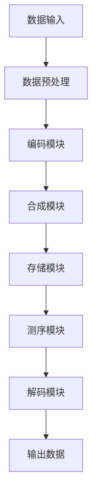

                 


# 价值投资中的DNA数据存储技术发展趋势

## 关键词：DNA数据存储，价值投资，数据完整性，投资策略优化，技术趋势

## 摘要：  
随着数据量的爆炸式增长，传统数据存储技术面临诸多挑战。DNA数据存储技术作为一种革命性的存储方案，以其高密度、持久性和潜在的低成本特性，正在成为金融领域的热门技术。本文将深入探讨DNA数据存储技术在价值投资中的应用，分析其发展趋势，结合具体案例，探讨如何利用DNA存储技术优化投资决策和提升数据管理效率。

---

# 第一部分：DNA数据存储技术的背景与现状

## 第1章：DNA数据存储技术的起源与发展

### 1.1 数据存储技术的历史演进  
传统数据存储技术经历了磁带、硬盘、固态存储等阶段，但随着数据量的指数级增长，这些技术面临存储密度有限、能耗高、维护成本高等问题。  

### 1.2 DNA存储技术的提出与研究进展  
DNA作为生命中承载遗传信息的分子，具有极高的信息存储密度（每升水可存储约2.75艾字节数据）和极长的寿命。科学家们通过化学合成和基因测序技术，提出了一种将数据编码为DNA分子的方法。近年来，研究者们在DNA存储技术上取得了显著进展，例如将书籍、视频等信息成功存储为DNA分子。  

### 1.3 DNA存储技术的核心优势  
- **高存储密度**：DNA分子的存储密度远高于传统存储介质。  
- **持久性**：DNA分子可以在常温下保存数千年而不降解。  
- **可扩展性**：理论上，DNA存储容量接近信息物理极限。  

---

## 第2章：价值投资中的数据存储需求  

### 2.1 价值投资中的数据特征  
价值投资者依赖于历史数据、市场趋势、公司基本面等信息进行决策。这些数据具有以下特点：  
- **多样性**：包括文本、数值、图像等多种类型的数据。  
- **实时性**：需要快速获取和处理实时市场数据。  
- **长期性**：投资决策需要基于长期的历史数据积累。  

### 2.2 DNA存储技术在金融领域的潜在应用  
- **金融数据的长期存储**：将大量历史市场数据存储为DNA分子，确保数据的持久性和安全性。  
- **大数据分析**：利用DNA存储技术高效存储和处理海量金融数据，支持复杂的投资模型。  
- **数据安全与隐私保护**：DNA存储技术可以通过加密和访问控制，确保金融数据的安全性。  

---

# 第二部分：DNA数据存储技术的核心原理与价值投资的结合

## 第3章：DNA数据存储技术的核心概念与原理  

### 3.1 DNA数据存储的编码与解码原理  

#### 3.1.1 信息编码的基本原理  
将二进制数据编码为DNA序列的过程包括以下几个步骤：  
1. **数据分割**：将输入的二进制数据分割成小块。  
2. **纠错编码**：为每块数据添加纠错码，确保数据的完整性。  
3. **碱基编码**：将每块数据映射到DNA碱基序列（A、T、C、G）。  

#### 3.1.2 DNA存储中的编码算法  
常用的编码算法包括：  
- **Reed-Solomon码**：用于纠错编码。  
- **Low-Complexity Codes**：用于简化编码过程。  

#### 3.1.3 解码过程与技术实现  
解码过程包括：  
1. **DNA测序**：将DNA分子转化为碱基序列。  
2. **纠错解码**：去除错误并恢复原始数据。  

### 3.2 DNA数据存储的合成与测序技术  

#### 3.2.1 DNA合成技术的原理与方法  
DNA合成技术通过化学方法将碱基序列合成到DNA分子中。常用的方法包括：  
- **磷光偶联法**：逐步合成DNA链。  
- **微芯片合成法**：在芯片上并行合成多个DNA链。  

#### 3.2.2 测序技术在数据恢复中的应用  
测序技术（如Illumina测序）用于将DNA分子转化为数字信号，从而恢复原始数据。  

---

## 第4章：DNA数据存储的数学模型与算法  

### 4.1 信息编码的数学模型  
假设我们有一个长度为N的二进制数据，将其编码为DNA序列。编码过程可以表示为：  
$$ f: \{0,1\}^N \rightarrow \{A,T,C,G\}^M $$  
其中，M是DNA序列的长度。  

### 4.2 DNA合成与测序的数学建模  
合成过程可以表示为：  
$$ s: \{A,T,C,G\}^M \rightarrow \text{物理DNA分子} $$  
测序过程可以表示为：  
$$ t: \text{物理DNA分子} \rightarrow \{A,T,C,G\}^M $$  

### 4.3 数据纠错与恢复的数学方法  
纠错码的设计可以使用生成矩阵和校验矩阵，例如：  
$$ H \cdot x = 0 $$  
其中，H是校验矩阵，x是纠错码。  

---

# 第三部分：价值投资中的DNA数据存储技术应用分析

## 第5章：价值投资中的数据存储需求分析  

### 5.1 价值投资中的数据特征  
- **多样性**：文本、数值、图像等多种类型的数据。  
- **实时性**：需要快速获取和处理实时市场数据。  
- **长期性**：投资决策需要基于长期的历史数据积累。  

### 5.2 DNA存储技术在价值投资中的应用场景  

#### 5.2.1 金融数据的长期存储解决方案  
通过DNA存储技术，可以将历史市场数据安全地存储数十年，确保数据的完整性。  

#### 5.2.2 大数据分析与投资决策支持  
DNA存储技术可以支持海量金融数据的快速分析，帮助投资者发现潜在的市场趋势。  

#### 5.2.3 数据安全与隐私保护  
通过加密和访问控制，DNA存储技术可以确保金融数据的安全性。  

---

## 第6章：DNA数据存储技术的算法与数学模型  

### 6.1 DNA数据存储的数学模型与算法  

#### 6.1.1 信息编码的数学模型  
将二进制数据编码为DNA序列的过程可以表示为：  
$$ f: \{0,1\}^N \rightarrow \{A,T,C,G\}^M $$  
其中，N是二进制数据的长度，M是DNA序列的长度。  

#### 6.1.2 DNA合成与测序的数学建模  
合成过程可以表示为：  
$$ s: \{A,T,C,G\}^M \rightarrow \text{物理DNA分子} $$  
测序过程可以表示为：  
$$ t: \text{物理DNA分子} \rightarrow \{A,T,C,G\}^M $$  

---

## 第7章：DNA数据存储技术的系统架构与设计  

### 7.1 系统架构设计  

#### 7.1.1 系统功能设计  
- 数据输入模块：接收金融数据并进行预处理。  
- 编码模块：将数据编码为DNA序列。  
- 合成模块：将DNA序列合成物理DNA分子。  
- 存储模块：将DNA分子存储在安全的环境中。  
- 测序模块：将DNA分子测序为数字信号。  
- 解码模块：将测序结果解码为原始数据。  

#### 7.1.2 系统架构图  


---

## 第8章：项目实战  

### 8.1 环境安装  
- 安装DNA合成和测序工具（如Illumina测序仪）。  
- 安装数据编码和解码软件。  

### 8.2 核心代码实现  
```python
def encode_data(data):
    # 将二进制数据编码为DNA序列
    pass

def decode_data(dna_sequence):
    # 将DNA序列解码为二进制数据
    pass
```

---

## 第9章：最佳实践与小结  

### 9.1 小结  
DNA数据存储技术在价值投资中的应用具有巨大的潜力，可以显著提高数据存储的效率和安全性。  

### 9.2 注意事项  
- 确保DNA存储技术的可靠性和可扩展性。  
- 注意数据隐私和安全问题。  

### 9.3 拓展阅读  
- 建议进一步研究DNA存储技术的纠错码优化和系统架构设计。  

---

通过以上分析，我们可以看到，DNA数据存储技术在价值投资中的应用前景广阔，但仍需克服技术和成本上的挑战。未来，随着技术的不断进步，DNA存储有望成为金融领域的重要工具。

