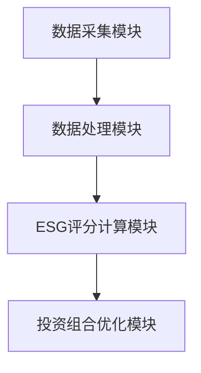
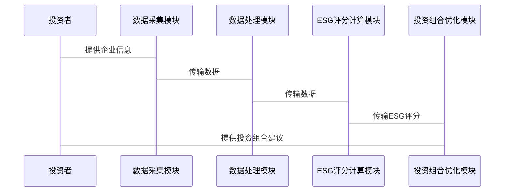

                 


# 价值投资中的ESG因素分析

> 关键词：价值投资, ESG, 环境, 社会, 公司治理

> 摘要：本文深入探讨了ESG（环境、社会、治理）因素在价值投资中的重要性。通过分析环境、社会和公司治理三个维度，结合数学模型和实际案例，展示了如何将ESG因素纳入投资决策，以实现长期稳健的投资回报。本文还介绍了基于层次分析法和因子分析法的ESG评分模型，并通过Python代码实现，为投资者提供了实用的工具和方法。

---

## 第1章: ESG因素与价值投资概述

### 1.1 ESG因素的基本概念

#### 1.1.1 环境（Environmental）的定义与内涵
- 环境因素关注企业在经营过程中对环境的影响，包括碳排放、能源消耗、资源利用效率等。
- 环境问题不仅是企业的社会责任，也是影响企业长期发展的关键因素。
- 环境因素的核心在于企业的可持续发展能力，包括绿色能源使用、环保合规性等。

#### 1.1.2 社会责任（Social）的定义与内涵
- 社会责任关注企业在社会中的表现，包括员工福利、社区关系、供应链管理等。
- 社会责任的核心在于企业的透明度和对社会的贡献，包括员工权益保护、公益活动等。
- 社会责任与企业的声誉密切相关，良好的社会责任表现可以提升企业的品牌形象。

#### 1.1.3 公司治理（Governance）的定义与内涵
- 公司治理关注企业的内部管理结构和决策机制，包括董事会构成、股权结构、内部控制等。
- 公司治理的核心在于企业的透明度和效率，良好的治理结构可以降低企业风险，提升投资者信心。
- 公司治理与企业的长期稳定发展密切相关，是价值投资的重要考量因素。

### 1.2 ESG在价值投资中的重要性

#### 1.2.1 传统价值投资的局限性
- 传统价值投资主要关注企业的财务指标，如市盈率、市净率等，忽视了企业的社会责任和治理结构。
- 传统价值投资在长期视角下，可能忽略企业的可持续发展能力，导致投资风险增加。
- 传统价值投资在应对环境和社会问题时，缺乏前瞻性和系统性。

#### 1.2.2 ESG因素对投资决策的影响
- ESG因素可以帮助投资者识别企业的潜在风险，如环境问题可能导致的罚款，社会责任缺失可能导致的品牌损失。
- ESG因素可以作为企业估值的重要参考，企业在环境、社会和治理方面的表现可以影响其长期盈利能力。
- ESG因素可以作为投资组合优化的重要工具，通过筛选表现优异的ESG企业，降低投资组合的系统性风险。

#### 1.2.3 ESG投资的长期价值与风险
- ESG投资具有长期价值，可以为投资者带来超额收益，尤其是在应对环境和社会问题时，ESG企业更具竞争力。
- ESG投资也存在一定的风险，如短期表现可能不如传统企业，需要投资者具备长期投资的耐心和信心。

### 1.3 ESG与价值投资的结合

#### 1.3.1 ESG评分的定义与计算方法
- ESG评分是基于环境、社会和治理三个维度对企业进行综合评价的指标。
- ESG评分的计算方法包括层次分析法（AHP）和因子分析法，可以根据不同行业的特点进行调整。

#### 1.3.2 ESG因素对股票估值的影响
- ESG因素可以影响企业的财务表现，如能源消耗减少可以降低企业的成本，社会责任履行可以提升企业的品牌形象。
- ESG因素可以作为股票估值的重要参考，企业在环境、社会和治理方面的表现可以影响其市盈率和市净率。

#### 1.3.3 ESG投资的策略与目标
- ESG投资策略包括筛选ESG表现优异的企业，构建ESG投资组合，通过长期持有实现超额收益。
- ESG投资的目标是实现长期稳健的投资回报，同时推动企业的可持续发展。

### 1.4 ESG投资的现状与趋势

#### 1.4.1 全球ESG投资的发展现状
- 全球ESG投资规模持续增长，越来越多的投资者开始关注企业的环境、社会和治理表现。
- ESG投资在资产管理行业中的占比不断提高，成为重要的投资策略之一。

#### 1.4.2 ESG投资的未来趋势
- ESG投资将更加注重企业的长期可持续发展能力，环境和社会问题将成为投资决策的重要考量因素。
- ESG投资将与人工智能和大数据技术结合，通过技术手段提升ESG评分的准确性和实时性。

#### 1.4.3 ESG投资面临的挑战与机遇
- ESG投资面临的主要挑战包括数据获取难度大、评分标准不统一、短期表现可能不如传统企业。
- ESG投资的机遇在于企业社会责任的增强和环境问题的加剧，ESG企业更具竞争力和长期发展潜力。

---

## 第2章: ESG因素的多维度分析

### 2.1 环境因素分析

#### 2.1.1 碳排放与气候变化的影响
- 碳排放是环境因素的核心指标之一，企业碳排放的多少直接影响其环境表现。
- 气候变化对企业的经营环境和盈利能力有重要影响，企业需要通过减少碳排放来应对气候变化带来的风险。

#### 2.1.2 能源消耗与资源利用效率
- 能源消耗是环境因素的重要组成部分，企业通过提高能源利用效率可以降低碳排放和运营成本。
- 资源利用效率是衡量企业环境表现的重要指标，高效利用资源可以减少浪费和环境污染。

#### 2.1.3 环保政策与企业合规性
- 环保政策对企业环境表现有重要影响，企业需要遵守相关环保法规，避免因违规导致的罚款和声誉损失。
- 企业合规性是环境因素的重要组成部分，合规的企业更容易获得投资者的信任和支持。

### 2.2 社会因素分析

#### 2.2.1 企业社会责任与员工福利
- 企业社会责任包括员工福利、员工培训、员工权益保护等内容，是社会因素的重要组成部分。
- 员工福利是社会因素的核心指标之一，良好的员工福利可以提升员工满意度和企业凝聚力。

#### 2.2.2 社区关系与公共利益
- 社区关系是社会因素的重要组成部分，企业通过积极参与社区活动可以提升品牌形象和社会责任感。
- 公共利益是社会因素的核心指标之一，企业通过履行社会责任可以为社会做出贡献，提升社会影响力。

#### 2.2.3 供应链管理与社会影响
- 供应链管理是社会因素的重要组成部分，企业需要确保供应链中的企业遵守社会责任和环境保护要求。
- 社会影响是社会因素的核心指标之一，企业通过优化供应链管理可以降低社会责任风险，提升社会影响力。

### 2.3 治理因素分析

#### 2.3.1 公司治理结构与透明度
- 公司治理结构是治理因素的核心内容，包括董事会构成、股权结构、管理层分工等内容。
- 透明度是治理因素的重要组成部分，企业需要通过提高透明度来增强投资者信心和社会责任感。

#### 2.3.2 董事会构成与决策效率
- 董事会构成是治理因素的重要组成部分，董事会成员的多元化和专业性可以提升企业的决策效率和治理能力。
- 决策效率是治理因素的核心指标之一，高效的决策可以提升企业的运营效率和市场竞争力。

#### 2.3.3 风险管理与内部控制
- 风险管理是治理因素的重要组成部分，企业需要通过建立完善的风险管理体系来降低经营风险。
- 内部控制是治理因素的核心内容，通过建立有效的内部控制机制可以提升企业的治理能力和抗风险能力。

### 2.4 ESG因素的综合评价

#### 2.4.1 ESG评分的多维度权重分配
- ESG评分需要根据环境、社会和治理三个维度的重要性进行权重分配，权重分配需要考虑行业特点和企业实际情况。

#### 2.4.2 ESG评分的行业差异性
- 不同行业的ESG评分权重不同，例如能源行业的环境权重较高，金融行业的治理权重较高。

#### 2.4.3 ESG评分的动态调整机制
- ESG评分需要根据企业实际情况和行业特点进行动态调整，确保评分的准确性和有效性。

---

## 第3章: ESG因素的数学模型与算法原理

### 3.1 ESG评分的层次分析法（AHP）

#### 3.1.1 层次分析法的基本原理
- 层次分析法（AHP）是一种用于多指标决策的分析方法，通过构建层次结构和计算权重来确定各指标的重要性。

#### 3.1.2 ESG评分的层次结构设计
- ESG评分的层次结构包括目标层（ESG评分）、准则层（环境、社会、治理）和指标层（具体指标）。

#### 3.1.3 权重计算与评分公式
- 使用AHP方法计算各层指标的权重，最终得到ESG评分的计算公式。

### 3.2 ESG评分的因子分析法

#### 3.2.1 因子分析的基本原理
- 因子分析是一种统计方法，通过提取公因子来降低数据维度，适用于多指标评价问题。

#### 3.2.2 ESG因子的提取与筛选
- 通过因子分析提取环境、社会和治理三个维度的公因子，确定ESG因子的权重。

#### 3.2.3 因子分析在ESG评分中的应用
- 使用因子分析法构建ESG评分模型，通过因子得分计算企业的ESG评分。

### 3.3 ESG评分的机器学习模型

#### 3.3.1 机器学习在ESG评分中的应用
- 机器学习可以通过训练数据预测企业的ESG评分，适用于大量数据的处理和分析。

#### 3.3.2 基于回归的ESG评分模型
- 使用线性回归或逻辑回归模型，通过训练数据预测企业的ESG评分。

#### 3.3.3 基于分类的ESG评分模型
- 使用决策树、随机森林等分类算法，将企业分为高、中、低三个ESG评分等级。

---

## 第4章: ESG因素的系统分析与架构设计

### 4.1 问题场景介绍
- ESG投资分析系统需要解决的问题包括数据获取、ESG评分计算、投资组合优化等。

### 4.2 系统功能设计

#### 4.2.1 数据采集模块
- 数据采集模块负责获取企业的环境、社会和治理数据，包括碳排放、员工福利、董事会构成等。

#### 4.2.2 数据处理模块
- 数据处理模块对采集到的数据进行清洗、转换和标准化处理，确保数据的准确性和一致性。

#### 4.2.3 ESG评分计算模块
- ESG评分计算模块基于层次分析法或因子分析法计算企业的ESG评分，提供多种评分方法供投资者选择。

#### 4.2.4 投资组合优化模块
- 投资组合优化模块通过优化算法筛选出ESG表现优异的企业，构建最优投资组合，实现长期稳健的投资回报。

### 4.3 系统架构设计

#### 4.3.1 系统架构图


#### 4.3.2 系统交互图


### 4.4 系统接口设计
- 数据接口：提供标准数据格式，方便数据采集和处理。
- API接口：提供ESG评分查询和投资组合优化的API，方便投资者调用。

---

## 第5章: ESG因素的项目实战

### 5.1 环境安装

#### 5.1.1 安装Python和相关库
```bash
pip install numpy pandas scikit-learn
```

### 5.2 核心代码实现

#### 5.2.1 数据清洗与特征提取
```python
import pandas as pd
import numpy as np

# 读取数据
data = pd.read_csv('esg_data.csv')

# 数据清洗
data.dropna(inplace=True)
data = pd.get_dummies(data)
```

#### 5.2.2 基于层次分析法的ESG评分计算
```python
import numpy as np

# 计算权重
weights = np.array([0.4, 0.3, 0.3])
esg_scores = np.dot(data, weights)
```

#### 5.2.3 基于因子分析法的ESG评分计算
```python
from sklearn import preprocessing

# 标准化数据
data_scaled = preprocessing.StandardScaler().fit_transform(data)

# 因子分析
from sklearn.decomposition import FactorAnalysis

fa = FactorAnalysis(n_components=3)
fa.fit(data_scaled)
```

### 5.3 项目总结
- 通过Python代码实现ESG评分计算，展示了层次分析法和因子分析法的应用。
- 项目实战部分提供了具体的代码实现和数据处理流程，帮助投资者更好地理解和应用ESG因素。

---

## 第6章: 总结与展望

### 6.1 总结
- 本文深入探讨了ESG因素在价值投资中的重要性，分析了环境、社会和治理三个维度对企业的影响。
- 通过数学模型和系统架构设计，展示了如何将ESG因素纳入投资决策，实现长期稳健的投资回报。

### 6.2 未来展望
- 随着人工智能和大数据技术的发展，ESG投资将更加精准和智能化。
- 未来的研究方向包括开发更高效的ESG评分模型，探索ESG投资与风险管理的结合。

---

## 总结

本文通过理论分析和实际案例，展示了ESG因素在价值投资中的重要性。通过数学模型和系统架构设计，为投资者提供了实用的工具和方法。希望本文能为投资者在ESG投资中提供有价值的参考和指导。

