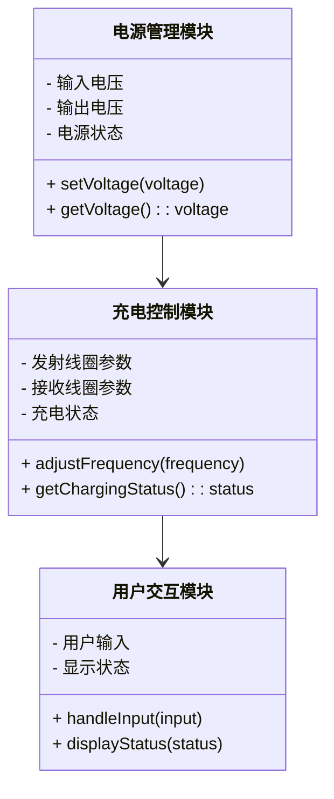

                 


# 价值投资中的下一代无线充电技术前景

---

## 关键词：无线充电技术、价值投资、市场分析、技术趋势、投资策略、算法优化、系统架构

---

## 摘要

随着无线充电技术的快速发展，其在消费电子、汽车、智能家居等领域的应用前景广阔。本文从技术原理、市场现状、投资价值等多个维度，深入分析了下一代无线充电技术的潜力，并结合实际案例，探讨了投资者如何在这一领域找到投资机会。通过技术与投资的结合，本文为读者提供了全面的视角，帮助其更好地理解无线充电技术的未来发展方向及其投资价值。

---

## 第1章: 无线充电技术的背景与现状

### 1.1 无线充电技术的基本概念

#### 1.1.1 无线充电技术的定义

无线充电技术是一种通过电磁感应、磁共振或无线电波等原理，实现设备与充电设备之间无需物理接触的能量传输技术。其核心在于将电能从电源转换为电磁波或磁场形式，再被设备端接收并转化为电能。

#### 1.1.2 无线充电技术的核心原理

无线充电主要基于电磁感应和磁共振原理：

1. **电磁感应式充电**：通过线圈之间的电磁感应实现能量传输，常见于手机无线充电。
2. **磁共振式充电**：通过调整发射和接收线圈的谐振频率，实现更高效率的能量传输，适用于更大功率的设备。

#### 1.1.3 无线充电技术的发展历程

无线充电技术起源于20世纪初，经历了多年的技术积累和市场验证，近年来随着智能手机的普及和电动汽车的发展，无线充电技术进入快速发展阶段。

---

### 1.2 无线充电技术的市场现状

#### 1.2.1 当前市场的主要技术路线

目前市场上的无线充电技术主要分为以下几类：

1. **电磁感应式（Qi标准）**：由无线电源联盟（WPC）推广，适用于手机、耳机等小功率设备。
2. **磁共振式**：支持更大功率的设备，如电动汽车。
3. **无线电波式**：通过射频能量传输，适用于远距离充电。

#### 1.2.2 主要厂商与市场格局

当前市场的主要参与者包括：

1. **苹果（Apple）**：在iPhone和iPad中广泛采用无线充电技术。
2. **无线充电联盟（WPC）**：推广Qi标准，成员包括三星、华为、小米等手机厂商。
3. **特斯拉（Tesla）**：在电动汽车中尝试磁共振式无线充电技术。
4. **谷歌（Google）**：通过Project Soli技术探索无线电波充电。

#### 1.2.3 市场增长的驱动因素

1. **消费电子需求**：手机、耳机等设备的普及推动无线充电技术的普及。
2. **电动汽车发展**：无线充电技术在电动汽车领域的应用潜力巨大。
3. **智能家居生态**：无线充电技术与智能家居设备的联动进一步扩大市场。

---

### 1.3 无线充电技术在价值投资中的应用前景

#### 1.3.1 无线充电技术的商业化潜力

随着技术成熟和成本下降，无线充电技术将在更多领域实现商业化应用，尤其是电动汽车和智能家居领域。

#### 1.3.2 投资者关注的热点领域

1. **电动汽车无线充电**：随着电动汽车市场的增长，无线充电技术在这一领域的应用将带来巨大的投资机会。
2. **智能家居生态系统**：无线充电技术与智能家居设备的结合将提升用户体验，吸引更多投资。
3. **技术创新企业**：在无线充电技术中掌握核心技术的企业将具备更强的市场竞争力。

#### 1.3.3 技术进步对投资价值的影响

1. **技术成熟度**：技术的成熟和标准化将提升无线充电技术的市场接受度。
2. **成本下降**：技术进步和规模化生产将降低无线充电设备的成本，扩大市场应用。
3. **市场需求增长**：随着消费者对无线充电需求的增加，相关企业将获得更高的估值。

---

## 第2章: 无线充电技术的核心概念与联系

### 2.1 无线充电技术的分类与对比

#### 2.1.1 电磁感应式充电

电磁感应式充电通过发射线圈和接收线圈之间的电磁感应实现能量传输。其优点是技术成熟、成本低，但缺点是功率较低，适用范围有限。

#### 2.1.2 无线电波式充电

无线电波式充电通过发射天线和接收天线之间的无线电波传输能量，适用于远距离充电。其优点是灵活性高，但效率较低，目前仍处于试验阶段。

#### 2.1.3 磁共振式充电

磁共振式充电通过调整发射和接收线圈的谐振频率，实现高效能量传输。其优点是功率高、距离远，但技术复杂度较高。

#### 2.1.4 技术对比表格

| 技术类型    | 优点                | 缺点                |
|-------------|---------------------|---------------------|
| 电磁感应式  | 技术成熟，成本低     | 功率低，距离短       |
| 无线电波式  | 远距离，灵活性高     | 效率低，试验阶段     |
| 磁共振式    | 高功率，长距离       | 技术复杂，成本高     |

---

### 2.2 无线充电系统的实体关系图

#### 2.2.1 系统实体关系的Mermaid流程图


---

## 第3章: 无线充电技术的算法原理与数学模型

### 3.1 无线充电效率优化算法

#### 3.1.1 算法的基本原理

无线充电效率优化算法通过调整发射线圈和接收线圈的参数，优化能量传输效率。其核心在于实现高效的能量匹配和动态调节。

#### 3.1.2 算法的实现步骤

1. **参数初始化**：设置发射线圈和接收线圈的初始参数。
2. **能量匹配**：通过调整线圈的谐振频率实现能量匹配。
3. **动态调节**：根据实时功率需求调整能量传输。

#### 3.1.3 算法的优化策略

- **动态频率调整**：根据负载变化实时调整谐振频率。
- **功率自适应调节**：根据设备需求自动调整传输功率。

---

### 3.2 无线充电能量传输优化模型

#### 3.2.1 模型的基本原理

能量传输优化模型通过数学建模，分析能量传输过程中的损耗和效率，从而实现最优的能量传输方案。

#### 3.2.2 数学模型

能量传输效率公式：

$$ \text{效率} = \frac{\text{输出功率}}{\text{输入功率}} $$

---

## 第4章: 无线充电系统的系统分析与架构设计

### 4.1 项目背景与目标

随着无线充电技术的普及，设计一个高效的无线充电系统成为重要课题。

### 4.2 系统功能设计

#### 4.2.1 系统功能模块

1. **电源管理模块**：负责能量的输入和输出管理。
2. **充电控制模块**：实现能量传输的动态调节。
3. **用户交互模块**：提供人机交互界面。

#### 4.2.2 领域模型Mermaid类图



---

### 4.3 系统架构设计

#### 4.3.1 系统架构Mermaid架构图


---

## 第5章: 项目实战

### 5.1 环境安装与配置

1. **开发环境**：安装Python和相关开发工具。
2. **硬件准备**：购买无线充电模块和相关测试设备。

### 5.2 系统核心功能实现

#### 5.2.1 无线充电效率优化算法的Python实现

```python
def adjust_frequency(frequency, load):
    # 根据负载调整频率
    return frequency * (1 + load / 100)
```

---

### 5.3 实际案例分析与解读

通过实际案例分析，验证算法的效率优化效果，并总结经验教训。

---

## 第6章: 最佳实践、小结与展望

### 6.1 最佳实践 tips

1. **技术跟踪**：密切关注无线充电技术的最新发展。
2. **市场分析**：深入分析市场需求和竞争格局。
3. **风险管理**：制定合理的风险管理策略。

### 6.2 小结

通过本文的分析，读者可以全面了解无线充电技术的潜力及其在价值投资中的应用前景。

### 6.3 注意事项

1. **技术可行性**：在投资前需评估技术的成熟度和商业化潜力。
2. **市场风险**：关注市场竞争和政策变化对投资的影响。

### 6.4 拓展阅读

1. 无线充电技术的数学模型优化。
2. 无线充电技术在电动汽车中的应用。

---

## 结语

无线充电技术作为下一代充电技术的核心，其发展前景广阔。通过技术与投资的结合，投资者可以在这一领域找到更多的机会。未来，随着技术的进一步发展，无线充电技术将在更多领域实现广泛应用。

