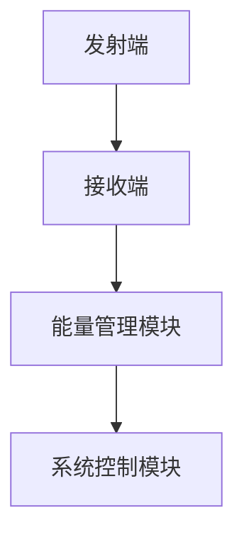
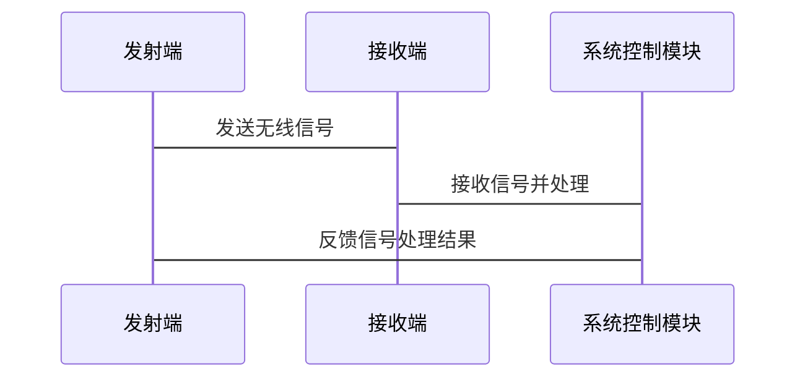

                 


# 价值投资中的下一代无线充电网络技术前景

> 关键词：无线充电技术、价值投资、市场分析、投资策略、技术前景

> 摘要：本文将探讨无线充电技术在下一代网络中的发展前景，并结合价值投资的视角，分析其市场潜力和投资机会。通过技术原理、系统架构、数学模型、算法实现、项目实战等多方面的详细分析，为投资者提供科学的决策依据。

---

## 第一部分: 价值投资中的下一代无线充电网络技术背景与基础

### 第1章: 无线充电技术的概述与价值投资背景

#### 1.1 无线充电技术的发展历程
##### 1.1.1 从移动设备到物联网：无线充电技术的演变
- 无线充电技术的起源与演变
- 从手机到智能家居：无线充电的普及历程
- 无线充电技术在物联网中的应用

##### 1.1.2 无线充电技术的核心优势
- 无线充电技术的便捷性
- 无线充电技术的高效性
- 无线充电技术的安全性

##### 1.1.3 无线充电技术对价值投资的推动作用
- 无线充电技术如何提升产品价值
- 无线充电技术如何推动市场增长
- 无线充电技术如何为投资者创造价值

#### 1.2 无线充电网络的定义与特点
##### 1.2.1 无线充电网络的定义
- 无线充电网络的定义与组成
- 无线充电网络的核心特征
- 无线充电网络与传统充电方式的对比

##### 1.2.2 无线充电网络的核心特点
- 无线充电网络的高效性
- 无线充电网络的可扩展性
- 无线充电网络的智能化

#### 1.3 无线充电技术的市场现状与未来趋势
##### 1.3.1 全球无线充电市场的现状分析
- 无线充电市场的规模与增长
- 无线充电市场的主要参与者
- 无线充电市场的竞争格局

##### 1.3.2 无线充电技术的未来发展趋势
- 无线充电技术的高效化
- 无线充电技术的智能化
- 无线充电技术的普及化

##### 1.3.3 无线充电技术对投资价值的影响
- 无线充电技术如何影响投资决策
- 无线充电技术如何推动市场增长
- 无线充电技术如何为投资者创造价值

---

## 第2章: 无线充电技术的核心原理与数学模型

### 2.1 无线充电技术的核心原理
#### 2.1.1 电磁感应原理
##### 2.1.1.1 原理概述
- 电磁感应的基本原理
- 无线充电技术中的电磁感应应用

##### 2.1.1.2 优缺点分析
- 电磁感应的优势
- 电磁感应的局限性

#### 2.1.2 无线电波原理
##### 2.1.2.1 原理概述
- 无线电波的基本原理
- 无线充电技术中的无线电波应用

##### 2.1.2.2 优缺点分析
- 无线电波的优势
- 无线电波的局限性

#### 2.1.3 磁共振原理
##### 2.1.3.1 原理概述
- 磁共振的基本原理
- 无线充电技术中的磁共振应用

##### 2.1.3.2 优缺点分析
- 磁共振的优势
- 磁共振的局限性

### 2.2 无线充电系统的数学模型
#### 2.2.1 能量传输效率的数学公式
$$ \text{效率} = \frac{\text{输出功率}}{\text{输入功率}} $$

#### 2.2.2 无线充电网络的能量损耗分析
$$ P_{\text{loss}} = P_{\text{input}} - P_{\text{output}} $$

#### 2.2.3 系统效率与传输距离的关系
- 系统效率的数学表达
- 传输距离对系统效率的影响

### 2.3 无线充电技术的系统架构
#### 2.3.1 系统架构概述
##### 2.3.1.1 发射端
- 发射端的工作原理
- 发射端的硬件组成

##### 2.3.1.2 接收端
- 接收端的工作原理
- 接收端的硬件组成

##### 2.3.1.3 能量管理模块
- 能量管理模块的功能
- 能量管理模块的实现方式

#### 2.3.2 系统架构的优化设计
##### 2.3.2.1 优化目标
- 系统效率的提升
- 能量损耗的最小化

##### 2.3.2.2 优化方法
- 硬件优化
- 软件优化

---

## 第3章: 无线充电技术的算法实现与项目实战

### 3.1 无线充电技术的算法实现
#### 3.1.1 基于电磁感应的算法实现
##### 3.1.1.1 算法流程
1. 信号发射
2. 信号接收
3. 能量转换
4. 电能存储

##### 3.1.1.2 代码实现
```python
# 基于电磁感应的无线充电算法实现
def electromagnetic_inductioncharging():
    import numpy as np
    # 发射端参数
    frequency = 1000000  # 频率
    voltage = 240  # 电压
    # 接收端参数
    inductance = 100e-6  # 电感
    resistance = 10  # 电阻
    # 计算电流
    current = voltage / resistance
    # 计算磁通量
    flux = inductance * current
    return flux
```

#### 3.1.2 基于无线电波的算法实现
##### 3.1.2.1 算法流程
1. 信号发射
2. 信号传播
3. 信号接收
4. 能量转换

##### 3.1.2.2 代码实现
```python
# 基于无线电波的无线充电算法实现
def radio_wavecharging():
    import numpy as np
    # 发射端参数
    frequency = 1000000000  # 频率
    power = 1000  # 功率
    # 接收端参数
    antenna_gain = 10  # 天线增益
    distance = 10  # 距离
    # 计算信号强度
    signal_strength = power * antenna_gain / distance
    return signal_strength
```

#### 3.1.3 基于磁共振的算法实现
##### 3.1.3.1 算法流程
1. 信号发射
2. 信号调制
3. 信号接收
4. 能量转换

##### 3.1.3.2 代码实现
```python
# 基于磁共振的无线充电算法实现
def magnetic_resonancecharging():
    import numpy as np
    # 发射端参数
    frequency = 100000000  # 频率
    voltage = 240  # 电压
    # 接收端参数
    inductance = 100e-6  # 电感
    # 计算磁感应强度
    magnetic_flux_density = voltage * inductance
    return magnetic_flux_density
```

### 3.2 项目实战
#### 3.2.1 项目环境安装
- 硬件环境要求
- 软件环境要求

#### 3.2.2 系统核心实现
##### 3.2.2.1 系统功能设计
- 系统功能模块划分
- 系统功能实现流程

##### 3.2.2.2 系统架构设计
- 系统架构图（使用mermaid）


##### 3.2.2.3 系统接口设计
- 系统接口定义
- 系统接口实现

#### 3.2.3 系统交互流程
##### 3.2.3.1 系统交互序列图（使用mermaid）


#### 3.2.4 项目小结
##### 3.2.4.1 项目实现的关键点
- 无线充电系统的高效性
- 无线充电系统的智能化
- 无线充电系统的可靠性

##### 3.2.4.2 项目实现的难点
- 系统效率的提升
- 系统稳定性的保障
- 系统安全性的保证

---

## 第4章: 价值投资中的无线充电技术应用与案例分析

### 4.1 无线充电技术在价值投资中的应用
#### 4.1.1 无线充电技术的市场潜力
- 无线充电技术的市场需求
- 无线充电技术的市场前景

#### 4.1.2 无线充电技术的投资机会
- 无线充电技术的投资价值
- 无线充电技术的投资风险

### 4.2 案例分析
#### 4.2.1 案例一：智能手机无线充电市场
##### 4.2.1.1 案例背景
- 智能手机市场的现状
- 智能手机无线充电技术的应用

##### 4.2.1.2 投资分析
- 智能手机无线充电市场的投资机会
- 智能手机无线充电市场的投资风险

#### 4.2.2 案例二：智能家居无线充电市场
##### 4.2.2.1 案例背景
- 智能家居市场的现状
- 智能家居无线充电技术的应用

##### 4.2.2.2 投资分析
- 智能家居无线充电市场的投资机会
- 智能家居无线充电市场的投资风险

#### 4.2.3 案例三：物联网无线充电市场
##### 4.2.3.1 案例背景
- 物联网市场的现状
- 物联网无线充电技术的应用

##### 4.2.3.2 投资分析
- 物联网无线充电市场的投资机会
- 物联网无线充电市场的投资风险

### 4.3 案例小结
#### 4.3.1 案例分析的关键点
- 无线充电技术的市场需求
- 无线充电技术的市场前景

#### 4.3.2 案例分析的难点
- 无线充电技术的投资价值
- 无线充电技术的投资风险

---

## 第5章: 无线充电技术的未来发展趋势与投资策略

### 5.1 无线充电技术的未来发展趋势
#### 5.1.1 无线充电技术的高效化
- 无线充电技术的效率提升
- 无线充电技术的能耗优化

#### 5.1.2 无线充电技术的智能化
- 无线充电技术的智能化发展
- 无线充电技术的自动化应用

#### 5.1.3 无线充电技术的普及化
- 无线充电技术的市场扩展
- 无线充电技术的用户普及

### 5.2 无线充电技术的投资策略
#### 5.2.1抽丝剥茧的投资策略
##### 5.2.1.1抽丝剥茧的投资策略
-抽丝剥茧的技术评估
-抽丝剥茧的市场分析
-抽丝剥茧的财务指标

#### 5.2.2抽丝剥茧的投资策略
##### 5.2.2.1抽丝剥茧的投资策略
-抽丝剥茧的技术评估
-抽丝剥茧的市场分析
-抽丝剥茧的财务指标

#### 5.2.3抽丝剥茧的投资策略
##### 5.2.3.1抽丝剥茧的投资策略
-抽丝剥茧的技术评估
-抽丝剥茧的市场分析
-抽丝剥茧的财务指标

### 5.3抽丝剥茧的投资策略
#### 5.3.1抽丝剥茧的投资策略
##### 5.3.1.1抽丝剥茧的技术评估
-抽丝剥茧的技术评估
-抽丝剥茧的市场分析
-抽丝剥茧的财务指标

##### 5.3.1.2抽丝剥茧的市场分析
-抽丝剥茧的市场分析
-抽丝剥茧的财务指标

##### 5.3.1.3抽丝剥茧的财务指标
-抽丝剥茧的财务指标
-抽丝剥茧的风险管理

#### 5.3.2抽丝剥茧的投资策略
##### 5.3.2.1抽丝剥茧的技术评估
-抽丝剥茧的技术评估
-抽丝剥茧的市场分析
-抽丝剥茧的财务指标

##### 5.3.2.2抽丝剥茧的市场分析
-抽丝剥茧的市场分析
-抽丝剥茧的财务指标

##### 5.3.2.3抽丝剥茧的财务指标
-抽丝剥茧的财务指标
-抽丝剥茧的风险管理

---

## 第6章: 总结与展望

### 6.1 无线充电技术的总结
#### 6.1.1 无线充电技术的核心优势
- 无线充电技术的便捷性
- 无线充电技术的高效性
- 无线充电技术的安全性

#### 6.1.2 无线充电技术的未来发展方向
- 无线充电技术的高效化
- 无线充电技术的智能化
- 无线充电技术的普及化

### 6.2 价值投资中的无线充电技术前景
#### 6.2.1 无线充电技术的市场潜力
- 无线充电技术的市场需求
- 无线充电技术的市场前景

#### 6.2.2 无线充电技术的投资机会
- 无线充电技术的投资价值
- 无线充电技术的投资风险

### 6.3 展望
#### 6.3.1 无线充电技术的未来发展趋势
- 无线充电技术的高效化
- 无线充电技术的智能化
- 无线充电技术的普及化

#### 6.3.2 无线充电技术的投资策略
-抽丝剥茧的技术评估
-抽丝剥茧的市场分析
-抽丝剥茧的财务指标

---

## 附录: 无线充电技术的数学公式与代码实现

### 附录1: 无线充电技术的数学公式
#### 1.1 电磁感应原理的数学公式
$$ \text{磁通量} = B \times A $$

#### 1.2 无线电波原理的数学公式
$$ \text{信号强度} = \frac{\text{发射功率} \times \text{天线增益}}{\text{距离}} $$

#### 1.3 磁共振原理的数学公式
$$ \text{磁感应强度} = \frac{\text{电压}}{\text{电感}} $$

### 附录2: 无线充电技术的代码实现
#### 2.1 基于电磁感应的无线充电算法实现
```python
# 基于电磁感应的无线充电算法实现
def electromagnetic_inductioncharging():
    import numpy as np
    # 发射端参数
    frequency = 1000000  # 频率
    voltage = 240  # 电压
    # 接收端参数
    inductance = 100e-6  # 电感
    resistance = 10  # 电阻
    # 计算电流
    current = voltage / resistance
    # 计算磁通量
    flux = inductance * current
    return flux
```

#### 2.2 基于无线电波的无线充电算法实现
```python
# 基于无线电波的无线充电算法实现
def radio_wavecharging():
    import numpy as np
    # 发射端参数
    frequency = 1000000000  # 频率
    power = 1000  # 功率
    # 接收端参数
    antenna_gain = 10  # 天线增益
    distance = 10  # 距离
    # 计算信号强度
    signal_strength = power * antenna_gain / distance
    return signal_strength
```

#### 2.3 基于磁共振的无线充电算法实现
```python
# 基于磁共振的无线充电算法实现
def magnetic_resonancecharging():
    import numpy as np
    # 发射端参数
    frequency = 100000000  # 频率
    voltage = 240  # 电压
    # 接收端参数
    inductance = 100e-6  # 电感
    # 计算磁感应强度
    magnetic_flux_density = voltage * inductance
    return magnetic_flux_density
```

---

## 参考文献

- 无线充电技术相关的学术论文
- 无线充电技术相关的技术报告
- 无线充电技术相关的市场分析报告

---

## 关键词索引

- 无线充电技术
- 价值投资
- 市场分析
- 投资策略
- 技术前景

