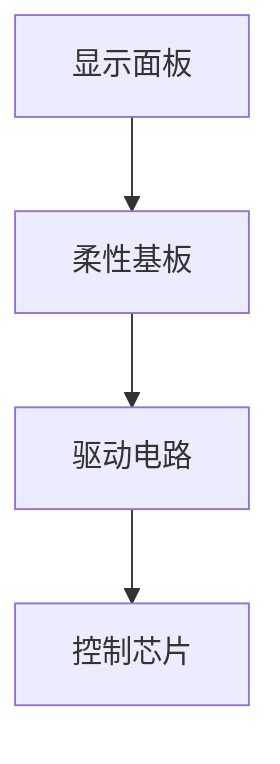

                 


```markdown
# 价值投资中的下一代柔性显示技术前景

> 关键词：价值投资，柔性显示，技术前景，投资策略，市场分析

> 摘要：本文从价值投资的角度深入分析了下一代柔性显示技术的市场前景和投资价值，结合技术原理、产业链分析和市场趋势，为投资者提供了详细的投资策略和风险评估。

---

# 第一部分：背景与核心概念

## 第1章：价值投资的核心理念

### 1.1 价值投资的定义与特点
- 价值投资的定义：寻找被市场低估的资产，长期持有，通过企业内在价值的增长实现收益。
- 价值投资的特点：注重基本面分析、长期持有、逆向思维。
- 柔性显示技术的定义：一种新型显示技术，具有可弯曲、轻薄、高分辨率等特点。

### 1.2 柔性显示技术的市场现状
- 柔性显示技术的定义：柔性显示技术是一种基于柔性基板的显示技术，能够实现屏幕的弯曲、折叠和卷曲。
- 柔性显示技术的关键材料：OLED（有机发光二极管）、柔性基板、驱动电路等。
- 柔性显示技术的产业链：从上游材料供应到下游应用市场，涵盖多个环节。

---

## 第2章：柔性显示技术的核心原理

### 2.1 柔性显示技术的基本原理
- 柔性显示的定义：柔性显示是一种基于柔性基板的显示技术，具有可弯曲、可折叠的特点。
- 柔性显示的关键技术：OLED显示技术、柔性基板制备技术、驱动电路设计技术。
- 柔性显示的制造流程：包括基板制备、OLED蒸镀、封装等步骤。

### 2.2 柔性显示技术的核心优势
- 轻薄化与可弯折性：柔性显示技术能够实现屏幕的弯曲和折叠，适用于可穿戴设备和柔性电子产品的应用。
- 高分辨率与色彩还原度：柔性显示技术能够实现高分辨率和高色彩还原度，提供更好的视觉体验。
- 节能与环保特性：柔性显示技术具有低功耗和环保特性，符合绿色科技的发展趋势。

---

## 第3章：柔性显示技术的产业链分析

### 3.1 产业链的构成与分工
- 上游材料供应商：包括柔性基板材料、OLED材料、驱动芯片等。
- 中游面板制造商：包括OLED面板制造、柔性显示面板封装等。
- 下游应用市场：包括智能手机、平板电脑、可穿戴设备、汽车电子等领域。

### 3.2 产业链的关键环节与技术壁垒
- 柔性基板的制备技术：柔性基板是柔性显示技术的核心材料，其制备技术是技术壁垒之一。
- OLED显示技术的核心专利：OLED技术的核心专利主要集中在少数几家企业，形成技术壁垒。
- 柔性显示的封装与测试技术：封装技术是柔性显示技术的重要环节，直接影响产品的可靠性和寿命。

---

# 第二部分：价值投资分析与技术前景

## 第4章：柔性显示技术的市场价值评估

### 4.1 市场需求的驱动因素
- 消费电子市场的增长潜力：随着智能手机、平板电脑等消费电子产品的升级换代，柔性显示技术的应用需求不断增加。
- 智能穿戴设备的普及趋势：智能手表、智能眼镜等可穿戴设备的普及为柔性显示技术提供了广阔的市场空间。
- 汽车电子与物联网应用的扩展：汽车电子和物联网设备的增加也为柔性显示技术的应用提供了新的机会。

### 4.2 技术发展的驱动因素
- 创新研发的投入与成果：企业对柔性显示技术的研发投入不断增加，技术创新不断涌现。
- 技术标准的制定与完善：行业标准的制定和完善为柔性显示技术的商业化提供了保障。
- 行业合作与生态系统的建设：企业之间的合作和生态系统的建设促进了柔性显示技术的快速发展。

---

## 第5章：价值投资中的技术前景分析

### 5.1 柔性显示技术的未来发展趋势
- 技术路线的选择与优化：随着技术的不断进步，企业需要不断优化技术路线，降低成本，提高效率。
- 新材料与新工艺的创新应用：新材料和新工艺的应用将推动柔性显示技术的进一步发展。
- 柔性显示技术的商业化进程：随着技术的成熟和成本的降低，柔性显示技术的商业化进程将加速。

### 5.2 技术风险与投资策略
- 技术失败的风险评估：技术失败可能导致投资损失，需要进行充分的风险评估。
- 市场竞争的加剧影响：随着市场竞争的加剧，企业利润空间可能受到挤压，需要制定合理的竞争策略。
- 投资组合的优化与风险管理：投资者需要根据市场变化和个人风险承受能力，优化投资组合，分散风险。

---

# 第三部分：系统分析与架构设计

## 第6章：柔性显示技术的系统架构分析

### 6.1 系统功能模块划分
- 显示屏功能模块：包括OLED显示面板、驱动电路等。
- 柔性基板功能模块：包括柔性基板材料、制备工艺等。
- 驱动电路功能模块：包括驱动芯片、电路设计等。

### 6.2 系统架构的实体关系图


---

## 第7章：系统架构设计与实现

### 7.1 系统架构设计
- 系统功能设计：包括显示功能、驱动功能、用户交互功能等。
- 系统架构图：使用Mermaid绘制系统架构图，展示各模块之间的关系和交互。

### 7.2 系统接口设计
- 显示面板接口：包括电源接口、数据接口等。
- 驱动电路接口：包括控制接口、电源接口等。

### 7.3 系统交互设计
- 用户交互流程：包括用户输入、系统响应、显示输出等。
- 使用Mermaid绘制系统交互图，展示用户与系统的交互过程。

---

## 第8章：项目实战与案例分析

### 8.1 环境安装与配置
- 开发环境的搭建：包括软件工具的安装与配置。
- 开发平台的选择：例如使用Arduino或Raspberry Pi进行开发。

### 8.2 核心实现与代码示例
- 显示面板的控制代码：例如OLED显示面板的控制代码示例。
- 柔性基板的制备工艺：例如柔性基板的制备步骤和工艺流程。

### 8.3 实际案例分析
- 柔性显示技术在智能手表中的应用：分析某款智能手表的柔性显示技术实现和市场表现。
- 柔性显示技术在汽车电子中的应用：分析某款汽车电子设备的柔性显示技术实现和市场表现。

---

## 第9章：最佳实践与投资建议

### 9.1 投资策略与风险管理
- 理性投资：避免盲目跟风，注重基本面分析。
- 分散投资：通过分散投资降低风险，提高收益稳定性。

### 9.2 技术发展与投资机会
- 关注技术创新：投资具有技术创新能力的企业。
- 关注市场应用：投资具有广泛应用前景的企业。

### 9.3 注意事项与拓展阅读
- 注意市场波动：市场波动较大，投资者需保持冷静。
- 拓展阅读：推荐阅读相关领域的书籍和报告，如《价值投资实战》、《柔性显示技术发展报告》等。

---

# 结语

通过本文的分析，我们可以看到，下一代柔性显示技术具有广阔的发展前景和投资价值。投资者需要结合技术发展、市场趋势和企业基本面进行综合分析，制定合理的投资策略，抓住技术变革带来的投资机会。

---

# 附录

## 附录A：相关技术术语解释
- OLED：Organic Light-Emitting Diode，有机发光二极管。
- 柔性基板：一种柔性材料，用于支撑和保护显示面板。

## 附录B：相关公式与模型

### 1. 市盈率（P/E）计算公式
$$ \text{市盈率} = \frac{\text{股价}}{\text{每股收益}} $$

### 2. 现金流折现模型（DCF）
$$ \text{企业价值} = \sum_{t=1}^{n} \frac{\text{自由现金流}}{(1 + r)^t} $$

---

以上是完整的目录大纲，涵盖了从背景分析到系统设计，再到投资策略的各个方面，为投资者提供了全面的视角和深度的技术分析。
```

