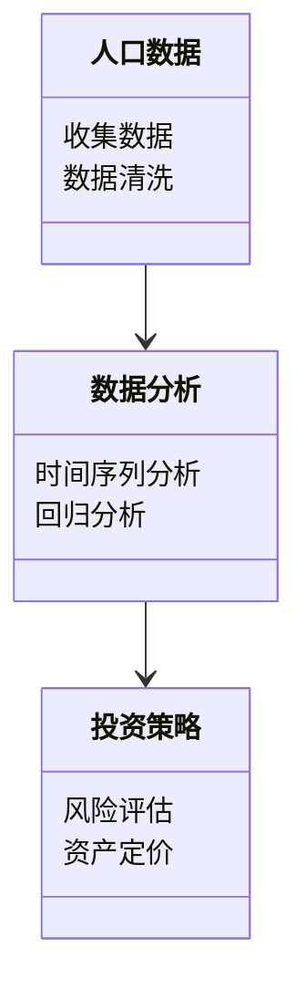

                 


# 价值投资中的人口趋势分析

## 关键词
价值投资, 人口趋势, 经济发展, 投资策略, 人口结构, 技术进步

## 摘要
本文探讨了人口趋势对价值投资的重要影响，分析了不同人口结构对经济和投资决策的影响，结合数学模型和实际案例，提出了一套基于人口趋势的价值投资策略。

---

## 第1章: 人口趋势分析的背景与重要性

### 1.1 人口趋势分析的定义与核心概念

#### 1.1.1 人口趋势分析的基本概念
人口趋势分析是指通过研究人口数量、结构和分布的变化规律，预测未来人口动态的过程。其核心在于分析年龄、性别、家庭结构等因素的变化对经济和社会的影响。

#### 1.1.2 人口趋势对投资决策的影响
人口趋势直接影响劳动力市场、消费习惯和政府政策，进而影响企业的盈利能力和投资环境。例如，人口老龄化可能导致医疗和养老服务需求增加，从而影响相关行业的投资价值。

#### 1.1.3 人口结构与经济发展之间的关系
人口结构通过影响劳动力供给、消费能力和社会福利支出，对经济发展产生深远影响。合理的年龄分布能够促进经济增长，而人口结构失衡可能导致经济问题。

### 1.2 人口趋势分析的背景与现状

#### 1.2.1 当前全球人口趋势的特征
全球人口增长放缓，老龄化加剧，年轻人口比例下降。这些变化影响了各国的经济发展模式和政策制定。

#### 1.2.2 人口老龄化与少子化的全球现象
许多国家面临人口老龄化和生育率下降的问题，这导致社会保障压力增加，劳动力市场紧张。

#### 1.2.3 技术进步对人口结构的影响
技术进步改变了劳动分工，提高了生产效率，但也可能导致部分行业劳动力需求减少，进而影响人口结构。

### 1.3 价值投资与人口趋势的结合

#### 1.3.1 价值投资的基本原理
价值投资强调购买被市场低估的资产，长期持有的投资策略。其核心在于识别具有持续增长潜力的企业。

#### 1.3.2 人口趋势对价值投资策略的影响
人口趋势影响企业的盈利能力和行业前景。例如，老龄化社会可能增加医疗和养老服务的需求，从而提升相关行业的投资价值。

#### 1.3.3 人口趋势分析在投资中的应用前景
通过分析人口趋势，投资者可以更好地预测行业发展趋势，识别具有长期增长潜力的企业，从而制定更有效的投资策略。

---

## 第2章: 人口结构分析的核心概念与联系

### 2.1 人口结构的核心要素

#### 2.1.1 年龄结构
年龄结构是人口结构的核心要素之一，包括儿童、劳动力年龄和老年人口的比例。不同年龄组的人口对经济的影响不同。

#### 2.1.2 性别比例
性别比例影响劳动力市场和家庭结构，进而影响消费和投资行为。

#### 2.1.3 家庭结构
家庭结构的变化影响消费模式和住房需求，进而影响房地产和相关行业的投资价值。

### 2.2 人口结构与经济发展的关系

#### 2.2.1 不同年龄段人口对经济的贡献
劳动力年龄人口是经济增长的主要动力，而老年人口则需要更多的社会支出。儿童人口比例高可能导致教育需求增加。

#### 2.2.2 人口红利与人口负债的经济学分析
人口红利是指劳动力年龄人口比例较高，能够推动经济增长。而人口负债则指老龄化导致的社会支出增加和劳动力不足。

#### 2.2.3 人口结构对企业投资的影响
人口结构影响市场需求和劳动力供给，进而影响企业的盈利能力和投资决策。

### 2.3 人口结构分析的数学模型

#### 2.3.1 年龄分布的数学模型
年龄分布可以用概率分布模型描述，例如正态分布或泊松分布。

#### 2.3.2 人口增长的指数模型
人口增长可以用指数增长模型预测，公式为：
$$ P(t) = P_0 \times e^{rt} $$
其中，\( P(t) \) 是 t 时间点的人口数量，\( P_0 \) 是初始人口，\( r \) 是增长率。

#### 2.3.3 人口结构与经济产出的关系公式
经济产出与人口结构密切相关，可以用生产函数模型表示：
$$ Y = A \times K^{α} \times L^{1-α} $$
其中，\( Y \) 是产出，\( A \) 是技术进步，\( K \) 是资本，\( L \) 是劳动力，\( α \) 是资本的产出弹性。

---

## 第3章: 人口趋势分析的算法原理

### 3.1 人口趋势预测的常用算法

#### 3.1.1 时间序列分析
时间序列分析用于预测未来的人口趋势，常用ARIMA模型。其步骤如下：

1. 数据收集与预处理
2. 模型选择与参数估计
3. 模型验证与预测

示例代码：
```python
from statsmodels.tsa.arima_model import ARIMA
import pandas as pd

data = pd.read_csv('population.csv')
model = ARIMA(data['population'], order=(1,1,1))
model_fit = model.fit()
forecast = model_fit.forecast(steps=5)
print(forecast)
```

#### 3.1.2 马尔可夫链模型
马尔可夫链模型用于分析人口状态转移，例如年龄组的变化。其核心是状态转移矩阵。

#### 3.1.3 灰色系统理论
灰色系统理论用于处理不确定性问题，适用于人口趋势预测。其基本步骤包括：

1. 数据预处理
2. 构建灰色模型
3. 预测与验证

### 3.2 人口结构与投资决策的关联分析

#### 3.2.1 回归分析
回归分析用于研究人口结构与投资回报之间的关系。例如，可以用线性回归模型预测企业盈利与人口结构的关系：
$$ Y = β_0 + β_1X + ε $$

#### 3.2.2 聚类分析
聚类分析用于将不同地区的人口结构进行分类，进而分析其投资潜力。

#### 3.2.3 网络分析
网络分析用于研究人口流动和经济联系，例如绘制人口迁移网络图。

### 3.3 基于人口趋势的金融模型构建

#### 3.3.1 人口驱动的资产定价模型
资产定价模型考虑人口因素的影响，例如：
$$ P = r \times (1 + g)^{-n} $$
其中，\( P \) 是资产价格，\( r \) 是收益率，\( g \) 是增长率，\( n \) 是时间。

#### 3.3.2 人口因素在风险评估中的应用
风险评估模型考虑人口结构对违约率的影响，例如：
$$ PD = α + β \times人口结构变量 + ε $$

#### 3.3.3 人口结构与市场周期的关系
市场周期与人口结构密切相关，例如，年轻人口比例高的时期可能更适合科技投资。

---

## 第4章: 人口趋势分析的系统架构与设计

### 4.1 系统分析与架构设计

#### 4.1.1 问题场景介绍
系统用于分析人口趋势对投资的影响，帮助投资者制定策略。

#### 4.1.2 系统功能设计（领域模型）
领域模型包括数据采集、分析、预测和可视化功能。



#### 4.1.3 系统架构设计（架构图）
```mermaid
client --> 人口数据采集层
人口数据采集层 --> 数据处理层
数据处理层 --> 数据分析层
数据分析层 --> 投资策略层
投资策略层 --> 可视化层
```

### 4.2 系统接口与交互设计

#### 4.2.1 数据接口设计
API接口用于数据输入和输出，例如：
- 输入接口：/api/population/data
- 输出接口：/api/population/forecast

#### 4.2.2 用户交互流程
用户输入数据，系统进行分析，输出结果。

#### 4.2.3 系统监控与反馈机制
系统实时监控数据更新和模型性能，及时反馈结果。

---

## 第5章: 人口趋势分析的项目实战

### 5.1 项目环境与工具安装

#### 5.1.1 数据获取与处理工具
常用工具包括Python的pandas和NumPy库。

#### 5.1.2 数据分析与建模工具
常用工具包括Python的statsmodels和scikit-learn库。

#### 5.1.3 投资分析与模拟工具
常用工具包括Excel和Python的Pandas库。

### 5.2 核心算法实现与代码解读

#### 5.2.1 时间序列预测代码示例
```python
from statsmodels.tsa.arima_model import ARIMA
import pandas as pd

data = pd.read_csv('population.csv')
model = ARIMA(data['population'], order=(1,1,1))
model_fit = model.fit()
forecast = model_fit.forecast(steps=5)
print(forecast)
```

#### 5.2.2 回归分析代码示例
```python
import statsmodels.api as sm

X = data['population']
Y = data['investment']
model = sm.OLS(Y, sm.add_constant(X))
results = model.fit()
print(results.summary())
```

#### 5.2.3 网络分析代码示例
```python
import networkx as nx

G = nx.DiGraph()
G.add_edges_from([('A', 'B'), ('B', 'C')])
nx.draw(G)
plt.show()
```

### 5.3 实际案例分析与结果解读

#### 5.3.1 典型国家的人口趋势分析
以中国为例，分析其人口老龄化趋势对医疗行业的投资影响。

#### 5.3.2 人口趋势对投资策略的影响
基于人口趋势预测，调整投资组合，例如增加医疗和养老服务行业的配置。

#### 5.3.3 投资组合优化的案例分析
根据人口趋势分析结果，优化投资组合，降低风险，提高收益。

---

## 第6章: 人口趋势分析的数学模型与公式

### 6.1 人口增长的数学模型

#### 6.1.1 指数增长模型
$$ P(t) = P_0 \times e^{rt} $$

#### 6.1.2 对数增长模型
$$ \ln(P(t)) = \ln(P_0) + rt $$

### 6.2 人口结构与经济产出的关系公式
$$ Y = A \times K^{α} \times L^{1-α} $$

### 6.3 人口驱动的资产定价模型
$$ P = r \times (1 + g)^{-n} $$

---

## 总结

人口趋势分析是价值投资的重要组成部分，通过分析人口结构和趋势，投资者可以更好地把握市场动态，制定有效的投资策略。本文通过理论分析、算法实现和实际案例，展示了如何利用人口趋势进行投资决策。

---

## 参考文献

1. 葛兰维恩. 《投资的真谛》
2. 弗里德曼. 《人口经济学》
3. 国家统计局数据

---

## 附录

### 附录1: 数据来源与处理方法

### 附录2: 常用工具与代码示例

### 附录3: 进一步阅读的书籍与资源

---

通过以上内容，您可以全面了解《价值投资中的人口趋势分析》的核心概念、算法原理和实际应用。

