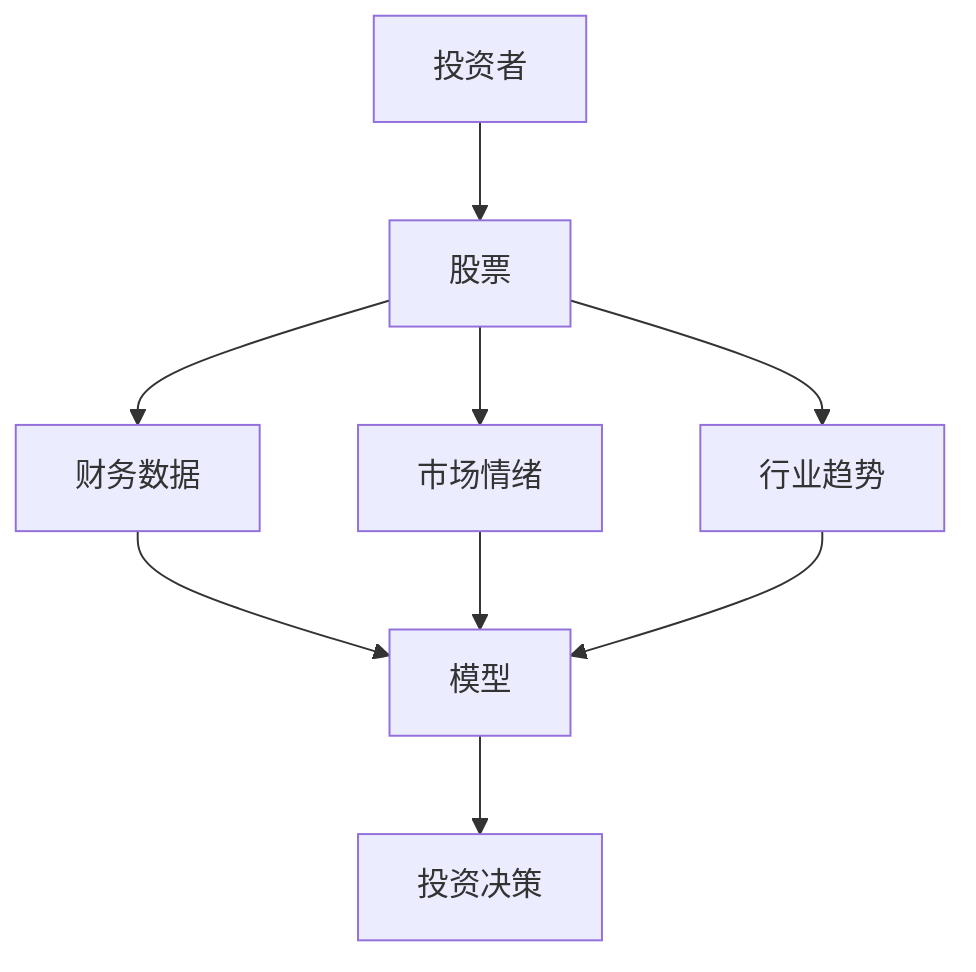
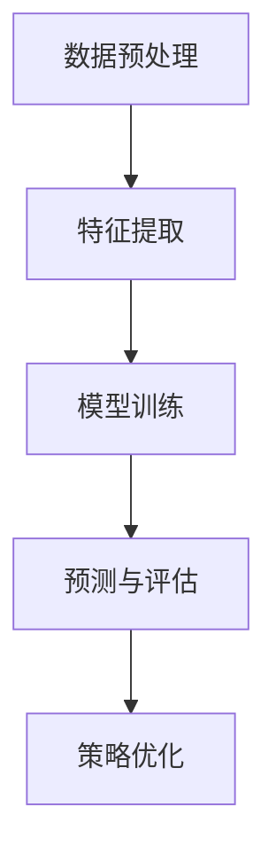
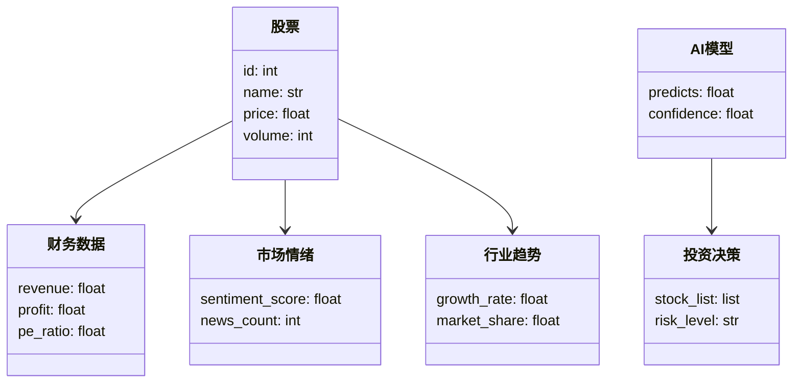
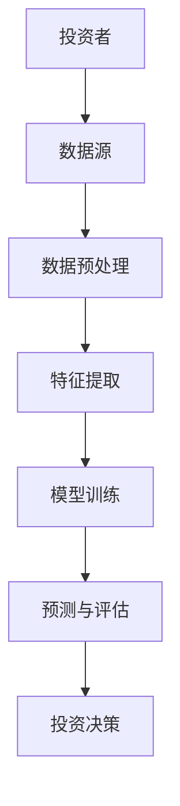
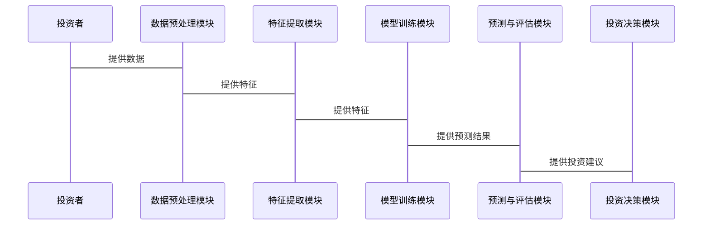

                 


# 价值投资中的人工智能应用评估

> 关键词：价值投资，人工智能，股票分析，算法交易，数据驱动投资

> 摘要：本文探讨了人工智能在价值投资中的应用，分析了人工智能如何通过数据处理、特征工程和模型预测等技术手段提升投资决策的效率和准确性。文章详细介绍了相关的核心概念、算法原理、系统架构以及实际案例，并提出了最佳实践建议。

---

## 第一部分: 价值投资与人工智能的结合概述

### 第1章: 价值投资与人工智能的结合背景

#### 1.1 价值投资的核心概念

##### 1.1.1 价值投资的定义与特点
价值投资是一种投资策略，核心在于通过分析企业的基本面（如财务状况、行业地位、盈利能力等），寻找市场价格低于其内在价值的股票。其特点包括：
- **长期视角**：关注企业的长期价值，而非短期市场波动。
- **安全边际**：强调以低于内在价值的价格买入股票，以降低风险。
- **逆向思维**：在市场恐慌时寻找被低估的机会，在市场狂热时保持冷静。

##### 1.1.2 价值投资的基本原理
价值投资的理论基础源于本杰明·格雷厄姆和戴维·多德的“安全边际”理论，核心在于寻找市场价格与内在价值的偏差。内在价值的计算通常基于企业的盈利能力、成长潜力和行业地位。

##### 1.1.3 价值投资在现代金融中的地位
尽管价值投资在传统金融学中占据重要地位，但其依赖人工分析和判断的特性使其在大数据时代面临效率和覆盖面的局限性。人工智能的引入，为价值投资提供了新的可能性。

#### 1.2 人工智能在金融领域的应用背景

##### 1.2.1 人工智能的定义与技术发展
人工智能（Artificial Intelligence，AI）是指计算机系统模拟人类智能的能力，包括学习、推理、自适应和决策等。近年来，AI技术的快速发展使其在金融领域的应用成为可能。

##### 1.2.2 人工智能在金融领域的应用现状
AI在金融领域的应用包括：
- **量化交易**：通过算法快速捕捉市场机会。
- **风险管理**：利用AI模型预测和控制风险。
- **智能投顾**：为投资者提供个性化的投资建议。
- **股票筛选**：通过大数据分析筛选出潜在的优质股票。

##### 1.2.3 人工智能与价值投资的结合潜力
人工智能在金融领域的广泛应用，为价值投资提供了新的工具和方法。通过AI技术，投资者可以更高效地分析大量数据，发现市场中的价值洼地，从而提升投资决策的效率和准确性。

#### 1.3 价值投资中的人工智能应用价值

##### 1.3.1 提高投资效率的潜力
人工智能可以通过自动化数据处理和模型训练，大幅提高投资分析的效率。例如，AI可以快速筛选出符合条件的股票，节省大量人工时间。

##### 1.3.2 数据分析能力的提升
AI技术可以处理和分析大量的非结构化数据（如新闻、社交媒体数据），结合结构化数据（如财务报表），为价值投资提供更全面的信息支持。

##### 1.3.3 风险控制的优化
通过AI模型，投资者可以更准确地预测市场风险，并制定相应的风险管理策略。例如，利用时间序列分析预测市场波动，帮助投资者规避潜在风险。

---

### 第2章: 价值投资中的人工智能应用的核心概念

#### 2.1 价值投资中的关键要素

##### 2.1.1 财务指标分析
财务指标是价值投资的核心依据，包括：
- **市盈率（P/E）**：用于衡量股票的估值。
- **市净率（P/B）**：用于衡量股票相对于账面价值的高低。
- **ROE（净资产收益率）**：衡量企业的盈利能力。

##### 2.1.2 市场情绪分析
市场情绪可以通过新闻、社交媒体数据等非结构化数据进行分析，帮助投资者判断市场的短期波动。

##### 2.1.3 行业趋势分析
行业趋势分析可以帮助投资者判断企业的成长潜力，例如通过分析行业增长率和政策变化。

#### 2.2 人工智能在价值投资中的应用模式

##### 2.2.1 数据驱动的股票筛选
通过AI技术对海量数据进行分析，筛选出符合价值投资标准的股票。

##### 2.2.2 智能化投资决策支持
AI可以通过构建投资模型，为投资者提供智能化的投资决策支持，例如通过回归分析预测股票价格。

##### 2.2.3 风险预测与管理
通过AI模型预测市场风险，帮助投资者制定风险管理策略，例如通过时间序列分析预测市场波动。

#### 2.3 核心概念的联系与对比

##### 2.3.1 价值投资与人工智能的对比分析
| 属性      | 价值投资                     | 人工智能                 |
|-----------|-------------------------------|--------------------------|
| 核心目标   | 寻找被低估的股票             | 提供数据驱动的决策支持   |
| 数据依赖   | 依赖财务数据和行业数据       | 依赖结构化和非结构化数据 |
| 决策方式   | 人工判断                     | 数据驱动的自动判断       |

##### 2.3.2 人工智能在价值投资中的关键属性特征
| 属性      | 特征                         | 说明                     |
|-----------|------------------------------|--------------------------|
| 数据处理能力 | 高效性                       | 能够快速处理海量数据     |
| 模型预测能力 | 准确性                       | 能够准确预测市场趋势     |
| 可扩展性   | 强大性                       | 能够同时处理多个投资标的 |

##### 2.3.3 实体关系图（ER图）分析


---

### 第3章: 人工智能在价值投资中的算法原理

#### 3.1 常见算法及其在价值投资中的应用

##### 3.1.1 线性回归分析
线性回归是一种统计方法，用于建立因变量和自变量之间的线性关系。在价值投资中，线性回归可以用于预测股票价格。

$$ y = \beta_0 + \beta_1x + \epsilon $$

其中，$y$ 是预测的股票价格，$x$ 是自变量（如市盈率），$\beta_0$ 是截距，$\beta_1$ 是回归系数，$\epsilon$ 是误差项。

##### 3.1.2 时间序列分析
时间序列分析是一种通过分析数据的时间特性来预测未来值的方法。在价值投资中，时间序列分析可以用于预测股票价格和市场趋势。

$$ ARIMA(p, d, q) $$

其中，$p$ 是自回归阶数，$d$ 是差分阶数，$q$ 是移动平均阶数。

##### 3.1.3 支持向量机（SVM）
支持向量机是一种监督学习算法，用于分类和回归。在价值投资中，SVM可以用于股票分类（如涨跌预测）。

##### 3.1.4 随机森林与梯度提升树
随机森林和梯度提升树是基于树的集成方法，用于分类和回归。在价值投资中，这些方法可以用于股票筛选和风险预测。

##### 3.1.5 强化学习在投资决策中的应用
强化学习是一种通过试错机制来优化决策的方法。在价值投资中，强化学习可以用于动态调整投资组合。

#### 3.2 算法流程图（Mermaid）


#### 3.3 算法实现代码示例

##### 3.3.1 线性回归示例
```python
import pandas as pd
import numpy as np
from sklearn.linear_model import LinearRegression
from sklearn.metrics import mean_squared_error

# 示例数据加载
data = pd.DataFrame({
    'price': [100, 110, 120, 130, 140],
    'volume': [1000, 2000, 1500, 2500, 3000]
})

# 特征矩阵
X = data[['volume']]
y = data['price']

# 线性回归模型
model = LinearRegression()
model.fit(X, y)

# 预测
predicted_price = model.predict(X)
print(f"预测价格: {predicted_price}")
print(f"均方误差: {mean_squared_error(y, predicted_price)}")
```

##### 3.3.2 时间序列分析示例
```python
import pandas as pd
import numpy as np
from statsmodels.tsa.arima_model import ARIMA

# 示例数据加载
data = pd.Series([100, 110, 120, 130, 140], index=pd.date_range('2020-01-01', periods=5))

# 时间序列模型
model = ARIMA(data, order=(1, 1, 1))
model_fit = model.fit()

# 预测
forecast = model_fit.forecast(steps=1)
print(f"预测值: {forecast[0]}")
```

---

## 第二部分: 人工智能在价值投资中的系统架构与实现

### 第4章: 系统架构设计

#### 4.1 问题场景介绍
在价值投资中，投资者需要处理大量数据，包括财务数据、市场情绪数据、行业趋势数据等。通过构建一个AI驱动的系统，可以帮助投资者快速筛选出符合价值投资标准的股票。

#### 4.2 系统功能设计

##### 4.2.1 领域模型（Mermaid 类图）


#### 4.3 系统架构设计（Mermaid 架构图）


#### 4.4 系统交互设计（Mermaid 序列图）


---

### 第5章: 项目实战

#### 5.1 环境安装
- Python 3.8+
- Jupyter Notebook
- 数据处理库（pandas, numpy）
- 机器学习库（scikit-learn, xgboost）
- 时间序列分析库（statsmodels）

#### 5.2 系统核心实现源代码

##### 5.2.1 数据预处理
```python
import pandas as pd
import numpy as np

# 加载数据
data = pd.read_csv('stock_data.csv')

# 处理缺失值
data.dropna(inplace=True)

# 标准化处理
from sklearn.preprocessing import StandardScaler
scaler = StandardScaler()
scaled_data = scaler.fit_transform(data[['open', 'high', 'low', 'close']])
```

##### 5.2.2 特征提取
```python
from sklearn.feature_selection import SelectKBest
from sklearn.feature_selection import f_regression

# 特征选择
selector = SelectKBest(score_func=f_regression, k=2)
selected_features = selector.fit_transform(data[['open', 'high', 'low', 'close']], data['volume'])
```

##### 5.2.3 模型训练
```python
from sklearn.ensemble import RandomForestRegressor

# 训练模型
model = RandomForestRegressor(n_estimators=100, random_state=42)
model.fit(selected_features, data['target'])
```

##### 5.2.4 预测与评估
```python
from sklearn.metrics import mean_absolute_error

# 预测
predicted_target = model.predict(selected_features)
print(f"均绝对误差: {mean_absolute_error(data['target'], predicted_target)}")
```

#### 5.3 实际案例分析
以某只股票为例，通过上述代码实现其价格预测，并根据预测结果制定投资策略。

---

## 第三部分: 最佳实践与总结

### 第6章: 最佳实践

#### 6.1 小结
人工智能在价值投资中的应用前景广阔，但需要结合实际场景进行模型优化。

#### 6.2 注意事项
- 数据质量是关键，需确保数据的准确性和完整性。
- 模型选择需根据具体问题进行调整，避免过度拟合。
- 投资决策需结合市场实际情况，避免完全依赖模型。

#### 6.3 拓展阅读
- 《Python机器学习实战》
- 《量化投资入门：利用Python进行算法交易》
- 《深入浅出人工智能》

---

通过本文的分析，读者可以系统地了解人工智能在价值投资中的应用，并掌握相关的核心技术和实践方法。

