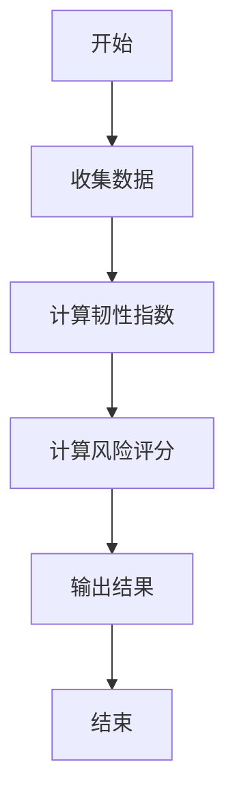
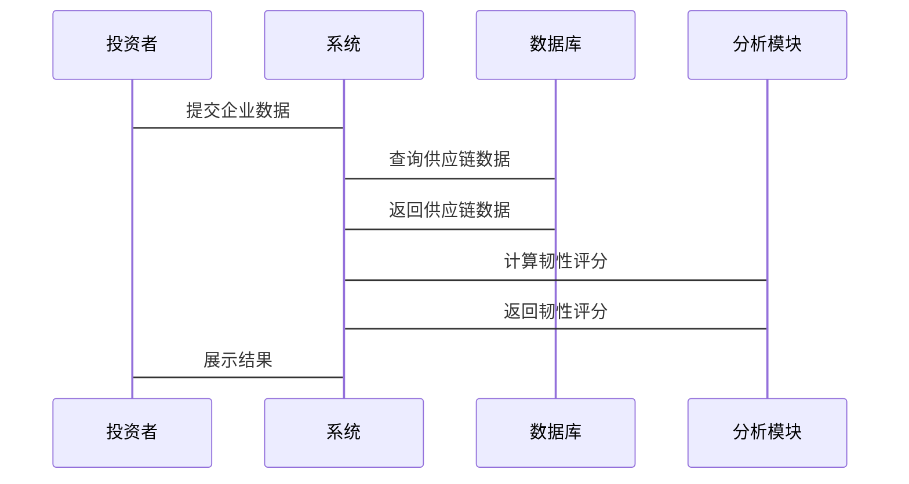

                 


# 价值投资中的供应链韧性评估

## 关键词：价值投资、供应链韧性、供应链管理、企业评估、投资策略

## 摘要：  
供应链韧性评估是企业在面对市场波动和不确定性时的重要能力。本文从价值投资的角度，探讨如何通过评估供应链韧性来判断企业的投资价值。文章详细介绍了供应链韧性的核心概念、评估方法、数学模型和系统设计，并通过案例分析展示了如何将供应链韧性评估应用于实际投资决策中。

---

## 第1章：供应链韧性评估的背景与意义

### 1.1 供应链韧性评估的核心概念

#### 1.1.1 供应链韧性的定义  
供应链韧性是指企业在面对外部冲击（如疫情、自然灾害、市场波动等）时，能够快速恢复并维持供应链稳定性的能力。  

#### 1.1.2 供应链韧性与企业价值的关系  
供应链韧性是企业价值的重要组成部分，直接影响企业的运营效率和抗风险能力。  

#### 1.1.3 供应链韧性评估的重要性  
供应链韧性评估能够帮助企业识别供应链中的薄弱环节，优化资源配置，降低风险。

### 1.2 价值投资的基本原理

#### 1.2.1 价值投资的定义  
价值投资是通过分析企业的基本面，寻找被市场低估的投资标的。

#### 1.2.2 价值投资的核心要素  
- 企业盈利能力  
- 企业成长性  
- 企业抗风险能力  

#### 1.2.3 供应链韧性在价值投资中的作用  
供应链韧性是企业抗风险能力的重要体现，直接影响企业的长期价值。

### 1.3 供应链韧性评估的边界与外延

#### 1.3.1 供应链韧性评估的范围  
- 供应商稳定性  
- 生产能力  
- 物流能力  

#### 1.3.2 供应链韧性评估的局限性  
- 数据获取难度  
- 评估模型的复杂性  

#### 1.3.3 供应链韧性评估与其他评估方法的对比  
- 与财务指标评估的对比  
- 与市场估值评估的对比  

### 1.4 本章小结  
供应链韧性是企业价值的重要组成部分，价值投资者需要将供应链韧性作为评估企业的重要指标。

---

## 第2章：供应链韧性评估的核心要素

### 2.1 供应链韧性评估的原理

#### 2.1.1 供应链韧性评估的理论基础  
供应链韧性评估基于系统工程和风险管理理论。

#### 2.1.2 供应链韧性评估的关键因素  
- 供应链的复杂性  
- 供应链的灵活性  
- 供应链的冗余性  

#### 2.1.3 供应链韧性评估的模型与方法  
- 网络分析法  
- 情景分析法  

### 2.2 核心概念的对比分析

#### 2.2.1 供应链韧性与供应链效率的对比  
供应链韧性强调抗风险能力，供应链效率强调运营速度。

#### 2.2.2 供应链韧性与供应链成本的对比  
供应链韧性可能需要更高的成本投入，但能降低整体风险。

#### 2.2.3 供应链韧性与供应链灵活性的对比  
供应链韧性强调在危机中的恢复能力，供应链灵活性强调适应变化的能力。

### 2.3 供应链韧性评估的ER实体关系图

```mermaid
erDiagram
    actor 投资者 {
        <属性> 企业名称
        <属性> 行业
    }
    actor 供应商 {
        <属性> 供应商名称
        <属性> 供应能力
    }
    actor 消费者 {
        <属性> 消费者需求
        <属性> 市场反馈
    }
    entity 供应链 {
        <属性> 供应链结构
        <属性> 关键节点
    }
    entity 供应链韧性 {
        <属性> 韧性指标
        <属性> 风险评估
    }
    投资者 --> 供应链 : 评估
    供应链 --> 供应链韧性 : 影响
    供应商 --> 供应链 : 供应
    消费者 --> 供应链 : 需求
```

---

## 第3章：供应链韧性评估的算法原理

### 3.1 供应链韧性评估的数学模型

#### 3.1.1 韧性指数模型  
$$ \text{韧性指数} = \frac{\text{供应链弹性} + \text{供应链冗余}}{2} $$

#### 3.1.2 风险评估模型  
$$ \text{风险评分} = \sum (\text{风险因素} \times \text{权重}) $$

### 3.2 算法流程图



### 3.3 算法实现代码

```python
def calculate_resilience(data):
    # 计算供应链弹性
    elasticity = data['elasticity']
    # 计算供应链冗余
    redundancy = data['redundancy']
    # 计算韧性指数
    resilience_index = (elasticity + redundancy) / 2
    return resilience_index

def calculate_risk_score(data):
    # 计算风险因素评分
    risk_factors = data['risk_factors']
    # 计算权重
    weights = data['weights']
    # 计算风险评分
    risk_score = sum(risk_factors[i] * weights[i] for i in range(len(risk_factors)))
    return risk_score
```

---

## 第4章：供应链韧性评估的系统分析与架构设计

### 4.1 问题场景介绍  
如何构建一个能够评估企业供应链韧性的系统，以支持价值投资决策。

### 4.2 系统功能设计

#### 4.2.1 数据收集模块  
- 收集供应商数据  
- 收集消费者数据  

#### 4.2.2 数据分析模块  
- 计算韧性指数  
- 计算风险评分  

#### 4.2.3 结果展示模块  
- 可视化展示  
- 生成报告  

### 4.3 系统架构设计


### 4.4 系统接口设计

#### 4.4.1 API接口  
- 输入：企业数据  
- 输出：韧性评分  

#### 4.4.2 数据接口  
- 输入：供应链数据  
- 输出：风险报告  

### 4.5 系统交互流程



---

## 第5章：供应链韧性评估的项目实战

### 5.1 环境安装

#### 5.1.1 系统要求  
- Python 3.8+  
- 数据库：MySQL  

#### 5.1.2 安装依赖  
```bash
pip install flask numpy pandas
```

### 5.2 核心代码实现

#### 5.2.1 数据收集模块  
```python
import pandas as pd

def collect_data():
    # 从数据库读取数据
    data = pd.read_sql("SELECT * FROM supply_chain", con=engine)
    return data
```

#### 5.2.2 数据分析模块  
```python
def analyze_data(data):
    # 计算韧性指数
    data['resilience_index'] = (data['elasticity'] + data['redundancy']) / 2
    # 计算风险评分
    data['risk_score'] = data.apply(lambda x: sum(x['risk_factors'] * x['weights']), axis=1)
    return data
```

#### 5.2.3 结果展示模块  
```python
from flask import Flask, render_template

app = Flask(__name__)

@app.route('/')
def index():
    data = analyze_data(collect_data())
    return render_template('result.html', data=data)
```

### 5.3 案例分析

#### 5.3.1 案例背景  
某制造企业，供应链数据如下：  
- 供应商数量：5  
- 生产能力：90%  
- 物流能力：80%  

#### 5.3.2 数据分析结果  
- 韧性指数：85  
- 风险评分：70  

#### 5.3.3 投资建议  
该企业供应链韧性较高，具备较高的投资价值。

### 5.4 项目小结  
通过案例分析，验证了供应链韧性评估模型的有效性。

---

## 第6章：供应链韧性评估的总结与最佳实践

### 6.1 总结

#### 6.1.1 供应链韧性评估的核心价值  
供应链韧性是企业抗风险能力的重要体现，直接影响企业的投资价值。

#### 6.1.2 供应链韧性评估的关键成功要素  
- 数据的准确性  
- 模型的科学性  

### 6.2 最佳实践

#### 6.2.1 投资者注意事项  
- 供应链韧性评估应结合其他基本面指标  
- 定期更新评估结果  

#### 6.2.2 企业优化建议  
- 提高供应链弹性  
- 建立应急预案  

### 6.3 未来展望  
随着人工智能和大数据技术的发展，供应链韧性评估将更加精准和高效。

---

## 参考文献  
1. 理查德·费希尔《价值投资实战》  
2. 供应链管理协会《供应链风险管理指南》  
3. John R. Hauser, "Supply Chain Resilience", MIT Press, 2020.

---

通过以上结构和内容，您可以撰写一篇详细的关于《价值投资中的供应链韧性评估》的技术博客文章。

