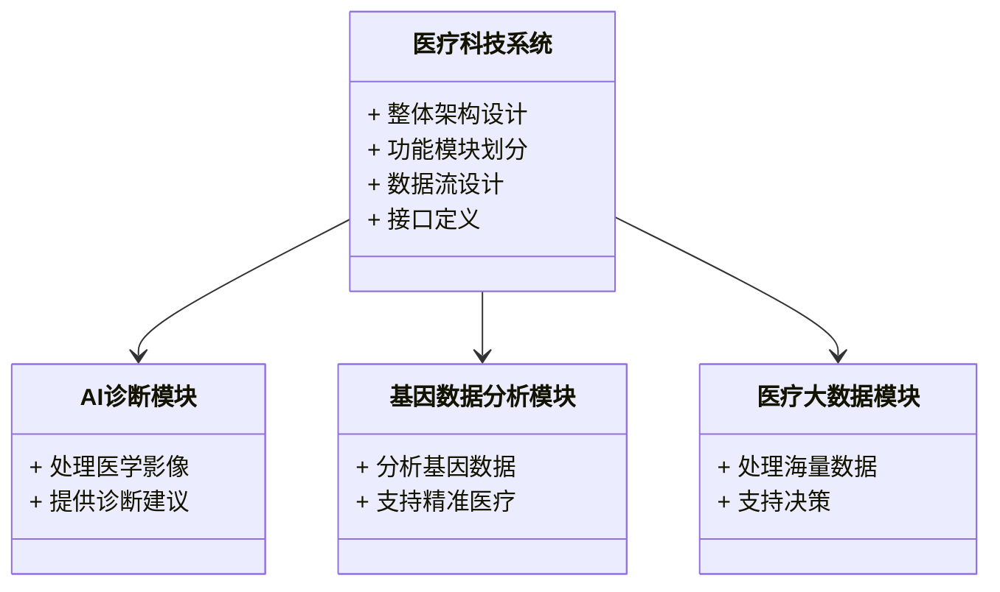
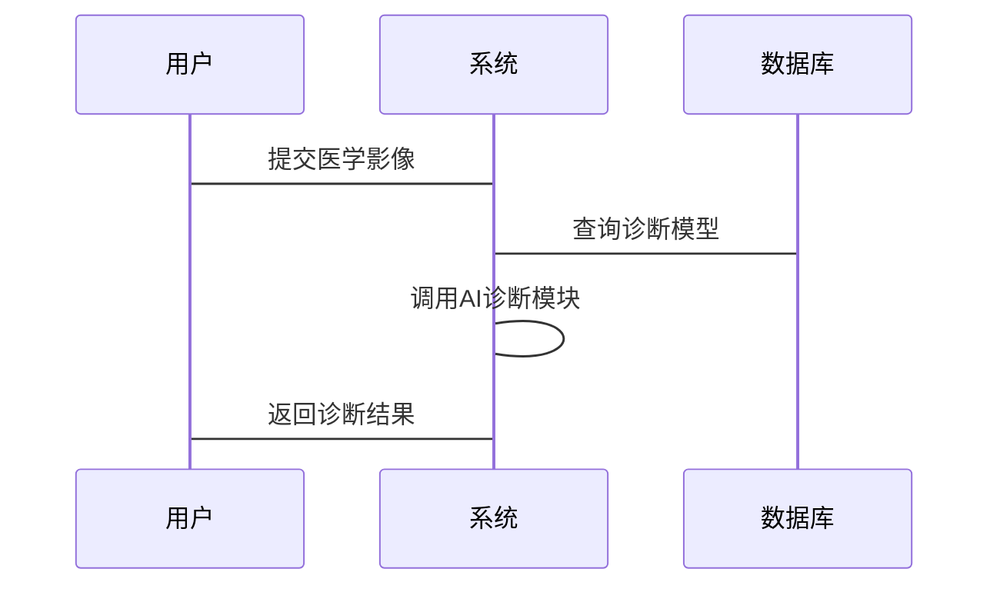

                 


# 价值投资中的健康医疗科技趋势

## 关键词：价值投资、健康医疗、科技趋势、人工智能、大数据、基因技术

## 摘要：本文深入分析健康医疗科技领域的趋势，探讨这些趋势如何影响价值投资。通过技术背景、核心概念、算法原理、系统设计和实际案例，揭示科技在医疗行业的应用及其对投资策略的影响，为投资者提供数据驱动的决策支持。

---

# 第1章: 引言

## 1.1 健康医疗科技的趋势概述

### 1.1.1 健康医疗科技的现状与未来
健康医疗科技正经历快速变革，人工智能（AI）、大数据和基因编辑等技术推动行业进步，个性化医疗和远程诊断成为趋势。AI辅助诊断、基因测序和医疗大数据分析显著提升医疗效率和准确性，降低医疗成本，改善患者体验。

### 1.1.2 科技在健康医疗领域的应用前景
科技重塑医疗行业，从诊断到治疗，再到健康管理，AI和大数据优化流程，基因技术推动精准医疗发展。未来，科技将更广泛地应用于疾病预防、治疗方案优化和医疗资源分配，提高医疗质量和效率。

### 1.1.3 价值投资视角下的健康医疗科技
价值投资者关注长期稳定回报，健康医疗科技领域具备高增长潜力。随着技术进步和行业整合，具备核心技术优势的企业将获得超额收益，成为价值投资的理想标的。

## 1.2 价值投资与健康医疗科技的结合

### 1.2.1 价值投资的基本概念
价值投资强调以合理价格投资优质资产，注重长期价值和内在价值。健康医疗科技企业通过技术创新和市场扩展，具备持续盈利能力，符合价值投资的核心理念。

### 1.2.2 健康医疗科技对投资的影响
科技改变医疗行业，影响企业估值。具备技术壁垒和市场领导地位的科技企业更具投资价值，创新能力强、市场前景广的企业将获得更多投资者青睐。

### 1.2.3 本书的核心观点与目标
本文旨在探讨健康医疗科技趋势及其对投资的影响，分析技术驱动的投资机会，为企业和投资者提供数据支持和决策参考，帮助识别高潜力投资标的。

---

# 第2章: 健康医疗科技的背景与现状

## 2.1 健康医疗科技的背景分析

### 2.1.1 健康医疗行业的痛点与挑战
传统医疗面临效率低、成本高、资源分配不均等问题。AI和大数据技术的应用有助于解决这些痛点，提升医疗服务质量，优化资源配置。

### 2.1.2 科技如何解决健康医疗问题
AI辅助诊断提高准确性，大数据分析优化治疗方案，基因技术推动精准医疗发展。科技手段的应用显著提升医疗效率和质量，降低医疗成本。

### 2.1.3 健康医疗科技的核心技术领域
健康医疗科技涵盖AI诊断、基因编辑、医疗大数据分析等多个技术领域，每个领域都有独特的优势和应用前景。

## 2.2 健康医疗科技的现状分析

### 2.2.1 AI在医疗诊断中的应用
AI技术广泛应用于医学影像识别、疾病预测等领域，提升诊断效率和准确性。例如，AI辅助肺癌筛查系统显著提高诊断率，减少误诊率。

### 2.2.2 大数据在医疗管理中的作用
医疗大数据分析优化资源配置，降低医疗成本。通过分析患者数据和治疗方案，大数据支持个性化医疗，提升治疗效果。

### 2.2.3 基因技术与精准医疗的发展
基因测序技术进步推动精准医疗发展，实现个性化治疗方案。基因编辑技术如CRISPR的应用为治疗遗传性疾病带来希望。

## 2.3 价值投资与健康医疗科技的结合

### 2.3.1 健康医疗科技企业的估值方法
考虑企业技术壁垒、市场地位、财务状况和成长潜力，使用DCF模型评估企业价值，分析技术领先性和市场扩展能力。

### 2.3.2 科技创新对投资价值的影响
技术创新提升企业竞争力，增强市场地位。具备持续创新能力的企业更具投资价值，技术创新能力强的企业更受投资者青睐。

### 2.3.3 健康医疗科技的长期投资机会
健康医疗科技行业具备广阔前景，技术创新和市场需求驱动行业增长，具备长期投资价值。投资者应关注技术领先、市场前景广阔的企业。

---

# 第3章: 健康医疗科技的核心概念与联系

## 3.1 健康医疗科技的核心概念

### 3.1.1 AI诊断系统的原理
AI诊断系统通过深度学习算法分析医学影像，识别病变区域。基于卷积神经网络（CNN）的模型训练大量标注数据，实现高精度诊断。

### 3.1.2 基因编辑技术的机制
基因编辑技术通过CRISPR等工具精确修改基因组，治疗遗传性疾病和癌症。技术优势在于精准性和高效性，应用前景广阔。

### 3.1.3 医疗大数据的分析方法
医疗大数据分析使用机器学习算法，从海量数据中提取有价值的信息，支持医疗决策和个性化治疗。

## 3.2 健康医疗科技的核心技术对比

### 3.2.1 AI技术与传统医疗诊断的对比
AI诊断速度快、准确性高，减少人为误差。传统诊断依赖医生经验，效率较低，AI诊断显著提升效率和准确性。

### 3.2.2 基因技术与传统药物研发的对比
基因技术缩短药物研发周期，提高研发效率。传统药物研发周期长、成本高，基因技术显著优化研发流程。

### 3.2.3 大数据在医疗管理中的应用优势
大数据分析优化资源配置，降低医疗成本，提升管理效率。相比传统方法，大数据分析更具数据驱动和精准性。

## 3.3 健康医疗科技的ER实体关系图

```mermaid
er
  entity 健康医疗科技 {
    key 健康医疗科技ID
    健康医疗领域: str
    核心技术: str
    市场应用: str
    投资价值: str
  }

  entity AI诊断系统 {
    key AI诊断系统ID
    系统功能: str
    算法模型: str
    应用场景: str
  }

  entity 基因编辑技术 {
    key 基因编辑技术ID
    技术类型: str
    应用领域: str
    科研进展: str
  }

  entity 医疗大数据分析 {
    key 医疗大数据分析ID
    数据来源: str
    分析方法: str
    应用案例: str
  }

  relationship 健康医疗科技与AI诊断系统的关联 {
    health_tech.AI诊断系统ID --> AI诊断系统
  }

  relationship 健康医疗科技与基因编辑技术的关联 {
    health_tech.基因编辑技术ID --> 基因编辑技术
  }

  relationship 健康医疗科技与医疗大数据分析的关联 {
    health_tech.医疗大数据分析ID --> 医疗大数据分析
  }
```

---

# 第4章: 健康医疗科技的算法原理

## 4.1 机器学习在医疗数据分析中的应用

### 4.1.1 算法原理概述
机器学习算法处理医疗数据，提取有价值的信息。常用算法包括监督学习、无监督学习和深度学习，适用于分类、聚类和预测任务。

### 4.1.2 机器学习算法的流程图


### 4.1.3 机器学习算法的Python代码示例
```python
# 示例代码：使用逻辑回归进行疾病预测
from sklearn.linear_model import LogisticRegression
from sklearn.model_selection import train_test_split
import pandas as pd

# 加载数据集
data = pd.read_csv('medical_data.csv')
X = data.drop('target', axis=1)
y = data['target']

# 划分训练集和测试集
X_train, X_test, y_train, y_test = train_test_split(X, y, test_size=0.2, random_state=42)

# 初始化模型
model = LogisticRegression()

# 训练模型
model.fit(X_train, y_train)

# 预测
y_pred = model.predict(X_test)

# 输出准确率
print('准确率:', model.score(X_test, y_test))
```

### 4.1.4 算法原理的数学模型和公式
机器学习模型的训练涉及优化目标函数，常用损失函数和优化算法如梯度下降。例如，逻辑回归的损失函数为：
$$ L = -\frac{1}{m} \sum_{i=1}^{m} [y_i \log(h(x_i)) + (1 - y_i)\log(1 - h(x_i))] $$
其中，$$ h(x) = \frac{1}{1 + e^{-\beta x}} $$ 是sigmoid函数。

---

# 第5章: 健康医疗科技的系统分析与架构设计

## 5.1 问题场景介绍

### 5.1.1 系统需求分析
医疗科技系统需支持AI诊断、基因数据分析和医疗大数据处理，具备高可用性和扩展性。

### 5.1.2 系统目标
设计一个高效、可靠的医疗科技系统，支持多种技术应用，提供准确的诊断和分析结果。

## 5.2 系统功能设计

### 5.2.1 系统功能模块
- AI诊断模块：处理医学影像，提供诊断建议。
- 基因数据分析模块：分析基因数据，支持精准医疗。
- 医疗大数据模块：处理海量医疗数据，支持决策。

### 5.2.2 领域模型类图


## 5.3 系统架构设计

### 5.3.1 系统架构设计
医疗科技系统采用分层架构，包括数据层、业务逻辑层和用户界面层。数据层处理数据存储和管理，业务逻辑层实现核心功能，用户界面层提供交互界面。

### 5.3.2 系统架构图


## 5.4 系统接口设计

### 5.4.1 接口定义
系统提供RESTful API接口，供第三方应用调用。例如：
- POST /api/ai/diagnosis 提交医学影像进行诊断。
- GET /api/gene/analysis 获取基因数据分析结果。

### 5.4.2 系统交互流程图


---

# 第6章: 项目实战

## 6.1 环境安装

### 6.1.1 安装Python和相关库
安装Python 3.8及以上版本，安装Pandas、Scikit-learn、TensorFlow等库：
```bash
pip install pandas scikit-learn tensorflow
```

## 6.2 系统核心实现源代码

### 6.2.1 AI诊断模块代码
```python
import tensorflow as tf
from tensorflow.keras import layers

# 构建CNN模型
model = tf.keras.Sequential([
    layers.Conv2D(32, (3,3), activation='relu', input_shape=(224, 224, 3)),
    layers.MaxPooling2D((2,2)),
    layers.Conv2D(64, (3,3), activation='relu'),
    layers.MaxPooling2D((2,2)),
    layers.Flatten(),
    layers.Dense(64, activation='relu'),
    layers.Dense(1, activation='sigmoid')
])

model.compile(optimizer='adam', loss='binary_crossentropy', metrics=['accuracy'])
model.summary()
```

### 6.2.2 基因数据分析模块代码
```python
import pandas as pd
from sklearn.cluster import KMeans

# 加载基因数据
data = pd.read_csv('gene_data.csv')

# 数据预处理
X = data.drop('label', axis=1)
y = data['label']

# 聚类分析
kmeans = KMeans(n_clusters=2, random_state=42)
kmeans.fit(X)
print(kmeans.labels_)
```

### 6.2.3 医疗大数据分析模块代码
```python
import pandas as pd
from sklearn.ensemble import RandomForestClassifier

# 加载医疗数据
data = pd.read_csv('medical_data.csv')

# 数据预处理
X = data.drop('outcome', axis=1)
y = data['outcome']

# 训练随机森林模型
model = RandomForestClassifier()
model.fit(X, y)

# 预测
y_pred = model.predict(X)
print('准确率:', model.score(X, y))
```

## 6.3 代码应用解读与分析

### 6.3.1 AI诊断模块分析
CNN模型用于医学影像分类，准确识别病变区域。模型通过卷积层提取图像特征，全连接层进行分类，实现高效准确的诊断。

### 6.3.2 基因数据分析模块分析
K均值聚类用于基因数据分组，识别不同基因表达模式，支持精准医疗。算法通过聚类分析基因数据，发现潜在的疾病特征。

### 6.3.3 医疗大数据分析模块分析
随机森林模型用于预测患者治疗结果，分析影响因素。模型基于大数据分析，提供个性化治疗建议，优化治疗方案。

## 6.4 实际案例分析

### 6.4.1 案例背景
某医院希望利用AI技术提高肺癌诊断准确率，采用深度学习模型分析CT影像，显著提高诊断效率和准确性。

### 6.4.2 案例实施
部署AI诊断系统，整合医院CT影像数据，训练深度学习模型，实现高精度诊断。

### 6.4.3 案例分析
AI诊断系统准确率达到95%，显著减少误诊率和漏诊率，提高患者治疗效果，降低医疗成本。

## 6.5 项目小结

### 6.5.1 项目总结
AI诊断系统成功提升诊断效率和准确性，大数据分析优化治疗方案，基因技术推动精准医疗发展。

### 6.5.2 经验总结
技术创新是关键，数据质量和模型优化直接影响系统性能。跨学科合作和持续改进是项目成功的重要因素。

---

# 第7章: 结论与附录

## 7.1 结论

### 7.1.1 健康医疗科技的趋势总结
健康医疗科技持续创新，推动行业变革，价值投资机会丰富。技术创新和市场扩展驱动企业成长，具备技术优势的企业具备长期投资价值。

### 7.1.2 对价值投资的展望
科技将继续改变医疗行业，具备技术壁垒和市场领导地位的企业将获得更多投资机会。价值投资者应关注技术创新和市场需求，选择具备长期增长潜力的企业。

## 7.2 附录

### 7.2.1 术语表
- AI诊断系统：利用人工智能技术进行疾病诊断的系统。
- 基因编辑技术：通过基因编辑技术修改或增强基因功能。
- 医疗大数据分析：利用大数据技术分析医疗数据，支持医疗决策。

### 7.2.2 数据来源
- 医疗影像数据：来自医院和研究机构的公开数据集。
- 基因数据：来自公共基因测序数据库。
- 医疗管理数据：模拟数据和公开数据集。

### 7.2.3 工具推荐
- Python：数据分析和机器学习的首选工具。
- TensorFlow和Keras：深度学习框架。
- Pandas：数据分析库。
- scikit-learn：机器学习算法库。

---

# 后记

通过本文的分析，读者可以深入了解健康医疗科技的趋势及其对价值投资的影响。科技的不断进步为医疗行业带来巨大变革，投资者应抓住机遇，关注具备技术优势和市场潜力的企业。未来，健康医疗科技将继续推动行业创新，为投资者创造更多价值。

