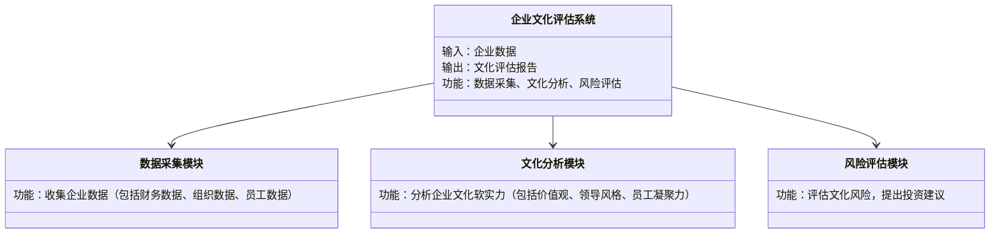

                 


# 价值投资中的公司文化：软实力的重要性

---

## 关键词：
- 价值投资
- 公司文化
- 软实力
- 投资决策
- 企业文化评估
- 组织氛围
- 领导风格

---

## 摘要：
在价值投资领域，公司文化是决定企业长期价值的关键因素之一。软实力，即公司文化的隐性影响力，往往比财务数据更能反映企业的核心竞争力和可持续发展潜力。本文从公司文化的定义、核心要素、评估框架、投资策略等多维度展开，结合实际案例和数学模型，深入分析公司文化对投资决策的重要性。通过系统化的分析和方法论的探讨，为投资者提供一套基于公司文化评估的决策支持体系。

---

## 正文：

---

### 第一部分：价值投资与公司文化基础

#### 第1章：价值投资与公司文化概述

##### 1.1 价值投资的基本概念
- **1.1.1 价值投资的定义与核心理念**  
  价值投资是一种长期投资策略，强调以低于内在价值的价格买入优质资产。其核心理念是关注企业的基本面、行业地位、财务健康度以及长期盈利能力。传统价值投资往往侧重于财务数据的分析，如市盈率、市净率、ROE等指标。然而，企业的文化与软实力同样影响其长期价值，因为它们决定了企业如何应对市场变化、处理内部矛盾以及实现长期目标。

- **1.1.2 公司文化在价值投资中的地位**  
  公司文化是企业的灵魂，决定了企业的行为方式、员工凝聚力以及对外界的态度。优秀的企业文化能够增强企业的抗风险能力、创新能力以及长期发展动力。在价值投资中，文化被视为企业的“软实力”，其重要性与财务数据相当。

- **1.1.3 软实力对投资决策的影响**  
  软实力指的是企业文化的隐性影响力，包括企业价值观、伦理标准、领导风格以及员工凝聚力等。这些因素虽然难以量化，但它们直接影响企业的长期表现和市场地位。通过分析企业的软实力，投资者能够更全面地评估企业的潜在价值。

##### 1.2 公司文化的定义与特征
- **1.2.1 公司文化的定义**  
  公司文化是企业在长期发展过程中形成的，由企业高层倡导并被全体员工认同的一套核心价值观、行为准则、思维方式和组织氛围。它是企业的灵魂，决定了企业的行为方式和内部凝聚力。

- **1.2.2 公司文化的分类与层次**  
  公司文化可以分为显性文化和隐性文化。显性文化包括企业的愿景、使命、核心价值观等，通常通过企业宣言、规章制度等形式体现。隐性文化则是企业文化的深层结构，包括员工的思维方式、行为习惯以及对企业目标的认同感。

- **1.2.3 软实力的核心要素**  
  软实力的核心要素包括企业价值观、领导风格、员工凝聚力、组织氛围、社会责任感等。这些要素共同构成了企业的文化软实力，决定了企业的长期发展潜力。

##### 1.3 软实力与投资的关系
- **1.3.1 软实力的内涵与外延**  
  软实力是指企业文化的隐性影响力，其内涵包括企业价值观、领导风格、员工凝聚力等。其外延则涉及企业的组织结构、管理方式、创新能力和市场竞争力。

- **1.3.2 软实力对投资价值的影响**  
  软实力直接影响企业的长期盈利能力、抗风险能力和市场地位。例如，一家具有强大企业文化和优秀领导风格的企业，往往能够在市场波动中保持稳定，并通过创新实现持续增长。

- **1.3.3 软实力的量化与评估**  
  软实力虽然难以量化，但可以通过员工满意度、领导风格、组织氛围等指标进行评估。例如，员工满意度高的企业通常具有更强的员工凝聚力和创新活力，从而为企业创造更大的价值。

---

### 第二部分：公司文化的核心要素与评估框架

#### 第2章：公司治理与文化的关系

##### 2.1 公司治理结构对文化的影响
- **2.1.1 股东、董事会与管理层的角色**  
  公司治理结构由股东、董事会和管理层构成。股东是企业的最终所有者，董事会是企业的决策机构，管理层是企业的执行机构。这三者在公司文化中扮演着不同的角色，共同影响企业的文化发展方向。

- **2.1.2 治理结构与文化形成的互动关系**  
  治理结构决定了企业的管理方式和决策流程，而文化则是治理结构的结果。例如，一家采用扁平化治理结构的企业，通常具有更强的员工参与感和创新氛围。

- **2.1.3 治理透明度对文化信任的影响**  
  治理透明度高的企业更容易赢得员工和投资者的信任。透明的治理结构能够增强企业的凝聚力和市场声誉，从而提升企业的软实力。

##### 2.2 领导层的风格与文化塑造
- **2.2.1 领导风格对文化的影响**  
  领导风格包括变革型领导、交易型领导、魅力型领导等。不同领导风格对企业的文化塑造有不同的影响。例如，变革型领导注重创新和变革，能够激发员工的潜力；而交易型领导则注重效率和结果，可能忽视员工的情感需求。

- **2.2.2 领导层的价值观与公司文化的关系**  
  领导层的价值观是企业文化的基石。领导层的价值观决定了企业的核心价值观，影响员工的行为方式和企业的发展方向。

- **2.2.3 领导层决策的文化后果**  
  领导层的决策不仅影响企业的财务表现，还会影响企业的文化氛围。例如，领导层在面对道德困境时的选择，能够体现企业的伦理标准，从而影响员工和市场的信任度。

#### 第3章：公司文化的核心要素分析

##### 3.1 企业价值观与使命
- **3.1.1 企业价值观的定义与分类**  
  企业价值观是企业在经营活动中所倡导的核心理念，包括客户至上、员工第一、创新、诚信等。企业价值观决定了企业的行为方式和长期发展目标。

- **3.1.2 使命与愿景对员工和投资者的影响**  
  企业的使命和愿景是其存在的意义和方向。明确的使命和愿景能够激发员工的使命感和责任感，同时也能吸引认同企业价值观的投资者。

- **3.1.3 价值观与企业长期发展的关系**  
  企业价值观决定了企业的长期发展方向和竞争优势。例如，以创新为核心价值观的企业，通常能够在技术和市场上保持领先地位。

##### 3.2 企业伦理与社会责任
- **3.2.1 企业伦理的基本概念**  
  企业伦理是指企业在经营活动中应遵循的道德准则，包括诚实守信、公平竞争、保护环境等。企业伦理是企业文化的重要组成部分，也是企业软实力的体现。

- **3.2.2 社会责任对品牌和声誉的影响**  
  企业履行社会责任能够提升品牌形象和市场声誉。例如，积极参与公益事业、推动可持续发展的企业，更容易获得消费者的信任和市场的认可。

- **3.2.3 伦理问题对企业价值的潜在影响**  
  伦理问题（如虚假宣传、环境污染等）会对企业的声誉和市场地位造成负面影响，进而影响企业的长期价值。例如，一家因产品质量问题被曝光的企业，其股价和市场地位可能会受到严重冲击。

##### 3.3 员工凝聚力与组织氛围
- **3.3.1 员工凝聚力的定义与测量**  
  员工凝聚力是指员工对企业认同感和归属感的强弱。员工凝聚力强的企业，通常具有更高的员工满意度和更低的员工流失率。

- **3.3.2 组织氛围对员工绩效的影响**  
  组织氛围是指企业内部的工作环境和文化氛围。积极的组织氛围能够提升员工的工作积极性和创造力，从而提高企业的整体绩效。

- **3.3.3 员工满意度与企业文化的关联**  
  员工满意度是企业文化的直接体现。高员工满意度通常意味着企业具有良好的组织氛围和员工关怀。

---

### 第三部分：公司文化评估与投资策略

#### 第4章：公司文化评估的框架与方法

##### 4.1 文化评估的维度
- **4.1.1 价值观与使命的匹配度**  
  评估企业的价值观和使命是否与其长期发展目标一致。例如，一家以创新为核心价值观的企业，其研发投入和创新能力是否与其使命一致。

- **4.1.2 领导风格与治理结构的协调性**  
  评估领导风格与治理结构的协调性。例如，变革型领导是否适合企业的治理结构，能够推动企业的创新和变革。

- **4.1.3 员工凝聚力与组织氛围的健康度**  
  评估员工凝聚力和组织氛围的健康度。例如，员工满意度高的企业通常具有更强的员工凝聚力和组织稳定性。

##### 4.2 文化评估的指标体系
- **4.2.1 价值观与使命的量化指标**  
  例如，员工对企业使命的认同度（通过调查问卷进行测量）。

- **4.2.2 领导风格与治理结构的评估维度**  
  例如，领导风格的变革性、决策透明度、员工参与度等。

- **4.2.3 员工凝聚力与组织氛围的测量方法**  
  例如，员工满意度调查、离职率、员工推荐率等。

##### 4.3 文化评估的工具与方法
- **4.3.1 文化评估的问卷设计**  
  设计一份包含价值观、使命、领导风格、员工凝聚力等维度的调查问卷，用于评估企业的文化软实力。

- **4.3.2 数据分析方法与模型**  
  使用统计分析方法（如因子分析、回归分析）对文化评估数据进行分析，识别企业的文化优势和潜在问题。

- **4.3.3 案例分析与标杆对比**  
  通过实际案例分析，对比行业标杆企业的文化特征，评估目标企业的文化软实力。

#### 第5章：基于公司文化的投资策略

##### 5.1 投资策略的制定
- **5.1.1 文化匹配度与投资决策**  
  在选择投资标的时，需要评估企业的文化匹配度。例如，选择具有强大企业文化和优秀领导风格的企业，能够降低投资风险并提升长期收益。

- **5.1.2 文化风险的识别与应对**  
  识别企业在文化上的潜在风险，例如企业文化僵化、领导层决策失误等，并制定应对策略。

##### 5.2 投资案例分析
- **5.2.1 案例一：技术型企业的文化评估**  
  以某技术创新型企业为例，分析其企业文化、领导风格、员工凝聚力等维度，并评估其文化软实力对投资价值的影响。

- **5.2.2 案例二：传统制造业的文化转型**  
  分析一家传统制造企业在文化转型中的挑战与成功经验，探讨文化转型对投资价值的影响。

##### 5.3 投资策略的优化
- **5.3.1 结合文化评估优化投资组合**  
  根据企业的文化评估结果，优化投资组合，选择具有强大文化软实力的企业。

- **5.3.2 长期投资与文化评估的结合**  
  在长期投资中，文化评估是重要的决策依据。通过持续跟踪企业的文化变化，调整投资策略。

---

### 第四部分：系统分析与架构设计方案

#### 第6章：系统分析与架构设计方案

##### 6.1 问题场景介绍
- **6.1.1 价值投资中的文化评估需求**  
  投资者在选择投资标的时，需要对企业的文化软实力进行系统化评估，以确保投资决策的全面性和准确性。

##### 6.2 项目介绍
- **6.2.1 项目目标**  
  构建一个基于公司文化评估的决策支持系统，帮助投资者量化企业的文化软实力，优化投资策略。

##### 6.3 系统功能设计（领域模型mermaid类图）


##### 6.4 系统架构设计（mermaid架构图）


##### 6.5 系统接口设计
- **输入接口**：企业数据接口，包括财务数据、组织数据、员工数据。
- **输出接口**：文化评估报告接口，包括企业文化软实力评估结果、投资建议。

##### 6.6 系统交互（mermaid序列图）
```mermaid
sequenceDiagram
    客户端 -> 服务器：提交企业数据
    服务器 -> 数据库：存储企业数据
    服务器 -> 文化分析模块：启动文化分析
    文化分析模块 -> 数据库：查询企业数据
    文化分析模块 -> 服务器：返回文化评估结果
    服务器 -> 客户端：返回文化评估报告
```

---

### 第五部分：项目实战

#### 第7章：项目实战

##### 7.1 环境安装
- **7.1.1 安装Python与相关库**  
  需要安装的库包括：pandas、numpy、scikit-learn、matplotlib等。

##### 7.2 系统核心实现源代码
```python
import pandas as pd
import numpy as np
from sklearn.decomposition import PCA
import matplotlib.pyplot as plt

# 示例：企业文化评估数据
data = {
    '员工满意度': [85, 70, 90, 60],
    '领导风格评分': [75, 80, 85, 90],
    '组织氛围评分': [80, 70, 85, 75]
}

df = pd.DataFrame(data)

# 使用主成分分析（PCA）进行文化评估
pca = PCA(n_components=2)
principal_components = pca.fit_transform(df)

# 可视化文化评估结果
plt.figure(figsize=(10, 6))
plt.scatter(principal_components[:, 0], principal_components[:, 1], 
            c=['r', 'g', 'b', 'y'], marker='o')
plt.xlabel('主成分1')
plt.ylabel('主成分2')
plt.title('企业文化评估结果')
plt.show()
```

##### 7.3 代码应用解读与分析
- 该代码通过主成分分析（PCA）方法，对企业的文化软实力进行评估。输入的企业文化数据包括员工满意度、领导风格评分和组织氛围评分。通过PCA降维，可以将多维的文化数据简化为二维的主成分，便于直观分析和可视化。

##### 7.4 实际案例分析和详细讲解剖析
- 以某企业为例，分析其企业文化数据，使用上述代码进行评估，并生成文化评估报告。通过报告，识别该企业在文化上的优势和潜在问题，并提出优化建议。

##### 7.5 项目小结
- 通过项目实战，验证了基于文化评估的决策支持系统的可行性。企业文化评估模型能够有效地量化企业的文化软实力，为投资者提供科学的决策支持。

---

### 第六部分：最佳实践与总结

#### 第8章：最佳实践与总结

##### 8.1 最佳实践 tips
- 在进行价值投资时，企业文化评估是不可或缺的一部分。建议投资者：
  1. 关注企业的文化软实力，如领导风格、员工凝聚力、社会责任感等。
  2. 通过问卷调查、数据分析等方法，系统化评估企业的文化特征。
  3. 结合文化评估结果，优化投资组合，降低投资风险。

##### 8.2 小结
- 本文从价值投资的角度，深入探讨了公司文化的重要性。通过系统化的分析和实际案例，展示了如何将企业文化评估纳入投资决策体系。

##### 8.3 注意事项
- 在进行文化评估时，需要注意数据的准确性和评估方法的科学性。此外，文化评估结果仅供参考，需结合其他因素（如财务数据、市场环境等）综合判断。

##### 8.4 拓展阅读
- 推荐阅读相关书籍和文献，如《文明、文化和投资》（虚构书名），深入探讨文化与投资的关系。

---

通过以上分析和详细阐述，我们可以看到，公司文化作为价值投资中的“软实力”，对企业的长期价值和投资决策具有重要影响。投资者在进行价值投资时，不仅需要关注企业的财务表现，还需要深入分析其文化软实力，从而做出更科学、更全面的投资决策。

